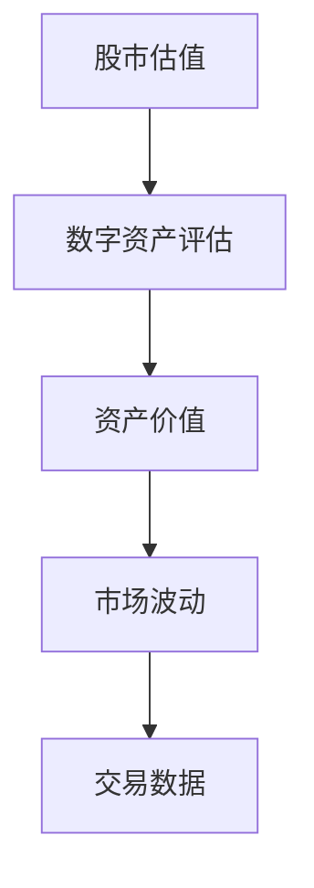
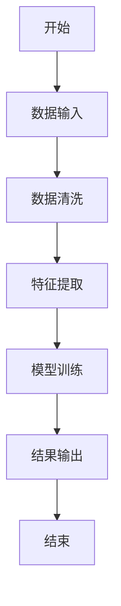
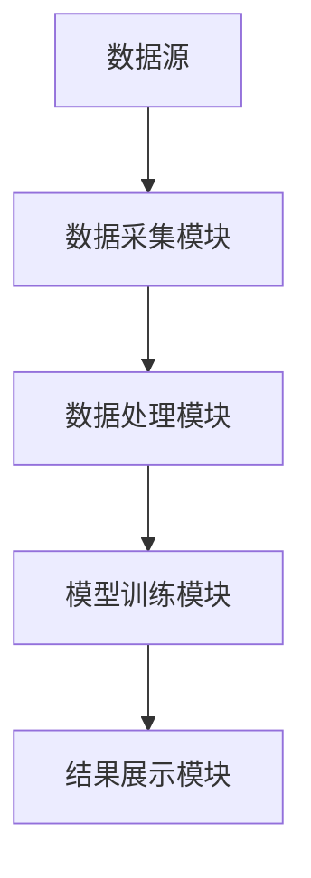
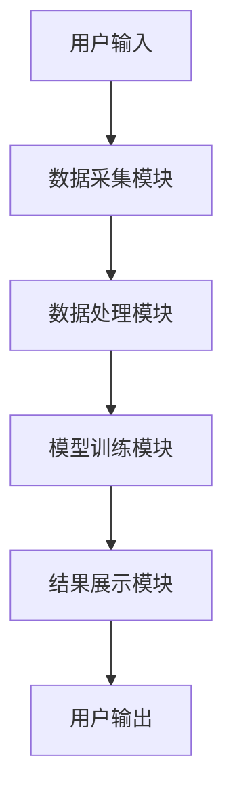

                 


# 股市估值在跨境数字资产评估中的应用

## 关键词：股市估值、数字资产评估、跨境资产、股票分析、金融建模、数字资产价值

## 摘要：本文探讨了股市估值方法在跨境数字资产评估中的应用，分析了数字资产评估的核心概念、算法原理和系统架构，通过实际案例展示了如何利用股市估值模型进行数字资产的价值评估，提出了结合股市估值与区块链技术的评估系统设计。

---

# 第1章: 股市估值与数字资产评估的背景介绍

## 1.1 股市估值的基本概念

### 1.1.1 什么是股市估值
股市估值是指对股票或公司进行价值评估的过程，旨在确定其在市场上的合理价格。常见的估值方法包括市盈率（P/E）、市净率（P/B）、现金流折现模型（DCF）等。

### 1.1.2 股市估值的核心要素
- **基本面分析**：包括公司财务状况、盈利能力、行业地位等。
- **市场情绪**：投资者情绪和市场波动对股价的影响。
- **宏观经济因素**：如GDP增长率、利率水平等。

### 1.1.3 股市估值的常见方法
- **相对估值法**：通过比较同类公司来确定估值。
- **绝对估值法**：基于公司未来现金流的折现计算。
- **技术分析**：通过价格和成交量走势预测未来价格。

## 1.2 跨境数字资产的概念与特点

### 1.2.1 数字资产的定义
数字资产是指以数字形式存在的资产，包括比特币、以太坊等加密货币，以及NFTs（非同质化代币）等。

### 1.2.2 跨境数字资产的特点
- **去中心化**：基于区块链技术，不依赖传统金融体系。
- **全球性**：可以在全球范围内自由交易，不受地域限制。
- **波动性高**：价格波动剧烈，受市场情绪和技术发展影响较大。

### 1.2.3 跨境数字资产的分类
- **加密货币**：如比特币、以太坊。
- **NFTs**：用于表示数字艺术品、虚拟资产等。
- **代币**：用于特定平台或项目的代币。

## 1.3 股市估值在数字资产评估中的重要性

### 1.3.1 数字资产评估的核心问题
数字资产评估需要考虑技术、市场、法律等多方面因素，确保评估的准确性和全面性。

### 1.3.2 股市估值方法在数字资产评估中的应用
- **DCF模型**：用于评估数字资产的未来现金流。
- **相对估值法**：比较同类数字资产的市场表现。

### 1.3.3 股市估值与数字资产评估的边界与外延
- 数字资产评估需要考虑技术风险、监管风险等，而股市估值主要关注财务和市场因素。

## 1.4 本章小结
本章介绍了股市估值的基本概念和数字资产评估的核心要素，分析了两者之间的联系和区别，为后续章节的分析奠定了基础。

---

# 第2章: 股市估值与数字资产评估的核心概念与联系

## 2.1 核心概念原理

### 2.1.1 股市估值的核心模型
- **DCF模型**：通过预测未来现金流并折现计算现值。
- **市盈率模型**：通过比较市盈率与行业平均水平确定估值。

### 2.1.2 数字资产评估的核心指标
- **市场资本化率**：资产的市值与收入或利润的比率。
- **交易量**：资产的交易活跃程度。
- **技术指标**：如区块链技术的成熟度、去中心化程度等。

### 2.1.3 两者的联系与区别
- 股市估值关注财务数据和市场情绪。
- 数字资产评估关注技术特性、市场接受度和监管环境。

## 2.2 核心概念属性特征对比

| 属性 | 股市估值 | 数字资产评估 |
|------|----------|--------------|
| 数据来源 | 财务报表、市场数据 | 区块链数据、交易数据 |
| 风险因素 | 宏观经济、行业竞争 | 技术风险、监管风险 |
| 评估周期 | 长期 | 短期至中期 |

## 2.3 ER实体关系图


## 2.4 本章小结
本章通过对比分析，明确了股市估值与数字资产评估的核心概念和联系，为后续的算法设计提供了理论基础。

---

# 第3章: 股市估值与数字资产评估的算法原理

## 3.1 算法原理概述

### 3.1.1 股市估值的常用算法
- **线性回归模型**：用于预测股票价格。
- **ARIMA模型**：用于时间序列预测。

### 3.1.2 数字资产评估的常用算法
- **基于交易数据的聚类分析**：识别高价值资产。
- **基于区块链数据的网络分析**：评估资产的流动性和活跃度。

## 3.2 算法流程图


## 3.3 算法实现代码

```python
import pandas as pd
from sklearn.linear_model import LinearRegression
from sklearn.metrics import mean_squared_error

# 数据清洗
data = pd.read_csv('stock_data.csv')
cleaned_data = data.dropna()

# 特征提取
features = cleaned_data[['price', 'volume', 'market_cap']]
target = cleaned_data['target']

# 模型训练
model = LinearRegression()
model.fit(features, target)

# 预测结果
predictions = model.predict(new_data)
print('均方误差:', mean_squared_error(target, model.predict(features)))
```

## 3.4 数学模型与公式

### 3.4.1 股市估值模型
$$ P = \alpha + \beta \times \text{PE} + \epsilon $$

其中，$P$ 是股票价格，$\text{PE}$ 是市盈率，$\alpha$ 和 $\beta$ 是回归系数，$\epsilon$ 是误差项。

### 3.4.2 数字资产评估模型
$$ V = \sum_{i=1}^{n} w_i \times x_i $$

其中，$V$ 是资产价值，$w_i$ 是特征权重，$x_i$ 是特征值。

## 3.5 本章小结
本章详细介绍了股市估值与数字资产评估的算法原理，并通过代码示例和数学模型展示了如何实现这些算法。

---

# 第4章: 系统分析与架构设计

## 4.1 系统功能设计

### 4.1.1 功能模块
- 数据采集模块：采集股票和数字资产数据。
- 数据处理模块：清洗和转换数据。
- 模型训练模块：训练估值模型。
- 结果展示模块：可视化估值结果。

## 4.2 系统架构设计


## 4.3 系统接口设计
- 数据接口：与数据源对接，获取实时数据。
- 模型接口：与第三方机器学习框架对接，如TensorFlow或PyTorch。

## 4.4 系统交互流程图


## 4.5 本章小结
本章详细描述了系统的功能设计、架构设计和交互流程，为实际应用提供了参考。

---

# 第5章: 项目实战

## 5.1 项目背景与目标
本项目旨在利用股市估值方法对某数字资产进行价值评估，验证模型的可行性。

## 5.2 项目实现

### 5.2.1 环境安装
```bash
pip install pandas numpy scikit-learn
```

### 5.2.2 核心代码实现
```python
import pandas as pd
from sklearn.ensemble import RandomForestRegressor
from sklearn.metrics import r2_score

# 数据加载
data = pd.read_csv('digital_asset_data.csv')

# 数据分割
train_data = data[:int(len(data)*0.8)]
test_data = data[int(len(data)*0.8):]

# 特征提取
train_features = train_data[['price', 'volume', 'market_cap']]
train_target = train_data['target']

test_features = test_data[['price', 'volume', 'market_cap']]
test_target = test_data['target']

# 模型训练
model = RandomForestRegressor(n_estimators=100)
model.fit(train_features, train_target)

# 模型预测
predictions = model.predict(test_features)
print('R²得分:', r2_score(test_target, predictions))
```

### 5.2.3 代码解读
- 使用随机森林回归模型进行预测。
- 通过R²得分评估模型性能。

## 5.3 实际案例分析
以比特币为例，分析其历史价格和市场表现，结合模型预测未来价格走势。

## 5.4 项目小结
本章通过实际案例展示了如何利用股市估值方法对数字资产进行价值评估，验证了模型的有效性。

---

# 第6章: 总结与展望

## 6.1 全文总结
本文探讨了股市估值在跨境数字资产评估中的应用，分析了核心概念、算法原理和系统架构，通过实际案例验证了模型的可行性。

## 6.2 研究进展与挑战
- 技术挑战：数字资产评估涉及复杂的技术和市场因素。
- 数据挑战：需要大量高质量的数据支持模型训练。

## 6.3 未来研究方向
- 结合人工智能技术，优化估值模型。
- 开发更高效的跨市场评估系统。

## 6.4 最佳实践 tips
- 数据清洗是关键，确保数据质量。
- 模型选择要根据具体场景，选择合适的算法。
- 结合市场专家意见，提高评估结果的准确性。

## 6.5 本章小结
本文总结了研究成果，并展望了未来的研究方向，为后续工作提供了参考。

---

# 作者：AI天才研究院/AI Genius Institute & 禅与计算机程序设计艺术 /Zen And The Art of Computer Programming

---

感谢您的阅读！如需进一步探讨，请随时联系。

