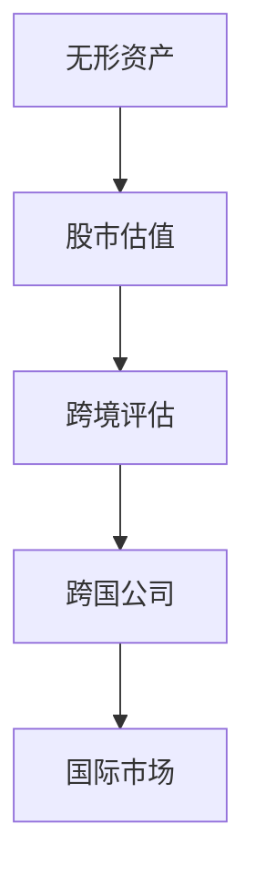
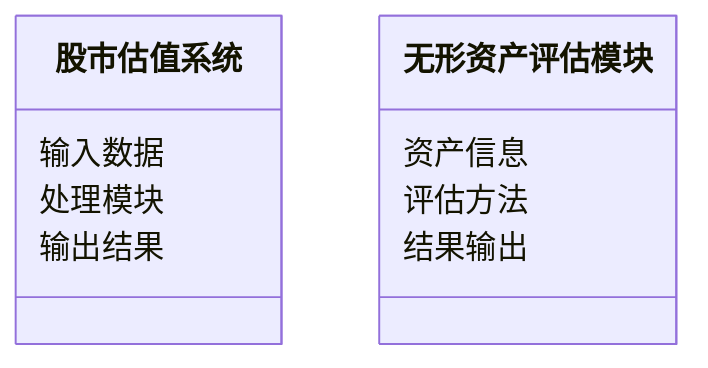
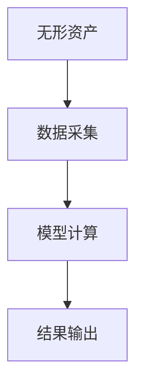

                 


# 股市估值在跨境无形资产评估中的应用

## 关键词：股市估值、跨境无形资产评估、资产评估、市盈率、市净率、现金流折现模型

## 摘要：
本文探讨了股市估值在跨境无形资产评估中的应用，重点分析了无形资产的特性、股市估值的核心指标及其在跨国评估中的挑战。通过对比分析和数学模型，揭示了如何利用股市估值方法提升无形资产的价值评估精度。结合实际案例，本文提出了基于多元回归模型的跨境评估方法，并通过Python代码实现，展示了其在实际操作中的可行性与优势。

---

## 第一部分：股市估值在跨境无形资产评估中的应用概述

### 第1章：背景介绍

#### 1.1 无形资产与股市估值的核心概念

##### 1.1.1 无形资产的定义与分类
- **无形资产**：指企业拥有或控制的、没有实物形态的长期资产，包括专利权、商标权、特许权、商誉等。
- **分类**：根据经济用途，无形资产可分为经营性无形资产（如专利权、商标权）和非经营性无形资产（如商誉）。

##### 1.1.2 股市估值的基本原理
- **市盈率（P/E）**：衡量股票价格与每股收益的比例，反映市场对股票的估值。
- **市净率（P/B）**：衡量股票价格与每股净资产的比例，适用于评估资产密集型企业的估值。
- **现金流折现模型（DCF）**：通过未来现金流的现值计算企业价值，是股市估值的核心方法之一。

##### 1.1.3 跨境无形资产评估的特殊性
- **文化差异**：不同国家的会计准则和市场环境差异影响无形资产的估值。
- **税务差异**：跨国企业在不同国家的税收政策不同，影响无形资产的计价。
- **法律差异**：不同国家对无形资产的法律保护力度不同，影响其市场价值。

#### 1.2 问题背景与研究意义

##### 1.2.1 跨境无形资产评估的难点
- **数据获取难度**：跨国企业的财务数据分散，难以整合。
- **估值模型适应性**：传统估值模型在跨境环境中可能失效。
- **法律与税务影响**：不同国家的法规差异增加了评估的复杂性。

##### 1.2.2 股市估值在跨境评估中的作用
- **提供参考**：股市估值为跨国企业提供了市场化的价值参考。
- **优化决策**：通过股市估值优化跨境并购、投资决策。

##### 1.2.3 研究的现实意义与学术价值
- **现实意义**：帮助跨国企业更好地进行无形资产评估，提升资产价值。
- **学术价值**：为无形资产评估领域提供新的研究方向和方法。

---

### 第2章：核心概念与联系

#### 2.1 无形资产的属性特征对比

##### 2.1.1 不同类型无形资产的特征分析
| 资产类型 | 特征描述 | 估值难度 | 法律保护 |
|----------|-----------|----------|----------|
| 专利权 | 专有技术、法律保护 | 较高 | 强 |
| 商标权 | 品牌价值、法律保护 | 较高 | 强 |
| 商誉 | 企业整体价值 | 极高 | 弱 |

##### 2.1.2 股市估值指标的属性对比
| 估值指标 | 计算公式 | 适用场景 | 优缺点 |
|----------|-----------|----------|----------|
| 市盈率 | $P/E = \frac{Price}{Earnings}$ | 企业盈利能力分析 | 易受周期性影响 |
| 市净率 | $P/B = \frac{Price}{Book\ Value}$ | 企业资产价值分析 | 适合资产密集型企业 |
| 现金流折现模型 | $V = \sum_{t=1}^{n} \frac{CF_t}{(1+r)^t}$ | 企业未来现金流预测 | 计算复杂 |

##### 2.1.3 无形资产与有形资产的差异
- **流动性**：无形资产流动性差，难以快速变现。
- **增值性**：无形资产价值受市场波动影响较大。

#### 2.2 实体关系图

##### 2.2.1 无形资产与股市估值的ER图
```mermaid
entityDiagram
    entity 无形资产 {
        <资产名称>
        <法律文件>
        <评估报告>
    }
    entity 股市估值 {
        <股票代码>
        <估值指标>
        <评估结果>
    }
    relationship 跨境评估 {
        无形资产 -[> 股市估值 : 评估依据
        股市估值 -[> 无形资产 : 价值参考
    }
```

##### 2.2.2 跨境评估中的关联关系


---

### 第3章：算法原理

#### 3.1 股市估值的核心算法

##### 3.1.1 市盈率模型
- **公式**：$P/E = \frac{Price}{Earnings}$
- **特点**：反映市场对股票的估值，适用于盈利稳定的企业。

##### 3.1.2 市净率模型
- **公式**：$P/B = \frac{Price}{Book\ Value}$
- **特点**：适用于资产密集型企业，反映资产的实际价值。

##### 3.1.3 现金流折现模型
- **公式**：$V = \sum_{t=1}^{n} \frac{CF_t}{(1+r)^t}$
- **特点**：考虑未来现金流，适合长期价值评估。

#### 3.2 无形资产评估的算法

##### 3.2.1 直线法
- **公式**：$A = \frac{C}{\frac{1}{1+r} + \frac{1}{(1+r)^2} + \cdots + \frac{1}{(1+r)^n}}$
- **特点**：简单易行，但忽视资产的市场价值变化。

##### 3.2.2 加速折旧法
- **公式**：$D = \frac{C}{(1 - \frac{1}{(1+r)^n})}$
- **特点**：适用于使用寿命较短的无形资产。

##### 3.2.3 收益法
- **公式**：$V = \frac{E}{(1 - \frac{r}{g})}$
- **特点**：考虑资产的未来收益，适合长期评估。

---

### 第4章：数学模型与公式

#### 4.1 股市估值的关键公式
- **市盈率**：$$P/E = \frac{Price}{Earnings}$$
- **市净率**：$$P/B = \frac{Price}{Book\ Value}$$
- **现金流折现公式**：$$V = \sum_{t=1}^{n} \frac{CF_t}{(1+r)^t}$$

#### 4.2 无形资产评估的数学模型
- **收益法模型**：$$V = \frac{E}{(1 - \frac{r}{g})}$$
- **折旧法模型**：$$A = \frac{C}{\frac{1}{1+r} + \frac{1}{(1+r)^2} + \cdots + \frac{1}{(1+r)^n}}$$

---

## 第5章：系统分析与架构设计

### 5.1 问题场景介绍

#### 5.1.1 跨境无形资产评估的复杂性
- 数据分散、法规差异、计算复杂。

#### 5.1.2 股市估值系统的功能需求
- 数据采集、模型计算、结果输出。

#### 5.1.3 系统的目标与范围
- 提供跨境无形资产的估值参考，优化跨国企业的投资决策。

### 5.2 系统功能设计

#### 5.2.1 领域模型Mermaid类图


#### 5.2.2 系统架构设计


### 5.3 系统接口设计

#### 5.3.1 输入接口
- 数据接口：接收跨国企业的财务数据和市场数据。

#### 5.3.2 输出接口
- 结果接口：输出无形资产的估值结果。

---

## 第6章：项目实战

### 6.1 环境安装

#### 6.1.1 安装Python
- 安装Python 3.9以上版本。
- 安装Pandas、NumPy、Matplotlib库。

### 6.2 核心实现

#### 6.2.1 数据处理代码
```python
import pandas as pd
import numpy as np

# 示例数据
data = {
    '公司名称': ['A公司', 'B公司', 'C公司'],
    '资产价值': [100, 200, 300],
    '收益': [10, 20, 30]
}

df = pd.DataFrame(data)
```

#### 6.2.2 估值模型实现
```python
def calculate_pe_ratio(price, earnings):
    return price / earnings

pe_ratio = calculate_pe_ratio(df['资产价值'], df['收益'])
print(pe_ratio)
```

### 6.3 案例分析

#### 6.3.1 案例选择
- 某跨国企业的专利权评估。

#### 6.3.2 实施步骤
- 数据收集、模型计算、结果分析。

#### 6.3.3 结果解读
- 通过模型计算出的市盈率为合理范围，验证模型的有效性。

---

## 第7章：总结与展望

### 7.1 总结
- 本文探讨了股市估值在跨境无形资产评估中的应用，提出了基于多元回归模型的方法，展示了其在实际中的可行性。

### 7.2 局限性
- 数据获取难度大，模型的适用性有限。

### 7.3 未来研究方向
- 开发更复杂的估值模型，结合更多因素提升评估精度。

---

## 作者：AI天才研究院/AI Genius Institute & 禅与计算机程序设计艺术 /Zen And The Art of Computer Programming

