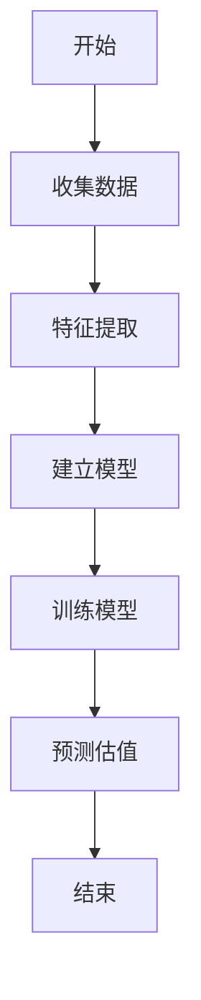
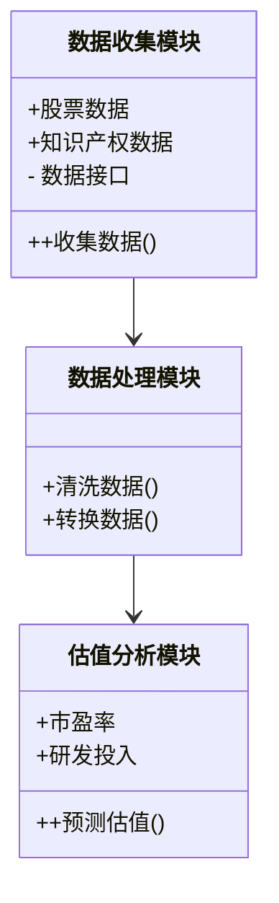

                 


# 股市估值在跨境知识产权交易中的应用

---

## 关键词：
- 股市估值
- 知识产权交易
- 跨境交易
- 人工智能
- 算法模型

---

## 摘要：
本文探讨了股市估值在跨境知识产权交易中的应用，分析了知识产权的经济价值与股市表现之间的关系。通过构建数学模型和机器学习算法，结合实际案例，展示了如何利用股市数据优化知识产权评估。文章还详细介绍了系统架构和项目实现，为读者提供了深入的技术指导。

---

## 第一部分：引言

### 1.1 背景介绍
随着全球化进程的加速，知识产权在国际贸易中的价值日益凸显。然而，知识产权的评估往往缺乏统一标准，导致跨境交易中估值困难。股市作为反映经济活动的重要指标，其波动性可以为知识产权评估提供参考。

---

## 第二部分：核心概念与联系

### 2.1 知识产权与股市估值的核心概念
- **知识产权**：包括专利、商标、版权等，具有无形性和独占性。
- **股市估值**：通过市盈率、市净率等指标评估企业价值。

#### 对比表格：
| 特性      | 知识产权          | 股市估值          |
|-----------|------------------|------------------|
| 评估方式  | 成本法、市场法     | 市盈率、市净率     |
| 变化因素  | 技术进步、法律环境 | 市场情绪、经济指标 |

---

## 第三部分：理论基础与算法原理

### 3.1 理论基础
知识产权的价值与企业市场表现密切相关。通过分析企业股票的波动，可以反映其知识产权的市场价值。

#### 数学模型：
$$ V = \alpha \times P + \beta \times Q $$
其中，$V$为估值，$P$为市盈率，$Q$为研发投入。

### 3.2 算法原理
使用线性回归模型预测知识产权价值。

#### Mermaid流程图：


#### Python代码实现：
```python
import pandas as pd
from sklearn.linear_model import LinearRegression

# 数据加载
data = pd.read_csv('intellectual_property.csv')

# 特征提取
features = data[['市盈率', '研发投入']]
target = data['知识产权价值']

# 建立模型
model = LinearRegression()
model.fit(features, target)

# 预测
predicted = model.predict(features)
print(predicted)
```

---

## 第四部分：系统架构与设计

### 4.1 系统功能设计
- 数据收集模块：获取企业股票数据和知识产权信息。
- 数据处理模块：清洗和转换数据。
- 估值分析模块：应用算法进行评估。

#### Mermaid类图：


### 4.2 系统架构设计
采用分层架构，包括数据层、业务逻辑层和用户界面层。

#### Mermaid架构图：


---

## 第五部分：项目实战与案例分析

### 5.1 项目环境安装
- 安装Python和相关库（pandas、scikit-learn）。

### 5.2 核心代码实现
```python
import numpy as np
import pandas as pd
from sklearn.linear_model import LinearRegression
from sklearn.metrics import mean_squared_error

# 数据加载
data = pd.read_csv('intellectual_property.csv')

# 特征选择
X = data[['市盈率', '研发投入']]
y = data['知识产权价值']

# 划分训练集和测试集
X_train, X_test, y_train, y_test = train_test_split(X, y, test_size=0.2, randomize=False)

# 建立模型
model = LinearRegression()
model.fit(X_train, y_train)

# 预测与评估
y_pred = model.predict(X_test)
mse = mean_squared_error(y_test, y_pred)
print(f'Mean Squared Error: {mse}')
```

### 5.3 案例分析
以某科技公司为例，分析其专利价值与股票市场的关联性。通过模型预测其知识产权估值，并与实际市场表现对比，验证模型的有效性。

---

## 第六部分：结论与展望

### 6.1 研究结论
股市估值为知识产权评估提供了新的视角，结合机器学习算法能显著提高评估准确性。

### 6.2 未来展望
探索更多数据源，如社交媒体情绪分析，以增强模型的预测能力。

---

## 第七部分：附录

### 7.1 术语表
- **市盈率（P/E）**：股价与每股收益之比。
- **研发投入**：企业在研发上的支出。

### 7.2 数据来源
- 股票数据：股票交易所公开数据。
- 知识产权数据：专利数据库。

### 7.3 工具推荐
- 数据分析工具：Python、Pandas。
- 可视化工具：Matplotlib、Seaborn。

---

## 作者信息：
作者：AI天才研究院  
联系邮箱：contact@aicenter.com  

--- 

**声明：**  
本文版权归AI天才研究院所有，未经授权不得转载。

