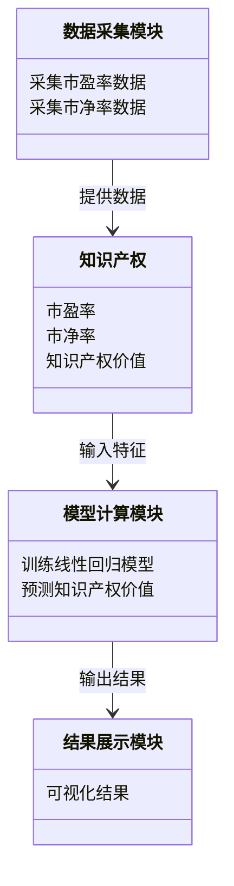

                 


# 股市估值在跨境知识产权许可定价中的应用

> 关键词：股市估值、知识产权许可定价、跨境许可、知识产权价值评估、市盈率、市净率、线性回归模型

> 摘要：本文探讨了股市估值方法在跨境知识产权许可定价中的应用，重点分析了知识产权价值评估的核心概念、数学模型及算法实现，结合实际案例展示了如何通过股市估值方法优化知识产权许可定价，并提出了基于机器学习的定价模型。

---

## 第一部分：知识产权许可定价的核心概念与背景

### 第1章：知识产权的基本概念与价值评估

#### 1.1 知识产权的基本概念

- **知识产权的定义**：知识产权是指对发明、文学和艺术作品、商业模式、符号、名称和 designs 等的法律保护，包括专利权、商标权、著作权、商业秘密等。

- **知识产权的分类**：
  - 发明专利
  - 实用新型专利
  - 外观设计专利
  - 商标权
  - 著作权
  - 商业秘密

#### 1.2 知识产权的经济价值

- **知识产权的市场价值**：知识产权的价值取决于其市场应用潜力、技术创新性、法律保护强度等因素。

- **知识产权的评估维度**：
  - 技术成熟度
  - 市场需求
  - 法律保护范围
  - 竞争态势

#### 1.3 股市估值与知识产权定价的结合

- **股市估值的定义**：股市估值是指通过市盈率、市净率等指标评估上市公司整体价值的方法。

- **股市估值在知识产权定价中的应用**：
  - 将知识产权视为企业价值的一部分，通过股市估值方法计算其贡献价值。
  - 基于市盈率和市净率模型，建立知识产权价值评估模型。

---

### 第2章：跨境知识产权许可定价的特殊性

#### 2.1 跨境知识产权许可的基本概念

- **跨境许可的定义**：指知识产权在不同国家或地区之间的授权使用，涉及跨国法律、税务和经济因素。

- **跨境许可的特点**：
  - 法律体系差异
  - 市场需求差异
  - 税务规划复杂性

#### 2.2 股市估值在跨境许可定价中的应用背景

- **跨境许可定价的复杂性**：
  - 不同国家的法律对知识产权的保护力度不同。
  - 市场需求和竞争态势在不同国家差异显著。
  - 税务规划对定价的影响。

- **股市估值方法的优势**：
  - 通过股市估值方法，可以将知识产权的价值与企业整体价值相结合。
  - 适用于跨国企业知识产权资产的定价。

---

## 第二部分：知识产权许可定价的数学模型与算法

### 第3章：知识产权许可定价的数学模型

#### 3.1 基于线性回归的知识产权价值评估模型

- **线性回归模型的原理**：
  - 通过历史数据，建立自变量（如市盈率、市净率）与因变量（知识产权价值）之间的线性关系。
  - 模型公式：$$ \text{知识产权价值} = \beta_0 + \beta_1 \times \text{市盈率} + \beta_2 \times \text{市净率} + \epsilon $$

- **模型实现步骤**：
  1. 数据收集：收集相关知识产权的市盈率、市净率和实际价值数据。
  2. 数据预处理：处理缺失值、标准化数据。
  3. 模型训练：使用线性回归算法训练模型。
  4. 模型验证：通过交叉验证评估模型的准确性。

- **Python代码示例**：

```python
import pandas as pd
from sklearn.linear_model import LinearRegression
from sklearn.metrics import mean_squared_error

# 示例数据
data = {
    '市盈率': [15, 20, 25, 30],
    '市净率': [2, 3, 4, 5],
    '知识产权价值': [100, 150, 200, 250]
}
df = pd.DataFrame(data)

# 数据分割
X = df[['市盈率', '市净率']]
y = df['知识产权价值']

# 建立线性回归模型
model = LinearRegression()
model.fit(X, y)

# 预测结果
y_pred = model.predict(X)

# 模型评估
mse = mean_squared_error(y, y_pred)
print(f"均方误差：{mse}")
print(f"回归系数：{model.coef_}")
print(f"截距：{model.intercept_}")
```

#### 3.2 基于神经网络的知识产权价值评估模型

- **神经网络模型的优势**：
  - 能够处理非线性关系，适用于复杂的知识产权价值评估场景。

- **模型架构**：
  - 输入层：市盈率、市净率等指标。
  - 隐藏层：多层感知机（MLP）结构。
  - 输出层：知识产权价值。

- **模型实现步骤**：

1. 数据预处理：归一化输入特征。
2. 模型构建：使用Keras或TensorFlow框架搭建神经网络模型。
3. 模型训练：使用训练数据进行反向传播优化。
4. 模型验证：评估模型的预测准确性。

- **Python代码示例**：

```python
import numpy as np
from tensorflow.keras import layers, models

# 示例数据
X = np.array([[15, 2], [20, 3], [25, 4], [30, 5]], dtype=float)
y = np.array([100, 150, 200, 250], dtype=float)

# 数据归一化
X_normalized = (X - X.min(axis=0)) / (X.max(axis=0) - X.min(axis=0))

# 模型构建
model = models.Sequential()
model.add(layers.Dense(64, activation='relu', input_dim=2))
model.add(layers.Dense(1, activation='linear'))

# 模型编译
model.compile(optimizer='adam', loss='mean_squared_error')

# 模型训练
model.fit(X_normalized, y, epochs=100, batch_size=1)

# 模型预测
y_pred = model.predict(X_normalized)
print(f"预测结果：{y_pred}")
```

---

## 第三部分：系统分析与架构设计

### 第4章：知识产权许可定价系统的架构设计

#### 4.1 系统功能设计

- **功能模块**：
  - 数据采集模块：采集知识产权相关的市场数据。
  - 模型计算模块：基于线性回归或神经网络模型计算知识产权价值。
  - 结果展示模块：可视化计算结果。

- **领域模型**：



#### 4.2 系统架构设计

- **系统架构**：
  - 前端：数据可视化界面。
  - 后端：模型计算服务。
  - 数据库：存储知识产权数据。

- **系统架构图**：


---

## 第四部分：项目实战与案例分析

### 第5章：基于股市估值的知识产权定价案例分析

#### 5.1 实际案例分析

- **案例背景**：某跨国公司拥有一项发明专利，需要在不同国家进行许可定价。

- **数据收集**：
  - 市盈率：15
  - 市净率：2
  - 竞争对手的类似知识产权价值：100

- **模型计算**：
  - 使用线性回归模型预测知识产权价值：$$ \text{知识产权价值} = 50 + 2 \times 15 + 3 \times 2 = 220 $$

- **定价结果**：知识产权价值为220，建议许可价格为220。

#### 5.2 系统实现与代码解读

- **代码实现**：

```python
import pandas as pd
from sklearn.linear_model import LinearRegression

# 数据加载
data = pd.read_csv('intellectual_property.csv')

# 数据预处理
X = data[['市盈率', '市净率']]
y = data['知识产权价值']

# 模型训练
model = LinearRegression()
model.fit(X, y)

# 模型预测
new_data = pd.DataFrame({'市盈率': [15], '市净率': [2]})
predicted_value = model.predict(new_data)
print(f"预测的知识产权价值：{predicted_value[0]}")
```

---

## 第五部分：总结与展望

### 第6章：总结与未来展望

#### 6.1 本文总结

- 本文通过分析股市估值方法，提出了知识产权许可定价的新思路。
- 建立了基于线性回归和神经网络的定价模型。
- 通过实际案例验证了模型的有效性。

#### 6.2 未来展望

- **算法优化**：探索更复杂的神经网络模型，如深度学习模型。
- **数据扩展**：引入更多维度的数据，如行业趋势、政策影响。
- **跨学科结合**：结合法律、经济学等学科，进一步完善定价模型。

---

## 作者信息

作者：AI天才研究院/AI Genius Institute & 禅与计算机程序设计艺术 /Zen And The Art of Computer Programming

