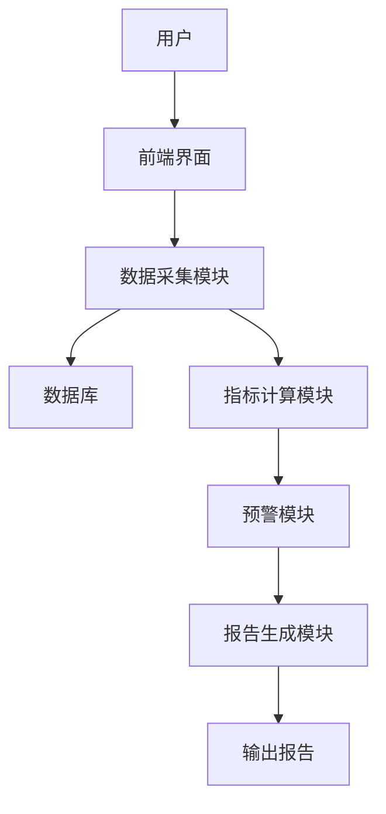

                 


# 股市估值在金融危机预警中的作用

## 关键词：股市估值、金融危机、预警系统、股票指标、系统架构

## 摘要：
股市估值是金融市场中衡量股票价值的重要工具，它不仅反映了市场的健康状况，还能通过特定的指标和模型预测潜在的金融风险。本文将深入探讨股市估值的核心概念、算法原理以及其在金融危机预警中的应用，结合实际案例和系统架构设计，为读者提供一个全面的理解框架。

---

## 第1章：金融危机与股市估值概述

### 1.1 金融危机的定义与特征
金融危机是指金融体系中的严重失衡，导致市场参与者无法正常运作，进而引发系统性风险的事件。其主要特征包括：
- 市场流动性枯竭
- 资产价格大幅波动
- 金融机构破产或纾困
- 经济衰退

### 1.2 股市估值的核心指标
股市估值的核心指标包括：
- **市盈率（P/E）**：衡量股票价格与每股收益的比率，公式为 $$ P/E = \frac{\text{股价}}{\text{每股收益}} $$
- **市净率（P/B）**：衡量股票价格与每股净资产的比率，公式为 $$ P/B = \frac{\text{股价}}{\text{每股净资产}} $$
- **市销率（P/S）**：衡量股票价格与每股销售收入的比率，公式为 $$ P/S = \frac{\text{股价}}{\text{每股销售收入}} $$

### 1.3 金融危机预警的必要性
股市估值不仅是衡量市场健康状况的工具，还能通过分析市场整体估值水平，预测潜在的金融危机。例如，过高的市盈率或市净率可能表明市场存在泡沫，而这些泡沫的破裂往往引发金融危机。

---

## 第2章：股市估值的核心指标与分析

### 2.1 股市估值的主要指标
1. **市盈率（P/E）**：反映市场对未来盈利的预期，高市盈率可能意味着市场过热。
2. **市净率（P/B）**：适用于评估银行等资产密集型行业，低市净率可能意味着低估。
3. **市销率（P/S）**：适用于亏损企业，高市销率可能意味着市场对企业的未来销售预期过高。

### 2.2 不同估值指标的属性特征对比
| 指标名称 | 公式 | 适用场景 | 优缺点 |
|----------|------|----------|--------|
| P/E      | $$ P/E = \frac{\text{股价}}{\text{每股收益}} $$ | 盈利企业 | 易受盈利波动影响 |
| P/B      | $$ P/B = \frac{\text{股价}}{\text{每股净资产}} $$ | 资产密集型行业 | 不适用于亏损企业 |
| P/S      | $$ P/S = \frac{\text{股价}}{\text{每股销售收入}} $$ | 亏损企业 | 易受销售波动影响 |

### 2.3 股市估值的ER实体关系图
```mermaid
er
  title 股市估值ER图
  stock
  company
  indicator
  investor

  stock -[1:N]-> indicator
  company -[1:N]-> stock
  investor -[1:N]-> stock
```

---

## 第3章：基于股市估值的金融危机预警算法

### 3.1 算法原理概述
金融危机预警算法通过分析市场整体估值水平，结合历史数据，预测潜在风险。核心步骤包括：
1. 数据采集：获取历史股价、收益、净资产等数据。
2. 指标计算：计算市盈率、市净率等指标。
3. 数据分析：识别指标异常波动。
4. 预警触发：当指标超出阈值时，触发预警。

### 3.2 算法的数学模型与公式
#### 3.2.1 金融危机预警模型
$$ \text{预警指标} = \alpha \times P/E + \beta \times P/B + \gamma \times P/S $$

其中，$$ \alpha + \beta + \gamma = 1 $$，且 $$ \alpha, \beta, \gamma > 0 $$。

#### 3.2.2 预警阈值设定
$$ \text{预警阈值} = \mu + z \times \sigma $$

其中，$$ \mu $$为均值，$$ \sigma $$为标准差，$$ z $$为标准差倍数。

### 3.3 算法的实现与优化
1. 数据预处理：去除异常值，处理缺失值。
2. 模型训练：使用历史数据训练预警模型。
3. 实时监控：持续计算当前市场指标，与阈值对比。

---

## 第4章：基于股市估值的金融危机预警系统

### 4.1 系统功能设计
#### 4.1.1 功能模块划分
1. 数据采集模块：从数据库获取实时数据。
2. 指标计算模块：计算市盈率、市净率等指标。
3. 预警模块：分析指标，触发预警。
4. 报告生成模块：生成预警报告。

#### 4.1.2 功能实现方式
- 数据采集：使用API接口获取实时数据。
- 指标计算：基于公式实现。
- 预警触发：设置阈值，实时监控。

### 4.2 系统架构设计


---

## 第5章：项目实战

### 5.1 环境安装
1. 安装Python和相关库（Pandas、NumPy、Matplotlib）。
2. 配置数据库连接。

### 5.2 核心实现源代码
```python
import pandas as pd
import numpy as np

# 数据采集
def fetch_data(ticker):
    # 假设使用数据库查询
    data = pd.read_sql(f"SELECT * FROM stock WHERE ticker='{ticker}'", con)
    return data

# 指标计算
def calculate_valuation_indicators(data):
    data['P/E'] = data['price'] / data['eps']
    data['P/B'] = data['price'] / data['book_value']
    data['P/S'] = data['price'] / data['sales_per_share']
    return data

# 预警模块
def trigger预警(data, threshold):
    warnings = []
    for idx, row in data.iterrows():
        if row['P/E'] > threshold['pe'] or row['P/B'] > threshold['pb'] or row['P/S'] > threshold['ps']:
            warnings.append(idx)
    return warnings

# 示例
if __name__ == "__main__":
    ticker = 'AAPL'
    data = fetch_data(ticker)
    indicators = calculate_valuation_indicators(data)
    threshold = {'pe': 20, 'pb': 5, 'ps': 5}
    warnings = trigger_预警(indicators, threshold)
    print(f"触发预警的日期：{warnings}")
```

### 5.3 代码应用解读
1. **数据采集**：从数据库中获取股票的历史数据。
2. **指标计算**：计算市盈率、市净率和市销率。
3. **预警触发**：与阈值对比，触发预警。

---

## 第6章：总结与展望

### 6.1 小结
股市估值是金融危机预警的重要工具，通过分析市场整体估值水平，可以有效识别潜在风险。本文结合理论、算法和系统设计，为读者提供了一个全面的框架。

### 6.2 注意事项
- 数据质量对预警效果至关重要。
- 预警模型需要定期更新和优化。

### 6.3 拓展阅读
- 《金融风险管理》
- 《算法交易：数学模型与实践》

---

## 作者：AI天才研究院 & 禅与计算机程序设计艺术

