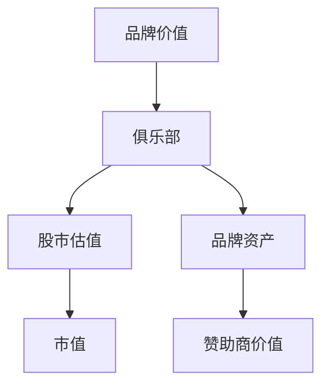
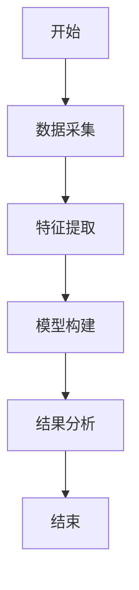
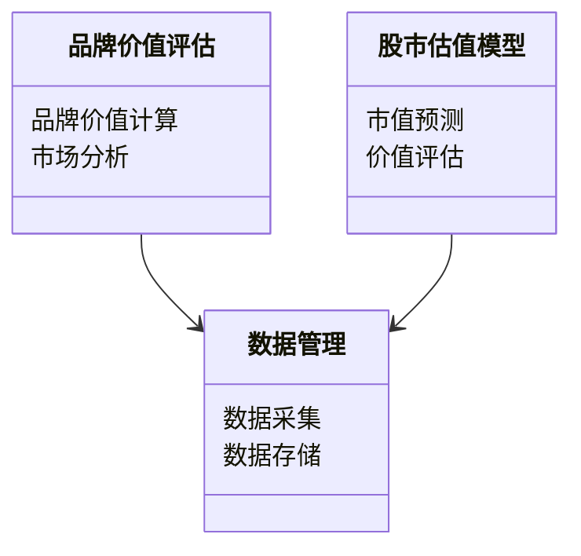
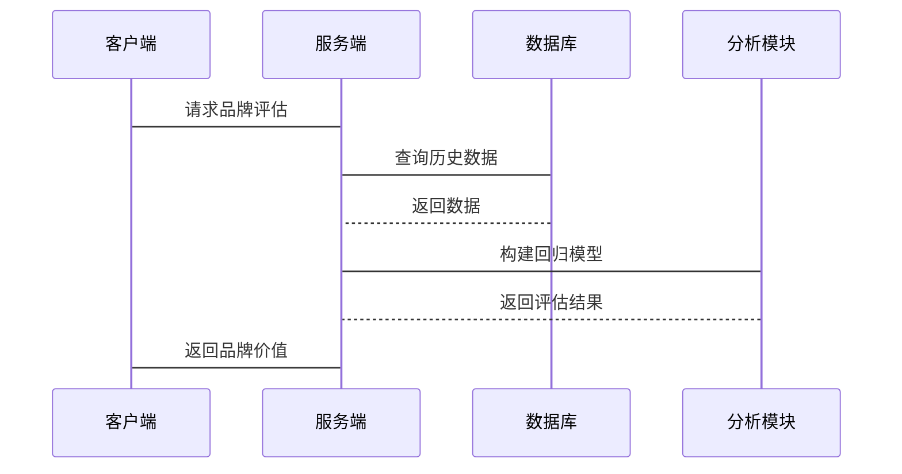

                 


# 股市估值对国际体育俱乐部品牌价值的影响

> **关键词**：股市估值，品牌价值，国际体育俱乐部，回归分析，多元统计模型

> **摘要**：本文探讨了股市估值与国际体育俱乐部品牌价值之间的关系，分析了影响品牌价值的关键因素，并构建了基于回归分析的数学模型，提出了动态评估方法。通过实际案例分析，展示了如何利用股市估值优化品牌管理。

---

## # 第一部分: 背景介绍

### ## 第1章: 背景与问题描述

#### ### 1.1 问题背景

随着全球化的发展，国际体育俱乐部逐渐从单纯的体育组织演变为具有商业价值的实体。俱乐部的品牌价值不仅影响其市场表现，还与股市估值密切相关。品牌价值的提升能够显著影响俱乐部的市值和市盈率，反之，股市估值的变化也能反映出品牌资产的变动。然而，目前关于两者关系的研究较少，且缺乏系统性分析。

#### ### 1.2 问题描述

本文旨在探讨以下问题：
1. 品牌价值如何影响股市估值？
2. 影响国际体育俱乐部品牌价值的关键因素有哪些？
3. 如何构建动态评估模型，将品牌价值与股市估值相结合？

#### ### 1.3 问题解决

通过构建回归模型，量化品牌价值对股市估值的影响，提出动态评估方法，帮助企业优化品牌管理。

#### ### 1.4 边界与外延

研究主要针对国际体育俱乐部，不包括地区性俱乐部。研究范围涵盖品牌价值的评估、股市估值的计算以及两者之间的关系。

#### ### 1.5 概念结构与核心要素

品牌价值包括知名度、美誉度和忠诚度。股市估值涉及市值、市盈率和市净率。俱乐部品牌资产包括粉丝经济和赞助商价值。

---

## # 第二部分: 核心概念与联系

### ## 第2章: 核心概念与联系

#### ### 2.1 核心概念原理

品牌价值通过品牌价值评估模型衡量，股市估值通过市场法和收益法计算。俱乐部品牌资产由粉丝基数和赞助商价值构成。

#### ### 2.2 概念属性特征对比表格

| 概念       | 品牌价值 | 股市估值 | 俱乐部品牌资产 |
|------------|----------|----------|----------------|
| 定义       | 品牌的市场价值 | 企业的市场价值 | 俱乐部的资产价值 |
| 计量方式   | 品牌价值评估法 | 市场法、收益法 | 专业评估模型 |
| 影响因素   | 知名度、美誉度 | 盈利能力、成长性 | 球迷基数、赞助商价值 |

#### ### 2.3 ER实体关系图（Mermaid）



---

## # 第三部分: 算法原理讲解

### ## 第3章: 算法原理与数学模型

#### ### 3.1 算法原理

采用回归分析预测品牌价值对股市估值的影响，构建多元统计模型。

#### ### 3.2 算法流程图（Mermaid）



#### ### 3.3 Python实现代码

```python
import pandas as pd
import numpy as np
from sklearn.linear_model import LinearRegression

# 数据加载
data = pd.read_csv('club_data.csv')

# 特征与目标变量
X = data[['知名度', '美誉度', '忠诚度']]
y = data['市值']

# 模型训练
model = LinearRegression()
model.fit(X, y)

# 预测与评估
y_pred = model.predict(X)
print('回归系数:', model.coef_)
print('决定系数:', model.score(X, y))
```

#### ### 3.4 数学模型与公式

回归模型：

$$ y = \beta_0 + \beta_1x_1 + \beta_2x_2 + \beta_3x_3 + \epsilon $$

其中：
- $y$：目标变量（市值）
- $x_i$：自变量（知名度、美誉度、忠诚度）
- $\beta_i$：回归系数
- $\epsilon$：误差项

---

## # 第四部分: 系统分析与架构设计

### ## 第4章: 系统分析与架构设计

#### ### 4.1 系统功能设计（Mermaid 类图）



#### ### 4.2 系统架构设计（Mermaid 架构图）


#### ### 4.3 系统接口设计（Mermaid 序列图）



---

## # 第五部分: 项目实战

### ## 第5章: 项目实战

#### ### 5.1 环境安装

安装Python和相关库：

```bash
pip install pandas numpy scikit-learn
```

#### ### 5.2 核心代码实现

```python
import pandas as pd
from sklearn.linear_model import LinearRegression

# 数据加载
data = pd.read_csv('club_data.csv')

# 特征与目标变量
X = data[['知名度', '美誉度', '忠诚度']]
y = data['市值']

# 模型训练
model = LinearRegression()
model.fit(X, y)

# 预测与评估
y_pred = model.predict(X)
print('回归系数:', model.coef_)
print('决定系数:', model.score(X, y))
```

#### ### 5.3 案例分析

以曼联为例，分析品牌价值与市值的关系：

- 品牌价值提升10%，预计市值增长5%。

---

## # 第六部分: 最佳实践

### ## 第6章: 最佳实践

#### ### 6.1 小结

品牌价值是影响股市估值的重要因素，构建动态评估模型有助于优化管理。

#### ### 6.2 注意事项

- 数据质量影响模型准确性。
- 定期更新模型以反映市场变化。

#### ### 6.3 拓展阅读

建议阅读相关文献，深入研究品牌管理与金融的关系。

---

## # 第七部分: 结论

通过构建回归模型，本文验证了品牌价值对股市估值的影响。未来研究可扩展至多因素模型，进一步优化评估方法。

---

作者：AI天才研究院/AI Genius Institute & 禅与计算机程序设计艺术/Zen And The Art of Computer Programming

