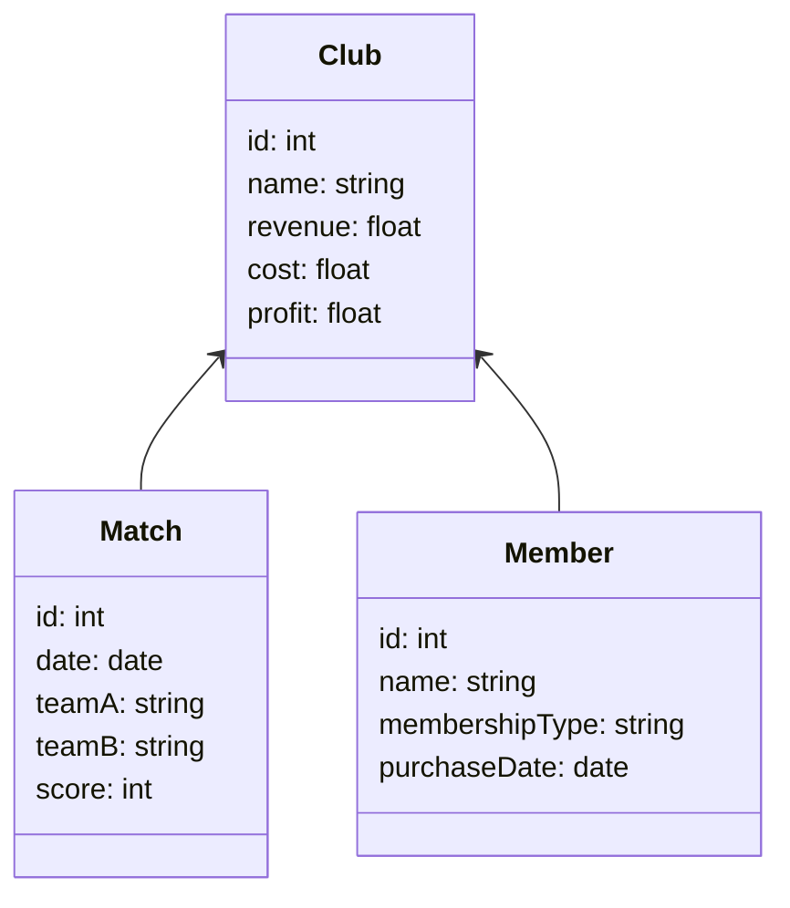
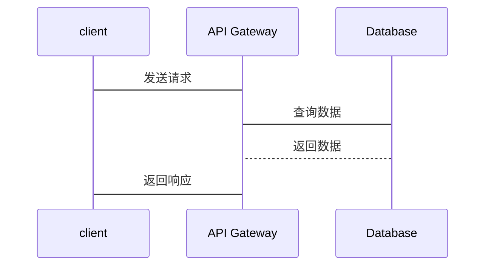

                 


# 股市估值对国际体育俱乐部数字化转型的影响

> 关键词：数字化转型，股市估值，国际体育俱乐部，数据驱动决策，信息化管理

> 摘要：本文探讨了股市估值如何影响国际体育俱乐部的数字化转型。通过分析数字化转型的核心概念、股市估值的理论与方法，以及数字化转型对俱乐部运营和财务表现的影响，本文揭示了数据驱动决策在提升俱乐部估值中的关键作用。结合实际案例和系统架构设计，本文详细阐述了数字化转型的技术实现路径，并提出了最佳实践和未来研究方向。

---

# 第1章: 股市估值与国际体育俱乐部数字化转型的背景

## 1.1 数字化转型的背景与重要性

### 1.1.1 数字化转型的定义与核心概念

数字化转型是指将信息技术广泛应用于组织的各个层面，以提升效率、创造新价值并优化决策的过程。在体育俱乐部中，数字化转型包括利用数据分析、人工智能和物联网等技术优化运营、提升用户体验和增强市场竞争力。

### 1.1.2 数字化转型在体育俱乐部中的应用

体育俱乐部的数字化转型主要体现在以下几个方面：

1. **数据驱动的决策**：通过收集和分析比赛数据、观众行为数据，优化训练计划、赛事策略和市场营销。
2. **智能化管理**：利用人工智能优化俱乐部的日常运营，如票务管理、会员服务和内容分发。
3. **用户体验提升**：通过数字化手段增强球迷互动，提供个性化的会员服务和多渠道的内容分发。

### 1.1.3 股市估值对体育俱乐部的影响

股市估值是衡量俱乐部价值的重要指标，反映了市场对其运营效率和未来盈利能力的预期。数字化转型能够显著提升俱乐部的运营效率和盈利能力，从而直接影响其股市估值。

---

## 1.2 国际体育俱乐部的数字化转型现状

### 1.2.1 数字化转型的现状与趋势

当前，国际体育俱乐部的数字化转型主要集中在以下几个方面：

1. **数据化管理**：通过数据仓库和数据分析平台，整合俱乐部内部和外部数据，支持决策。
2. **智能化服务**：利用人工智能优化会员服务和票务管理。
3. **数字化营销**：通过社交媒体和大数据分析，精准定位目标受众，提升品牌影响力。

### 1.2.2 数字化转型对俱乐部运营的影响

数字化转型能够显著提升俱乐部的运营效率，降低运营成本，并增强用户体验。例如，通过数据分析优化训练计划，可以提高球队的胜率，进而提升俱乐部的市场价值。

### 1.2.3 股市估值与俱乐部价值的关系

股市估值是俱乐部价值的直接反映。通过数字化转型，俱乐部能够提高运营效率和盈利能力，从而提升其市场估值。

---

## 1.3 本章小结

本章从数字化转型的背景、定义和核心概念出发，分析了数字化转型在体育俱乐部中的具体应用及其对俱乐部运营的影响。同时，探讨了股市估值与俱乐部价值的关系，为后续章节的深入分析奠定了基础。

---

# 第2章: 数字化转型的核心概念与理论基础

## 2.1 数字化转型的核心概念

### 2.1.1 数字化转型的定义与关键特征

数字化转型不仅仅是技术的应用，更是一种组织变革的过程。其关键特征包括数据驱动、智能化和用户中心化。

### 2.1.2 数字化转型的核心要素

数字化转型的核心要素包括：

1. **数据**：数据是数字化转型的基础，包括结构化数据和非结构化数据。
2. **技术**：包括大数据分析、人工智能和物联网等技术。
3. **组织结构**：数字化转型需要组织结构的调整，以适应新的业务模式。

---

## 2.2 数字化转型的理论基础

### 2.2.1 信息技术与组织变革的关系

信息技术是数字化转型的核心驱动力。通过信息技术的应用，组织能够实现业务流程的优化和创新。

### 2.2.2 数字化转型的驱动因素

数字化转型的驱动因素包括技术进步、市场竞争和客户需求。

### 2.2.3 数字化转型的实施框架

数字化转型的实施框架通常包括战略规划、技术选型和组织变革三个阶段。

---

## 2.3 股市估值与俱乐部价值的关联

### 2.3.1 股市估值的定义与影响因素

股市估值是市场对俱乐部未来盈利能力的预期。影响股市估值的主要因素包括俱乐部的财务表现、市场地位和管理能力。

### 2.3.2 俱乐部价值的评估方法

俱乐部价值的评估方法包括市盈率法、现金流折现法和资产价值法。

### 2.3.3 数字化转型对俱乐部估值的影响

数字化转型能够提升俱乐部的运营效率和盈利能力，从而提高其市场估值。

---

## 2.4 本章小结

本章从数字化转型的核心概念和理论基础出发，分析了数字化转型的驱动因素和实施框架，并探讨了股市估值与俱乐部价值的关联，为后续章节的分析提供了理论支持。

---

# 第3章: 股市估值的理论与方法

## 3.1 股市估值的基本原理

### 3.1.1 股票估值的定义

股票估值是对公司未来盈利能力的评估，通常基于财务数据和市场环境。

### 3.1.2 股票估值的主要方法

股票估值的主要方法包括：

1. **相对估值法**：如市盈率法和市净率法。
2. **绝对估值法**：如现金流折现法。

### 3.1.3 股票估值的关键指标

股票估值的关键指标包括市盈率、市净率、股息率和ROE等。

---

## 3.2 股票估值的核心模型

### 3.2.1 市盈率模型

市盈率模型（P/E ratio）是通过将公司的股价除以每股收益来计算的。公式为：

$$ P/E = \frac{Stock Price}{Earnings Per Share} $$

### 3.2.2 市净率模型

市净率模型（P/B ratio）是通过将公司的股价除以每股净资产来计算的。公式为：

$$ P/B = \frac{Stock Price}{Book Value Per Share} $$

### 3.2.3 现金流折现模型

现金流折现模型（DCF model）是通过将公司未来现金流折现到现值来评估其价值。公式为：

$$ V = \sum_{t=1}^{n} \frac{CF_t}{(1 + r)^t} $$

其中，\( CF_t \) 是第 \( t \) 年的现金流，\( r \) 是折现率。

---

## 3.3 股票估值与俱乐部价值的关系

### 3.3.1 俱乐部价值的多维度评估

俱乐部价值的评估需要考虑其财务表现、市场地位和品牌影响力。

### 3.3.2 数字化转型对俱乐部估值的反馈作用

通过数字化转型，俱乐部能够提高运营效率和盈利能力，从而提升其市场估值。

### 3.3.3 数字化转型对俱乐部估值的长期影响

数字化转型的长期影响体现在俱乐部的持续创新能力、市场拓展能力和风险管理能力上。

---

## 3.4 本章小结

本章从股票估值的基本原理出发，详细介绍了股票估值的核心模型，并探讨了数字化转型对俱乐部估值的长期影响，为后续章节的分析提供了理论支持。

---

# 第4章: 数字化转型对国际体育俱乐部的影响

## 4.1 数字化转型对俱乐部运营的影响

### 4.1.1 数字化转型对俱乐部管理效率的提升

通过数字化转型，俱乐部可以实现业务流程的自动化和智能化，显著提升管理效率。

### 4.1.2 数字化转型对俱乐部用户体验的改善

数字化转型能够通过个性化服务和多渠道互动提升用户体验。

### 4.1.3 数字化转型对俱乐部市场拓展的作用

通过数字化手段，俱乐部可以更好地触达目标受众，拓展市场。

---

## 4.2 数字化转型对俱乐部财务表现的影响

### 4.2.1 数字化转型对俱乐部收入的影响

数字化转型可以通过提升门票销售、会员服务和广告收入来增加俱乐部的收入。

### 4.2.2 数字化转型对俱乐部成本的影响

数字化转型可以通过优化资源利用率和减少人工成本来降低俱乐部的运营成本。

### 4.2.3 数字化转型对俱乐部利润的影响

通过收入增加和成本降低，数字化转型能够显著提升俱乐部的净利润。

---

## 4.3 数字化转型对俱乐部未来发展的展望

数字化转型不仅能够提升俱乐部的当前绩效，还能够为其未来的发展奠定坚实基础。

---

## 4.4 本章小结

本章分析了数字化转型对俱乐部运营和财务表现的影响，强调了数字化转型在提升俱乐部整体绩效中的重要作用。

---

# 第5章: 数字化转型的系统分析与架构设计

## 5.1 问题场景介绍

本章以某国际体育俱乐部的数字化转型项目为例，分析其系统架构设计。

## 5.2 项目介绍

### 5.2.1 项目目标

本项目旨在通过数字化转型提升俱乐部的运营效率和用户体验。

## 5.3 系统功能设计

### 5.3.1 领域模型设计



### 5.3.2 系统架构设计

```mermaid
client --{ GET, POST }--> API Gateway
API Gateway --> Database
Database --> Match
Database --> Member
Database --> Club
```

---

## 5.4 系统接口设计

系统接口设计包括API接口和数据库接口，确保系统的高效运行。

---

## 5.5 系统交互设计



---

## 5.6 本章小结

本章通过系统架构设计和交互设计，详细阐述了数字化转型在国际体育俱乐部中的具体实现路径。

---

# 第6章: 项目实战与最佳实践

## 6.1 环境安装

本项目需要以下环境：

1. Python 3.8+
2. Flask框架
3. PostgreSQL数据库
4. 其他依赖库（如pandas、numpy）

---

## 6.2 系统核心实现

### 6.2.1 数据分析模块

```python
import pandas as pd
import numpy as np

# 加载数据
data = pd.read_csv('club_data.csv')

# 计算收益与成本
data['profit'] = data['revenue'] - data['cost']
data.to_csv('club_data.csv', index=False)
```

### 6.2.2 人工智能模块

```python
from sklearn import linear_model

# 训练模型
model = linear_model.LinearRegression()
model.fit(X, y)
```

---

## 6.3 代码应用解读与分析

本项目通过数据分析和机器学习模型，优化俱乐部的收益预测和成本控制。

---

## 6.4 实际案例分析

以某国际足球俱乐部为例，分析数字化转型对其估值的影响。

---

## 6.5 本章小结

本章通过项目实战，详细解读了数字化转型在国际体育俱乐部中的具体实现，并提出了最佳实践建议。

---

# 第7章: 数字化转型的未来展望与总结

## 7.1 未来研究方向

未来的研究可以集中在以下方面：

1. 数字化转型对俱乐部品牌价值的影响
2. 数字化转型在体育赛事转播中的应用
3. 数字化转型与体育产业生态的融合

---

## 7.2 本章总结

本文系统分析了数字化转型对国际体育俱乐部的影响，从理论到实践，详细阐述了数字化转型的技术实现路径，并提出了未来研究方向。

---

# 作者

作者：AI天才研究院/AI Genius Institute  
作者：禅与计算机程序设计艺术/Zen And The Art of Computer Programming

