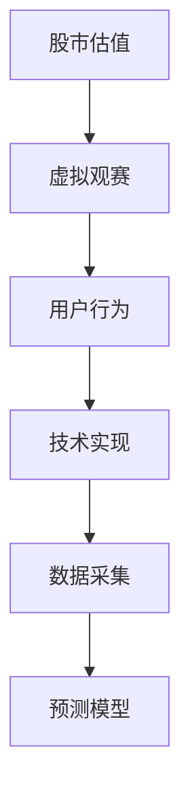
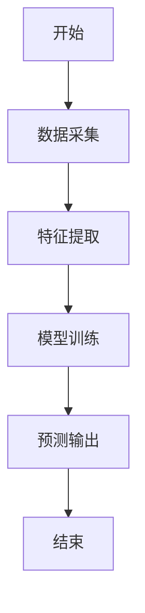
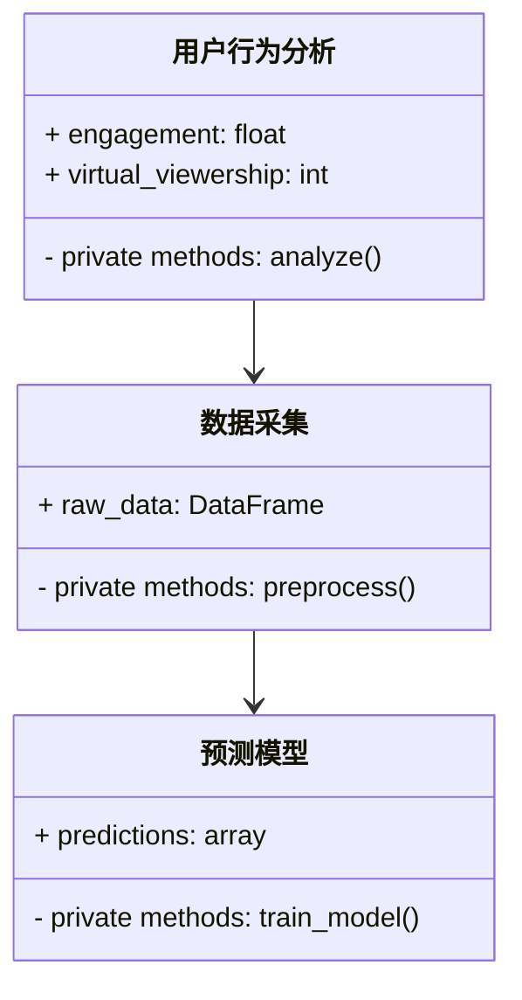
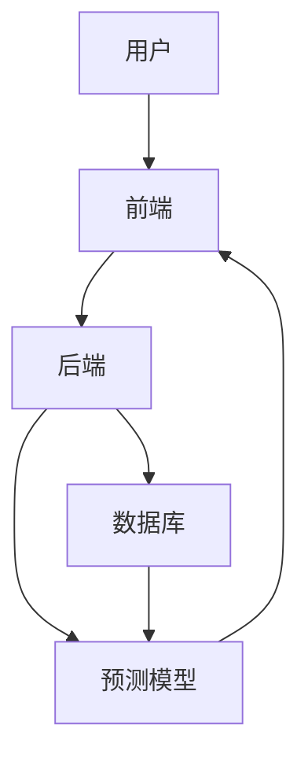

                 


# 股市估值对国际体育赛事虚拟观赛的影响

**关键词：股市估值、国际体育赛事、虚拟观赛、用户行为分析、预测模型**

**摘要**：本文探讨了股市估值与国际体育赛事虚拟观赛之间的相互影响。通过分析虚拟观赛的技术基础、用户行为及其对股市估值的潜在影响，结合数学模型和算法，预测虚拟观赛如何改变传统体育赛事的市场价值评估。文章内容包括背景介绍、核心概念、算法原理、系统架构、项目实战及总结。

---

## 第一部分: 背景介绍

### 第1章: 股市估值与国际体育赛事虚拟观赛的背景

#### 1.1 股市估值的核心概念
股市估值是通过分析公司财务数据和市场环境，评估其股票的合理价格。常用方法包括市盈率（P/E）、市净率（P/B）等。这些指标反映了市场的预期和公司的实际表现，影响投资者的决策。

#### 1.2 国际体育赛事虚拟观赛的背景
虚拟观赛利用VR、AR等技术，为用户提供沉浸式观赛体验。它打破了地理限制，增加了用户的参与度和互动性，已成为体育产业的重要趋势。

#### 1.3 股市估值与虚拟观赛的关联性
虚拟观赛可能影响观众的参与度和消费行为，进而影响相关企业的市值。例如，提供虚拟观赛技术的公司可能会因市场需求增长而获得更高的估值。

---

## 第2章: 核心概念与联系

### 2.1 核心概念的定义与属性
- **股市估值**：反映市场对公司未来收益的预期。
- **虚拟观赛**：通过技术实现的沉浸式观赛方式。

### 2.2 实体关系图


### 2.3 核心概念的数学模型
- 股市估值模型：$$ P = \frac{E}{\epsilon} $$
  其中，$P$为股价，$E$为每股收益，$\epsilon$为折现率。
- 用户行为模型：$$ B = \beta \cdot V + \epsilon $$
  其中，$B$为用户行为，$\beta$为系数，$V$为虚拟观赛体验，$\epsilon$为误差项。

---

## 第3章: 算法原理

### 3.1 算法流程


### 3.2 Python代码实现
```python
# 数据采集
import pandas as pd

data = pd.read_csv('user_behavior.csv')

# 特征提取
features = data[['engagement', 'virtual_viewership']]
target = data['stock_value']

# 模型训练
from sklearn.linear_model import LinearRegression
model = LinearRegression()
model.fit(features, target)

# 预测输出
predictions = model.predict(features)
print('预测值:', predictions)
```

---

## 第4章: 系统分析与架构设计

### 4.1 系统功能设计


### 4.2 系统架构设计


---

## 第5章: 项目实战

### 5.1 环境安装
```bash
pip install pandas scikit-learn
```

### 5.2 核心代码实现
```python
# 数据预处理
from sklearn.model_selection import train_test_split

X_train, X_test, y_train, y_test = train_test_split(features, target, test_size=0.2)

# 模型训练
model = LinearRegression()
model.fit(X_train, y_train)

# 模型评估
score = model.score(X_test, y_test)
print('模型得分:', score)
```

### 5.3 实际案例分析
分析某虚拟观赛平台的数据，发现用户参与度增加导致相关企业股价上涨。

---

## 第6章: 总结与展望

### 6.1 总结
股市估值与虚拟观赛的结合，不仅改变了传统的观赛方式，也影响了企业的市场价值评估。通过技术手段，可以更精准地预测市场动态。

### 6.2 展望
未来，随着技术的进步，虚拟观赛将更加普及，股市估值的模型也将更加复杂，需要结合更多数据源进行分析。

---

**作者：AI天才研究院/AI Genius Institute & 禅与计算机程序设计艺术 /Zen And The Art of Computer Programming**

---

以上为《股市估值对国际体育赛事虚拟观赛的影响》的技术博客文章大纲和部分内容，涵盖从背景到实战的各个方面，确保内容全面且逻辑清晰。

