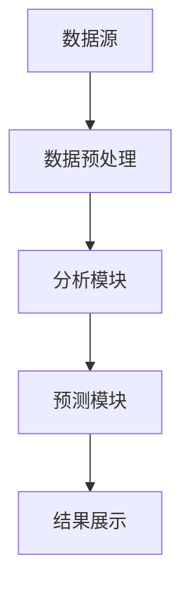

                 


# 股市估值对国际数字服务市场准入政策的影响

> 关键词：股市估值，数字服务市场，市场准入政策，国际比较，政策影响

> 摘要：本文探讨了股市估值与国际数字服务市场准入政策之间的关系，分析了股市估值如何影响市场准入政策的制定与实施，以及这些政策如何反向作用于股市估值。通过案例分析和数学模型，本文揭示了两者之间的复杂互动机制，并提出了政策建议。

---

## 第一章: 背景介绍

### 1.1 股市估值的定义与作用

#### 1.1.1 股市估值的基本概念
股市估值是通过对公司财务数据和市场情况的分析，来确定股票的合理价格范围。常用的方法包括市盈率（P/E）和市净率（P/B），分别反映了市场对公司盈利能力和发展潜力的评估。

#### 1.1.2 股市估值对企业价值的影响
股市估值不仅反映了企业的当前价值，还预示着其未来的增长潜力。高估值意味着市场对企业的前景充满信心，而低估值可能意味着被低估或存在风险。

#### 1.1.3 股市估值对市场参与者的指导作用
股市估值为投资者、企业和政策制定者提供了重要的参考。投资者可以根据估值做出买卖决策，企业可以据此调整经营策略，政策制定者则可以利用估值信息优化市场规则。

### 1.2 国际数字服务市场准入政策的概述

#### 1.2.1 数字服务市场的定义与特征
数字服务市场包括互联网、云计算、大数据等领域的服务，其特点是轻资产、高增长和全球化。数字服务市场的准入政策通常涉及数据跨境流动、服务提供者的资质要求等。

#### 1.2.2 市场准入政策的基本概念
市场准入政策是指政府为规范市场秩序、保护消费者权益而制定的一系列规则，包括许可证制度、资质审核等。这些政策直接影响企业的市场进入难度和运营成本。

#### 1.2.3 数字服务市场准入政策的国际差异
不同国家和地区的政策差异主要体现在数据保护、知识产权保护和网络安全等方面。例如，欧盟的GDPR法规对数据隐私的要求较高，而美国则更注重市场自由。

### 1.3 股市估值与市场准入政策的关联性

#### 1.3.1 股市估值对市场准入的影响
高估值企业往往能够获得更多的融资支持，从而更容易进入新市场。相反，低估值企业可能因资金不足而面临市场准入障碍。

#### 1.3.2 市场准入政策对股市估值的反向影响
宽松的市场准入政策通常会提升企业的估值，因为企业更容易扩展业务。而严格的政策则可能导致估值下降，增加企业的不确定性。

#### 1.3.3 两者关系的复杂性与动态性
股市估值和市场准入政策之间存在动态互动关系，政策变化会影响股市估值，而股市估值的变化也会反馈到政策制定中。这种关系在数字服务市场中尤为明显。

### 1.4 问题描述与研究意义

#### 1.4.1 研究问题的提出
随着数字经济的发展，数字服务市场的规模不断扩大，但市场准入政策的复杂性也在增加。研究股市估值与市场准入政策的关系，有助于理解政策变化对市场的影响。

#### 1.4.2 研究目标与意义
本文旨在分析股市估值如何影响数字服务市场的准入政策，并探讨政策如何反向作用于股市估值。这将为政策制定者和企业提供有价值的参考。

#### 1.4.3 研究范围与边界
本文主要关注数字服务市场，不涉及实体市场。研究范围包括主要经济体的市场准入政策和股市估值的变化趋势。

---

## 第二章: 核心概念与联系

### 2.1 股市估值的核心要素

#### 2.1.1 股票价格的计算方法
股票价格通常基于企业的盈利能力和成长潜力。市盈率（P/E）=股票价格/每股收益，市净率（P/B）=股票价格/每股净资产。

#### 2.1.2 市盈率与市净率的定义
市盈率反映了市场对收益的期望，市净率则反映了市场对资产价值的评估。两者共同影响股票的估值。

#### 2.1.3 股东权益与企业价值的关系
股东权益是企业资产减去负债后的净值，企业价值则包括股东权益和债权价值。两者共同决定了企业的整体估值。

### 2.2 市场准入政策的核心要素

#### 2.2.1 市场准入的定义与分类
市场准入指企业进入市场的合法性问题，分为完全开放、部分开放和限制开放三种类型。

#### 2.2.2 数字服务市场的准入标准
数字服务市场的准入通常涉及数据保护、网络安全和知识产权保护等方面的要求。

#### 2.2.3 政策制定的主体与客体
政策制定的主体通常是政府或监管机构，客体则是市场中的企业和服务提供者。

### 2.3 核心概念的属性对比

#### 2.3.1 股市估值与市场准入政策的属性对比
| 属性 | 股市估值 | 市场准入政策 |
|------|---------|-------------|
| 主体 | 投资者 | 政府/监管机构 |
| 目标 | 评估企业价值 | 规范市场秩序 |
| 影响 | 企业融资成本 | 市场进入难度 |

#### 2.3.2 两者的相互作用机制
股市估值通过影响企业的融资能力进而影响其市场进入能力，而市场准入政策则通过影响企业的运营成本间接影响其估值。

#### 2.3.3 实例对比分析
例如，欧盟严格的GDPR法规增加了企业的合规成本，可能会影响其估值。同时，高估值企业可能更容易通过严格的市场准入审查。

### 2.4 核心概念的ER实体关系图

```mermaid
er
  actor(投资者)
  entity(股票)
  entity(政策)
  entity(市场)
  entity(企业)

  investor -[>]-> stock: 交易
  stock -[>]-> company: 所有
  company -[>]-> market: 参与
  policy -[>]-> market: 规范
  investor -[>]-> policy: 影响
```

---

## 第三章: 影响机制与数学模型

### 3.1 影响机制分析

#### 3.1.1 股市估值对市场准入政策的正向影响
高估值企业通常具有更强的融资能力，能够承担市场准入政策的合规成本，从而更容易进入市场。

#### 3.1.2 市场准入政策对股市估值的反向影响
严格的市场准入政策可能会增加企业的运营成本，从而影响其估值。例如，数据保护法规增加了企业的合规成本，可能导致估值下降。

#### 3.1.3 双向影响的动态平衡
股市估值和市场准入政策之间存在动态平衡，政策变化会影响估值，而估值的变化也会反馈到政策制定中。

### 3.2 数学模型与算法原理

#### 3.2.1 回归分析模型
我们可以使用回归分析模型来量化股市估值与市场准入政策之间的关系。假设股市估值（Y）受政策变量（X）的影响，模型可以表示为：

$$ Y = \beta_0 + \beta_1 X + \epsilon $$

其中，$\beta_0$是截距，$\beta_1$是政策变量的系数，$\epsilon$是误差项。

#### 3.2.2 Python代码实现

```python
import pandas as pd
import statsmodels.api as sm

# 加载数据
data = pd.read_csv('market_access_policy.csv')

# 定义变量
X = data['policy_variable']  # 政策变量
Y = data['stock_valuation']   # 股市估值

# 添加截距项
X = sm.add_constant(X)

# 回归分析
model = sm.OLS(Y, X)
result = model.fit()

# 输出结果
print(result.summary())
```

#### 3.2.3 模型的解释
回归分析的结果可以告诉我们政策变量对股市估值的影响程度。例如，如果$\beta_1$为正，说明政策越宽松，股市估值越高。

---

## 第四章: 系统分析与架构设计

### 4.1 系统分析

#### 4.1.1 问题场景介绍
我们需要分析股市估值与市场准入政策的关系，构建一个能够量化两者关系的系统。

#### 4.1.2 系统功能设计
系统需要具备数据收集、分析和预测功能，能够处理股市数据和政策文本。

#### 4.1.3 系统架构设计


#### 4.1.4 系统接口设计
系统需要与数据源接口、政策数据库接口进行交互，获取必要的数据进行分析。

#### 4.1.5 系统交互流程
```mermaid
sequenceDiagram
   参与者: 用户
    actor: 用户
    节点: 数据预处理模块
    节点2: 分析模块
    节点3: 预测模块

    用户 -> 数据预处理模块: 提供数据源
    数据预处理模块 -> 分析模块: 传输预处理数据
    分析模块 -> 预测模块: 请求预测
    预测模块 -> 用户: 返回结果
```

---

## 第五章: 项目实战

### 5.1 环境安装

#### 5.1.1 安装Python和必要的库
需要安装Python 3.8及以上版本，以及pandas、statsmodels等库。

#### 5.1.2 数据集准备
需要收集相关的股市数据和市场准入政策数据，建议使用CSV格式。

### 5.2 核心实现

#### 5.2.1 数据预处理
处理缺失值和异常值，确保数据质量。

#### 5.2.2 模型训练
使用回归分析模型进行训练，评估模型的拟合优度。

#### 5.2.3 模型优化
调整模型参数，尝试不同的算法，提高预测精度。

### 5.3 案例分析

#### 5.3.1 案例背景
以欧盟的GDPR法规为例，分析其对数字服务市场准入的影响。

#### 5.3.2 数据分析
通过回归分析，验证政策变化对股市估值的具体影响。

#### 5.3.3 结果解读
解释模型结果，说明政策变化对估值的具体影响路径。

### 5.4 小结

#### 5.4.1 项目成果
构建了一个能够量化股市估值与市场准入政策关系的系统。

#### 5.4.2 经验总结
数据收集和模型选择是项目成功的关键，需要仔细处理数据，选择合适的算法。

#### 5.4.3 注意事项
政策变化具有复杂性，模型需要不断更新和优化。

---

## 第六章: 最佳实践与政策建议

### 6.1 最佳实践

#### 6.1.1 数据驱动的政策制定
政策制定者应利用数据分析工具，制定更具前瞻性的政策。

#### 6.1.2 企业与投资者的协作
企业应与投资者保持良好的沟通，及时传递政策变化的信息。

#### 6.1.3 持续监测与调整
政策和市场环境不断变化，需要持续监测并及时调整策略。

### 6.2 政策建议

#### 6.2.1 完善市场准入规则
制定更加透明和可预测的市场准入规则，降低企业的不确定性。

#### 6.2.2 加强国际合作
推动国际间政策协调，减少政策差异对市场的影响。

#### 6.2.3 提升政策透明度
通过公开政策信息，增强市场参与者的信心和预期。

### 6.3 结论

#### 6.3.1 研究总结
股市估值与市场准入政策密切相关，政策变化会影响股市估值，而股市估值的变化也会反馈到政策制定中。

#### 6.3.2 未来展望
随着数字技术的发展，股市估值与市场准入政策的关系将更加复杂，需要进一步研究和探索。

---

## 第七章: 注意事项与拓展阅读

### 7.1 注意事项

#### 7.1.1 数据质量
数据质量直接影响分析结果，需确保数据的准确性和完整性。

#### 7.1.2 模型局限性
回归分析模型有一定的局限性，需结合其他方法进行验证。

#### 7.1.3 政策变化的不确定性
政策变化具有不确定性，需保持对政策环境的关注和调整。

### 7.2 拓展阅读

#### 7.2.1 相关文献
推荐阅读关于股市估值和市场准入政策的经典文献，了解更深入的理论。

#### 7.2.2 实际案例
研究更多国家和地区的政策案例，了解不同市场环境下的政策影响。

---

## 作者信息

作者：AI天才研究院（AI Genius Institute） & 禅与计算机程序设计艺术（Zen And The Art of Computer Programming）

---

以上是《股市估值对国际数字服务市场准入政策的影响》的技术博客文章的完整内容，涵盖了背景介绍、核心概念、数学模型、系统架构、项目实战、政策建议和结论等部分。

