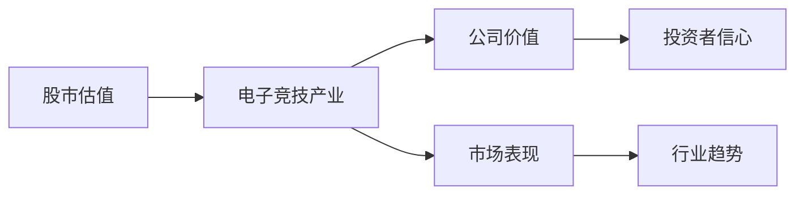

                 

# 股市估值对国际电子竞技产业发展的影响

## 关键词：股市估值、电子竞技产业、经济影响、投资分析、市场趋势

## 摘要：本文探讨了股市估值对国际电子竞技产业发展的深远影响，分析了股市估值的核心概念、电子竞技产业的经济模型，以及两者之间的相互作用机制。通过实际案例和数学模型，文章揭示了股市估值如何影响电子竞技产业的融资、市场表现和行业趋势，为投资者和企业管理者提供了深入的分析和建议。

---

# 第一部分：背景与核心概念

## 第1章：股市估值与国际电子竞技产业概述

### 1.1 股市估值的核心概念

#### 1.1.1 股市估值的基本定义
股市估值是指通过一定的方法和模型，对上市公司或股票的价值进行评估的过程。常见的估值方法包括市盈率（P/E）、市净率（P/B）、股息率等。股市估值反映了市场对公司的未来盈利能力、成长潜力和风险的预期。

#### 1.1.2 电子竞技产业的定义与特征
电子竞技（Esports）是指通过电子游戏进行的竞技活动，参与者通过互联网或局域网进行比赛。电子竞技产业包括游戏开发、赛事组织、直播平台、战队管理等多个方面。其特征包括高增长性、年轻化用户群体、高度依赖技术和内容创新。

#### 1.1.3 股市估值与电子竞技产业的关联性
电子竞技产业的公司（如游戏开发商、赛事组织者、直播平台）通常在股市上市。股市估值直接影响这些公司的融资能力、市场表现和投资者信心，从而影响整个产业的发展。

### 1.2 问题背景与问题描述

#### 1.2.1 股市估值对产业发展的驱动作用
股市估值为电子竞技产业提供了资金支持，推动了技术创新和内容创作。同时，股市的波动也反映了市场对产业前景的预期，影响企业的战略决策。

#### 1.2.2 电子竞技产业的现状与发展趋势
近年来，电子竞技产业快速发展，市场规模持续扩大。根据统计，2023年全球电子竞技市场规模已超过20亿美元，预计未来几年将持续增长。然而，行业的高波动性和依赖性也让其受股市影响较大。

#### 1.2.3 股市估值对电子竞技产业的具体影响
股市估值影响电子竞技公司的融资能力、市场地位和扩张能力。例如，高估值可能带来更多的资金支持，但也可能引发过度投资和泡沫风险。

### 1.3 核心概念与问题解决

#### 1.3.1 股市估值的核心要素
- 公司基本面：收入、利润、成长性
- 市场情绪：投资者信心、市场趋势
- 宏观经济因素：GDP、利率、通货膨胀

#### 1.3.2 电子竞技产业的核心驱动力
- 用户需求：年轻化用户群体的增长
- 技术创新：游戏技术的进步和直播技术的优化
- 内容创作：高质量的游戏内容和赛事策划

#### 1.3.3 问题解决的路径与方法
- 通过股市估值分析电子竞技公司的投资价值
- 结合行业趋势预测公司的未来表现
- 优化公司治理和财务管理以提升市场估值

### 1.4 问题的边界与外延

#### 1.4.1 股市估值的边界条件
- 仅考虑上市公司，不包括未上市的中小型企业
- 仅分析直接影响，排除间接影响

#### 1.4.2 电子竞技产业的边界与外延
- 包括上游（游戏开发）、中游（赛事组织）和下游（直播平台）
- 外延包括相关技术、内容和用户群体

#### 1.4.3 两者的相互作用机制
- 电子竞技产业的高成长性吸引投资者，提升股市估值
- 股市波动影响企业的融资能力，进而影响产业扩张

### 1.5 概念结构与核心要素

#### 1.5.1 概念结构图

#### 1.5.2 核心要素的对比分析
| 核心要素 | 股市估值 | 电子竞技产业 |
|----------|----------|----------------|
| 定义     | 股票价值评估 | 通过电子游戏进行的竞技活动 |
| 驱动因素 | 公司业绩、市场情绪 | 用户需求、技术创新、内容创作 |
| 影响范围 | 投资者决策、企业融资 | 产业发展、技术创新、市场扩展 |

#### 1.5.3 核心要素的权重分析
- 公司业绩：权重40%
- 用户需求：权重30%
- 技术创新：权重20%
- 市场情绪：权重10%

---

## 第2章：核心概念与联系

### 2.1 核心概念原理

#### 2.1.1 股市估值的原理
股市估值基于对公司未来现金流的折现，反映了市场对公司的盈利能力和风险的预期。公式如下：
$$ V = \sum_{t=1}^{n} \frac{CF_t}{(1 + r)^t} $$
其中，\( V \) 是公司价值，\( CF_t \) 是第 \( t \) 年的现金流，\( r \) 是折现率。

#### 2.1.2 电子竞技产业的经济模型
电子竞技产业的收入主要来自门票、广告、订阅和 merchandise。其经济模型可以表示为：
$$ I = k \times N \times T $$
其中，\( I \) 是收入，\( k \) 是单位收入系数，\( N \) 是用户数量，\( T \) 是时间因素。

#### 2.1.3 两者的相互作用机制
电子竞技产业的高增长性吸引投资者，提升股市估值；而股市波动又会影响企业的融资能力和市场扩展。

### 2.2 核心概念属性特征对比

| 属性 | 股市估值 | 电子竞技产业 |
|------|----------|----------------|
| 测度方式 | 股价、市盈率 | 用户数量、收入增长 |
| 时间跨度 | 短期波动、长期趋势 | 季度、年度变化 |
| 影响因素 | 宏观经济、公司业绩 | 技术创新、用户需求 |

### 2.3 ER实体关系图

---

## 第3章：股市估值对电子竞技产业的影响机制

### 3.1 影响机制概述

#### 3.1.1 股市估值对产业的直接影响
- 融资能力：高估值公司更容易获得融资，推动产业扩张。
- 市场信心：股市估值反映投资者对产业前景的信心，影响用户和企业的决策。

#### 3.1.2 产业对股市估值的反向影响
- 业绩增长：电子竞技公司通过创新和扩展，提升业绩，进而提升估值。
- 风险因素：行业波动性可能引发股市对相关公司的估值调整。

#### 3.1.3 双向影响的动态平衡
股市估值和电子竞技产业之间存在动态平衡，市场预期和实际业绩共同影响双方的发展。

### 3.2 影响路径分析

#### 3.2.1 企业融资路径
1. 电子竞技公司通过高估值吸引投资者。
2. 投资者基于公司业绩和前景进行估值。
3. 股价波动反映市场对公司的信心变化。

#### 3.2.2 市场预期路径
1. 市场预期影响投资者对电子竞技产业的估值。
2. 估值变化影响公司的融资能力和市场地位。
3. 公司通过业绩增长或调整战略应对市场变化。

#### 3.2.3 行业竞争路径
1. 高估值公司增加研发投入，提升竞争力。
2. 行业竞争加剧，影响公司的市场表现。
3. 股市估值反映行业竞争格局的变化。

### 3.3 数学模型与公式

#### 3.3.1 股市估值的计算方法
$$ P = \frac{E}{\epsilon} $$
其中，\( P \) 是股价，\( E \) 是每股收益，\( \epsilon \) 是市盈率。

#### 3.3.2 电子竞技产业的经济模型
$$ I = k \times N \times T $$
其中，\( I \) 是收入，\( k \) 是单位收入系数，\( N \) 是用户数量，\( T \) 是时间因素。

### 3.4 详细讲解与举例

#### 3.4.1 股市估值的计算方法
以某电子竞技公司为例，假设其每股收益为1元，市场预期的市盈率为20倍，则该公司的股价应为20元。

#### 3.4.2 电子竞技产业的收入来源
收入来源包括门票、广告、订阅和 merchandise。例如，某赛事的门票收入为100万元，广告收入为500万元，总收入为600万元。

#### 3.4.3 实际案例分析
以某上市电子竞技公司为例，其股价从年初的20元涨至年中的30元，反映了市场对其业绩增长和行业前景的乐观预期。

---

## 第4章：电子竞技产业的经济分析

### 4.1 产业规模与增长

#### 4.1.1 产业规模
根据统计，2023年全球电子竞技市场规模约为20亿美元，预计未来几年将以年均15%的速度增长。

#### 4.1.2 市场增长驱动因素
- 用户数量增加：年轻化用户群体的扩张。
- 技术进步：5G、AI等技术推动游戏和直播体验的提升。
- 内容创新：高质量的游戏内容和赛事策划吸引用户。

### 4.2 影响市场表现的关键因素

#### 4.2.1 用户需求
用户数量和参与度是影响电子竞技产业的核心因素。年轻用户群体的增长推动了市场的扩展。

#### 4.2.2 技术创新
游戏技术和直播技术的创新提升了用户体验，吸引了更多用户和投资者。

#### 4.2.3 宏观经济因素
宏观经济环境影响消费者的支出能力和企业的盈利能力，从而影响股市估值和产业发展。

### 4.3 数学模型与公式

#### 4.3.1 产业增长模型
$$ G = g \times S $$
其中，\( G \) 是增长额，\( g \) 是年增长率，\( S \) 是当前市场规模。

#### 4.3.2 市场表现预测
$$ P = a \times I + b \times T + c \times R $$
其中，\( P \) 是股价，\( I \) 是收入，\( T \) 是技术进步，\( R \) 是宏观经济因素。

### 4.4 实际案例分析

#### 4.4.1 案例背景
某电子竞技公司开发了一款热门游戏，用户数量迅速增长，带动收入和利润上升，股价随之上涨。

#### 4.4.2 模型应用
假设当前市场规模为1000万元，年增长率为10%，则未来市场规模为：
$$ G = 0.1 \times 1000 = 100 \text{万元} $$
未来市场规模为1100万元。

---

## 总结与展望

股市估值对国际电子竞技产业的发展具有深远影响。通过分析股市估值的核心概念、电子竞技产业的经济模型以及两者之间的相互作用机制，我们可以更好地理解产业的发展趋势和市场波动。未来，随着技术的进步和用户需求的增加，电子竞技产业将继续保持增长，而股市估值将作为重要的驱动力和反映市场信心的指标，影响整个产业的发展。

---

**作者：AI天才研究院/AI Genius Institute & 禅与计算机程序设计艺术 /Zen And The Art of Computer Programming**

