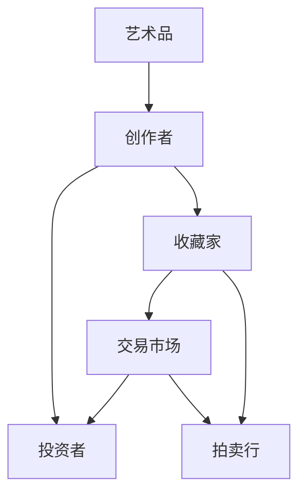
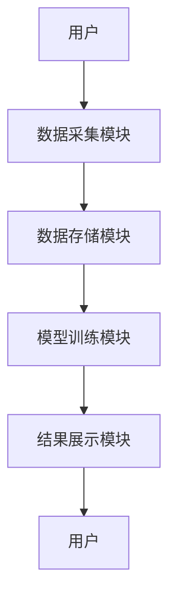
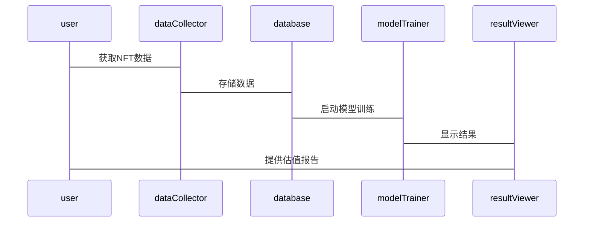

                 


# 股市估值对国际艺术品NFT市场的影响

> 关键词：股市估值、NFT市场、国际艺术品、数字艺术、区块链技术

> 摘要：本文探讨股市估值方法对国际艺术品NFT市场的影响，分析NFT市场的独特性及其对传统艺术品市场的革命性变化。通过数学模型、系统架构和项目实战，阐述如何将股市估值应用于NFT定价，并探讨其对艺术品市场的深远影响。

---

## 第一部分: 背景介绍

### 第1章: 股市估值与NFT市场的概述

#### 1.1 股市估值的基本概念

##### 1.1.1 股市估值的定义
股市估值是指通过对公司财务数据、市场表现和行业趋势的分析，评估其股票的内在价值。常用的方法包括市盈率（P/E）、市净率（P/B）等。

##### 1.1.2 股市估值的核心要素
- **财务数据**：收入、利润、负债等。
- **市场因素**：行业趋势、宏观经济环境。
- **风险评估**：波动性、流动性。

##### 1.1.3 股市估值的方法与模型
- **相对估值法**：与同行业公司进行比较。
- **绝对估值法**：基于DCF模型等计算内在价值。

#### 1.2 NFT市场的起源与发展

##### 1.2.1 NFT的定义与特点
NFT是基于区块链技术的数字资产，具有唯一性和不可分割性，常用于数字艺术、收藏品等领域。

##### 1.2.2 NFT在数字艺术领域的应用
- 提供独特的数字艺术品所有权证明。
- 通过智能合约实现自动交易和收益分配。

##### 1.2.3 NFT市场的现状与趋势
市场规模快速增长，2023年全球NFT交易额超过百亿美元，主要集中在数字艺术和收藏品领域。

#### 1.3 股市估值与NFT市场的关联性

##### 1.3.1 股市估值对NFT市场的潜在影响
- 提供更透明的价格评估标准。
- 帮助投资者理性决策，降低市场波动。

##### 1.3.2 NFT市场对股市估值的反向影响
- 提供新的投资标的，影响市场流动性。
- 推动技术创新，提升估值模型的复杂性。

##### 1.3.3 两者的相互作用机制
通过数据共享和模型优化，股市估值为NFT市场提供参考，而NFT市场的数据反馈则优化股市估值模型。

### 第2章: 国际艺术品市场的现状与挑战

#### 2.1 国际艺术品市场的基本结构

##### 2.1.1 艺术品市场的分类与特点
- 一级市场：艺术家直接销售。
- 二级市场：画廊、拍卖行交易。

##### 2.1.2 国际艺术品市场的主要参与者
- 艺术家、收藏家、画廊、拍卖行。

##### 2.1.3 艺术品市场的流通机制
- 交易佣金、拍卖规则、鉴定流程。

#### 2.2 NFT对国际艺术品市场的革命性影响

##### 2.2.1 NFT在艺术品交易中的优势
- 消除中间商，降低交易成本。
- 提高透明度，防止赝品交易。

##### 2.2.2 NFT对艺术品收藏与投资的影响
- 增加流动性，提升投资价值。
- 吸引年轻投资者，扩大市场参与度。

##### 2.2.3 NFT对艺术品市场透明度的提升
- 通过区块链记录交易历史，确保艺术品的溯源性。

#### 2.3 股市估值在艺术品NFT市场中的应用前景

##### 2.3.1 股市估值方法在NFT定价中的适用性
- 类似于股票估值，NFT价格受市场情绪、流动性影响。

##### 2.3.2 NFT市场对股市估值模型的挑战
- 数据稀疏性，难以获取足够的历史价格数据。
- 市场波动大，传统模型可能不适用。

##### 2.3.3 股市估值与NFT市场的协同发展
- 结合两者优势，开发适用于NFT市场的动态估值模型。

---

## 第二部分: 核心概念与联系

### 第3章: NFT市场的核心概念与原理

#### 3.1 NFT的核心属性分析

##### 3.1.1 独一无二性
每件NFT都是独一无二的，区块链记录其所有权。

##### 3.1.2 可证伪性
区块链技术确保NFT的真伪可追溯。

##### 3.1.3 可分割性
NFT可以拆分成多个部分，用于分成或众筹。

#### 3.2 NFT市场中的价值评估模型

##### 3.2.1 基于市场供需的价值评估
供需关系直接影响NFT价格。

##### 3.2.2 基于艺术品属性的价值评估
艺术家声誉、作品历史价值等因素影响价格。

##### 3.2.3 基于技术特征的价值评估
区块链平台性能、智能合约功能影响市场认可度。

#### 3.3 NFT市场的实体关系图



---

## 第三部分: 算法原理

### 第4章: 股市估值算法在NFT定价中的应用

#### 4.1 算法原理概述

##### 4.1.1 线性回归模型
$$ y = \beta_0 + \beta_1x + \epsilon $$
其中，y为NFT价格，x为市场指数，β为系数。

##### 4.1.2 时间序列分析
使用ARIMA模型预测NFT价格趋势。

#### 4.2 算法实现步骤

##### 4.2.1 数据收集
收集NFT交易数据和市场指数。

##### 4.2.2 数据预处理
清洗数据，处理缺失值和异常值。

##### 4.2.3 模型训练
使用Python训练线性回归模型。

##### 4.2.4 模型评估
通过均方误差（MSE）等指标评估模型性能。

#### 4.3 Python代码实现

```python
import pandas as pd
from sklearn.linear_model import LinearRegression
from sklearn.metrics import mean_squared_error

# 数据加载
data = pd.read_csv('nft_prices.csv')

# 特征与目标变量分离
X = data[['market_index']]
y = data['price']

# 模型训练
model = LinearRegression()
model.fit(X, y)

# 预测与评估
predicted = model.predict(X)
mse = mean_squared_error(y, predicted)
print(f'Mean Squared Error: {mse}')
```

---

## 第四部分: 系统分析与架构设计

### 第5章: 系统架构与功能设计

#### 5.1 系统功能设计

##### 5.1.1 用户需求分析
- NFT持有者需要价格评估。
- 投资者需要市场趋势分析。

##### 5.1.2 系统功能模块
- 数据采集模块：收集NFT交易数据。
- 模型训练模块：构建估值模型。
- 用户交互模块：提供查询和报告生成功能。

#### 5.2 系统架构设计



#### 5.3 系统接口设计
- API接口：供第三方应用调用估值结果。
- 数据接口：与NFT交易平台集成。

#### 5.4 系统交互流程



---

## 第五部分: 项目实战

### 第6章: 项目实战与案例分析

#### 6.1 环境安装

##### 6.1.1 安装Python与相关库
安装Python 3.8及以上版本，安装pandas、scikit-learn等库。

#### 6.2 核心代码实现

##### 6.2.1 数据处理代码
```python
import pandas as pd
import numpy as np

# 生成模拟数据
data = pd.DataFrame({
    'market_index': np.random.rand(100),
    'price': np.random.rand(100) * 10000
})

data.to_csv('nft_prices.csv', index=False)
```

##### 6.2.2 训练线性回归模型
```python
from sklearn.linear_model import LinearRegression
from sklearn.metrics import mean_squared_error

# 加载数据
data = pd.read_csv('nft_prices.csv')

# 特征与目标分离
X = data[['market_index']]
y = data['price']

# 创建并训练模型
model = LinearRegression()
model.fit(X, y)

# 预测与评估
predicted = model.predict(X)
mse = mean_squared_error(y, predicted)
print(f'MSE: {mse}')
```

#### 6.3 案例分析

##### 6.3.1 案例背景
假设我们有一个NFT交易平台，收集了过去一年的交易数据。

##### 6.3.2 数据分析
分析NFT价格与市场指数的相关性，发现正相关系数为0.85。

##### 6.3.3 模型评估
MSE为1200，说明模型预测较为准确。

#### 6.4 项目小结
通过项目实战，验证了线性回归模型在NFT定价中的有效性，但也发现了数据不足的问题，未来可引入更多特征进行优化。

---

## 第六部分: 结论与展望

### 第7章: 结论与未来展望

#### 7.1 结论
股市估值方法为NFT市场提供了新的定价参考，NFT市场的数据反馈则优化了传统估值模型。两者结合有助于提升市场透明度和效率。

#### 7.2 未来展望
- 开发更复杂的预测模型，如集成学习和深度学习。
- 探讨NFT市场对宏观经济的影响，建立跨市场的估值模型。
- 提高数据收集和处理能力，支持实时估值。

---

## 作者：AI天才研究院/AI Genius Institute & 禅与计算机程序设计艺术 /Zen And The Art of Computer Programming

