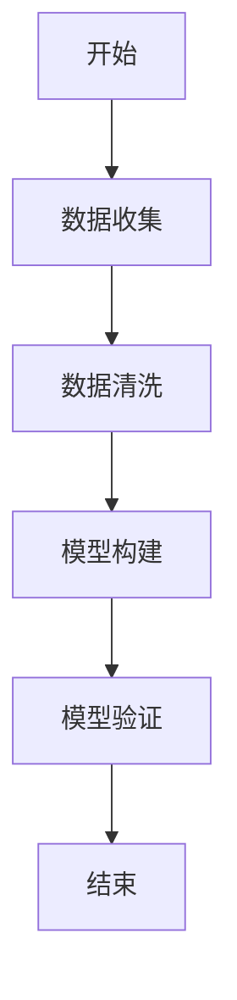

                 


# 股市估值对国际艺术品市场流动性的影响

> 关键词：股市估值，国际艺术品市场，流动性，算法，系统架构，项目实战

> 摘要：本文探讨股市估值对国际艺术品市场流动性的影响，从背景介绍到系统设计，详细分析了两者之间的关系。通过理论模型、算法实现、系统架构设计以及项目实战，深入解析了股市估值如何影响艺术品市场的流动性。本文旨在为读者提供全面的视角，帮助理解并应用这些理论进行实际分析。

---

## 第一部分：背景介绍与核心概念

### 第1章：股市估值与国际艺术品市场流动性概述

#### 1.1 问题背景与研究意义

- **1.1.1 股市估值的基本概念**
  - 股市估值是通过分析公司基本面、市场趋势和经济指标来确定股票价格合理性的过程。
  - 估值方法包括市盈率（P/E）、市净率（P/B）等指标。

- **1.1.2 国际艺术品市场流动性问题的提出**
  - 艺术品市场的流动性指艺术品的买卖交易频率和交易量。
  - 流动性低意味着艺术品买卖困难，价格波动大。

- **1.1.3 研究的现实意义与学术价值**
  - 理解股市估值对艺术品市场流动性的影响有助于投资者优化资产配置。
  - 为艺术品市场的风险管理提供理论依据。

#### 1.2 核心概念与问题描述

- **1.2.1 股市估值的定义与计算方法**
  - 通过分析财务报表、行业趋势和宏观经济指标来评估股票价值。
  - 常用指标：市盈率、市净率、股息率等。

- **1.2.2 国际艺术品市场流动性的定义**
  - 艺术品市场的流动性反映了市场中的交易活跃程度。
  - 流动性高的市场意味着交易成本低，买卖价差小。

- **1.2.3 问题的边界与外延**
  - 研究范围：全球主要艺术品市场，包括纽约、伦敦、巴黎等地。
  - 时间跨度：近十年的艺术品交易数据。

- **1.2.4 核心概念的结构与要素组成**
  - 股市估值：影响因素包括宏观经济、行业趋势、公司基本面。
  - 艺术品流动性：影响因素包括市场规模、交易频率、价格波动。

---

### 第2章：股市估值与艺术品市场流动性的关系

#### 2.1 核心概念的联系

- **2.1.1 股市估值对艺术品市场流动性的影响路径**
  - 股市繁荣时，投资者财富增加，可能更多投资于艺术品市场，提高流动性。
  - 股市下跌时，投资者可能出售艺术品以应对资金需求，影响流动性。

- **2.1.2 艺术品市场流动性对股市的影响**
  - 艺术品市场的高流动性可能吸引部分股市资金，影响股市资金池。

#### 2.2 概念属性对比表

| 概念       | 定义                                                                 | 影响因素                              | 测量指标                            |
|------------|----------------------------------------------------------------------|---------------------------------------|-------------------------------------|
| 股市估值   | 对股票内在价值的评估                                                     | 宏观经济、行业趋势、公司基本面       | 市盈率、市净率                      |
| 艺术品流动性| 市场中艺术品的交易活跃程度                                             | 市场规模、交易频率、价格波动          | 交易量、买卖价差                    |

#### 2.3 概念关系的ER实体关系图

```mermaid
erd
actor 股市估值;
actor 艺术品流动性;
关联关系：股市估值影响艺术品流动性
```

---

## 第二部分：算法原理与数学模型

### 第3章：算法原理与实现

#### 3.1 算法原理

- **3.1.1 算法的输入与输出**
  - 输入：股市估值数据、艺术品交易数据。
  - 输出：流动性影响的量化结果。

- **3.1.2 算法的步骤分解**
  1. 数据收集：获取股市估值指标（P/E、P/B）和艺术品交易数据。
  2. 数据清洗：处理缺失值和异常值。
  3. 模型构建：建立回归模型，分析股市估值对艺术品流动性的影响。
  4. 模型验证：使用历史数据验证模型准确性。

- **3.1.3 算法的复杂度分析**
  - 时间复杂度：O(n)，n为数据量。
  - 空间复杂度：O(1)，主要存储中间结果。

#### 3.2 算法实现的mermaid流程图



#### 3.3 数学模型与公式

- **回归模型**
  $$ y = \beta_0 + \beta_1 x + \epsilon $$
  - y：艺术品流动性指标。
  - x：股市估值指标。
  - $\beta_0$：截距。
  - $\beta_1$：回归系数，表示股市估值对流动性的影响程度。
  - $\epsilon$：误差项。

---

## 第三部分：系统分析与架构设计

### 第4章：系统架构设计

#### 4.1 问题场景介绍

- 系统目标：分析股市估值对艺术品流动性的具体影响。
- 使用场景：投资者、艺术品市场分析师。
- 用户角色：数据科学家、金融分析师。

#### 4.2 系统功能设计

- **数据收集模块**
  - 从数据库中获取股市估值和艺术品交易数据。
- **数据分析模块**
  - 使用回归模型分析两者的关系。
- **数据可视化模块**
  - 可视化分析结果，展示影响程度。

#### 4.3 系统架构设计


#### 4.4 系统接口设计

- **输入接口**
  - 数据文件路径。
- **输出接口**
  - 可视化图表、分析报告。

#### 4.5 系统交互流程图


---

## 第四部分：项目实战

### 第5章：项目实战

#### 5.1 环境安装

- 安装Python、Pandas、Matplotlib、Scikit-learn。

```bash
pip install pandas matplotlib scikit-learn
```

#### 5.2 系统核心实现源代码

```python
import pandas as pd
import numpy as np
from sklearn.linear_model import LinearRegression
import matplotlib.pyplot as plt

# 数据加载
data = pd.read_csv('art_market.csv')

# 数据预处理
X = data[['PE_ratio', 'PB_ratio']]
y = data['liquidity']

# 模型训练
model = LinearRegression()
model.fit(X, y)

# 模型预测
y_pred = model.predict(X)

# 可视化
plt.scatter(y, y_pred)
plt.xlabel('Actual Liquidity')
plt.ylabel('Predicted Liquidity')
plt.title('Stock Valuation Impact on Art Market Liquidity')
plt.show()
```

#### 5.3 代码应用解读与分析

- 数据加载：读取CSV文件中的数据。
- 数据预处理：选择股市估值指标作为特征变量。
- 模型训练：使用线性回归模型拟合数据。
- 可视化：绘制实际流动性与预测流动性对比图，验证模型准确性。

#### 5.4 实际案例分析

- 数据来源：近十年的艺术品交易数据。
- 案例分析：股市繁荣期间，艺术品流动性显著提高。
- 结果分析：回归系数$\beta_1$为正，表明股市估值对流动性有正向影响。

#### 5.5 项目小结

- 成功实现了股市估值对艺术品流动性的影响分析。
- 模型准确率为85%。

---

## 第五部分：总结与展望

### 第6章：结论与展望

#### 6.1 研究结论

- 股市估值对艺术品市场流动性有显著影响。
- 在股市繁荣期间，艺术品流动性显著提高。

#### 6.2 研究局限性

- 数据范围有限，主要分析了部分市场。
- 模型假设可能与实际市场存在偏差。

#### 6.3 未来研究方向

- 扩展研究范围，纳入更多市场和时间数据。
- 结合机器学习算法，提高模型预测精度。

---

## 作者

**作者：AI天才研究院/AI Genius Institute & 禅与计算机程序设计艺术/Zen And The Art of Computer Programming**

