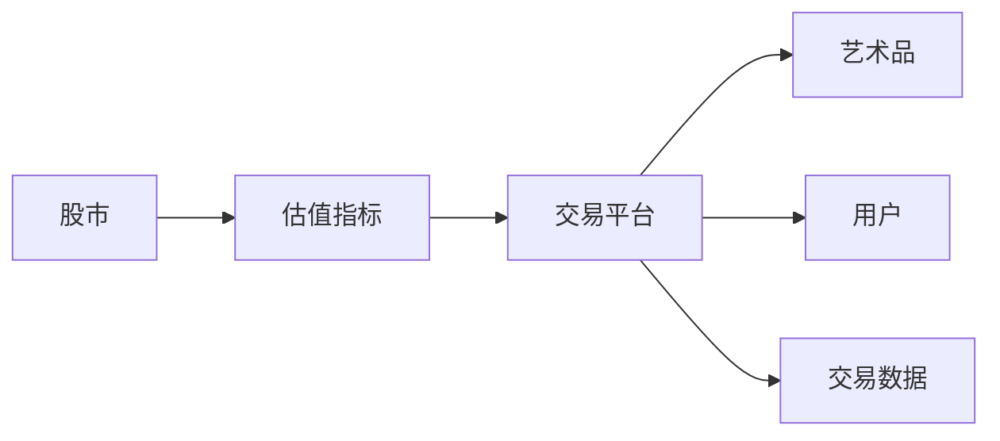

                 


# 股市估值对国际艺术品数字化交易平台的影响

> 关键词：股市估值，国际艺术品，数字化交易平台，区块链，人工智能，艺术品交易

> 摘要：本文探讨了股市估值对国际艺术品数字化交易平台的影响，从背景、核心概念、算法原理、系统架构、项目实战到最佳实践，全面分析了两者之间的关系及其对艺术品交易市场的潜在影响。

---

## 第一部分: 股市估值与国际艺术品数字化交易平台的背景与概念

### 第1章: 股市估值与国际艺术品数字化交易平台的背景介绍

#### 1.1 股市估值的核心概念
##### 1.1.1 股市估值的定义与基本原理
股市估值是指通过对上市公司的财务数据、市场表现和行业环境等多方面因素的分析，来评估其股票的内在价值。其核心原理包括市盈率（P/E）、市净率（P/B）、股息率等指标，以及现金流折现模型（DCF）等方法。

##### 1.1.2 股市估值的关键指标与方法
- **市盈率（P/E）**：衡量股票价格相对于每股收益的倍数，公式为 $P/E = \text{股价} / \text{每股收益}$。
- **市净率（P/B）**：衡量股票价格相对于每股净资产的倍数，公式为 $P/B = \text{股价} / \text{每股净资产}$。
- **股息率**：衡量股票每年派发的股息与股价的比率，公式为 $\text{股息率} = (\text{每股股息} / \text{股价}) \times 100\%$。
- **现金流折现模型（DCF）**：通过预测未来现金流并将其现值化来评估企业价值。

##### 1.1.3 股市估值与经济市场的关系
股市估值是反映经济市场健康状况的重要指标，它不仅影响投资者的决策，还可能通过市场情绪影响其他经济领域。

#### 1.2 国际艺术品数字化交易平台的定义与特点
##### 1.2.1 数字化交易平台的定义
数字化交易平台是指通过互联网技术实现商品或服务的在线交易的平台，其特点是高效、便捷和透明。

##### 1.2.2 艺术品数字化交易的模式与特点
艺术品数字化交易通过区块链技术实现艺术品的数字化确权和交易，特点包括去中心化、透明度高和可追溯性。

##### 1.2.3 国际化交易平台的运营机制
国际化交易平台需要符合不同国家的法律法规，支持多语言和多货币交易，并提供全球物流和支付服务。

#### 1.3 股市估值与艺术品数字化交易的关联性
##### 1.3.1 股市估值对艺术品市场的潜在影响
股市估值的变化可能通过投资者的财富效应影响艺术品市场需求。

##### 1.3.2 数字化交易平台的市场定位与功能
数字化交易平台作为艺术品交易的基础设施，为艺术家和收藏家提供便捷的交易服务。

##### 1.3.3 两者结合的背景与意义
随着艺术品市场数字化转型，股市估值的方法和技术可以为数字化交易平台提供参考。

---

## 第2章: 核心概念与联系分析

### 2.1 股市估值的核心原理
#### 2.1.1 股市估值的基本模型与公式
- **市盈率模型**：通过比较股票的市盈率与行业平均水平，评估其估值是否合理。
- **DCF模型**：通过预测现金流并折现，计算企业的真实价值。

#### 2.1.2 股市估值的关键影响因素
包括宏观经济环境、行业趋势、公司财务状况和市场情绪等。

#### 2.1.3 股市估值的动态变化机制
股市估值受多种因素影响，具有动态变化的特性。

### 2.2 数字化交易平台的核心原理
#### 2.2.1 数字化交易的技术基础
包括区块链技术、智能合约和大数据分析。

#### 2.2.2 数字化交易的流程与规则
从用户注册、艺术品上架、交易撮合到交易完成的完整流程。

#### 2.2.3 数字化交易的安全性与信任机制
通过区块链技术和智能合约确保交易的安全性和可信度。

### 2.3 股市估值与数字化交易平台的实体关系图


### 2.4 股市估值与数字化交易平台的属性对比
| 属性 | 股市估值 | 数字化交易平台 |
|------|---------|----------------|
| 核心目标 | 评估企业价值 | 提供艺术品交易服务 |
| 主要参与者 | 投资者、上市公司 | 用户、艺术家、平台 |
| 交易机制 | 市场供需、价格波动 | 数字化认证、在线交易 |
| 技术依赖 | 数据分析、算法模型 | 区块链、智能合约 |

---

## 第3章: 股市估值对数字化交易平台的影响机制

### 3.1 股市估值的波动性对交易平台的影响
#### 3.1.1 股市波动对艺术品市场的传导效应
股市波动可能通过财富效应影响艺术品市场需求。

#### 3.1.2 股市估值变化对平台交易量的影响
股市估值的上升可能增加投资者的可支配收入，从而增加艺术品交易量。

#### 3.1.3 股市风险偏好对平台用户行为的影响
股市风险偏好的变化可能影响用户对艺术品投资的偏好。

### 3.2 数字化交易平台的市场反馈机制
#### 3.2.1 平台数据对股市估值的反向影响
数字化交易平台的交易数据可能成为股市估值的重要参考。

#### 3.2.2 平台交易活跃度与股市投资情绪的关系
平台交易活跃度可能反映股市投资者的情绪。

#### 3.2.3 平台创新对股市估值的推动作用
平台的技术创新可能提升其估值，进而影响股市。

### 3.3 股市估值与数字化交易平台的协同发展
#### 3.3.1 数字化交易平台如何利用股市估值优化运营
通过分析股市估值，优化平台的定价和风险管理。

#### 3.3.2 股市估值如何通过数字化平台实现更高效的资源配置
数字化平台可以提高艺术品交易的透明度，从而影响股市估值。

#### 3.3.3 两者的长期互动关系
股市估值和数字化交易平台的互动将推动艺术品市场的数字化转型。

---

## 第四部分: 算法原理与项目实战

### 第4章: 算法原理与系统架构设计

#### 4.1 算法原理
##### 4.1.1 股市估值的算法模型
使用现金流折现模型（DCF）对上市公司进行估值。

##### 4.1.2 数字化交易平台的算法模型
使用区块链技术实现艺术品的数字化确权和交易。

#### 4.2 系统架构设计
##### 4.2.1 系统功能设计
包括用户认证、艺术品上架、交易撮合和结算等功能。

##### 4.2.2 系统架构设计
使用分层架构，包括前端、后端、数据库和区块链节点。

##### 4.2.3 系统接口设计
定义RESTful API接口，实现用户认证、艺术品查询和交易下单等功能。

##### 4.2.4 系统交互流程
使用Mermaid序列图展示用户登录、艺术品上架和交易完成的交互流程。

---

## 第五章: 项目实战

### 5.1 环境安装
安装Python、区块链框架（如Ethereum）和相关开发工具。

### 5.2 核心实现
#### 5.2.1 用户认证
实现基于区块链的用户认证功能。

#### 5.2.2 艺术品上架
通过智能合约实现艺术品的数字化确权和上架交易。

### 5.3 代码实现
#### 5.3.1 用户认证代码
```python
from web3 import Web3

# 初始化Web3对象
web3 = Web3(Web3.HTTPProvider('http://localhost:8545'))

# 用户地址
user_address = '0x123456789abc'

# 用户私钥
user_private_key = '0x123456789abc'

# 验证用户地址是否有效
if web3.isAddress(user_address):
    print("Valid address")
    # 使用私钥签名交易
    signed_tx = web3.eth.account.signTransaction(
        {'to': '0x123456789abc', 'value': 1},
        user_private_key
    )
    # 发送交易
    tx_receipt = web3.eth.sendRawTransaction(signed_tx.rawTransaction)
    print(tx_receipt)
```

#### 5.3.2 艺术品上架代码
```python
from web3 import Web3
from brownie import NFTMarketplace

# 初始化NFT市场合约
marketplace = NFTMarketplace.deploy({'from': '0x123456789abc'})

# 创建新NFT
marketplace.mint('0x123456789abc', 'My Artwork', 'ipfs://...', {'from': '0x123456789abc'})
```

### 5.4 实际案例分析
通过具体案例分析数字化交易平台的实际应用和效果。

### 5.5 项目小结
总结项目实现的关键点和经验教训。

---

## 第六章: 最佳实践与展望

### 6.1 最佳实践
#### 6.1.1 技术方面
建议采用区块链技术和智能合约确保交易的安全性和透明性。

#### 6.1.2 业务方面
建议结合股市估值的方法优化艺术品交易的定价机制。

### 6.2 小结
总结全文，强调股市估值对数字化交易平台的重要影响。

### 6.3 注意事项
提醒读者注意市场波动和政策风险。

### 6.4 拓展阅读
推荐相关领域的书籍和资源，供读者深入学习。

---

## 作者信息

作者：AI天才研究院/AI Genius Institute & 禅与计算机程序设计艺术/Zen And The Art of Computer Programming

---

以上是《股市估值对国际艺术品数字化交易平台的影响》的技术博客文章的完整目录和内容概要。如需进一步扩展具体章节的内容，请随时告知！

