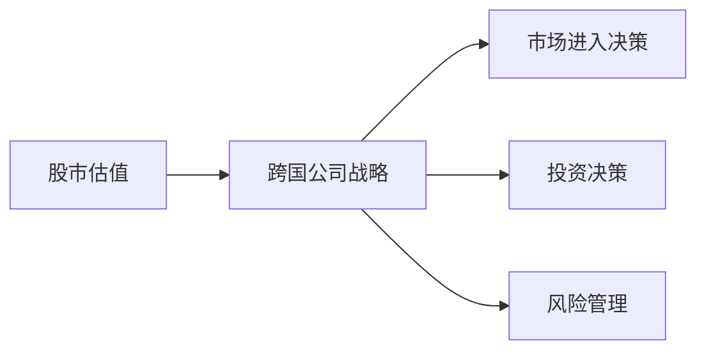
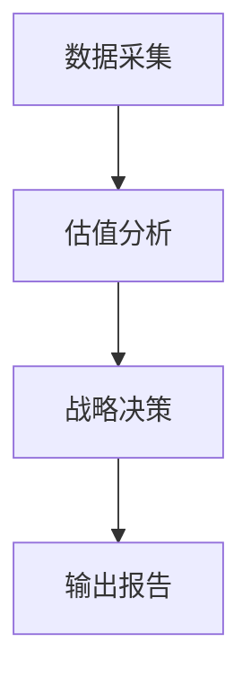

                 

# 股市估值对跨国公司全球战略的影响

## 关键词：股市估值，跨国公司，全球战略，风险管理，投资决策

## 摘要：  
股市估值是衡量企业价值的重要指标，对跨国公司的全球战略有着深远影响。本文从股市估值的核心概念出发，分析其如何影响跨国公司的市场进入、投资决策和风险管理。通过理论模型和实际案例，探讨股市估值波动对跨国公司战略调整的驱动作用，并提出应对策略。

---

# 正文

## 第1章 背景与概述

### 1.1 股市估值的定义与影响因素

股市估值是通过股票市值对企业价值的评估。股票市值等于股价乘以流通股数，反映市场对公司的整体价值判断。影响股市估值的主要因素包括：

1. **公司基本面**：收入、利润、资产负债表等。
2. **行业环境**：行业趋势、竞争格局。
3. **宏观经济**：GDP增速、利率、通货膨胀。
4. **市场情绪**：投资者情绪、市场信心。

### 1.2 跨国公司的定义与特点

跨国公司是指在多个国家和地区开展业务的企业。其特点包括全球化布局、多元化收入来源、较强的抗风险能力和国际化管理团队。

### 1.3 股市估值与跨国公司战略的关系

股市估值不仅是企业价值的体现，也是跨国公司制定全球战略的重要依据。高估值可能推动企业扩张，低估值可能促使企业调整业务。

---

## 第2章 核心概念与联系

### 2.1 股市估值与跨国公司战略的核心联系

股市估值影响跨国公司的市场进入决策、投资方向和风险管理策略。例如，高估值可能促使公司进行跨国并购，而低估值可能促使公司收缩业务。

### 2.2 影响股市估值的关键因素

以下因素直接影响股市估值：

- **收入与利润增长**：是推动股价上涨的核心动力。
- **行业竞争**：高竞争行业可能面临估值压力。
- **宏观经济政策**：货币宽松政策通常推高估值。

### 2.3 股市估值与跨国公司战略的Mermaid图

---

## 第3章 算法原理与数学模型

### 3.1 股市估值计算模型

股票市值计算公式：

$$
\text{股票市值} = \text{股价} \times \text{流通股数}
$$

### 3.2 股价预测的数学模型

使用回归分析预测股价：

$$
\hat{y} = a + bx
$$

其中，$y$是目标股价，$x$是自变量（如收入增长率）。

### 3.3 股市估值对战略影响的分析模型

通过分析股市估值波动，企业可以调整：

- **市场进入**：选择估值被低估的市场。
- **投资决策**：优化资本结构，降低财务风险。
- **风险管理**：使用衍生工具对冲估值波动风险。

---

## 第4章 系统分析与架构设计

### 4.1 系统功能设计

- **数据采集模块**：收集公司财务数据和市场数据。
- **估值分析模块**：计算估值指标。
- **战略决策模块**：基于估值结果生成战略建议。

### 4.2 系统架构设计

### 4.3 系统接口设计

- 输入：财务数据、市场数据。
- 输出：估值报告、战略建议。

---

## 第5章 项目实战

### 5.1 案例分析：苹果公司的全球战略

苹果通过高估值推动全球扩张，投资于创新领域，优化资本结构，降低风险。

### 5.2 实际应用

- 市场进入：选择估值低的新兴市场。
- 投资决策：优化资本结构，降低财务杠杆。

---

## 第6章 总结与展望

### 6.1 研究总结

股市估值是跨国公司制定全球战略的重要工具，影响市场进入、投资决策和风险管理。

### 6.2 研究展望

未来研究可以关注技术进步和全球经济变化对股市估值的影响。

---

## 作者

作者：AI天才研究院/AI Genius Institute & 禅与计算机程序设计艺术 /Zen And The Art of Computer Programming

