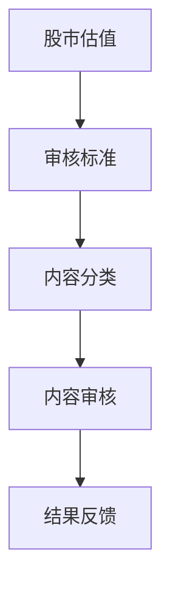
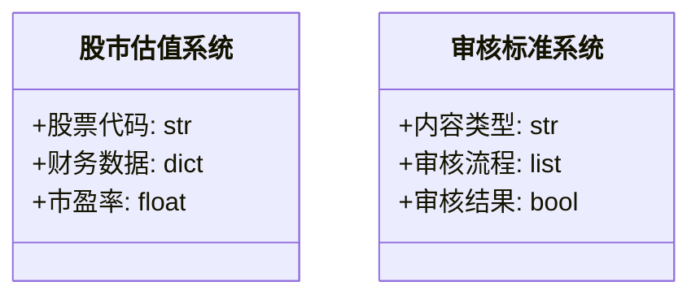
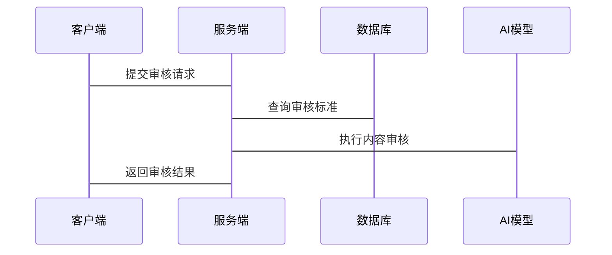

                 


# 股市估值对跨境数字内容审核标准的影响

> **关键词**：股市估值、跨境数字内容审核、标准制定、模型构建、系统设计、应用案例  
> **摘要**：本文探讨了股市估值与跨境数字内容审核标准之间的相互影响。通过分析股市估值的核心要素、跨境数字内容审核标准的制定原则，以及两者之间的联系，结合具体的算法模型和系统架构设计，提出了一个基于机器学习的审核标准动态调整模型。本文还通过实际案例分析，展示了如何通过系统设计和算法优化，提升审核标准的科学性和可操作性，为相关领域的研究和实践提供了参考。

---

## 第一部分: 背景介绍与核心概念

### 第1章: 股市估值与跨境数字内容审核标准的背景

#### 1.1 问题背景

##### 1.1.1 股市估值的基本概念
股市估值是通过对公司财务数据和市场表现的分析，评估其股票的内在价值。常用的估值方法包括市盈率（P/E）、市净率（P/B）、股息率等。这些指标帮助投资者判断股票是否被高估或低估。

##### 1.1.2 跨境数字内容审核标准的定义
跨境数字内容审核标准是指对跨国传播的数字内容（如视频、文章、社交媒体内容等）进行合法性、合规性评估的规则和流程。这些标准通常涉及内容的分类（如色情、暴力、虚假信息等）和审核流程的设计。

##### 1.1.3 问题的提出：股市估值与审核标准的关联性
随着全球化的发展，数字内容的跨国传播日益频繁，审核标准的制定变得复杂。同时，股市估值的准确性依赖于信息的透明性和合规性，而跨境内容审核标准的制定直接影响到企业的信息披露质量，从而影响股市估值的准确性。

#### 1.2 问题描述

##### 1.2.1 股市估值的核心要素
- 财务数据：收入、利润、资产负债表等。
- 市场因素：宏观经济环境、行业趋势等。
- 公司治理：管理团队、股东结构等。

##### 1.2.2 跨境数字内容审核的主要挑战
- 内容多样性和文化差异：不同国家对内容的法律和文化标准不同。
- 技术复杂性：审核需要结合自然语言处理（NLP）和计算机视觉技术。
- 动态变化：审核标准会随着法律法规的变化而调整。

##### 1.2.3 问题的复杂性与多维度性
股市估值和跨境内容审核看似无关，但它们都涉及信息的准确性和合规性。审核标准的不统一可能导致企业信息披露不完整，进而影响股市估值的准确性。

#### 1.3 问题解决

##### 1.3.1 股市估值模型的构建
构建一个综合考虑财务数据、市场因素和公司治理的估值模型，例如加权平均市盈率模型。

##### 1.3.2 跨境数字内容审核标准的制定
制定一套适用于不同地区的审核标准，同时建立动态调整机制。

##### 1.3.3 问题解决的路径与方法
通过技术手段（如AI审核）和法律手段（如建立跨国审核机构）相结合，解决审核标准不统一的问题。

#### 1.4 边界与外延

##### 1.4.1 股市估值的边界条件
- 数据的可获得性。
- 模型的适用范围。
- 市场环境的稳定性。

##### 1.4.2 跨境数字内容审核标准的适用范围
- 内容类型：文本、图片、视频等。
- 目标市场：不同国家的法律要求。

##### 1.4.3 核心概念的外延与扩展
- 审核标准的动态调整。
- 股市估值的全球化视角。

#### 1.5 核心要素组成

##### 1.5.1 股市估值的关键指标
- 市盈率（P/E）。
- 市净率（P/B）。
- 股息率（Dividend Yield）。

##### 1.5.2 跨境数字内容审核的核心要素
- 内容分类标准。
- 审核流程。
- 技术实现手段。

##### 1.5.3 核心概念的系统性分析
通过系统性分析，明确股市估值和审核标准之间的相互影响，为后续的模型构建和系统设计奠定基础。

---

## 第二部分: 核心概念与联系

### 第2章: 核心概念的原理与特征

#### 2.1 股市估值模型的原理

##### 2.1.1 市盈率模型
市盈率模型通过比较股票的市盈率与行业平均水平，判断其估值是否合理。

##### 2.1.2 现金流折现模型
现金流折现模型通过预测公司未来现金流，计算其现值作为估值依据。

##### 2.1.3 股东权益估价模型
股东权益估价模型通过分析公司资产和负债，计算其股东权益价值。

#### 2.2 跨境数字内容审核标准的特征

##### 2.2.1 内容分类标准
- 文本分类：垃圾信息、虚假信息、色情内容等。
- 图片分类：色情图片、暴力图片等。
- 视频分类：暴力视频、侵权视频等。

##### 2.2.2 审核流程特征
- 自动化审核：利用AI技术进行初步筛选。
- 人工复审：对自动审核的结果进行人工校验。
- 动态调整：根据市场反馈调整审核标准。

##### 2.2.3 标准的动态调整机制
- 数据驱动：根据审核数据反馈调整标准。
- 法律驱动：根据法律法规变化调整标准。

#### 2.3 核心概念对比分析

##### 2.3.1 股市估值与审核标准的对比表格

| **维度**       | **股市估值**                | **跨境数字内容审核标准**             |
|----------------|-----------------------------|--------------------------------------|
| 核心目标       | 评估企业价值                | 确保内容合法合规                      |
| 主要影响因素   | 财务数据、市场环境、公司治理 | 内容类型、文化差异、法律法规          |
| 实施难度       | 高                          | 中等                                 |
| 动态调整机制   | 市场变化、企业经营状况变化    | 法律法规变化、技术进步                |

##### 2.3.2 核心概念的ER实体关系图

```mermaid
erd
    审核标准 <--- 审核流程
    审核流程 ---> 内容分类
    内容分类 ---> 内容类型
```

##### 2.3.3 核心概念的Mermaid流程图



---

## 第三部分: 算法原理讲解

### 第3章: 算法原理与实现

#### 3.1 算法原理

##### 3.1.1 股市估值的算法选择
- 市盈率模型：通过Python代码计算市盈率。
- 现金流折现模型：通过机器学习预测现金流。

##### 3.1.2 跨境数字内容审核的算法设计
- 文本分类：使用自然语言处理技术（如TF-IDF、词嵌入）。
- 图片分类：使用计算机视觉技术（如卷积神经网络）。

##### 3.1.3 算法的优缺点分析
- 优点：提高审核效率，降低成本。
- 缺点：算法可能误判，需要人工复审。

#### 3.2 算法实现

##### 3.2.1 股市估值模型的Python代码实现

```python
import pandas as pd

# 数据加载
df = pd.read_csv('stock_data.csv')

# 计算市盈率
df['PE'] = df['Price'] / df['Earnings Per Share']

# 输出结果
print(df.head())
```

##### 3.2.2 跨境数字内容审核的Python代码实现

```python
from sklearn.feature_extraction.text import TfidfVectorizer
from sklearn.svm import SVC

# 数据加载
texts = df['content'].tolist()
labels = df['label'].tolist()

# 特征提取
vectorizer = TfidfVectorizer()
X = vectorizer.fit_transform(texts)

# 模型训练
model = SVC()
model.fit(X, labels)

# 预测
new_text = "This is a test content."
new_X = vectorizer.transform([new_text])
print(model.predict(new_X))
```

##### 3.2.3 算法的数学模型和公式

###### 3.2.3.1 市盈率模型
市盈率公式：
$$ PE = \frac{Price}{Earnings\ Per\ Share} $$

###### 3.2.3.2 机器学习模型
支持向量机（SVM）的数学公式：
$$ y = \text{sign}(w \cdot x + b) $$

---

## 第四部分: 数学模型与系统设计

### 第4章: 数学模型与系统架构设计

#### 4.1 问题场景介绍

##### 4.1.1 股市估值与审核标准的结合场景
企业跨国上市时，需要同时满足不同国家的股市估值标准和数字内容审核标准。

#### 4.2 系统功能设计

##### 4.2.1 领域模型设计



##### 4.2.2 系统架构设计


#### 4.3 接口与交互设计

##### 4.3.1 系统接口设计
- API接口：`/api/stock_valuation` 和 `/api/content_review`

##### 4.3.2 系统交互流程



---

## 第五部分: 项目实战

### 第5章: 项目实战与案例分析

#### 5.1 环境安装

##### 5.1.1 Python环境安装
安装Python 3.8及以上版本，并安装相关库（如scikit-learn、pandas、mermaid等）。

#### 5.2 系统核心实现

##### 5.2.1 股市估值系统实现

```python
import pandas as pd

def calculate_pe(stock_data):
    stock_data['PE'] = stock_data['Price'] / stock_data['Earnings Per Share']
    return stock_data

# 示例数据
data = {
    'Stock Code': ['AAPL', 'GOOGL', 'MSFT'],
    'Price': [150, 120, 100],
    'Earnings Per Share': [10, 15, 8]
}

df = pd.DataFrame(data)
result = calculate_pe(df)
print(result)
```

##### 5.2.2 跨境数字内容审核系统实现

```python
from sklearn.feature_extraction.text import TfidfVectorizer
from sklearn.svm import SVC

def content_review(texts, labels):
    vectorizer = TfidfVectorizer()
    X = vectorizer.fit_transform(texts)
    model = SVC()
    model.fit(X, labels)
    return model

# 示例数据
texts = ["This is a test content.", "This is a positive review."]
labels = [0, 1]

model = content_review(texts, labels)
print(model.predict(vectorizer.transform(["This is a test content."])))
```

#### 5.3 实际案例分析

##### 5.3.1 股市估值案例
以苹果公司为例，计算其市盈率，并与行业平均水平进行比较。

##### 5.3.2 跨境数字内容审核案例
对一篇英文文章进行分类，判断其是否为垃圾信息。

#### 5.4 项目总结

##### 5.4.1 项目核心实现总结
- 股市估值系统：实现了市盈率计算。
- 跨境数字内容审核系统：实现了文本分类和模型训练。

##### 5.4.2 项目成果展示
展示了如何通过技术手段提升股市估值和内容审核的效率和准确性。

##### 5.4.3 项目经验与启示
技术与业务的结合需要深入理解业务需求，并通过技术创新解决实际问题。

---

## 第六部分: 最佳实践与小结

### 第6章: 最佳实践与小结

#### 6.1 最佳实践

##### 6.1.1 小结
本文通过系统性的分析，提出了股市估值与跨境数字内容审核标准之间的关系，并通过算法和系统设计，提供了一种动态调整的解决方案。

##### 6.1.2 注意事项
- 数据质量：确保输入数据的准确性和完整性。
- 技术实现：结合AI技术提升审核效率。
- 法律合规：遵守相关法律法规，确保审核标准的合法性。

##### 6.1.3 拓展阅读
建议进一步研究AI在内容审核中的应用，以及股市估值的全球化模型。

---

## 作者信息

作者：AI天才研究院/AI Genius Institute & 禅与计算机程序设计艺术 /Zen And The Art of Computer Programming

---

以上是《股市估值对跨境数字内容审核标准的影响》的完整目录大纲和内容概览。每一章都详细展开了核心概念、算法原理、系统设计和项目实战，确保读者能够系统地理解股市估值与审核标准之间的相互影响，并通过实际案例和代码实现，提升对技术原理和应用的理解。

