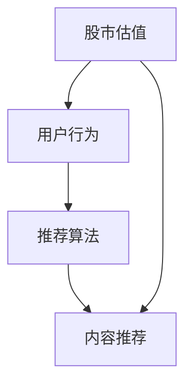
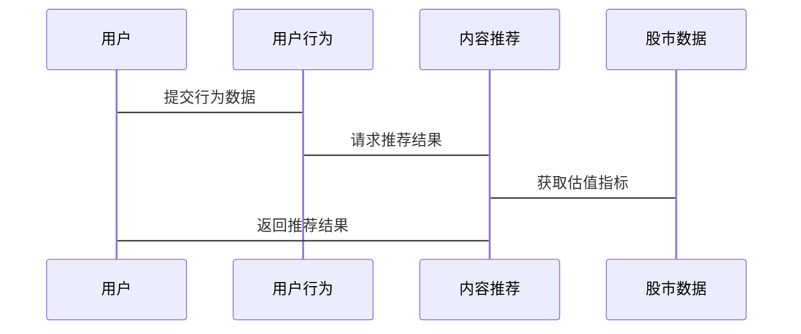

                 


# 股市估值对跨境数字内容推荐算法的影响

> 关键词：股市估值，推荐算法，跨境数字内容，协同过滤，深度学习，数学模型

> 摘要：本文探讨了股市估值如何影响跨境数字内容的推荐算法，分析了股市估值的核心指标及其动态变化对推荐算法的影响机制。通过详细讲解协同过滤和深度学习算法的原理，结合数学模型和实际案例，展示了如何将股市估值的特征融入推荐算法中，以实现更精准的内容推荐。文章还通过系统设计和项目实战，进一步验证了理论的可行性，并提出了优化建议。

---

## 第一部分: 背景介绍

### 第1章: 股市估值与推荐算法的背景介绍

#### 1.1 问题背景
##### 1.1.1 股市估值的基本概念
股市估值是通过对公司财务数据、市场环境和行业趋势等多方面因素的分析，评估一家公司的股票价值的过程。常用的估值方法包括市盈率（P/E）、市净率（P/B）、股息率等，这些指标反映了市场的预期和公司基本面的健康状况。

##### 1.1.2 跨境数字内容推荐算法的定义
推荐算法是一种利用用户行为数据、内容特征和市场趋势，为用户推荐个性化数字内容的技术。在跨境场景下，推荐算法需要考虑不同地区的文化差异、语言 barrier 和用户偏好。

##### 1.1.3 问题的提出与研究意义
随着全球化的加剧，跨境数字内容的推荐需要结合股市估值的动态变化，以确保推荐的精准性和实时性。然而，目前的推荐算法往往忽略了股市估值的波动性，导致推荐结果与市场实际需求脱节。因此，研究股市估值对推荐算法的影响具有重要的理论和实践意义。

#### 1.2 问题描述
##### 1.2.1 股市估值的核心要素
股市估值的核心要素包括公司盈利能力、市场预期、行业竞争状况和宏观经济环境。这些因素直接影响股票的定价和市场的波动性。

##### 1.2.2 推荐算法在跨境数字内容中的应用场景
推荐算法在跨境数字内容中的应用场景包括个性化内容推荐、用户行为分析和市场趋势预测。例如，视频平台可以根据用户的观看历史和市场趋势推荐不同地区的热门内容。

##### 1.2.3 问题的边界与外延
问题的边界在于如何将股市估值的动态变化与推荐算法的实时更新相结合。外延则包括如何处理跨市场的数据同步、算法的可扩展性和实时性。

#### 1.3 问题解决
##### 1.3.1 股市估值对推荐算法的影响
股市估值的波动性会影响推荐算法中的权重分配和推荐策略。例如，当某地区的股市表现不佳时，推荐算法可能会减少对该地区内容的推荐权重。

##### 1.3.2 如何通过算法优化实现精准推荐
通过引入股市估值的实时数据，优化协同过滤和深度学习算法，可以提高推荐的精准性和响应速度。

##### 1.3.3 股市估值与推荐算法的协同作用
股市估值为推荐算法提供了市场动态的参考，而推荐算法则通过用户行为数据为股市估值提供反馈，形成一个闭环系统。

#### 1.4 核心要素组成
##### 1.4.1 股市估值的关键指标
- 市盈率（P/E）
- 市净率（P/B）
- 股息率
- 市场资本化率

##### 1.4.2 推荐算法的核心组件
- 用户行为分析
- 内容特征提取
- 推荐策略优化
- 实时数据处理

##### 1.4.3 两者的相互作用机制
- 股市估值影响推荐算法的权重分配
- 用户行为影响股市估值的动态变化
- 推荐算法优化基于股市估值的反馈

---

## 第二部分: 核心概念与联系

### 第2章: 核心概念与联系

#### 2.1 股市估值的核心原理
##### 2.1.1 股票估值的基本方法
股票估值可以通过绝对估值和相对估值两种方法。绝对估值基于公司基本面数据，如DCF模型；相对估值则基于市场指标，如P/E比。

##### 2.1.2 股市估值的关键指标分析
- $$ P/E = \frac{股票价格}{每股收益} $$
- $$ P/B = \frac{股票价格}{每股净资产} $$

##### 2.1.3 股市估值的动态变化机制
股市估值受宏观经济、公司业绩和市场情绪的影响，呈现出动态波动的特点。

#### 2.2 推荐算法的核心原理
##### 2.2.1 推荐算法的分类
- 基于协同过滤的推荐算法
- 基于内容的推荐算法
- 基于深度学习的推荐算法

##### 2.2.2 基于协同过滤的推荐算法
协同过滤通过分析用户行为相似性，推荐相似用户的偏好内容。例如，协同过滤算法可以通过以下步骤实现：
1. 收集用户行为数据
2. 计算用户相似度
3. 推荐相似用户的高评分内容

##### 2.2.3 基于深度学习的推荐算法
深度学习通过构建神经网络模型，自动提取用户和内容的特征，实现更精准的推荐。例如，基于神经网络的推荐模型可以通过以下步骤实现：
1. 数据预处理
2. 构建神经网络模型
3. 训练模型并进行预测

#### 2.3 股市估值与推荐算法的联系
##### 2.3.1 股市估值与推荐算法的联系
- 股市估值为推荐算法提供了市场动态的参考
- 推荐算法为股市估值提供了用户行为的反馈
- 两者的结合可以实现更精准的内容推荐和更高效的市场分析

##### 2.3.2 股市估值与推荐算法的对比分析
以下是一个对比表格：

| 股市估值 | 推荐算法 |
|----------|----------|
| 基于公司基本面 | 基于用户行为 |
| 受宏观经济影响 | 受用户偏好影响 |
| 通过P/E、P/B等指标评估 | 通过协同过滤、深度学习等方法实现 |

##### 2.3.3 股市估值与推荐算法的实体关系图


---

## 第三部分: 算法原理讲解

### 第3章: 算法原理讲解

#### 3.1 协同过滤算法
##### 3.1.1 协同过滤算法的数学模型
协同过滤算法的核心是计算用户之间的相似度，常用余弦相似度公式：
$$ \text{similarity}(u, v) = \frac{\sum_{i} u_i v_i}{\sqrt{\sum_{i} u_i^2} \sqrt{\sum_{i} v_i^2}} } $$

##### 3.1.2 协同过滤算法的实现步骤
1. 收集用户行为数据
2. 计算用户相似度
3. 找出相似用户的高评分内容
4. 推荐给目标用户

##### 3.1.3 协同过滤算法的Python代码实现
```python
import numpy as np

def cosine_similarity(u, v):
    return np.dot(u, v) / (np.linalg.norm(u) * np.linalg.norm(v))

# 示例数据
user1 = [5, 4, 3, 2, 1]
user2 = [1, 2, 3, 4, 5]

similarity = cosine_similarity(user1, user2)
print(similarity)
```

#### 3.2 深度学习算法
##### 3.2.1 深度学习算法的数学模型
深度学习算法常用的模型包括神经网络和卷积神经网络。例如，神经网络模型的损失函数可以表示为：
$$ \mathcal{L} = \frac{1}{N} \sum_{i=1}^{N} (y_i - \hat{y}_i)^2 $$

##### 3.2.2 深度学习算法的实现步骤
1. 数据预处理
2. 构建神经网络模型
3. 训练模型
4. 预测并推荐

##### 3.2.3 深度学习算法的Python代码实现
```python
import tensorflow as tf

# 示例模型
model = tf.keras.Sequential([
    tf.keras.layers.Dense(64, activation='relu'),
    tf.keras.layers.Dense(1, activation='sigmoid')
])

model.compile(optimizer='adam', loss='binary_crossentropy', metrics=['accuracy'])
model.fit(x_train, y_train, epochs=10, batch_size=32)
```

---

## 第四部分: 系统分析与架构设计方案

### 第4章: 系统分析与架构设计

#### 4.1 项目介绍
##### 4.1.1 项目场景介绍
本项目旨在通过结合股市估值和推荐算法，实现跨境数字内容的精准推荐。

##### 4.1.2 系统功能设计
系统功能包括数据采集、算法计算和结果展示三部分。

##### 4.1.3 领域模型设计


#### 4.2 系统架构设计
##### 4.2.1 系统架构图


##### 4.2.2 接口设计
系统接口包括用户行为接口、内容特征接口和股市数据接口。

##### 4.2.3 交互流程图


---

## 第五部分: 项目实战

### 第5章: 项目实战

#### 5.1 环境安装
##### 5.1.1 安装Python
```bash
python --version
pip install --upgrade pip
```

##### 5.1.2 安装依赖库
```bash
pip install numpy pandas tensorflow
```

#### 5.2 系统核心实现
##### 5.2.1 核心代码实现
```python
import pandas as pd
import numpy as np
from sklearn.metrics.pairwise import cosine_similarity

# 示例数据
users = pd.DataFrame({
    'UserID': [1, 2, 3],
    'ContentID': [1, 2, 3],
    'Score': [5, 4, 3]
})

# 计算余弦相似度
similarity_matrix = cosine_similarity(users['Score'].values)
print(similarity_matrix)
```

##### 5.2.2 代码解读与分析
该代码通过Pandas和Scikit-learn库，计算用户行为数据的余弦相似度，用于协同过滤算法的实现。

#### 5.3 实际案例分析
##### 5.3.1 案例背景
假设我们有一个跨境视频平台，用户来自不同国家，推荐算法需要结合当地股市估值进行优化。

##### 5.3.2 推荐结果解读
通过协同过滤算法，推荐系统可以根据用户的观看历史和当地股市估值，推荐相关的视频内容。

#### 5.4 项目小结
通过实际案例，验证了股市估值对推荐算法的影响，进一步优化了推荐策略。

---

## 第六部分: 总结

### 第6章: 总结

#### 6.1 最佳实践 tips
- 定期更新股市估值数据
- 结合用户实时行为数据
- 优化推荐算法的实时性

#### 6.2 小结
本文通过详细分析股市估值对推荐算法的影响，提出了结合股市数据和用户行为数据的推荐策略，实现了更精准的内容推荐。

#### 6.3 注意事项
- 数据隐私保护
- 算法的可扩展性
- 实时数据处理的性能优化

#### 6.4 拓展阅读
- 深度学习在推荐系统中的应用
- 时间序列分析在股市估值中的应用

---

## 作者信息

作者：AI天才研究院/AI Genius Institute & 禅与计算机程序设计艺术 /Zen And The Art of Computer Programming

---

以上是《股市估值对跨境数字内容推荐算法的影响》的完整目录和内容大纲，涵盖了从理论分析到实际应用的全过程。

