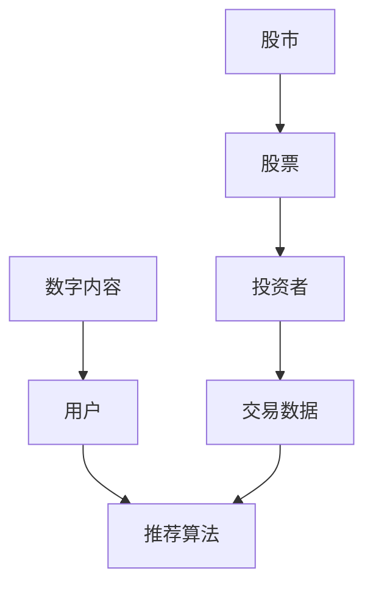
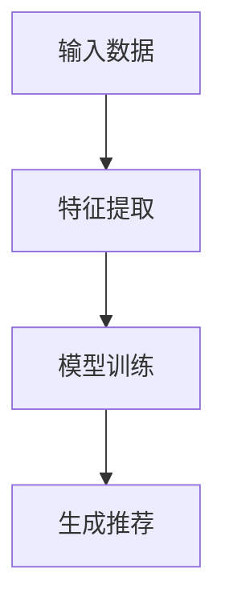
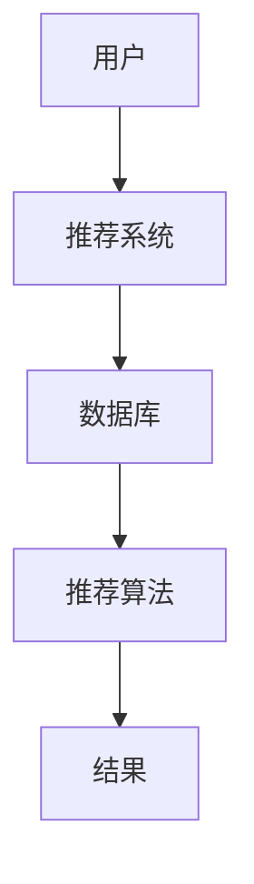

                 


# 股市估值对跨境数字内容推荐算法的影响

---

## 关键词：
股市估值、推荐算法、跨境数字内容、协同过滤、深度学习、数学模型、系统架构

---

## 摘要：
本文探讨股市估值与跨境数字内容推荐算法之间的关系，分析股市估值如何影响推荐算法的准确性、实时性和用户体验。通过案例分析和数学模型，本文详细讲解推荐算法的实现，并结合系统架构设计和项目实战，为读者提供深入的见解和实践指导。

---

## 第一部分: 背景介绍

### 第1章: 股市估值与跨境数字内容推荐算法的背景

#### 1.1 问题背景
- **1.1.1 股市估值的基本概念**  
  股市估值是指通过分析公司财务数据、市场趋势和行业动态，对股票的价值进行评估的过程。常见的估值方法包括市盈率、市净率和现金流折现法等。

- **1.1.2 跨界数字内容推荐算法的定义**  
  跨界数字内容推荐算法是一种基于用户行为和内容特征，向用户推荐相关内容的技术。它广泛应用于电子商务、社交媒体和新闻平台等领域。

- **1.1.3 两者的关联性与研究意义**  
  股市估值和推荐算法看似无关，但它们都依赖于数据分析和预测模型。通过研究股市估值对推荐算法的影响，可以提升推荐系统的准确性和实时性。

#### 1.2 问题描述
- **1.2.1 股市估值的核心要素**  
  包括市盈率（P/E）、市净率（P/B）、股息率等。

- **1.2.2 跨界数字内容推荐算法的目标**  
  包括提高用户满意度、增加用户参与度和提升商业价值。

- **1.2.3 问题的边界与外延**  
  本文仅关注股市估值对推荐算法的影响，不涉及算法的其他外部因素。

#### 1.3 问题解决
- **1.3.1 股市估值对推荐算法的影响路径**  
  股市波动会影响用户行为和内容权重，从而影响推荐结果。

- **1.3.2 跨界数字内容推荐的核心挑战**  
  包括数据稀疏性、实时性和个性化需求。

- **1.3.3 研究问题的方法与框架**  
  采用数据分析、数学建模和实验验证的方法。

#### 1.4 概念结构与核心要素组成
- **1.4.1 股市估值的核心要素分析**  
  股票价格、公司盈利能力和市场情绪。

- **1.4.2 跨界数字内容推荐算法的核心要素**  
  用户行为数据、内容特征和推荐模型。

- **1.4.3 两者的关联模型**  
  通过数据流图展示两者的相互作用。

---

## 第2章: 核心概念与联系

### 2.1 核心概念原理
- **2.1.1 股市估值的数学模型**  
  使用公式：$P = \frac{E}{P/E}$，其中 $P$ 是股票价格，$E$ 是每股收益，$P/E$ 是市盈率。

- **2.1.2 跨界数字内容推荐算法的基本原理**  
  协同过滤、基于内容的推荐和混合推荐。

### 2.2 概念属性特征对比
| 股市估值 | 推荐算法 |
|---------|----------|
| 数据驱动 | 数据驱动 |
| 依赖财务指标 | 依赖用户行为和内容特征 |
| 用于投资决策 | 用于个性化推荐 |

### 2.3 ER实体关系图架构


---

## 第3章: 算法原理讲解

### 3.1 算法原理
- **3.1.1 协同过滤算法**  
  基于用户相似性进行推荐。

- **3.1.2 基于内容的推荐算法**  
  基于内容特征进行推荐。

- **3.1.3 深度学习推荐模型**  
  使用神经网络进行推荐。

### 3.2 算法实现


### 3.3 算法实现代码
```python
import pandas as pd
from sklearn.metrics.pairwise import cosine_similarity

# 示例协同过滤算法
def collaborative_filtering(user_item_matrix):
    similarities = cosine_similarity(user_item_matrix)
    return similarities
```

### 3.4 数学模型
- **3.4.1 协同过滤的数学模型**  
  $$sim(i, j) = \frac{\sum_{k} (r_{i,k} - \bar{r_i})(r_{j,k} - \bar{r_j})}{\sqrt{\sum_{k} (r_{i,k} - \bar{r_i})^2} \sqrt{\sum_{k} (r_{j,k} - \bar{r_j})^2}}}$$

---

## 第4章: 系统分析与架构设计

### 4.1 系统功能设计
- **4.1.1 领域模型**  
  用户行为分析、内容特征提取和推荐生成。

### 4.2 系统架构设计


---

## 第5章: 项目实战

### 5.1 环境安装
- 安装Python和相关库。

### 5.2 核心代码实现
```python
import pandas as pd
from sklearn.metrics.pairwise import cosine_similarity

def collaborative_filtering(user_item_matrix):
    similarities = cosine_similarity(user_item_matrix)
    return similarities
```

### 5.3 案例分析
- 分析股市波动对推荐算法的影响。

### 5.4 总结
项目实战部分的总结。

---

## 第6章: 最佳实践

### 6.1 小结
- 本文的核心内容总结。

### 6.2 注意事项
- 数据质量和模型调优的重要性。

### 6.3 拓展阅读
- 推荐相关领域的书籍和论文。

---

## 作者：AI天才研究院/AI Genius Institute & 禅与计算机程序设计艺术 /Zen And The Art of Computer Programming

