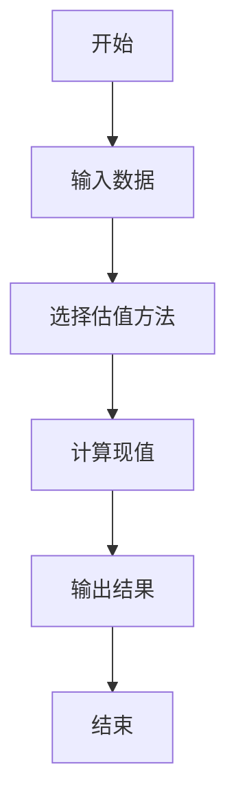

                 


# 股市估值对跨境数字内容版权估值的影响

## 关键词：股市估值，数字内容版权，跨境，版权估值，数学模型，算法原理

## 摘要：  
本文探讨了股市估值与数字内容版权估值之间的关系，特别是在跨境环境下的影响。文章从核心概念、算法原理、数学模型、系统架构设计、项目实战等多维度展开分析，结合实际案例，深入解读股市估值对数字内容版权价值的影响。通过构建数学模型和算法，本文提出了一个基于收益法、成本法和市场法的综合评估方法，并设计了一个跨境数字内容版权估值系统，为投资者和企业提供了科学的决策依据。

---

## 正文

### 第1章：背景介绍

#### 1.1 核心概念

##### 1.1.1 股市估值  
股市估值是指对上市公司或股票的投资价值进行评估的过程。常见的估值方法包括市盈率（P/E）、市净率（P/B）、股息率等。这些指标反映了市场对公司的盈利能力、资产质量和分红能力的预期。

##### 1.1.2 数字内容版权  
数字内容版权是指对数字化内容（如音乐、视频、软件、文学作品等）的所有权和使用权。数字内容的特点包括易复制性、全球可访问性和快速传播性。

##### 1.1.3 跨境交易  
跨境交易指跨越国界的商业活动，涉及不同法律体系、文化背景和市场环境。在数字内容版权领域，这意味着版权可能在多个国家或地区进行交易，受到不同法律的约束。

#### 1.2 问题背景

##### 1.2.1 数字内容版权在股市中的价值体现  
数字内容版权的价值取决于其市场需求、用户基础和盈利能力。例如，热门视频内容的版权可能具有较高的市场价值，因为它们能够吸引大量用户并带来广告收入。

##### 1.2.2 跨境交易中的版权估值挑战  
跨境交易涉及复杂的法律和市场差异，如不同国家的版权法、税收政策和市场规则。这些因素会直接影响数字内容版权的估值。

##### 1.2.3 当前市场的痛点与解决方案  
当前市场中，数字内容版权的估值缺乏统一标准，且难以量化其在全球范围内的潜在收益。本文提出了基于收益法、成本法和市场法的综合估值模型。

---

### 第2章：核心概念分析

#### 2.1 数字内容版权的属性特征对比

| 特性             | 传统版权       | 数字内容版权       |
|------------------|----------------|--------------------|
| 所有权           | 独占性         | 易复制性           |
| 使用方式         | 线下传播       | 全球可访问性       |
| 保护方式         | 版权法         | 数字版权管理技术   |
| 价值评估         | 作品影响力     | 用户基础和市场潜力 |

#### 2.2 ER实体关系图  
以下是数字内容版权与相关实体的ER图：  
```mermaid
erd
    客户
    用户
    内容平台
    数字内容版权
    收益

    客户 --> 用户
    用户 --> 内容平台
    内容平台 --> 数字内容版权
    数字内容版权 --> 收益
```

---

### 第3章：版权估值算法

#### 3.1 估值方法

##### 3.1.1 收益法  
收益法通过预测数字内容版权的未来收益，折现到现值来评估其价值。公式为：  
$$ V = \sum_{t=1}^{n} \frac{C_t}{(1 + r)^t} $$  
其中，\( V \) 是版权的现值，\( C_t \) 是第 \( t \) 年的收益，\( r \) 是折现率。

##### 3.1.2 成本法  
成本法基于版权的开发和维护成本，加上合理的利润来评估其价值。公式为：  
$$ V = C + \text{利润} $$  
其中，\( C \) 是成本，利润基于市场回报率计算。

##### 3.1.3 市场法  
市场法通过比较类似版权的市场交易价格，确定其价值。公式为：  
$$ V = \alpha \times P + \beta $$  
其中，\( P \) 是可比交易价格，\( \alpha \) 和 \( \beta \) 是回归系数。

#### 3.2 算法流程图  
以下是版权估值算法的流程图：  


---

### 第4章：数学模型与公式

#### 4.1 收益预测模型  
数字内容版权的预期收益可以通过以下公式计算：  
$$ \text{预期收益} = \sum_{i=1}^{n} p_i \times q_i $$  
其中，\( p_i \) 是第 \( i \) 项内容的价格，\( q_i \) 是销量。

#### 4.2 市场价值评估  
市场价值评估公式为：  
$$ \text{市场价值} = \alpha \times \text{预期收益} + \beta \times \text{风险调整因子} $$  
其中，\( \alpha \) 和 \( \beta \) 是根据市场条件确定的系数。

---

### 第5章：系统分析与架构设计

#### 5.1 系统功能模块

##### 5.1.1 数据采集模块  
数据采集模块负责收集数字内容版权的相关数据，包括用户行为数据、市场交易数据等。

##### 5.1.2 估值计算模块  
估值计算模块基于输入数据，运行收益法、成本法和市场法，计算版权的估值。

##### 5.1.3 结果展示模块  
结果展示模块将估值结果以图表形式展示，便于用户理解和分析。

#### 5.2 系统架构设计  
以下是系统的架构图：  


---

### 第6章：项目实战

#### 6.1 环境安装

```bash
# 安装Python和相关库
pip install numpy pandas scikit-learn matplotlib
```

#### 6.2 核心代码实现

##### 6.2.1 收益预测模型  
```python
import numpy as np
import pandas as pd

# 示例数据
data = {
    '内容ID': [1, 2, 3],
    '价格': [10, 15, 20],
    '销量': [100, 200, 150]
}
df = pd.DataFrame(data)

# 计算预期收益
expected_revenue = np.dot(df['价格'], df['销量'])
print(f"预期收益：{expected_revenue}")
```

##### 6.2.2 估值计算模块  
```python
from sklearn.linear_model import LinearRegression

# 示例数据
X = df[['价格', '销量']]
y = df['价格'] * df['销量']

# 训练模型
model = LinearRegression()
model.fit(X, y)

# 预测估值
new_data = pd.DataFrame({'价格': [12, 18], '销量': [150, 200]})
predicted_value = model.predict(new_data)
print(f"预测估值：{predicted_value}")
```

---

### 第7章：总结

#### 7.1 最佳实践  
在进行数字内容版权估值时，建议结合多种估值方法，充分考虑市场风险和法律因素。

#### 7.2 小结  
本文通过构建数学模型和算法，深入分析了股市估值对跨境数字内容版权的影响。通过实际案例分析，展示了如何将理论应用于实践。

#### 7.3 注意事项  
在实际应用中，需注意数据的准确性和模型的可解释性，避免因数据偏差导致的估值误差。

#### 7.4 拓展阅读  
推荐阅读《数字版权经济学》和《金融工程中的数学模型》。

---

作者：AI天才研究院/AI Genius Institute & 禅与计算机程序设计艺术 /Zen And The Art of Computer Programming

