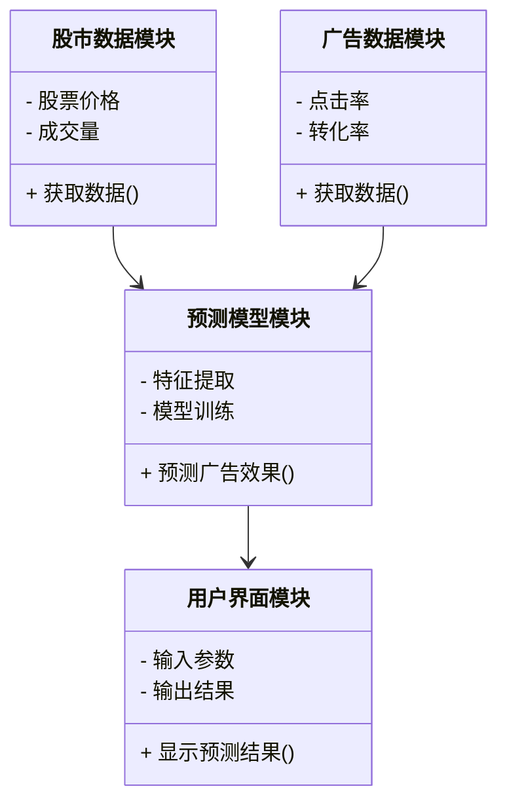
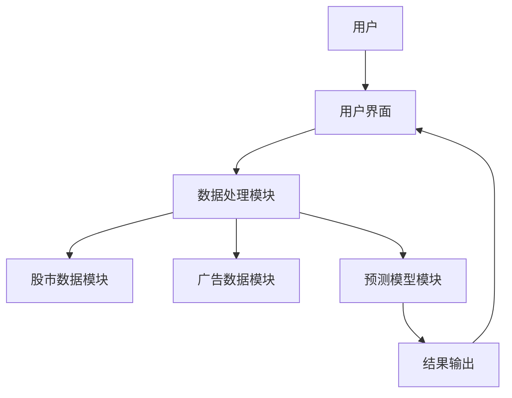

                 


# 股市估值对跨境数字广告效果评估的影响

> 关键词：股市估值，数字广告，广告效果评估，机器学习，数据科学

> 摘要：本文探讨了股市估值对跨境数字广告效果评估的影响。通过分析股市波动如何影响广告公司的投资决策和广告投放策略，结合机器学习算法，提出了一种基于股市估值的广告效果预测模型，为广告行业提供了新的视角和方法。

---

# 引言

在全球化和数字化的今天，股市波动对经济活动的影响日益显著。数字广告作为现代市场营销的重要手段，其效果评估受到多种因素的影响，其中之一就是股市估值的变化。本文旨在探讨股市估值对跨境数字广告效果评估的影响，结合数据科学和机器学习的方法，提出一种新的广告效果预测模型。

---

## 第1章：背景介绍

### 1.1 股市估值与数字广告的核心概念

#### 1.1.1 股市估值的定义与核心要素
股市估值是指通过对公司财务数据和市场表现的分析，评估其股票的内在价值。核心要素包括：
- **市盈率（P/E）**：市价与每股收益的比率。
- **市净率（P/B）**：市价与每股净资产的比率。
- **EV/EBITDA**：企业价值与息税折旧及摊销前利润的比率。

#### 1.1.2 数字广告的基本概念与分类
数字广告是指通过互联网平台投放的广告，主要包括：
- **搜索广告**：如Google Ads。
- **展示广告**：如 banner 广告。
- **社交媒体广告**：如 Facebook 和 Twitter 广告。

#### 1.1.3 股市估值与数字广告的关联性
股市波动会影响广告公司的市值和投资决策，进而影响广告投放预算和策略。同时，数字广告的效果评估也可以通过股市数据提供额外的预测维度。

---

### 1.2 股市波动对广告行业的影响

#### 1.2.1 股市波动对广告公司市值的影响
股市波动直接影响广告公司的股价，进而影响其市场地位和融资能力。

#### 1.2.2 广告行业受经济周期的影响
经济繁荣时期，广告预算增加；经济衰退时期，广告预算可能减少。

#### 1.2.3 股市波动对广告投放预算的影响
股市波动会影响广告公司的盈利能力，从而影响其广告投放预算。

---

## 第2章：数字广告效果评估的核心概念

### 2.1 广告效果评估的主要指标

#### 2.1.1 点击率（CTR）
点击率是广告效果的重要指标，公式为：
$$ CTR = \frac{\text{点击次数}}{\text{展示次数}} $$

#### 2.1.2 转化率（CVR）
转化率是广告点击后用户完成特定行为（如购买）的比例。

#### 2.1.3 每点击成本（CPC）
每点击成本是每次广告点击的平均成本，公式为：
$$ CPC = \frac{\text{总花费}}{\text{点击次数}} $$

---

### 2.2 广告效果评估的模型与方法

#### 2.2.1 基于统计的广告效果评估方法
常用方法包括回归分析和时间序列分析。

#### 2.2.2 基于机器学习的广告效果预测模型
使用随机森林、梯度提升树（如XGBoost）等算法进行预测。

#### 2.2.3 广告效果评估的对比分析方法
通过对比不同广告策略的效果，优化广告投放策略。

---

## 第3章：股市波动与广告公司决策的关系

### 3.1 股市波动对广告公司投资决策的影响

#### 3.1.1 股价波动对广告预算的影响
股价波动会影响广告公司的资金分配，从而影响广告投放预算。

#### 3.1.2 投资者情绪对广告投放策略的影响
投资者情绪会影响广告公司的市场信心，进而影响广告投放策略。

---

### 3.2 股市估值对广告效果预测的启示

#### 3.2.1 股市估值指标与广告效果预测的关联性
通过分析市盈率、市净率等指标，可以预测广告公司的广告效果。

#### 3.2.2 基于股市估值的广告效果预测模型
构建一个基于股市估值的广告效果预测模型，公式为：
$$ \text{广告效果} = f(\text{市盈率}, \text{市净率}, \text{EV/EBITDA}) $$

---

## 第4章：数据采集与预处理

### 4.1 数据来源与采集方法

#### 4.1.1 股市数据的采集
从金融数据源（如Yahoo Finance）获取股票价格、成交量等数据。

#### 4.1.2 广告效果数据的采集
从广告平台（如Google Ads API）获取点击率、转化率等数据。

---

### 4.2 数据清洗与预处理

#### 4.2.1 数据清洗方法
- 删除缺失值。
- 处理异常值。

#### 4.2.2 数据标准化与归一化处理
使用标准化或归一化方法，将数据转换为统一的尺度。

#### 4.2.3 时间序列数据的处理方法
对时间序列数据进行滑动窗口处理，提取特征。

---

## 第5章：算法原理与实现

### 5.1 基于机器学习的广告效果预测模型

#### 5.1.1 算法选择与原理
选择随机森林算法，通过特征重要性分析，提取关键影响因素。

#### 5.1.2 算法实现步骤
1. 数据预处理。
2. 特征提取。
3. 模型训练。
4. 模型评估。

---

## 第6章：系统分析与架构设计方案

### 6.1 系统功能设计

#### 6.1.1 领域模型设计
使用Mermaid绘制类图，展示系统各模块之间的关系。



---

### 6.2 系统架构设计

#### 6.2.1 系统架构图
使用Mermaid绘制系统架构图，展示各模块之间的关系。



---

## 第7章：项目实战

### 7.1 环境安装

#### 7.1.1 安装Python环境
使用Anaconda安装Python 3.8以上版本。

#### 7.1.2 安装依赖库
安装numpy、pandas、scikit-learn等库。

---

### 7.2 系统核心实现源代码

#### 7.2.1 数据处理代码

```python
import pandas as pd
import numpy as np

# 数据加载
stock_data = pd.read_csv('stock.csv')
ad_data = pd.read_csv('ad.csv')

# 数据清洗
stock_data.dropna(inplace=True)
ad_data.dropna(inplace=True)

# 数据合并
merged_data = pd.merge(stock_data, ad_data, on='date')
```

---

#### 7.2.2 预测模型代码

```python
from sklearn.ensemble import RandomForestRegressor
from sklearn.metrics import mean_squared_error

# 特征选择
features = ['市盈率', '市净率', 'EV/EBITDA']
target = '广告效果'

model = RandomForestRegressor(n_estimators=100, random_state=42)
model.fit(merged_data[features], merged_data[target])

# 模型评估
预测 = model.predict(merged_data[features])
print('均方误差:', mean_squared_error(merged_data[target], 预测))
```

---

## 第8章：案例分析与详细解读

### 8.1 案例分析

#### 8.1.1 案例背景
分析一家跨境数字广告公司的广告效果，结合其股市估值数据。

#### 8.1.2 案例分析过程
使用上述模型，预测广告效果，分析股市波动对广告效果的影响。

---

## 第9章：总结与展望

### 9.1 研究总结
本文提出了基于股市估值的数字广告效果预测模型，为广告行业提供了新的视角。

### 9.2 未来研究方向
未来可以研究更多影响广告效果的因素，如用户行为数据、社交媒体情绪分析等。

---

## 参考文献

（此处列出相关文献和数据来源）

---

## 作者：AI天才研究院 & 禅与计算机程序设计艺术

---

通过本文的分析与实践，我们展示了股市估值对跨境数字广告效果评估的重要影响，并提出了一种基于机器学习的预测模型，为广告行业的优化提供了新的思路。

