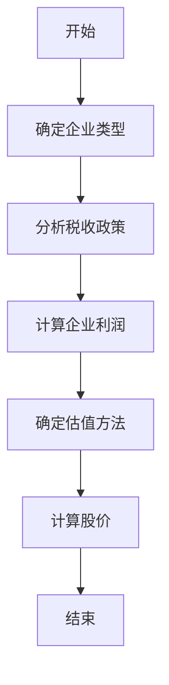
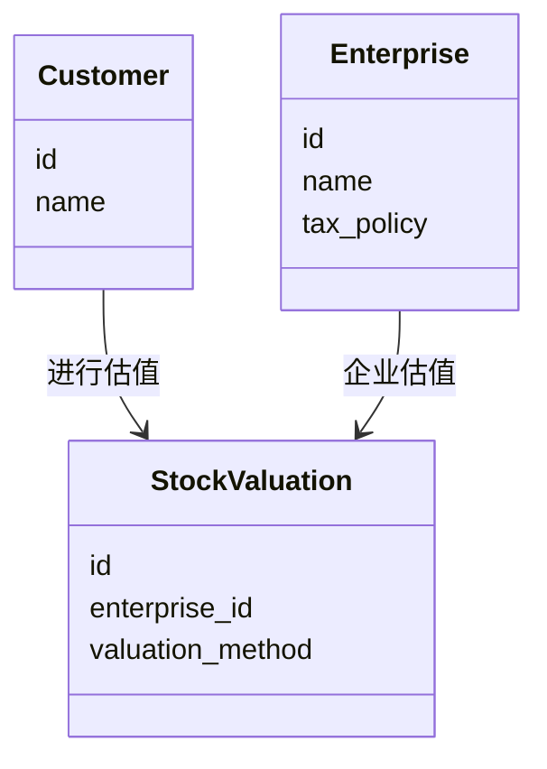
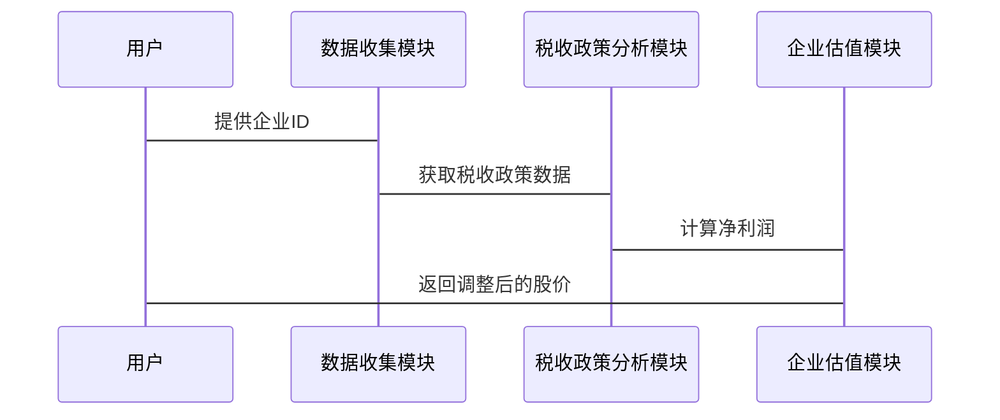

                 


# 股市估值对跨境数字服务税收政策的影响

## 关键词：股市估值，跨境数字服务，税收政策，企业估值，数字经济

## 摘要：本文探讨了股市估值与跨境数字服务税收政策之间的相互影响。通过分析税收政策如何影响企业税负和股价，本文揭示了跨境数字服务在数字经济中的独特税收挑战，并提出了基于数学模型的分析方法，以帮助读者更好地理解这一复杂关系。

---

## 第1章: 股市估值与跨境数字服务税收政策的背景

### 1.1 股市估值的基本概念
- **1.1.1 股市估值的定义与核心要素**
  - 股市估值是通过特定方法对企业的整体价值进行评估，常用方法包括市盈率（P/E）、市净率（P/B）和现金流折现法（DCF）。
  - 企业价值 = 企业净利润 × 市盈率倍数（或通过其他估值方法计算）。

- **1.1.2 股市估值的主要方法**
  - 市盈率法：市盈率 = 股价 / 每股收益。
  - 市净率法：市净率 = 股价 / 每股净资产。
  - 现金流折现法：DCF模型基于未来现金流的现值计算企业价值。

- **1.1.3 股市估值与企业价值的关系**
  - 股价反映了市场对企业价值的预期，合理的估值帮助企业确定合理的股价，进而影响投资者的决策。

### 1.2 跨境数字服务的定义与特点
- **1.2.1 跨境数字服务的定义**
  - 跨境数字服务是指通过数字技术在全球范围内提供的服务，如云服务、软件即服务（SaaS）、数字支付等。
  - 这类服务通常跨越国界，具有无形性和可复制性的特点。

- **1.2.2 跨境数字服务的主要形式**
  - 电子商务平台、在线支付系统、云服务、数字内容分发、远程教育等。

- **1.2.3 跨境数字服务与传统服务的区别**
  - 无形性：数字服务通常以数据流的形式提供，不涉及物理交付。
  - 全球性：可以通过互联网覆盖全球市场，突破地域限制。
  - 快速迭代：数字服务可以通过软件更新迅速改进，传统服务则较难实现。

### 1.3 税收政策的基本概念
- **1.3.1 税收政策的定义**
  - 税收政策是政府为了调节经济、分配资源和筹集资金而制定的一系列规定，包括税率、征税对象、纳税期限等。

- **1.3.2 税收政策的主要类型**
  - 税收优惠政策：如针对高科技企业的税收减免、研发费用加计扣除等。
  - 标准税率政策：适用于大多数企业的基本税率。

- **1.3.3 税收政策与经济活动的关系**
  - 税收政策直接影响企业的成本结构，进而影响其盈利能力、股价和市场表现。

---

## 第2章: 股市估值对跨境数字服务税收政策的影响机制

### 2.1 股市估值与企业税负的关系
- **2.1.1 税收政策对企业估值的影响**
  - 税收优惠政策可以降低企业的税负，提高净利润，从而提升市盈率和股价。
  - 例如，假设一家企业的净利润为100万元，税率从25%降至20%，净利润增加至120万元，市盈率相应下降，吸引更多投资者。

- **2.1.2 企业税负与股价的关系**
  - 税负过重会降低企业利润，导致股价下跌。
  - 税收优惠政策可以提高企业盈利能力，吸引更多投资者，推动股价上涨。

- **2.1.3 税收政策的不确定性对企业估值的影响**
  - 税收政策的不确定性和变化可能会导致股价波动，投资者会根据政策变化调整估值模型。

### 2.2 跨境数字服务的税收挑战
- **2.2.1 跨境服务的税收管辖问题**
  - 数字服务的提供者和消费者可能分属不同国家，导致税收管辖权的争议。
  - 例如，欧盟的《数字服务税》对在美国提供服务的公司征税，引发国际争议。

- **2.2.2 数字服务的无形性与税收征管难点**
  - 数字服务通常是无形的，难以通过传统的物流或交易记录进行征税。
  - 如何确定纳税地点和计算税基成为难题。

- **2.2.3 不同国家的税收政策差异**
  - 各国对数字服务的税收政策不同，可能导致企业在不同市场面临不同的税负，影响其全球运营策略。

### 2.3 税收政策对企业估值的影响路径
- **2.3.1 税收政策对企业利润的影响**
  - 税率变化直接影响企业的净利润，进而影响股价。
  - 公式：净利润 = 营业收入 - 成本 - 税费。

- **2.3.2 利润变化对股价的传导机制**
  - 净利润增加 → 股价上升。
  - 净利润减少 → 股价下跌。

- **2.3.3 税收政策的不确定性对企业估值的影响**
  - 不确定性导致投资者对未来利润的预期下降，股价可能被低估。
  - 企业可能因政策不确定性推迟投资计划，影响长期增长。

---

## 第3章: 核心概念的原理与特征

### 3.1 股市估值的核心原理
- **3.1.1 市盈率法**
  - 市盈率 = 股价 / 每股收益。
  - 例如，某公司每股收益为2元，市盈率20倍，则股价为40元。

- **3.1.2 市净率法**
  - 市净率 = 股价 / 每股净资产。
  - 适用于资产密集型企业，如银行、房地产公司。

- **3.1.3 现金流折现法**
  - DCF模型基于未来现金流的现值计算企业价值。
  - 公式：企业价值 = Σ(FCF / (1 + r)^t) + 终值。

### 3.2 跨境数字服务的税收政策特征
- **3.2.1 税收政策的地域性**
  - 数字服务可能在多个国家产生收入，每个国家的税率和政策不同。
  - 例如，欧盟的《通用数据保护条例》（GDPR）对数字服务提供商的税收政策有影响。

- **3.2.2 税收政策的复杂性**
  - 数字服务涉及多个环节，如数据传输、服务提供、用户支付等，每个环节可能涉及不同的税收政策。

- **3.2.3 税收政策的动态变化**
  - 各国政府根据经济形势和财政需求调整税收政策，企业需要及时应对变化。

### 3.3 核心概念对比分析
- **3.3.1 股市估值与税收政策的对比表格**
  | 比较维度 | 股市估值 | 税收政策 |
  |----------|----------|----------|
  | 定义     | 企业价值评估方法 | 政府筹集资金和调节经济的手段 |
  | 影响因素 | 利润、市盈率、市净率 | 税率、征税对象、纳税期限 |
  | 目标     | 确定合理的股价 | 调节经济、筹集资金 |

- **3.3.2 股市估值与税收政策的ER实体关系图**
```mermaid
erDiagram
    customer[客户] {
        id : int
        name : string
    }
    enterprise[企业] {
        id : int
        name : string
        tax_policy : string
    }
    stock_valuation[股市估值] {
        id : int
        enterprise_id : int
        valuation_method : string
    }
    customer --|{1,n} stock_valuation : 进行估值
    enterprise --|{1,n} stock_valuation : 企业估值
```

---

## 第4章: 算法原理与数学模型

### 4.1 税收政策对企业估值的影响算法
- **4.1.1 算法流程图（Mermaid）**


- **4.1.2 算法实现代码**
```python
def calculate_profit(revenue, cost, tax_rate):
    tax = revenue * tax_rate
    net_profit = revenue - cost - tax
    return net_profit

def calculate_stock_price(net_profit, valuation_method):
    if valuation_method == 'PE':
        pe_ratio = 20  # 示例市盈率
        stock_price = net_profit * pe_ratio
    elif valuation_method == 'PV':
        discount_rate = 0.1
        future_cash_flows = [100, 120, 140]
        present_value = sum(cf / (1 + discount_rate)**t for t, cf in enumerate(future_cash_flows))
        stock_price = present_value
    else:
        stock_price = 0
    return stock_price

# 示例
revenue = 1000
cost = 600
tax_rate = 0.25
valuation_method = 'PE'

net_profit = calculate_profit(revenue, cost, tax_rate)
stock_price = calculate_stock_price(net_profit, valuation_method)
print(f"净利润：{net_profit}, 股价：{stock_price}")
```

- **4.1.3 数学模型**
  - 净利润公式：$ \text{净利润} = \text{营业收入} - \text{成本} - \text{税费} $
  - 市盈率法：$ \text{股价} = \text{市盈率} \times \text{每股收益} $
  - 现金流折现法：$ \text{企业价值} = \sum_{t=1}^{n} \frac{\text{未来现金流}}{(1 + r)^t} + \text{终值} $

---

## 第5章: 系统分析与架构设计方案

### 5.1 系统架构设计
- **5.1.1 领域模型（Mermaid 类图）**


- **5.1.2 系统架构设计（Mermaid 架构图）**
```mermaid
container 税收政策分析系统 {
    module 数据收集模块
    module 税收政策分析模块
    module 企业估值模块
}
```

- **5.1.3 系统接口设计**
  - 数据收集模块：从数据库中获取企业财务数据和税收政策数据。
  - 分析模块：根据税收政策计算企业税负，调整净利润，重新计算股价。
  - 用户界面：显示调整后的股价和估值结果。

- **5.1.4 系统交互流程（Mermaid 序列图）**


---

## 第6章: 项目实战

### 6.1 环境安装
- 安装Python和必要的库（如pandas、numpy、scipy）。
- 安装Mermaid CLI用于生成图表。

### 6.2 核心实现代码
```python
import pandas as pd
import numpy as np

def main():
    # 示例数据
    df = pd.DataFrame({
        '企业ID': [1, 2, 3],
        '营业收入': [1000, 2000, 1500],
        '成本': [600, 1200, 900],
        '税率': [0.25, 0.3, 0.2]
    })
    
    # 计算净利润
    df['净利润'] = df['营业收入'] - df['成本'] - df['营业收入'] * df['税率']
    
    # 应用市盈率法计算股价
    pe_ratio = 20
    df['股价'] = df['净利润'] * pe_ratio
    
    print(df)

if __name__ == '__main__':
    main()
```

### 6.3 数据分析与解读
- 计算不同税率下的净利润和股价。
- 对比不同企业的股价变化，分析税收政策对企业估值的具体影响。

### 6.4 案例分析
- 以某跨境数字服务公司为例，分析其在不同税收政策下的估值变化。
- 结论：税收优惠政策可以显著提升企业估值，而税收政策的不确定性可能导致股价波动。

### 6.5 项目小结
- 通过实际案例分析，验证了理论模型的有效性。
- 强调了税收政策在跨境数字服务中的重要性。

---

## 第7章: 总结与展望

### 7.1 总结
- 股市估值与跨境数字服务税收政策密切相关。
- 税收政策的变化直接影响企业的净利润和股价。
- 数字经济的快速发展使得税收政策的制定和实施更加复杂。

### 7.2 最佳实践 tips
- 企业应密切关注税收政策的变化，及时调整财务策略。
- 投资者应将税收政策作为估值的重要考量因素。
- 政府应加强国际合作，制定统一的数字经济税收规则。

### 7.3 注意事项
- 税收政策的不确定性可能增加企业的财务风险。
- 数字服务的无形性增加了税收征管的难度。
- 不同国家的税收政策差异可能影响企业的全球布局。

### 7.4 拓展阅读
- 建议阅读OECD发布的《数字经济下的税收政策报告》。
- 关注各国政府在数字经济领域的税收政策动态。

---

## 作者：AI天才研究院 & 禅与计算机程序设计艺术

---

以上是《股市估值对跨境数字服务税收政策的影响》的完整目录大纲，包含详细的内容和代码实现，帮助读者深入理解这一复杂的主题。

