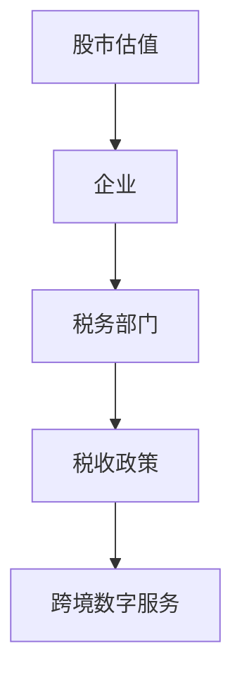
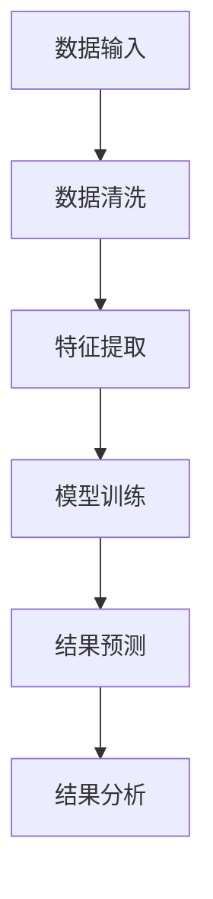
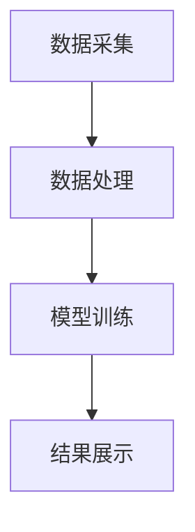

                 


# 股市估值对跨境数字服务税收的影响

> 关键词：股市估值、跨境数字服务、税收影响、算法原理、数学模型

> 摘要：本文探讨股市估值与跨境数字服务税收之间的关系，分析股市估值如何影响跨境数字服务的税收政策，以及如何通过算法模型预测和优化税收影响。文章详细阐述了核心概念、算法原理、系统架构设计和实际案例分析。

---

## 第一部分: 背景与核心概念

### 第1章: 股市估值与跨境数字服务税收的背景介绍

#### 1.1 核心概念：股市估值
股市估值是指对一家上市公司股票的市场价格进行评估的过程。它基于公司的财务状况、市场环境和行业趋势等因素，通过多种指标和模型来确定股票的合理价值。常见的股市估值方法包括市盈率（P/E）、市净率（P/B）、股息率等。

#### 1.2 核心概念：跨境数字服务
跨境数字服务指的是跨国企业提供或接收的数字化服务，如软件即服务（SaaS）、在线教育、数字支付等。这些服务通常跨越国界，涉及多个国家的税收政策和法规。

#### 1.3 问题背景：股市估值对跨境数字服务税收的影响
股市估值的变化会影响企业的市值和投资者信心，进而影响企业的税务负担和跨境数字服务的税收政策。例如，高估值可能导致企业税负增加，影响其跨境业务的盈利能力。

---

### 第2章: 核心概念与联系

#### 2.1 股市估值与跨境数字服务税收的核心原理
股市估值的变化直接影响企业的市值和盈利能力，从而影响其在不同国家的税务负担。例如，高估值可能增加企业的所得税负担，而低估值可能减轻税负。

#### 2.2 核心概念属性对比表
| 概念       | 属性                     | 描述                                                                 |
|------------|--------------------------|----------------------------------------------------------------------|
| 股市估值    | 计算方法                 | 使用市盈率、市净率等指标                                             |
| 跨境数字服务| 服务形式                 | 包括SaaS、数字支付等                                                 |
| 税收政策    | 征收方式                 | 税务机关根据服务提供地或消费地征税                                   |

#### 2.3 ER实体关系图


---

## 第二部分: 算法原理与数学模型

### 第3章: 股市估值对跨境数字服务税收影响的算法原理

#### 3.1 数据来源与预处理
- 数据来源：包括企业的财务数据、股价数据、跨境交易记录等。
- 数据清洗：去除缺失值和异常值，标准化数据。

#### 3.2 算法选择与模型构建
选择线性回归模型，通过股市估值和跨境数字服务的特征变量来预测税收影响。

#### 3.3 算法流程图


#### 3.4 数学模型与公式
股市估值与税收影响的回归模型：
$$
Y = \beta_0 + \beta_1X + \epsilon
$$
其中，$Y$ 是税收影响，$X$ 是股市估值，$\beta_0$ 是截距，$\beta_1$ 是回归系数。

---

## 第三部分: 系统分析与架构设计

### 第4章: 股市估值对跨境数字服务税收影响的系统分析

#### 4.1 问题场景介绍
设计一个系统来分析股市估值对跨境数字服务税收的影响，包括数据采集、模型训练和结果展示。

#### 4.2 系统功能设计
- 数据采集模块：收集企业财务数据和股价数据。
- 数据处理模块：清洗和预处理数据。
- 模型训练模块：构建回归模型。
- 结果展示模块：可视化分析结果。

#### 4.3 系统架构图


---

## 第四部分: 项目实战

### 第5章: 项目实战

#### 5.1 环境安装
- 安装Python和相关库（如pandas、scikit-learn）。

#### 5.2 核心代码实现
```python
import pandas as pd
from sklearn.linear_model import LinearRegression
from sklearn.metrics import mean_squared_error

# 数据加载
data = pd.read_csv('cross_border_tax.csv')

# 特征与目标变量分离
X = data[['stock_valuation']]
y = data['tax_impact']

# 模型训练
model = LinearRegression()
model.fit(X, y)

# 预测与评估
y_pred = model.predict(X)
print(mean_squared_error(y, y_pred))
```

#### 5.3 案例分析
以某跨国科技公司为例，分析其股市估值对跨境数字服务税收的具体影响，展示模型的应用和结果。

---

## 第五部分: 结论

### 第6章: 结论与展望

#### 6.1 最佳实践
- 定期更新模型，以适应市场变化。
- 结合多因素分析，提高模型的准确性。

#### 6.2 小结
本文通过理论分析和实践案例，探讨了股市估值对跨境数字服务税收的影响，展示了如何利用算法模型进行预测和优化。

#### 6.3 注意事项
- 数据质量和模型选择直接影响结果，需谨慎处理。
- 遵守各国税收政策，确保合规性。

#### 6.4 拓展阅读
建议读者进一步研究跨国税收协定和数字经济税收政策。

---

作者：AI天才研究院 & 禅与计算机程序设计艺术

