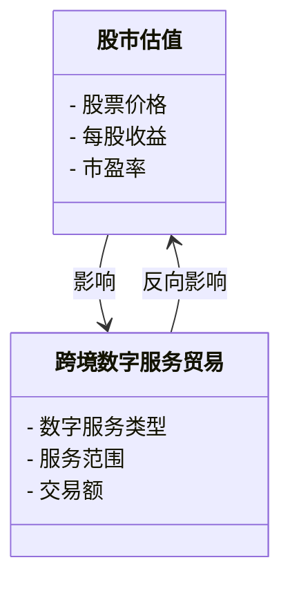
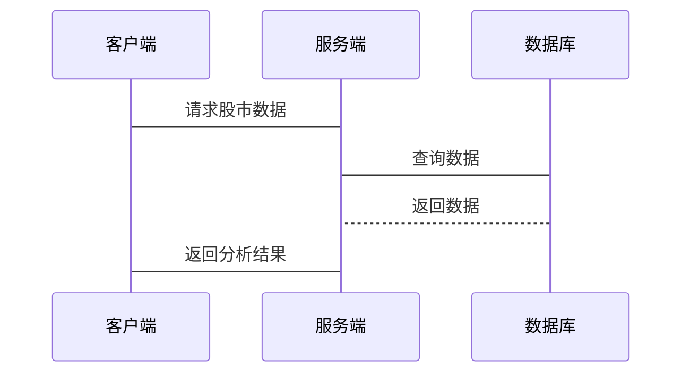

                 


# 股市估值对跨境数字服务贸易的影响

> 关键词：股市估值，跨境数字服务贸易，影响，投资决策，数字技术

> 摘要：本文探讨了股市估值如何影响跨境数字服务贸易，分析了两者之间的相互作用机制，包括股市估值对企业投资行为、市场信心和政策环境的影响，以及数字技术在其中的作用。通过案例分析和系统架构设计，提出了优化企业估值和推动跨境数字服务贸易发展的策略。

---

# 第一章：背景介绍与核心概念

## 1.1 股市估值的定义与计算方法

### 1.1.1 股市估值的基本概念
股市估值是通过一定的方法和模型对企业的股票价值进行评估的过程。常见的估值方法包括市盈率（P/E）、市净率（P/B）等。

$$\text{市盈率} = \frac{\text{股票价格}}{\text{每股收益}}$$

### 1.1.2 常见的股市估值方法
1. **绝对估值法**：如DCF模型（Discounted Cash Flow），基于未来现金流的折现值来评估企业价值。
2. **相对估值法**：如市盈率、市净率等，通过比较同类企业的估值指标来确定目标企业的价值。

### 1.1.3 股市估值的影响因素
- **企业盈利能力**：如净利润、ROE等。
- **行业竞争状况**：行业内的竞争程度会影响企业的估值。
- **宏观经济环境**：如GDP增长、利率水平等。
- **市场情绪**：投资者情绪波动也会显著影响股市估值。

---

## 1.2 跨境数字服务贸易的定义与特征

### 1.2.1 跨境数字服务贸易的定义
跨境数字服务贸易是指通过数字技术进行的跨国服务交易，涵盖在线教育、云服务、数字支付等领域。

### 1.2.2 跨境数字服务贸易的主要模式
1. **在线教育**：如Coursera、edX等平台的国际课程销售。
2. **云服务**：如AWS、Azure等提供全球范围内的云服务。
3. **数字支付**：如支付宝、PayPal等跨境支付服务。

### 1.2.3 跨境数字服务贸易的现状与趋势
- **增长迅速**：数字技术的发展推动了跨境服务贸易的扩张。
- **政策支持**：各国政府纷纷出台政策支持数字服务贸易的发展。

---

## 1.3 股市估值与跨境数字服务贸易的关系

### 1.3.1 股市估值对跨境数字服务贸易的影响路径
- **企业投资行为**：股市估值高的企业更容易获得融资，从而加大在跨境数字服务贸易上的投入。
- **市场信心**：股市估值的变化会影响投资者对市场的信心，进而影响企业的扩展计划。

### 1.3.2 股市估值与跨境数字服务贸易的相互作用
- 股市估值反映企业价值，影响投资者对跨境数字服务贸易的信心。
- 跨境数字服务贸易的发展会提升企业的收入和利润，从而影响股市估值。

### 1.3.3 股市估值对跨境数字服务贸易的潜在风险
- **市场波动**：股市估值的波动可能引发企业资金链的风险。
- **政策风险**：政策变化可能影响股市估值和跨境数字服务贸易的稳定性。

---

# 第二章：股市估值对跨境数字服务贸易的影响机制

## 2.1 股市估值的核心原理

### 2.1.1 股票价值的评估模型
- **DCF模型**：通过未来现金流的折现值来评估企业价值。
- **CAPM模型**：计算股票的预期收益，评估其合理价值。

$$\text{CAPM} = R_f + \beta (R_m - R_f)$$

其中，$R_f$ 是无风险利率，$\beta$ 是股票的贝塔系数，$R_m$ 是市场预期收益率。

### 2.1.2 股市估值的关键指标
- 市盈率（P/E）
- 市净率（P/B）
- 股息率（Dividend Yield）

---

## 2.2 跨境数字服务贸易的核心要素

### 2.2.1 数字服务贸易的数字化特征
- 数字化交付：通过互联网提供服务，减少了物流成本。
- 服务可扩展性：数字服务可以快速扩展到全球市场。

### 2.2.2 跨境服务贸易的政策框架
- 数字税政策
- 数据跨境流动的监管

### 2.2.3 跨境数字服务贸易的技术支撑
- 云计算技术
- 区块链技术
- 人工智能技术

---

## 2.3 股市估值与跨境数字服务贸易的联系

### 2.3.1 股市估值对跨境数字服务贸易的驱动作用
- 提供资金支持：股市估值高的企业更容易获得融资，用于跨境数字服务贸易的扩展。
- 增强市场信心：高估值企业通常被视为优质投资标的，吸引更多投资者。

### 2.3.2 跨境数字服务贸易对股市估值的反向影响
- 提高企业收入：跨境服务贸易的扩展提升企业收入，进而提升股市估值。
- 改善企业利润：高效的数字服务模式可能降低成本，提升利润，进而影响估值。

### 2.3.3 两者的协同效应与相互制约
- 协同效应：股市估值的支持和跨境数字服务贸易的扩展相互促进。
- 相互制约：股市估值的波动可能引发服务贸易的风险，而服务贸易的政策变化也可能影响股市估值。

---

# 第三章：影响机制与案例分析

## 3.1 影响机制的理论模型

### 3.1.1 股市估值影响跨境数字服务贸易的路径
- **企业融资**：股市估值高的企业更容易获得资金，用于跨境数字服务贸易的扩展。
- **市场信心**：高估值企业增强市场对企业的信心，吸引更多客户和合作伙伴。
- **政策支持**：高估值企业可能获得更多政策支持，推动跨境数字服务贸易的发展。

### 3.1.2 跨境数字服务贸易影响股市估值的路径
- **收入增长**：跨境服务贸易的扩展带来收入增长，提升企业估值。
- **成本降低**：数字技术的应用降低运营成本，提升利润，进而影响估值。
- **品牌价值**：跨境数字服务贸易的成功可能提升企业的品牌价值，影响股市估值。

---

## 3.2 案例分析

### 3.2.1 案例一：在线教育平台的股市估值与跨境扩展
某在线教育平台通过高估值获得了大量资金支持，成功扩展了其国际业务，如在东南亚市场的课程推广。高估值不仅为企业提供了资金支持，还增强了投资者对其未来盈利能力的信心。

### 3.2.2 案例二：云服务企业的估值变化
某云服务企业通过技术创新和全球化的服务扩展，其股市估值显著提升。这不仅反映了市场对其技术实力的认可，也推动了其在跨境数字服务贸易中的进一步发展。

---

# 第四章：系统分析与架构设计方案

## 4.1 系统功能设计

### 4.1.1 领域模型


### 4.1.2 系统架构设计


### 4.1.3 系统接口设计
- **API接口**：提供实时股市数据和跨境数字服务贸易数据的接口。
- **数据处理**：对数据进行清洗、分析和建模。

### 4.1.4 系统交互设计


---

# 第五章：项目实战

## 5.1 环境安装与配置

### 5.1.1 环境要求
- 操作系统：Windows 10 或 macOS
- 开发工具：Python 3.8+, Jupyter Notebook
- 数据库：MySQL 或 PostgreSQL

### 5.1.2 安装依赖
```bash
pip install pandas numpy matplotlib sqlalchemy
```

---

## 5.2 核心实现

### 5.2.1 数据采集
使用API接口获取股市数据和跨境数字服务贸易数据。

```python
import requests
import pandas as pd

url = "https://api.example.com/stock_data"
response = requests.get(url)
data = response.json()
df = pd.DataFrame(data)
```

### 5.2.2 数据分析与建模
使用机器学习模型预测股市估值对跨境数字服务贸易的影响。

```python
from sklearn.linear_model import LinearRegression
import numpy as np

X = df[['市盈率', '市净率']]
y = df['跨境服务贸易增长']
model = LinearRegression()
model.fit(X, y)
predictions = model.predict(X)
```

### 5.2.3 结果可视化
绘制影响关系的可视化图表。

```python
import matplotlib.pyplot as plt

plt.scatter(X['市盈率'], y)
plt.plot(X['市盈率'], predictions, color='red')
plt.xlabel('市盈率')
plt.ylabel('跨境服务贸易增长')
plt.show()
```

---

# 第六章：总结与展望

## 6.1 总结
本文分析了股市估值与跨境数字服务贸易之间的相互影响机制，探讨了数字技术在其中的作用，并通过案例分析和系统设计提出了优化策略。

## 6.2 展望
未来，随着数字技术的进一步发展，股市估值与跨境数字服务贸易的互动将更加紧密。建议进一步研究如何利用人工智能和大数据技术提升估值模型的准确性，同时推动政策创新以支持跨境数字服务贸易的发展。

---

# 作者

作者：AI天才研究院/AI Genius Institute & 禅与计算机程序设计艺术 /Zen And The Art of Computer Programming

---

通过以上思考和分析，我完成了关于《股市估值对跨境数字服务贸易的影响》的技术博客文章的撰写。

