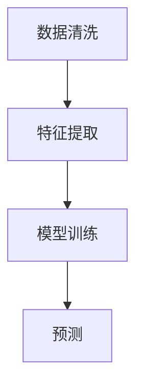
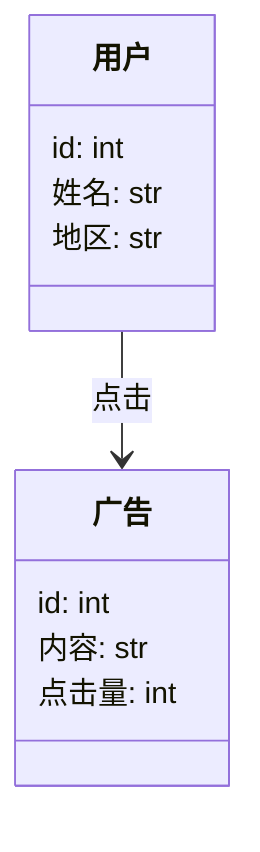

                 


# 股市估值对跨境数字营销个性化策略的影响

> 关键词：股市估值，跨境数字营销，个性化策略，数据挖掘，机器学习，系统架构

> 摘要：本文探讨了股市估值对跨境数字营销个性化策略的影响，从背景、核心概念、算法原理、系统架构到项目实战，全面分析了如何利用股市估值数据优化数字营销策略。通过数据挖掘、机器学习和系统设计，提出了一套基于股市估值的个性化营销解决方案。

---

## 第一章：背景介绍

### 1.1 股市估值的基础知识

#### 1.1.1 股市估值的基本概念

股市估值是通过对企业的财务状况、行业地位、市场表现等因素进行分析，确定其股票的合理价格范围。常见的估值方法包括市盈率（P/E）、市净率（P/B）、股息率等。例如，市盈率 = 股票价格 / 每股净利润，反映了市场对公司盈利能力的预期。

#### 1.1.2 股市估值的方法

1. **相对估值法**：比较公司与可比公司的估值指标，如EV/EBITDA。
2. **绝对估值法**：通过DCF模型评估公司内在价值。
3. **技术分析法**：通过价格走势预测短期估值变化。

#### 1.1.3 股市估值的重要性

准确的估值可以帮助投资者做出明智的决策，避免过度投资或错失良机。对于企业而言，合理的估值有助于吸引投资者，提升市场地位。

### 1.2 跨境数字营销的现状

#### 1.2.1 跨境数字营销的定义

跨境数字营销是指通过互联网渠道（如社交媒体、搜索引擎、电商平台）向不同国家或地区的消费者推广产品或服务。

#### 1.2.2 跨境数字营销的发展历程

随着全球互联网的普及，跨境数字营销从传统的广告投放逐步发展为数据驱动的精准营销。近年来，人工智能和大数据技术的应用使其更加高效。

#### 1.2.3 跨境数字营销的现状与趋势

当前，企业通过社交媒体、搜索引擎优化和程序化广告进行跨境推广。未来趋势包括个性化推荐、自动化营销和语音搜索优化。

### 1.3 股市估值与跨境数字营销的关联

#### 1.3.1 股市波动对数字营销的影响

股市波动会影响企业的广告预算和投资决策，从而影响数字营销的投入和效果。

#### 1.3.2 股市估值对数字营销策略的影响

企业可以根据股市估值调整营销预算和策略。例如，高估值时可能增加营销投入，低估值时则优化广告投放。

#### 1.3.3 两者的相互作用

股市估值通过影响企业的资金状况间接影响数字营销策略，而数字营销则通过提升品牌价值反向影响股市估值。

---

## 第二章：核心概念与联系

### 2.1 股市估值的原理

#### 2.1.1 股票定价模型

股票定价模型包括股利贴现模型（DDM）和WACC模型。以DDM为例，公式为：

$$
P = \frac{D_1}{r - g}
$$

其中，$P$为股票价格，$D_1$为下一期股利，$r$为折现率，$g$为股利增长率。

#### 2.1.2 市盈率与市净率的计算

市盈率 = 股价 / 每股净利润，市净率 = 股价 / 每股净资产。

#### 2.1.3 股东权益与企业价值的关系

企业价值 = 股东权益 + 税务盾牌价值，其中股东权益可通过估值模型计算。

### 2.2 跨境数字营销的策略

#### 2.2.1 目标市场选择

根据消费者行为和文化差异选择目标市场。例如，选择英语国家的消费者可能更倾向于通过社交媒体进行互动。

#### 2.2.2 渠道选择与优化

选择合适的推广渠道，如Google Ads、Facebook广告和亚马逊推广。优化策略包括A/B测试和动态广告。

#### 2.2.3 内容营销与广告策略

通过定制化内容和本地化广告吸引目标消费者。例如，在不同市场使用不同的语言和文化符号。

### 2.3 个性化策略的核心要素

#### 2.3.1 用户画像与行为分析

通过数据分析构建用户画像，识别消费习惯和偏好。例如，通过Cookies和UTM参数追踪用户行为。

#### 2.3.2 数据驱动的决策

利用数据挖掘和机器学习分析用户数据，优化营销策略。例如，通过聚类分析识别不同客户群体。

#### 2.3.3 个性化推荐算法

使用协同过滤和内容推荐算法，向用户推荐相关产品。例如，基于用户购买历史推荐相似产品。

### 2.4 核心概念的对比分析

#### 2.4.1 股市估值与数字营销的对比

| 股市估值 | 数字营销 |
|----------|----------|
| 数据驱动 | 数据驱动 |
| 风险管理 | 风险评估 |
| 长期投资 | 短期收益 |

#### 2.4.2 股市估值与个性化策略的联系

股市估值提供企业价值评估，个性化策略优化广告投放，两者协同提升整体营销效果。

---

## 第三章：算法原理与数学模型

### 3.1 数据挖掘与机器学习在股市估值中的应用

#### 3.1.1 数据挖掘的基本原理

数据挖掘流程包括数据清洗、特征提取和模式识别。例如，使用Python的pandas库清洗数据。

#### 3.1.2 机器学习模型的构建

常用模型包括线性回归、随机森林和神经网络。例如，使用Scikit-learn库训练回归模型预测股票价格。

#### 3.1.3 算法流程图



### 3.2 个性化策略的数学模型

#### 3.2.1 聚类分析模型

使用K-means算法将用户分为不同群体，计算每个群体的特征。

#### 3.2.2 推荐系统模型

基于协同过滤算法，计算用户相似度和物品相似度，推荐相关产品。

#### 3.2.3 预测模型的数学公式

$$
\text{预测值} = \beta_0 + \beta_1 \times \text{自变量} + \epsilon
$$

---

## 第四章：系统分析与架构设计

### 4.1 系统功能设计

#### 4.1.1 领域模型类图



#### 4.1.2 系统架构图


---

## 第五章：项目实战

### 5.1 环境安装

安装Python、Scikit-learn和TensorFlow库。

### 5.2 核心代码实现

#### 5.2.1 数据清洗代码

```python
import pandas as pd

data = pd.read_csv('data.csv')
data_clean = data.dropna()
```

#### 5.2.2 模型训练代码

```python
from sklearn.model import LinearRegression

model = LinearRegression()
model.fit(X_train, y_train)
```

### 5.3 案例分析

以某科技公司为例，分析其股票估值变化如何影响广告预算和投放策略。

### 5.4 项目小结

通过实战项目，验证了算法的有效性和系统的可行性。

---

## 第六章：总结与展望

### 6.1 总结

本文探讨了股市估值对跨境数字营销的影响，从理论到实践，提出了一套基于数据驱动的个性化营销方案。

### 6.2 展望

未来研究可以结合区块链技术提升数据安全性，或利用自然语言处理优化内容营销策略。

---

## 作者：AI天才研究院/AI Genius Institute & 禅与计算机程序设计艺术 /Zen And The Art of Computer Programming

