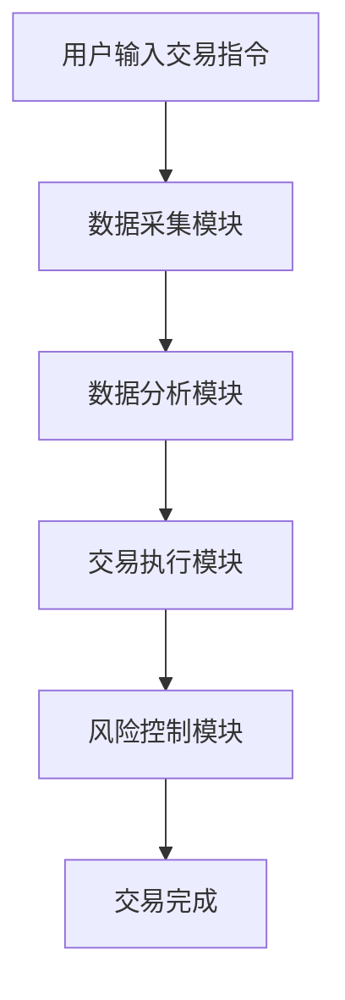

                 

# 股市估值对跨境数字货币交易的影响

## 关键词：股市估值, 跨境数字货币, 数字货币交易, 技术分析, 量化分析, 股市影响, 数字货币市场

## 摘要：  
本文探讨股市估值对跨境数字货币交易的影响，分析股市估值的核心概念与方法，以及如何将股市估值的原理应用到跨境数字货币交易中。通过技术分析、量化分析和系统设计等方法，揭示股市估值与跨境数字货币交易之间的相互作用机制，并通过实际案例和系统实现，展示如何利用股市估值优化跨境数字货币交易策略。

---

## 第1章: 股市估值与跨境数字货币交易概述

### 1.1 股市估值的基本概念

#### 1.1.1 股市估值的定义  
股市估值是指通过对公司财务数据、市场环境和行业趋势等多方面因素的分析，对股票的内在价值进行评估的过程。其目的是确定股票的合理价格区间，为投资者提供决策依据。

#### 1.1.2 股市估值的核心要素  
- **收入与利润**：包括营业收入、净利润等财务指标，用于衡量公司的盈利能力。  
- **资产与负债**：通过资产总额与负债总额分析公司的财务健康状况。  
- **行业地位**：公司所处行业的竞争地位、市场占有率等。  
- **市场环境**：宏观经济政策、行业趋势等外部因素对股价的影响。  

#### 1.1.3 股市估值的影响因素  
- **宏观经济因素**：如GDP增长率、通货膨胀率、利率水平等。  
- **行业因素**：如行业周期、政策法规等。  
- **公司基本面**：如盈利能力、财务状况、管理团队等。  
- **市场情绪**：如投资者的心理预期、市场流动性等。  

### 1.2 跨境数字货币交易的基本概念

#### 1.2.1 跨境数字货币的定义  
跨境数字货币是指在不同国家或地区之间流通的数字资产，如比特币、以太坊等。它们通过区块链技术实现去中心化的价值转移，具有跨境支付的便捷性。

#### 1.2.2 跨境数字货币交易的特点  
- **去中心化**：交易不依赖于传统金融机构，通过区块链技术实现点对点交易。  
- **高效性**：交易速度快，跨境支付的手续费低。  
- **透明性**：区块链上的交易记录公开透明，可追溯。  
- **波动性**：数字货币价格波动较大，受市场情绪和技术因素影响显著。  

#### 1.2.3 跨境数字货币交易的流程  
1. **开户**：在支持跨境交易的平台注册账户。  
2. **购买数字货币**：通过平台购买比特币、以太坊等数字货币。  
3. **跨境转账**：通过区块链技术将数字货币发送到目标国家或地区的钱包地址。  
4. **兑换法币**：在目标国家将数字货币兑换为当地货币。  

### 1.3 股市估值与跨境数字货币交易的关系

#### 1.3.1 股市估值对跨境数字货币交易的影响  
- **价格发现**：股市估值为投资者提供价格参考，影响数字货币的市场定价。  
- **风险评估**：通过分析公司的财务数据，评估数字货币投资的风险。  
- **市场情绪传导**：股市的波动性会影响投资者对数字货币市场的信心。  

#### 1.3.2 跨境数字货币交易对股市估值的反作用  
- **资金流动**：投资者将资金从股市转移到数字货币市场，可能影响股市的资金流动性。  
- **技术创新**：数字货币的技术创新可能推动股市中相关科技公司的估值上升。  
- **市场联动**：数字货币市场的波动性可能通过投资者情绪影响股市估值。  

#### 1.3.3 两者的相互作用机制  
- **信息共享**：股市估值的分析方法可以借鉴到数字货币交易中。  
- **技术融合**：区块链技术的应用可能改变股市估值的方式。  
- **市场协同**：股市与数字货币市场的投资者可能存在重叠，形成双向影响。  

### 1.4 本章小结  
本章介绍了股市估值和跨境数字货币交易的基本概念，并分析了两者之间的相互作用机制。理解这些关系对于投资者制定跨市场策略具有重要意义。

---

## 第2章: 股市估值的核心概念与分析方法

### 2.1 股市估值的核心概念

#### 2.1.1 市盈率（P/E Ratio）

##### 定义  
市盈率是股票的市场价格除以每股收益（EPS）的比率，用于衡量股票的估值水平。  
$$ P/E = \frac{\text{股价}}{\text{每股收益}} $$  

##### 特点  
- 反映市场对公司的盈利能力的预期。  
- 适用于盈利稳定的公司。  

#### 2.1.2 市净率（P/B Ratio）

##### 定义  
市净率是股票的市场价格除以每股净资产的比率，用于衡量股票的估值水平。  
$$ P/B = \frac{\text{股价}}{\text{每股净资产}} $$  

##### 特点  
- 适用于资产密集型行业。  
- 更关注公司的资产质量。  

#### 2.1.3 股息率（Dividend Yield）

##### 定义  
股息率是每股股息与股票市场价格的比率，用于衡量股票的投资回报率。  
$$ \text{股息率} = \frac{\text{每股股息}}{\text{股价}} \times 100\% $$  

##### 特点  
- 反映股票的分红能力。  
- 适用于注重稳定收益的投资者。  

### 2.2 股市估值的分析方法

#### 2.2.1 基本分析法（Fundamental Analysis）

##### 核心步骤  
1. **分析公司财务报表**：包括收入表、资产负债表和现金流量表。  
2. **评估公司盈利能力**：通过ROE（净资产收益率）、ROA（资产收益率）等指标。  
3. **行业分析**：分析行业发展趋势和竞争格局。  
4. **宏观经济分析**：考虑宏观经济政策和市场环境。  

#### 2.2.2 技术分析法（Technical Analysis）

##### 核心假设  
1. **价格反映一切信息**：认为市场价格已经反映了所有相关信息。  
2. **价格走势可预测**：通过历史价格数据寻找价格趋势和形态。  

##### 主要工具  
- **K线图**：显示股票价格在特定时间段内的开盘价、收盘价、最高价和最低价。  
- **移动平均线**：用于平滑价格波动，识别趋势方向。  
- **技术指标**：如RSI（相对强弱指数）、MACD（移动平均收敛散度）。  

#### 2.2.3 量化分析法（Quantitative Analysis）

##### 核心步骤  
1. **数据收集**：收集历史股价、财务数据等。  
2. **建立模型**：通过回归分析、时间序列分析等方法建立预测模型。  
3. **回测与优化**：对模型进行历史数据回测，优化参数。  
4. **风险控制**：通过VaR（在险价值）等方法控制投资风险。  

### 2.3 股市估值的核心模型

#### 2.3.1 市盈率模型

##### 计算公式  
$$ \text{目标股价} = \text{行业平均P/E} \times \text{每股收益} $$  

##### 应用场景  
适用于盈利稳定、成长性较低的公司。  

#### 2.3.2 现金流折现模型（DCF Model）

##### 计算公式  
$$ \text{企业价值} = \sum_{t=1}^{n} \frac{\text{自由现金流}}{(1 + r)^t} + \text{终值} $$  

##### 应用场景  
适用于现金流稳定的公司，如公用事业公司。  

#### 2.3.3 市净率模型

##### 计算公式  
$$ \text{目标股价} = \text{行业平均P/B} \times \text{每股净资产} $$  

##### 应用场景  
适用于资产密集型行业，如银行、房地产。  

### 2.4 本章小结  
本章详细介绍了股市估值的核心概念和分析方法，包括基本分析、技术分析和量化分析，为后续章节的应用奠定了基础。

---

## 第3章: 跨境数字货币交易的核心概念与分析方法

### 3.1 跨境数字货币交易的核心概念

#### 3.1.1 跨境支付的定义  
跨境支付是指在不同国家或地区之间进行的款项划转，传统跨境支付依赖于银行系统，流程复杂且费用较高。

#### 3.1.2 数字货币的基本特性  
- **去中心化**：交易不依赖于中央机构，通过区块链技术实现。  
- **安全性**：通过密码学技术保障交易安全。  
- **匿名性**：交易记录不公开，保护用户隐私。  
- **可扩展性**：支持大规模交易处理。  

#### 3.1.3 跨境交易的特点  
- **快速便捷**：通过区块链技术实现秒级交易确认。  
- **低费用**：相比传统跨境支付，手续费大幅降低。  
- **透明可追溯**：区块链上的交易记录可追溯，便于审计。  

### 3.2 跨境数字货币交易的分析方法

#### 3.2.1 技术分析法

##### 核心步骤  
1. **价格走势分析**：通过K线图分析数字货币的价格波动。  
2. **技术指标应用**：使用RSI、MACD等指标预测价格趋势。  
3. **支撑与阻力分析**：识别价格的支撑位和阻力位。  

#### 3.2.2 量化分析法

##### 核心步骤  
1. **数据收集**：收集数字货币的历史价格数据。  
2. **建立模型**：使用时间序列模型预测价格走势。  
3. **回测与优化**：对模型进行历史数据回测，优化参数。  

### 3.3 跨境数字货币交易的系统设计

#### 3.3.1 系统架构设计

##### 系统模块  
1. **数据采集模块**：实时采集数字货币价格数据。  
2. **数据分析模块**：对数据进行技术分析和量化分析。  
3. **交易执行模块**：根据分析结果执行交易指令。  
4. **风险控制模块**：监控交易风险，设置止损和止盈。  

#### 3.3.2 系统交互流程

##### 流程描述  
1. **用户下单**：用户输入交易指令。  
2. **数据采集**：系统采集相关数字货币的价格数据。  
3. **数据分析**：系统对数据进行分析，生成交易信号。  
4. **交易执行**：系统根据交易信号执行交易指令。  
5. **风险监控**：系统实时监控交易风险，调整交易策略。  

### 3.4 本章小结  
本章介绍了跨境数字货币交易的核心概念和分析方法，并提出了系统的架构设计，为后续章节的实际应用提供了框架。

---

## 第4章: 股市估值对跨境数字货币交易的影响分析

### 4.1 股市估值对数字货币市场的直接影响

#### 4.1.1 市场情绪的影响  
股市的波动性会影响投资者对数字货币市场的信心，进而影响数字货币价格。  

#### 4.1.2 资金流动的影响  
股市的资金流出可能为数字货币市场带来增量资金，反之亦然。  

### 4.2 股市估值对数字货币市场的间接影响

#### 4.2.1 技术创新的传导  
股市中科技公司的估值上升可能推动区块链技术的进一步发展，从而影响数字货币市场。  

#### 4.2.2 宏观经济的传导  
股市对宏观经济的反映可能通过政策变化影响数字货币市场。  

### 4.3 跨境数字货币交易对股市的反馈影响

#### 4.3.1 投资者情绪的反馈  
数字货币市场的波动性可能通过投资者情绪影响股市估值。  

#### 4.3.2 技术创新的反馈  
数字货币的技术创新可能推动相关科技公司的股价上升。  

### 4.4 本章小结  
本章分析了股市估值对跨境数字货币交易的直接影响和间接影响，并探讨了两者之间的反馈机制，为投资者制定跨市场策略提供了参考。

---

## 第5章: 股市估值与跨境数字货币交易的系统实现

### 5.1 系统设计概述

#### 5.1.1 系统目标  
构建一个结合股市估值和跨境数字货币交易的综合分析系统。  

#### 5.1.2 系统架构  
- **数据采集模块**：采集股市和数字货币市场的实时数据。  
- **数据分析模块**：对数据进行技术分析和量化分析。  
- **交易执行模块**：根据分析结果执行交易指令。  
- **风险控制模块**：监控交易风险，调整交易策略。  

### 5.2 系统实现细节

#### 5.2.1 数据采集模块  
使用API接口实时采集股市和数字货币市场的数据，包括股价、成交量、数字货币价格等。  

#### 5.2.2 数据分析模块  
- **技术分析**：使用K线图、RSI等技术指标分析价格走势。  
- **量化分析**：建立时间序列模型，预测价格走势。  

#### 5.2.3 交易执行模块  
根据分析结果生成交易信号，自动执行买入或卖出指令。  

#### 5.2.4 风险控制模块  
设置止损和止盈策略，监控市场波动，调整交易仓位。  

### 5.3 系统流程图

### 5.4 本章小结  
本章详细介绍了系统的实现细节，包括数据采集、数据分析、交易执行和风险控制模块，展示了如何将股市估值的原理应用到跨境数字货币交易中。

---

## 第6章: 实战案例分析与系统优化

### 6.1 实战案例分析

#### 6.1.1 案例背景  
假设某投资者希望通过股市估值的方法进行比特币的跨境交易。  

#### 6.1.2 数据分析  
- **市盈率分析**：分析传统金融公司的市盈率，寻找估值合理的公司。  
- **技术分析**：通过K线图分析比特币的价格走势。  
- **量化分析**：建立回归模型，预测比特币的价格走势。  

#### 6.1.3 交易策略  
根据分析结果制定交易策略，例如在比特币价格低于均线时买入，在价格高于均线时卖出。  

### 6.2 系统优化

#### 6.2.1 系统性能优化  
- **数据采集优化**：使用高效的数据采集算法，减少数据延迟。  
- **算法优化**：改进量化分析模型，提高预测准确性。  

#### 6.2.2 风险控制优化  
- **动态调整止损线**：根据市场波动实时调整止损位。  
- **多策略组合**：结合技术分析和量化分析，降低交易风险。  

### 6.3 本章小结  
本章通过实战案例展示了如何将股市估值的方法应用到跨境数字货币交易中，并提出了系统的优化方案，为投资者提供了实用的指导。

---

## 第7章: 结论与展望

### 7.1 研究结论  
股市估值对跨境数字货币交易具有重要影响，技术分析、量化分析和系统设计是实现跨市场交易的关键。  

### 7.2 研究展望  
未来的研究可以进一步探讨人工智能在跨市场交易中的应用，以及如何通过技术创新提升交易效率。  

### 7.3 本章小结  
本章总结了全文的研究成果，并展望了未来的研究方向，为读者提供了进一步思考的空间。

---

## 作者：AI天才研究院/AI Genius Institute & 禅与计算机程序设计艺术 /Zen And The Art of Computer Programming

