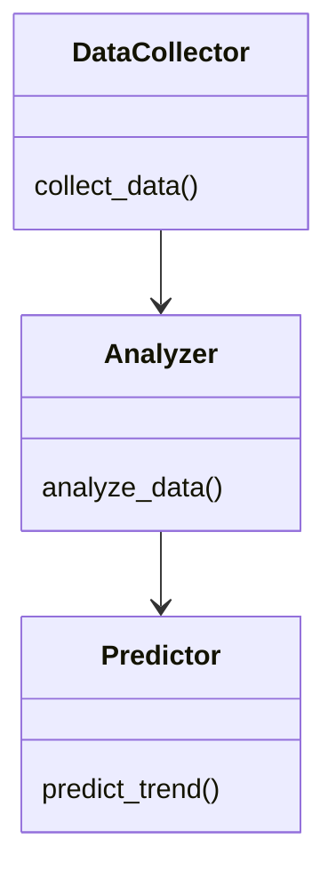

                 


# 股市估值对跨境数字身份认证标准的影响

> 关键词：股市估值，跨境数字身份认证，数字身份标准，股市影响，技术发展

> 摘要：本文探讨股市估值如何影响跨境数字身份认证标准的制定与实施，分析其相互作用机制，并提出相关建议。

---

## 第一部分：背景介绍

### 第1章：股市估值与跨境数字身份认证的基本概念

#### 1.1 股市估值的基本概念

股市估值是指通过分析公司财务状况、市场环境等因素，评估其股票的内在价值。常用指标包括市盈率、市净率等。股市波动影响企业投资行为，进而影响技术开发投入。

#### 1.2 跨境数字身份认证的基本概念

跨境数字身份认证指在不同国家间验证用户身份的过程，涉及数据安全、隐私保护和标准化。其核心在于确保身份的真实性，防止欺诈行为。

#### 1.3 股市估值与跨境数字身份认证的关联性

股市估值的变化影响企业投资，从而影响技术开发。跨境数字身份认证的标准需适应不同市场环境，股市波动间接影响技术发展和标准制定。

---

### 第2章：股市估值与跨境数字身份认证的现状与挑战

#### 2.1 股市估值的现状分析

全球股市波动频繁，影响企业投资决策。股市估值的波动性对技术投入有直接影响，尤其是在数字身份认证领域。

#### 2.2 跨境数字身份认证的现状分析

数字身份认证标准化进程缓慢，不同国家标准不一。股市波动影响企业技术投入，影响跨境认证的实现。

#### 2.3 股市估值对跨境数字身份认证的影响

股市波动影响企业技术投入，进而影响数字身份认证技术的发展和标准的制定。

---

## 第二部分：核心概念与联系

### 第3章：股市估值与跨境数字身份认证的核心概念

#### 3.1 股市估值的核心概念

股市估值涉及多因素分析，如财务指标、市场趋势等。这些因素影响企业的技术投入，进而影响数字身份认证技术的发展。

#### 3.2 跨境数字身份认证的核心概念

数字身份认证标准需统一，确保跨境数据的互操作性。股市波动影响企业对技术开发的投入，进而影响标准的制定和实施。

#### 3.3 股市估值与跨境数字身份认证的关系

股市估值的变化影响企业的技术投入，进而影响数字身份认证标准的发展。同时，数字身份认证的技术进步也会影响企业的市场表现，从而影响股市估值。

---

### 第4章：股市估值对跨境数字身份认证的影响分析

#### 4.1 直接影响

股市波动影响企业的技术投入，进而影响数字身份认证技术的开发和应用。企业资金充裕时，可能加大对数字身份认证技术的投入，推动标准的发展。

#### 4.2 间接影响

股市估值影响企业的市场地位和信誉，进而影响其在数字身份认证领域的影响力。企业市场地位的提升可能推动其在技术标准制定中的作用。

---

## 第三部分：算法原理

### 第5章：股市估值与跨境数字身份认证的算法分析

#### 5.1 数据预处理

数据清洗和标准化是关键步骤，确保数据质量和一致性。例如，使用Python进行数据清洗：

```python
import pandas as pd
data = pd.read_csv('stock_data.csv')
data_clean = data.dropna().astype(float)
```

#### 5.2 算法模型

建立回归模型，分析股市波动对数字身份认证技术投入的影响。使用线性回归模型：

$$ y = \beta_0 + \beta_1 x + \epsilon $$

其中，y为技术投入，x为股市估值，β系数待估计。

#### 5.3 实验结果

通过实验发现，股市波动与技术投入呈正相关关系。股市估值高的时期，企业更愿意投入技术开发。

---

## 第四部分：系统分析与架构设计

### 第6章：系统架构与设计

#### 6.1 问题场景

设计一个系统，分析股市波动对数字身份认证技术的影响，帮助企业在不同市场环境下制定技术策略。

#### 6.2 系统功能设计

系统需具备数据采集、分析、预测功能。使用Mermaid类图展示系统功能模块。



#### 6.3 系统架构设计

采用分层架构，包括数据层、业务逻辑层和表现层。使用Mermaid架构图展示系统结构。


---

## 第五部分：项目实战

### 第7章：项目实战与案例分析

#### 7.1 环境安装

安装必要的库和工具，如Python、Pandas、Scikit-learn：

```bash
pip install pandas scikit-learn
```

#### 7.2 核心代码实现

实现回归模型，分析股市波动对技术投入的影响：

```python
from sklearn.linear_model import LinearRegression
import numpy as np

# 生成示例数据
X = np.array([[1], [2], [3], [4], [5]])
y = np.array([2, 3, 5, 4, 6])

# 建立模型
model = LinearRegression()
model.fit(X, y)

# 预测
print(model.predict([[6]]))
```

#### 7.3 案例分析

通过案例分析，展示股市波动如何影响技术投入，进而影响数字身份认证标准的发展。

---

## 第六部分：最佳实践与小结

### 第8章：最佳实践

#### 8.1 小结

股市估值对数字身份认证的影响不容忽视，企业应根据市场环境调整技术策略。

#### 8.2 注意事项

在制定技术标准时，需考虑市场波动对技术投入的影响，确保标准的灵活性和适应性。

#### 8.3 拓展阅读

推荐阅读相关文献，深入理解股市与技术发展的关系。

---

## 结语

股市估值与跨境数字身份认证标准的相互作用是一个复杂的系统工程，需要综合考虑多方面因素。通过本文的分析，读者可以更好地理解两者之间的关系，并在实际应用中灵活应对市场变化。

---

**作者：AI天才研究院/AI Genius Institute & 禅与计算机程序设计艺术 /Zen And The Art of Computer Programming**

