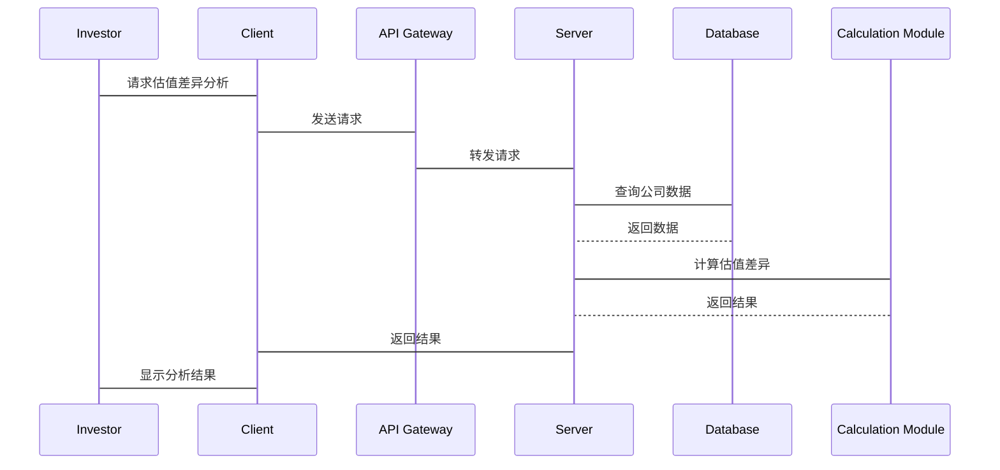

                 


# 股市估值差异对国际分工格局的影响

> 关键词：股市估值差异、国际分工、宏观经济、资本流动、投资策略

> 摘要：股市估值差异是指不同国家或地区股市中股票估值的差异，这种差异对国际分工格局有着深远的影响。本文将从股市估值差异的背景、核心概念、算法原理、系统分析、项目实战、最佳实践等多个方面进行详细分析，探讨其对国际分工格局的具体影响。

---

## 第一部分：股市估值差异的背景与概念

### 第1章：股市估值差异的背景介绍

#### 1.1 全球经济一体化与股市估值差异的形成

- **经济全球化的基本概念**
  - 经济全球化是指全球范围内的商品、服务、资本、技术等资源的自由流动和配置。
  - 股市作为经济全球化的重要组成部分，是跨国资本流动的主要渠道。

- **跨国资本流动的现状**
  - 跨国公司通过股市融资，实现全球范围内的资源优化配置。
  - 股市估值差异是跨国资本流动的重要驱动因素。

- **股市估值差异的定义与内涵**
  - 股市估值差异是指不同国家或地区股市中股票的估值水平差异。
  - 这种差异反映了市场对资产的风险定价和收益预期的不同。

#### 1.2 国际分工格局的历史演变

- **传统国际分工体系的特征**
  - 以比较优势为基础，主要表现为制造业分工。
  - 例如，发达国家专注于高科技产业，发展中国家专注于劳动密集型产业。

- **现代国际分工格局的转变**
  - 从垂直分工向水平分工转变，跨国公司主导全球产业链分工。
  - 股市估值差异对跨国公司布局的影响日益显著。

- **股市估值差异与国际分工的互动关系**
  - 股市估值差异影响跨国资本流动，进而影响国际分工格局。
  - 国际分工格局的变化反过来又会影响股市估值差异的形成。

### 第2章：股市估值差异的核心概念与联系

#### 2.1 股市估值差异的影响因素

- **经济基本面因素**
  - 国内生产总值（GDP）增长率、通货膨胀率、利率水平等宏观经济指标。
  - 行业景气度、企业盈利能力等微观经济因素。

- **市场情绪与投资者行为**
  - 投资者情绪波动、市场流动性、市场参与度等。
  - 市场情绪通过影响股票价格进而影响估值差异。

- **宏观经济政策的影响**
  - 货币政策、财政政策、贸易政策等对股市估值的影响。
  - 例如，降息政策通常会降低企业的融资成本，进而影响股市估值。

#### 2.2 股市估值差异的计算与衡量

- **常用估值指标**
  - 市盈率（P/E）：股价与每股收益的比率。
  - 市净率（P/B）：股价与每股净资产的比率。
  - 市销率（P/S）：股价与每股营业收入的比率。

- **估值差异的计算方法**
  - 比较不同国家或地区的同一行业上市公司的估值指标差异。
  - 例如，计算A股与美股的市盈率差异。

- **股市估值差异与国际分工的关系**
  - 股市估值差异反映了不同国家或地区的风险偏好和经济发展水平。
  - 高估值市场通常对应高风险溢价，低估值市场对应低风险溢价。

#### 2.3 股市估值差异的实体关系图


---

## 第二部分：股市估值差异的算法原理

### 第3章：股市估值差异的数学模型与公式

#### 3.1 常用估值指标的数学表达

- **市盈率（P/E）公式**
  $$市盈率 = \frac{每股价格}{每股收益}$$

- **市净率（P/B）公式**
  $$市净率 = \frac{每股价格}{每股净资产}$$

- **市销率（P/S）公式**
  $$市销率 = \frac{每股价格}{每股营业收入}$$

#### 3.2 估值差异的算法步骤

- **步骤1：选择样本公司**
  - 从不同国家或地区的同一行业中选择样本公司。
  - 例如，选择中国、美国的科技公司作为样本。

- **步骤2：计算各样本公司的估值指标**
  - 计算各样本公司的市盈率、市净率等指标。

- **步骤3：比较估值指标的差异**
  - 分析不同国家或地区之间估值指标的差异。

- **步骤4：分析差异的原因**
  - 结合宏观经济、行业特点等因素分析估值差异的原因。

#### 3.3 估值差异的算法实现

```python
import pandas as pd
import numpy as np

def calculate_valuation_ratios(price, eps, bvps, revenue_per_share):
    pe = price / eps
    pb = price / bvps
    ps = price / revenue_per_share
    return pe, pb, ps

# 示例数据
price = [100, 200, 150]
eps = [10, 20, 15]
bvps = [50, 100, 75]
revenue_per_share = [50, 100, 75]

pe, pb, ps = calculate_valuation_ratios(price, eps, bvps, revenue_per_share)
print("市盈率:", pe)
print("市净率:", pb)
print("市销率:", ps)
```

---

## 第三部分：股市估值差异的系统分析与架构设计

### 第4章：系统分析与架构设计方案

#### 4.1 问题场景介绍

- **问题描述**
  - 如何量化股市估值差异对国际分工格局的影响。
  - 如何利用算法模型预测估值差异的变化趋势。

- **项目介绍**
  - 开发一个基于股市估值差异的国际分工分析系统。
  - 系统功能包括数据采集、估值计算、差异分析、结果可视化等。

#### 4.2 系统功能设计

- **领域模型**
  ```mermaid
  classDiagram
      class Company {
          id: int
          name: string
          stock_price: float
          eps: float
          bvps: float
          revenue_per_share: float
      }
      class Market {
          id: int
          name: string
          country: string
          exchange: string
      }
      class Investor {
          id: int
          name: string
          investment: float
          valuation_ratio: float
      }
      Company --> Market
      Market --> Investor
  ```

- **系统架构设计**
  ```mermaid
  architecture
      Client
      Server
      Database
      API Gateway
  ```

- **系统接口设计**
  - 数据接口：从数据库获取公司基本面数据。
  - 计算接口：调用估值差异计算模块。
  - 可视化接口：展示估值差异分析结果。

#### 4.3 系统交互流程图



---

## 第四部分：股市估值差异的项目实战

### 第5章：项目实战

#### 5.1 环境安装

- **安装Python环境**
  - 使用Anaconda安装Python 3.8及以上版本。
- **安装依赖库**
  ```bash
  pip install pandas numpy matplotlib
  ```

#### 5.2 系统核心实现

```python
import pandas as pd
import matplotlib.pyplot as plt

# 示例数据
data = {
    '国家': ['中国', '美国', '日本'],
    '市盈率': [15, 20, 18],
    '市净率': [3, 4, 2.5],
    '市销率': [2, 2.5, 1.8]
}

df = pd.DataFrame(data)
print(df)

# 可视化分析
plt.figure(figsize=(10, 6))
df.plot(kind='bar', stacked=True)
plt.title('不同国家的估值指标对比')
plt.xlabel('国家')
plt.ylabel('估值指标')
plt.show()
```

#### 5.3 代码应用解读与分析

- **代码功能**
  - 数据加载：从字典加载国家和估值指标数据。
  - 数据分析：计算并展示不同国家的估值指标对比。
  - 图表可视化：使用Matplotlib绘制柱状图，直观展示估值差异。

#### 5.4 实际案例分析

- **案例背景**
  - 比较中国、美国和日本的股市估值差异。
  - 例如，分析科技行业的市盈率差异。

- **分析结果**
  - 美国科技公司的市盈率普遍高于中国和日本，反映了高风险溢价。
  - 中国科技公司的市盈率相对较低，可能反映了市场对风险的较低预期。

#### 5.5 项目小结

- **项目成果**
  - 开发了一个基于Python的股市估值差异分析系统。
  - 实现了数据采集、计算、可视化等功能。

- **经验总结**
  - 数据质量对分析结果的影响至关重要。
  - 算法选择需要结合具体业务需求。

---

## 第五部分：股市估值差异的最佳实践

### 第6章：最佳实践

#### 6.1 小结

- 股市估值差异是影响国际分工格局的重要因素。
- 通过算法模型和系统分析，可以更好地理解和预测估值差异的变化。

#### 6.2 注意事项

- 数据来源的可靠性：确保数据准确无误。
- 模型的适用性：根据具体情况调整模型参数。
- 风险管理：避免因估值差异预测失误导致的损失。

#### 6.3 拓展阅读

- 建议阅读相关文献：
  - 约翰·奈什的《博弈论与经济行为》。
  - 《国际经济学》中的相关章节。

---

## 作者：AI天才研究院 & 禅与计算机程序设计艺术

---

以上是《股市估值差异对国际分工格局的影响》的技术博客文章的详细目录和内容概览。如需进一步调整或补充，请随时告知。

