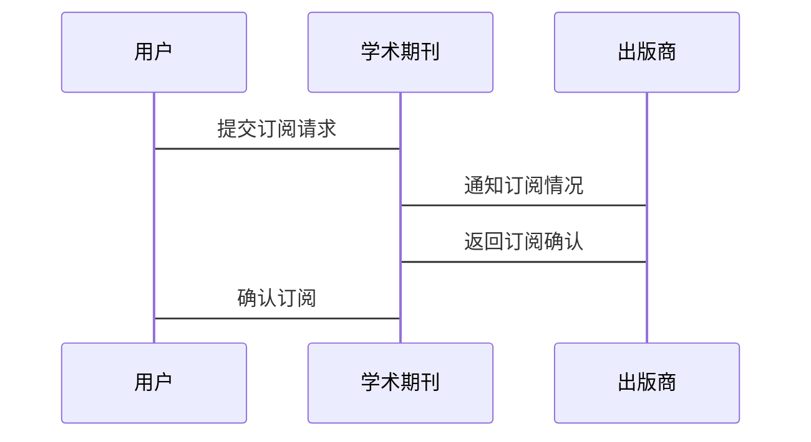

                 


# 股市估值差异对国际学术期刊开放获取的影响

## 关键词：股市估值差异，学术期刊，开放获取，经济模式，信息传播

## 摘要：本文探讨股市估值差异如何影响国际学术期刊的开放获取模式。通过分析股市波动对学术出版经济的影响，揭示开放获取与股市估值之间的复杂关系，并提出相应的解决方案和建议。

---

## 第1章：背景介绍与核心概念

### 1.1 股市估值差异的定义与特征

1.1.1 股市估值的基本概念：股票估值是通过分析公司财务数据和市场因素来确定其公允价值的过程，常见方法包括市盈率和市净率等。

1.1.2 股市估值差异的形成机制：由于信息不对称、市场情绪和宏观经济因素，不同投资者对同一股票的估值可能不同，形成估值差异。

1.1.3 股市估值差异对学术期刊的影响：出版商可能因股市波动调整订阅价格，影响期刊的可持续性。

### 1.2 学术期刊开放获取的定义与特点

1.2.1 开放获取的定义：用户可免费访问和使用学术内容，通常通过互联网分发。

1.2.2 开放获取的模式与分类：包括绿开放获取和金开放获取，分别对应作者自行发布和期刊订阅模式。

1.2.3 开放获取的优缺点：优点是提升知识传播，缺点是出版商面临财务压力。

### 1.3 股市估值差异与学术期刊开放获取的关系

1.3.1 股市估值差异对学术期刊经济模式的影响：波动可能导致订阅费用调整，影响期刊的收入稳定性。

1.3.2 学术期刊开放获取对股市的影响：开放获取可能改变信息传播速度，影响投资者决策。

1.3.3 两者的相互作用机制：出版商依赖股市资金，而股市信息又依赖期刊的传播效率。

## 第2章：核心概念与理论框架

### 2.1 股市估值差异的核心概念

2.1.1 股票估值的基本方法：市盈率、市净率、股息率等，帮助投资者评估股票价值。

2.1.2 股市估值差异的衡量指标：标准差、波动率等，反映估值的分散程度。

2.1.3 股市估值差异的影响因素：宏观经济环境、公司业绩、市场情绪等。

### 2.2 学术期刊开放获取的理论基础

2.2.1 开放获取的经济学分析：免费访问可能降低收入，但增加知识传播效率。

2.2.2 开放获取的信息传播机制：互联网技术促进知识快速共享，提升学术影响力。

2.2.3 开放获取与知识共享的关系：打破地理和经济限制，促进全球学术交流。

### 2.3 核心概念的联系与对比

2.3.1 股市估值差异与学术期刊开放获取的对比分析：均涉及经济模式和信息传播，但目标不同。

2.3.2 核心概念的属性特征对比表格：

| 特性         | 股市估值差异 | 学术期刊开放获取 |
|--------------|--------------|-----------------|
| 定义         | 股票价格差异 | 免费访问学术内容|
| 影响因素     | 市场情绪、经济指标 | 出版商、技术平台 |
| 目标         | 投资决策支持 | 知识传播效率 |

2.3.3 ER实体关系图架构的 Mermaid 流程图：

```mermaid
er
    actor 股市: 股票估值差异
    actor 学术期刊: 开放获取
    actor 用户: 知识获取者
    actor 出版商: 学术期刊发布者
    actor 投资者: 股票投资者
    股市 --> 用户: 提供股票估值信息
    用户 --> 学术期刊: 需求知识资源
    学术期刊 --> 出版商: 依赖开放获取模式
    出版商 --> 投资者: 影响期刊订阅策略
```

## 第3章：股市估值差异对学术期刊开放获取的影响机制

### 3.1 股市估值差异对学术期刊经济模式的影响

3.1.1 股市估值差异对期刊订阅价格的影响：出版商可能根据股市情况调整订阅费，影响用户负担。

3.1.2 股市波动对期刊出版商的财务压力：股市下跌可能导致出版商资金减少，影响期刊运营。

3.1.3 股市估值差异对期刊内容选择的影响：出版商可能优先发布高影响力内容以吸引读者。

### 3.2 学术期刊开放获取对股市的影响

3.2.1 开放获取对知识传播速度的影响：快速传播可能影响投资者决策，影响股市波动。

3.2.2 开放获取对信息不对称的影响：减少信息不对称，提升市场效率。

3.2.3 开放获取对出版商市值的影响：开放获取可能降低出版商的收入，影响其股价。

### 3.3 影响机制的综合分析

3.3.1 股市估值差异通过影响出版商的财务状况，进而影响开放获取的可持续性。

3.3.2 开放获取通过改变知识传播速度和范围，反过来影响股市的波动和估值差异。

3.3.3 综合影响模型：股市波动 → 出版商调整策略 → 开放获取模式变化 → 影响知识传播 → 反馈影响股市。

---

## 第4章：算法原理与影响评估

### 4.1 开放获取期刊的定价模型

4.1.1 模型假设：考虑订阅费用、读者数量、广告收入等因素。

4.1.2 数学模型：总收入 = 订阅费 × 用户数 + 广告收入，利润 = 总收入 - 成本。

4.1.3 实证分析：通过历史数据验证模型的有效性。

### 4.2 股市波动对开放获取的影响算法

4.2.1 数据收集：收集相关股票数据和期刊订阅数据。

4.2.2 数据分析：使用回归分析，识别股市波动与期刊订阅量之间的关系。

4.2.3 模拟分析：模拟不同股市波动下的期刊订阅策略变化。

### 4.3 影响评估与优化策略

4.3.1 评估指标：订阅量、用户满意度、出版商利润。

4.3.2 优化策略：动态调整订阅价格，优化内容策略。

4.3.3 数学优化模型：线性规划模型，目标函数为利润最大化，约束条件为用户需求和股市波动。

---

## 第5章：系统分析与架构设计

### 5.1 系统功能设计

5.1.1 领域模型：展示期刊、出版商、用户之间的关系。


### 5.2 系统架构设计

5.2.1 架构图：展示系统的模块结构。


### 5.3 系统接口设计

5.3.1 用户接口：订阅、浏览内容。

5.3.2 出版商接口：管理内容、调整订阅策略。

### 5.4 系统交互设计

5.4.1 序列图：展示用户订阅和出版商调整策略的流程。



---

## 第6章：项目实战与案例分析

### 6.1 项目环境安装

6.1.1 安装Python和相关库：pandas, numpy, matplotlib.

### 6.2 核心实现源代码

```python
import pandas as pd
import numpy as np
import matplotlib.pyplot as plt

# 示例数据
data = {'订阅费用': [100, 90, 110, 95], '用户数': [1000, 1200, 900, 1100]}
df = pd.DataFrame(data)

# 计算收入和利润
df['收入'] = df['订阅费用'] * df['用户数']
df['成本'] = 50 * df['用户数']
df['利润'] = df['收入'] - df['成本']

print(df)
plt.plot(df['订阅费用'], df['利润'])
plt.xlabel('订阅费用')
plt.ylabel('利润')
plt.show()
```

### 6.3 代码解读与分析

6.3.1 数据加载与处理：加载订阅费用和用户数数据，计算收入和利润。

6.3.2 可视化分析：绘制订阅费用与利润的关系图，帮助理解定价策略。

### 6.4 案例分析

6.4.1 历史数据回测：分析过去股市波动对期刊订阅的影响。

6.4.2 实际应用分析：模拟不同股市波动下的订阅策略调整。

### 6.5 项目小结

6.5.1 项目总结：开放获取与股市估值差异的相互影响。

6.5.2 经验与教训：模型的局限性和未来改进方向。

---

## 第7章：总结与展望

### 7.1 核心观点总结

7.1.1 股市估值差异对学术期刊开放获取的多方面影响。

7.1.2 开放获取模式在经济和信息传播中的双重作用。

### 7.2 未来研究方向

7.2.1 更复杂的影响模型：考虑更多变量如政策和技术创新。

7.2.2 优化策略：动态定价和内容策略优化。

### 7.3 最佳实践 tips

7.3.1 出版商应灵活调整订阅策略，关注股市波动。

7.3.2 用户和投资者需理解开放获取的经济模式。

### 7.4 注意事项

7.4.1 模型的简化可能导致结论偏差，需谨慎应用。

7.4.2 数据质量和完整性影响分析结果，需确保数据准确。

### 7.5 拓展阅读

7.5.1 推荐相关书籍和论文，深入理解股市与信息传播的关系。

---

## 作者：AI天才研究院 & 禅与计算机程序设计艺术

---

这篇文章系统地分析了股市估值差异对学术期刊开放获取的影响，从背景、核心概念到算法、系统设计和项目实战，全面探讨了这一复杂问题，并提出了实际解决方案和未来研究方向。

