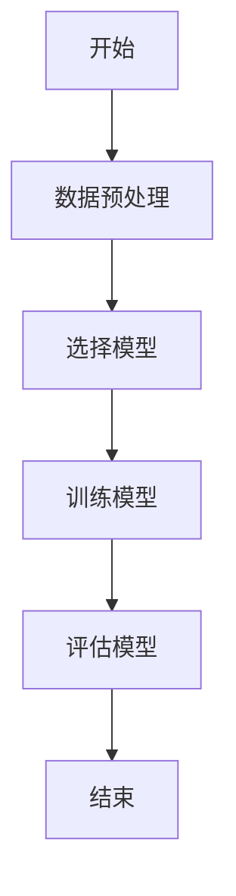
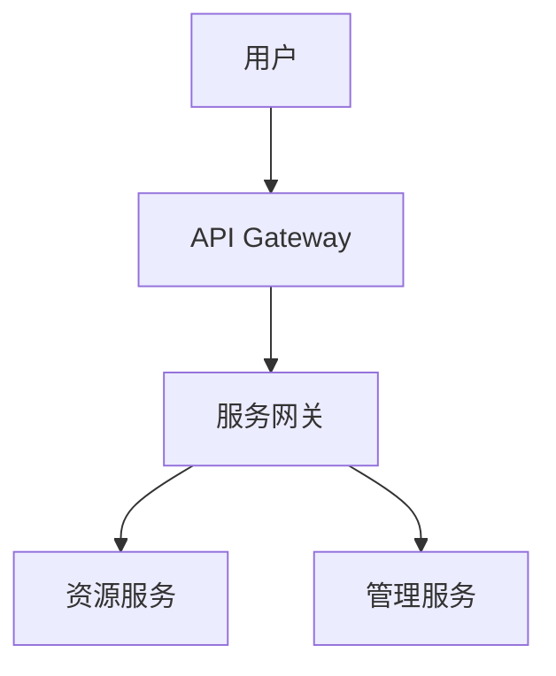

                 


```markdown
# 股市估值差异对国际教育资源共享平台的影响

> 关键词：股市估值、教育资源共享平台、经济模型、数据挖掘、系统架构

> 摘要：本文探讨了股市估值差异对国际教育资源共享平台的影响，从核心概念、算法原理、系统架构到项目实战，详细分析了估值差异如何影响教育资源的分配与平台运营，并提出了相应的解决方案。

---

## 第一部分: 背景介绍

### 第1章: 股市估值差异的背景与问题描述

#### 1.1 股市估值差异的定义与核心概念
- **1.1.1 股市估值的基本概念**  
  股市估值是指对股票内在价值的评估，通常通过市盈率、市净率等指标衡量。估值差异则是指不同市场或时间段内，同一股票的估值出现的差异。

- **1.1.2 估值差异的形成原因**  
  包括市场情绪、信息不对称、经济周期、政策变化等因素。

- **1.1.3 估值差异对市场的潜在影响**  
  估值差异可能导致资金流动、市场波动和投资行为的变化。

#### 1.2 国际教育资源共享平台的背景
- **1.2.1 教育资源共享平台的发展现状**  
  随着全球化的发展，教育资源共享平台逐渐兴起，旨在打破地域限制，实现资源的高效分配。

- **1.2.2 国际化视角下的教育资源共享**  
  通过技术手段，教育资源可以跨越国界，实现全球范围内的共享。

- **1.2.3 平台的核心功能与目标**  
  提供高质量教育资源，优化资源配置，降低教育成本。

#### 1.3 问题背景与问题描述
- **1.3.1 股市估值差异的现状分析**  
  不同市场间估值差异显著，影响投资者决策。

- **1.3.2 国际教育资源共享平台的挑战**  
  资源分配不均、平台经济压力、用户需求多样性。

- **1.3.3 问题解决思路**  
  通过分析估值差异对平台的影响，提出优化策略。

---

## 第二部分: 核心概念与联系

### 第2章: 核心概念的原理与联系

#### 2.1 核心概念的原理
- **2.1.1 股市估值差异的经济模型**  
  使用回归分析模型，量化估值差异的影响因素。

- **2.1.2 教育资源共享平台的运作机制**  
  平台通过技术手段实现资源的高效匹配。

#### 2.2 概念属性特征对比
| 概念       | 属性           | 特征         |
|------------|----------------|--------------|
| 股市估值差异 | 形成原因       | 市场情绪、信息不对称 |
| 教育资源共享 | 核心功能       | 资源匹配、优化分配 |

#### 2.3 ER实体关系图
```mermaid
er
  %%{init: 'auto'}%%
  title 实体关系图
  rectangle 股市估值差异 {
    <定义>
  }
  rectangle 教育资源共享平台 {
    <定义>
  }
  rectangle 用户 {
    <定义>
  }
  rectangle 资源 {
    <定义>
  }
  股市估值差异 --|> 教育资源共享平台 : 影响
  教育资源共享平台 --|> 用户 : 提供服务
  用户 --|> 资源 : 需求
```

---

## 第三部分: 算法原理讲解

### 第3章: 算法原理

#### 3.1 算法选择与原理
- **3.1.1 选择回归分析模型**  
  用于分析估值差异与教育资源共享的关系。

- **3.1.2 回归分析模型的数学公式**  
  $$ y = \beta_0 + \beta_1 x + \epsilon $$  
  其中，$y$ 表示教育资源共享的效率，$x$ 表示估值差异。

#### 3.2 算法实现步骤


#### 3.3 代码实现
```python
import pandas as pd
from sklearn.linear_model import LinearRegression

# 数据预处理
data = pd.read_csv('resources.csv')
X = data[['valuation_diff']]
y = data['sharing_efficiency']

# 训练模型
model = LinearRegression()
model.fit(X, y)

# 评估模型
print(model.score(X, y))
```

---

## 第四部分: 系统分析与架构设计方案

### 第4章: 系统架构设计

#### 4.1 问题场景介绍
- 股市估值差异影响平台资源分配，需设计高效的解决方案。

#### 4.2 项目介绍
- 开发一个智能化的教育资源共享平台，优化资源配置。

#### 4.3 系统功能设计
- **领域模型设计**  
  ```mermaid
  classDiagram
    class 用户 {
      用户ID, 姓名, 邮箱
    }
    class 资源 {
      资源ID, 类型, 描述
    }
    class 平台 {
      管理资源, 分配资源
    }
    用户 --> 平台 : 请求资源
    平台 --> 资源 : 提供资源
  ```

#### 4.4 系统架构设计


#### 4.5 接口设计与交互
- **API接口**  
  ```http
  GET /api/resources?valuation_diff=0.2
  ```

---

## 第五部分: 项目实战

### 第5章: 项目实战

#### 5.1 环境安装
- 安装Python、Pandas、Scikit-learn等工具。

#### 5.2 核心代码实现
```python
import pandas as pd
from sklearn.linear_model import LinearRegression

# 数据预处理
data = pd.read_csv('resources.csv')
X = data[['valuation_diff']]
y = data['sharing_efficiency']

# 训练模型
model = LinearRegression()
model.fit(X, y)

# 预测与评估
predictions = model.predict(X)
print("预测结果:", predictions)
print("评分:", model.score(X, y))
```

#### 5.3 案例分析
- 分析某平台在估值差异下的资源分配效率，展示模型的应用效果。

---

## 第六部分: 总结与展望

### 第6章: 总结与展望

#### 6.1 总结
- 股市估值差异对教育资源共享平台的影响显著，需通过技术手段优化资源配置。

#### 6.2 展望
- 进一步研究动态估值模型，提升平台智能化水平。

---

## 第七部分: 最佳实践

### 7.1 小结
- 通过技术手段优化教育资源共享，解决估值差异带来的问题。

### 7.2 注意事项
- 数据隐私保护、模型的实时性优化。

### 7.3 拓展阅读
- 推荐阅读《数据挖掘与机器学习实战》、《系统架构设计指南》。

---

## 作者

作者：AI天才研究院/AI Genius Institute & 禅与计算机程序设计艺术/Zen And The Art of Computer Programming
```

