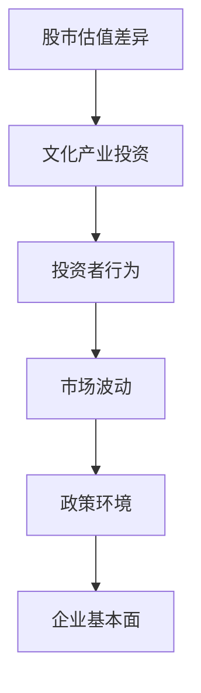
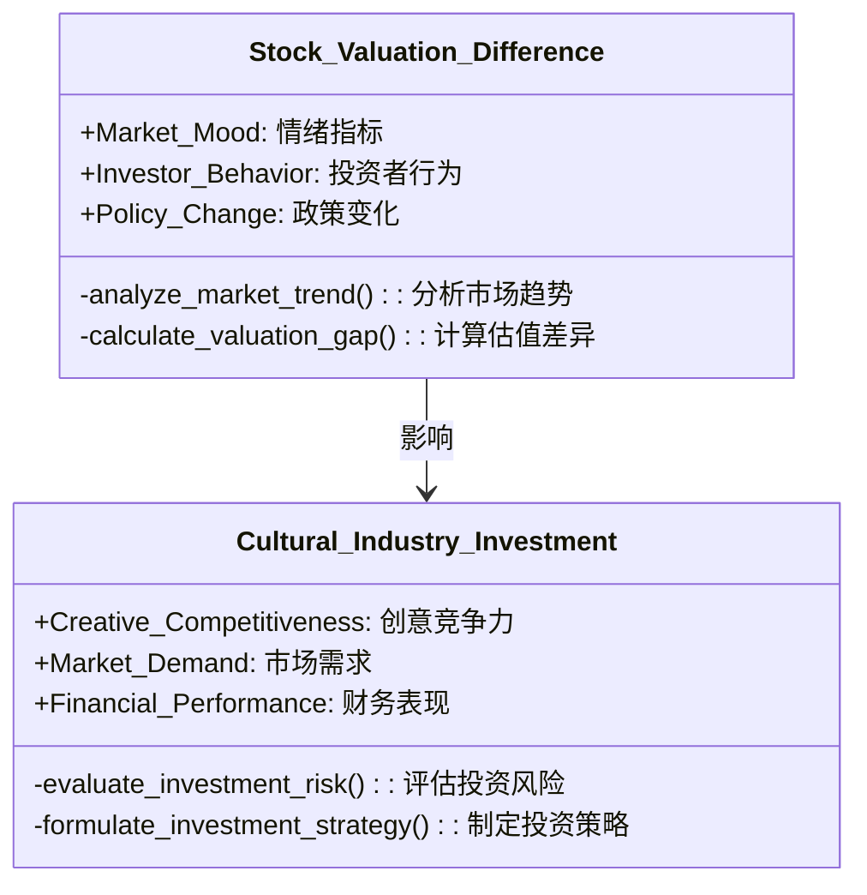
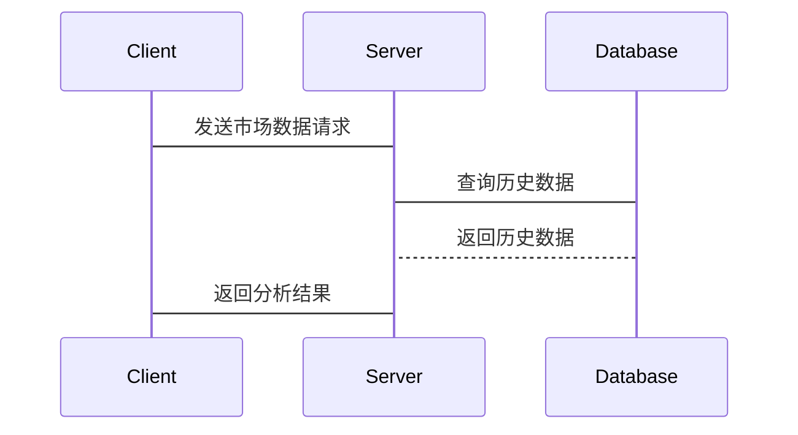

                 


# 股市估值差异对国际文化产业投资的影响

## 关键词：股市估值差异、文化产业投资、投资者行为、市场波动、文化产业策略

## 摘要：  
股市估值差异对国际文化产业投资的影响是一个复杂的金融与文化产业交叉领域的问题。本文将从股市估值的基本原理出发，分析文化产业的特殊性，探讨股市波动如何影响文化产业投资决策，以及投资者如何在不同市场环境下优化投资策略。通过实际案例分析和系统性框架设计，本文为投资者和研究者提供了深入的分析和实用的建议。

---

# 第一部分: 背景介绍与核心概念

## 第1章: 股市估值差异与文化产业投资概述

### 1.1 股市估值差异的定义与背景

#### 1.1.1 股市估值的基本概念  
股市估值是通过市盈率（P/E）、市净率（P/B）等指标，衡量一家公司的股票价格与实际价值之间的关系。这些指标反映了市场对公司的盈利能力、资产质量和成长潜力的预期。

#### 1.1.2 文化产业的定义与特点  
文化产业包括电影、音乐、游戏、艺术等多个领域。其特点是高创意性、高风险性和高波动性。文化企业的价值往往依赖于创意的成功和市场的接受度，这使得其估值更具不确定性。

#### 1.1.3 股市估值差异对文化产业投资的影响背景  
股市估值差异是指同一行业或不同市场中，公司股票估值的差异。这种差异在文化产业中尤为显著，因为文化企业受市场情绪、消费者偏好和政策环境的影响较大。

### 1.2 核心问题描述

#### 1.2.1 股市估值差异的形成机制  
股市估值差异由多种因素引起，包括市场流动性、投资者情绪、行业竞争格局和政策变化等。这些因素在文化产业中表现得尤为突出，因为文化产品的需求弹性较大。

#### 1.2.2 文化产业投资的特殊性  
文化产业投资的风险较高，回报周期较长。文化企业的成功往往依赖于创意的成功和市场的接受度，这使得其估值更具波动性。

#### 1.2.3 问题解决的路径与方法  
通过分析股市估值差异对文化产业投资的影响机制，提出优化投资策略的方法，包括分散投资、风险控制和长期视角等。

### 1.3 问题的边界与外延

#### 1.3.1 股市估值差异的边界条件  
股市估值差异的分析应考虑市场环境、政策环境和企业自身条件等因素。例如，政策变化可能对文化产业的投资产生重大影响。

#### 1.3.2 文化产业投资的范围界定  
文化产业投资的范围包括电影、音乐、游戏等创意产业，以及相关的文化和科技融合企业。不同领域的投资策略可能有所不同。

#### 1.3.3 相关概念的对比分析  
将股市估值差异与文化产业投资进行对比，分析它们之间的相互作用。例如，股市波动可能影响文化产业的投资决策，而文化产业的发展又可能反过来影响股市估值。

### 1.4 核心概念结构与要素

#### 1.4.1 股市估值差异的核心要素  
- 市场流动性  
- 投资者情绪  
- 企业基本面  

#### 1.4.2 文化产业投资的构成要素  
- 文化创意能力  
- 市场需求  
- 政策环境  

#### 1.4.3 两者之间的关系结构图  


---

## 第2章: 核心概念与联系

### 2.1 股市估值差异的原理

#### 2.1.1 股市估值的基本原理  
股市估值是市场对企业的综合评估，包括盈利能力、资产质量和成长潜力。市盈率（P/E）=股价 / 每股净利润，市净率（P/B）=股价 / 每股净资产。

#### 2.1.2 估值差异的形成机制  
市场参与者对信息的解读和反应不同，导致估值差异。例如，乐观的投资者可能高估一家文化企业的价值，而悲观的投资者则可能低估其价值。

#### 2.1.3 估值差异的影响因素  
- 市场情绪  
- 行业竞争  
- 宏观经济环境  

### 2.2 文化产业投资的核心要素

#### 2.2.1 文化产业的市场特征  
- 高波动性：文化产品的需求受消费者偏好影响较大。  
- 高创意性：文化企业的核心竞争力依赖于创意和创新。  

#### 2.2.2 投资者行为分析  
投资者在文化产业中的行为受市场情绪和风险偏好影响。例如，在市场繁荣时期，投资者可能更愿意冒险投资于高风险的文化企业。

#### 2.2.3 产业政策的影响  
政府政策对文化产业的支持力度直接影响投资环境。例如，税收优惠和补贴政策可以吸引更多的投资者进入文化产业。

### 2.3 核心概念对比分析

#### 2.3.1 股市估值差异与文化产业投资的对比表格  
| 要素               | 股市估值差异                | 文化产业投资               |
|--------------------|-----------------------------|-----------------------------|
| 核心影响因素       | 市场情绪、企业基本面        | 创意能力、市场需求         |
| 风险特征           | 高波动性                   | 高风险性                   |
| 投资策略           | 分散投资、风险控制         | 创意评估、长期视角         |

#### 2.3.2 ER实体关系图的 Mermaid 流程图  
```mermaid
erd
    Customer
    Investor
    Cultural_Enterprise
    Market_Mood
    Government_Policy

    Investor --> Customer: 投资驱动
    Cultural_Enterprise --> Market_Mood: 受市场情绪影响
    Government_Policy --> Cultural_Enterprise: 政策支持
```

---

## 第3章: 股市估值差异与文化产业投资的相互作用

### 3.1 股市波动对文化产业投资的影响机制

#### 3.1.1 市场情绪与投资决策  
市场情绪会影响投资者的风险偏好。例如，在市场乐观时，投资者更愿意投资于高风险的文化企业。

#### 3.1.2 估值差异与投资行为  
估值差异可能导致投资者在不同市场阶段调整投资策略。例如，在市场低估时，投资者可能增加对文化企业的投资。

### 3.2 文化企业自身经营策略对股市估值的影响

#### 3.2.1 创意能力与企业价值  
文化企业的创意能力直接影响其市场表现和估值。例如，一部成功的电影可能提升一家制片公司的估值。

#### 3.2.2 营销策略与市场需求  
有效的营销策略可以提升文化产品的市场需求，从而影响企业的估值。

---

## 第4章: 案例分析与投资策略

### 4.1 案例分析

#### 4.1.1 电影公司的融资情况  
以某电影公司为例，分析其在股市波动中的融资策略和估值变化。例如，票房表现与股价的正相关关系。

#### 4.1.2 音乐流媒体平台的上市表现  
分析某音乐流媒体平台的上市表现，探讨其估值变化与市场环境的关系。

### 4.2 投资策略

#### 4.2.1 制定投资计划  
根据市场环境和企业基本面，制定灵活的投资计划。例如，在市场低估时增加投资，市场高估时减少投资。

#### 4.2.2 风险管理  
使用对冲策略和分散投资来降低风险。例如，投资于不同领域的文化企业，以分散市场波动带来的风险。

#### 4.2.3 长期投资策略  
关注文化企业的长期发展潜力，而非短期市场波动。例如，投资于具有强大创意能力和市场影响力的公司。

---

## 第5章: 系统分析与架构设计方案

### 5.1 问题场景介绍

#### 5.1.1 项目介绍  
分析股市估值差异对文化产业投资的影响，构建分析框架，提出优化策略。

### 5.2 系统功能设计

#### 5.2.1 领域模型 Mermaid 类图  


### 5.3 系统架构设计

#### 5.3.1 系统架构 Mermaid 图  


### 5.4 系统接口设计

#### 5.4.1 核心接口  
- `analyze_market_trend()`: 分析市场趋势  
- `calculate_valuation_gap()`: 计算估值差异  

### 5.5 系统交互设计

#### 5.5.1 系统交互 Mermaid 序列图  


---

## 第6章: 项目实战

### 6.1 环境安装

#### 6.1.1 工具安装  
安装Python、Pandas、Matplotlib等工具，用于数据分析和可视化。

### 6.2 系统核心实现源代码

#### 6.2.1 数据分析代码  
```python
import pandas as pd
import matplotlib.pyplot as plt

# 加载数据
data = pd.read_csv('market_data.csv')

# 计算估值差异
data['valuation_gap'] = data['price'] - data['value']

# 可视化
plt.figure(figsize=(10, 6))
plt.plot(data['date'], data['valuation_gap'])
plt.title('Valuation Gap Over Time')
plt.xlabel('Date')
plt.ylabel('Valuation Gap')
plt.show()
```

### 6.3 代码应用解读与分析

#### 6.3.1 数据分析结果解读  
通过代码分析，我们可以看到股市估值差异在不同时间点的变化趋势，帮助投资者制定投资策略。

### 6.4 实际案例分析

#### 6.4.1 案例分析  
以某文化企业为例，分析其在股市波动中的表现，验证理论模型的有效性。

### 6.5 项目小结

#### 6.5.1 项目总结  
通过项目实战，我们验证了理论模型的有效性，并提出了优化投资策略的建议。

---

## 第7章: 结论与展望

### 7.1 研究结论

#### 7.1.1 主要结论  
股市估值差异显著影响文化产业投资，投资者应根据市场环境和企业基本面调整投资策略。

### 7.2 未来研究方向

#### 7.2.1 进一步研究  
未来可以研究更多影响文化产业投资的因素，如技术进步和全球化的深入发展。

### 7.3 对投资人的建议

#### 7.3.1 投资建议  
投资者应关注市场情绪、企业基本面和政策环境，制定灵活的投资策略，降低投资风险。

---

## 参考文献

（此处列出相关文献和参考资料）

---

## 作者：AI天才研究院/AI Genius Institute & 禅与计算机程序设计艺术 /Zen And The Art of Computer Programming

---

**说明：** 以上是《股市估值差异对国际文化产业投资的影响》的完整目录和部分内容示例。文章详细探讨了股市估值差异与文化产业投资的关系，结合实际案例和系统分析，为投资者和研究者提供了深入的分析和实用的建议。

