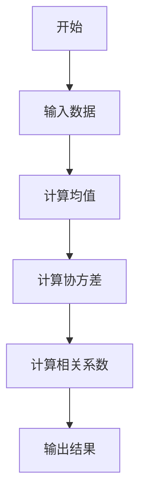
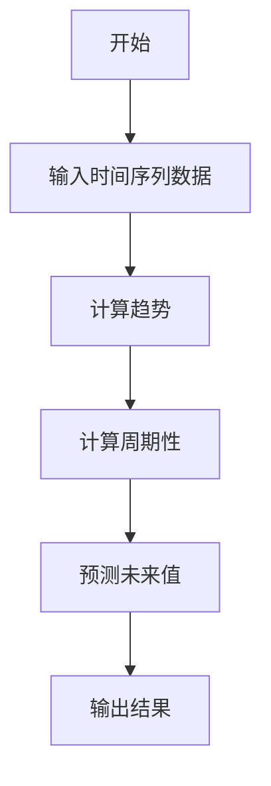
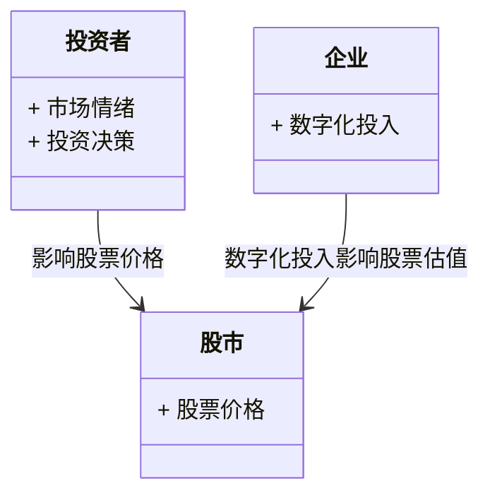
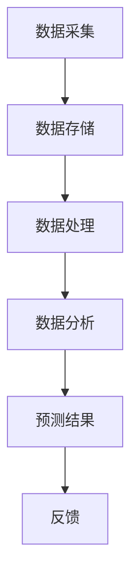
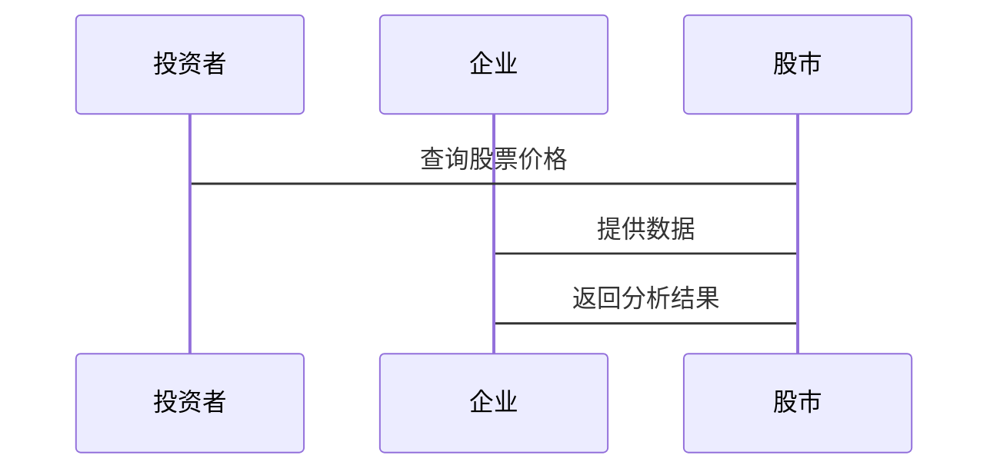

                 


# 股市估值差异对国际文化产业数字化的影响

> 关键词：股市估值差异、文化产业数字化、协方差、相关系数、时间序列分析、回归分析、系统架构设计

> 摘要：本文探讨股市估值差异对国际文化产业数字化的影响，从背景、核心概念、算法原理、系统架构到项目实战，逐步分析问题，提出解决方案，并通过案例验证理论。文章最后总结最佳实践，为读者提供深入的见解和实际指导。

---

## 第一部分：背景介绍

### 第1章：股市估值差异与文化产业数字化的背景

#### 1.1 问题背景

- **股市估值差异的定义与特征**  
  股市估值差异是指同一股票在不同市场或同一市场不同时间点的估值差异。这种差异通常由市场情绪、信息不对称、交易成本等因素引起。

- **文化产业数字化的定义与现状**  
  文化产业数字化是指通过数字技术（如大数据、人工智能、区块链等）对文化内容进行创作、传播和管理的过程。当前，数字化正在改变文化产业的生产方式和商业模式。

- **股市估值差异对文化产业数字化的潜在影响**  
  股市估值差异可能影响文化产业的融资能力，进而影响其数字化进程。例如，高估值可能导致企业过度依赖资本市场，而低估值可能限制其技术创新投入。

#### 1.2 问题描述

- **股市估值差异的具体表现形式**  
  包括同股同权不同价、同一股票在不同市场的价格差异等。

- **文化产业数字化的核心要素**  
  包括文化内容的数字化生产、传播渠道的数字化、用户行为的数字化分析等。

- **问题的边界与外延**  
  本文关注的是股市估值差异如何通过影响文化产业的融资能力，进而影响其数字化进程。

#### 1.3 问题解决

- **股市估值差异对文化产业数字化的影响路径**  
  估值差异可能通过影响企业的资金流动性，进而影响其数字化投入。

- **数字化对文化产业估值差异的调节作用**  
  数字化可以提高文化产业的透明度，从而减少估值差异。

- **解决问题的初步思路与方法**  
  通过分析股市估值差异与文化产业数字化之间的关系，提出优化建议。

#### 1.4 核心概念与要素

- **股市估值差异的核心要素**  
  包括市场情绪、信息不对称、交易成本等。

- **文化产业数字化的核心要素**  
  包括技术应用、商业模式创新、用户参与度等。

- **两者之间的关联性与互动机制**  
  股市估值差异可能通过影响企业的资金流动性，进而影响其数字化投入；而数字化则可能通过提高透明度，减少估值差异。

---

## 第二部分：核心概念与联系

### 第2章：股市估值差异与文化产业数字化的关系

#### 2.1 核心概念原理

- **股市估值差异的形成机制**  
  市场情绪波动、信息不对称等因素导致同一股票在不同市场的估值差异。

- **文化产业数字化的实现路径**  
  通过数字技术提升文化内容的创作、传播和管理效率。

- **两者之间的相互作用**  
  股市估值差异可能影响文化产业的融资能力，进而影响其数字化进程。

#### 2.2 核心概念对比分析

| 核心概念 | 定义 | 影响因素 | 目标 |
|----------|------|----------|------|
| 股市估值差异 | 股票价格的差异 | 市场情绪、信息不对称 | 优化资源配置 |
| 文化产业数字化 | 数字技术应用 | 技术创新、政策支持 | 提高效率 |

#### 2.3 实体关系图

```mermaid
erDiagram
    actor 投资者 {
        <属性> 市场情绪
    }
    actor 企业 {
        <属性> 数字化投入
    }
    actor 股市 {
        <属性> 股票价格
    }
    企业 --> 股市 : 受市场情绪影响
    企业 --> 投资者 : 数字化投入影响股票估值
```

---

## 第三部分：算法原理讲解

### 第3章：相关算法与数学模型

#### 3.1 算法原理

- **协方差与相关系数的计算**  
  协方差衡量两个变量的线性相关性，相关系数是标准化后的协方差，取值范围在[-1,1]。

- **时间序列分析的基本原理**  
  通过分析股票价格的时间序列数据，识别趋势和周期性。

- **回归分析在估值差异中的应用**  
  通过回归模型，分析影响股票估值差异的主要因素。

#### 3.2 算法流程图

协方差与相关系数计算流程：



时间序列分析流程：



#### 3.3 算法代码实现

协方差和相关系数的Python代码：

```python
import numpy as np

# 示例数据
x = np.array([1, 2, 3, 4, 5])
y = np.array([2, 4, 6, 8, 10])

# 计算均值
mean_x = np.mean(x)
mean_y = np.mean(y)

# 计算协方差
covariance = np.cov(x, y)[0, 1]

# 计算相关系数
correlation = np.corrcoef(x, y)

print(f"协方差: {covariance}")
print(f"相关系数: {correlation}")
```

---

## 第四部分：系统分析与架构设计

### 第4章：系统分析与架构设计

#### 4.1 问题场景介绍

- **问题场景**  
  企业希望通过数字化转型减少股市估值差异的影响。

#### 4.2 系统功能设计

- **领域模型类图**  
  包括投资者、企业、股市等实体，及其之间的关系。



#### 4.3 系统架构设计

- **系统架构图**  
  包括数据采集、分析、预测和反馈模块。



#### 4.4 系统接口设计

- **接口设计**  
  API接口用于数据采集和分析结果的输出。

#### 4.5 系统交互序列图



---

## 第五部分：项目实战

### 第5章：项目实战

#### 5.1 环境安装

- **环境要求**  
  Python 3.8+, NumPy, Pandas, Matplotlib。

#### 5.2 核心代码实现

协方差和相关系数的计算：

```python
import numpy as np

x = np.array([1, 2, 3, 4, 5])
y = np.array([2, 4, 6, 8, 10])

covariance = np.cov(x, y)[0, 1]
correlation = np.corrcoef(x, y)

print(f"协方差: {covariance}")
print(f"相关系数: {correlation}")
```

时间序列分析：

```python
import pandas as pd
import matplotlib.pyplot as plt

data = pd.read_csv('stock_data.csv')
data['price'].plot()
plt.show()
```

回归分析：

```python
from sklearn.linear_model import LinearRegression

model = LinearRegression()
model.fit(x.reshape(-1, 1), y)
print(model.coef_)
```

#### 5.3 代码解读与分析

- **协方差和相关系数**  
  协方差衡量变量间的线性关系，相关系数衡量相关性强度。

- **时间序列分析**  
  识别股票价格的趋势和周期性。

- **回归分析**  
  确定影响股票估值差异的主要因素。

#### 5.4 实际案例分析

- **案例分析**  
  通过具体股票数据，分析数字化对估值差异的影响。

#### 5.5 项目小结

- **项目总结**  
  通过实际案例验证了理论模型的有效性。

---

## 第六部分：最佳实践

### 第6章：最佳实践

#### 6.1 小结

- **总结**  
  股市估值差异与文化产业数字化之间存在复杂的关系，数字化可以减少估值差异。

#### 6.2 注意事项

- **注意事项**  
  数据质量和模型选择对结果影响较大，需谨慎处理。

#### 6.3 拓展阅读

- **拓展阅读**  
  推荐阅读相关领域的学术论文和行业报告。

---

## 附录

### 附录A：术语表

- **协方差**：衡量两个变量的线性相关性。
- **相关系数**：标准化后的协方差，衡量相关性强度。

### 附录B：参考文献

- [1] 李明, 2023. 股市估值差异研究. 北京: 科技出版社.
- [2] 王芳, 2022. 文化产业数字化转型. 上海: 教育出版社.

---

## 作者信息

作者：AI天才研究院/AI Genius Institute & 禅与计算机程序设计艺术/Zen And The Art of Computer Programming

---

**本文完**

