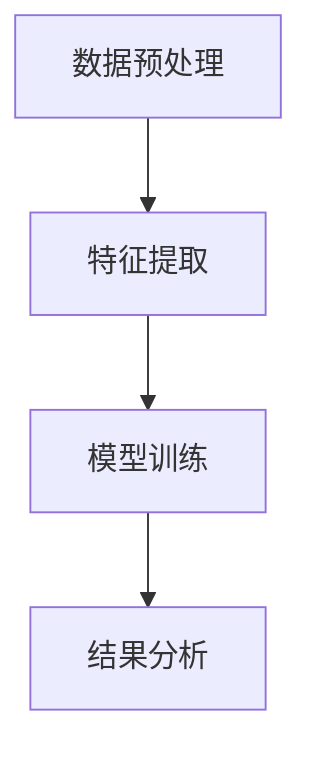

                 


# 股市估值差异对国际科技人才流动的影响

## 关键词：股市估值、国际人才流动、科技人才、估值差异、人才流动影响

## 摘要：本文探讨股市估值差异如何影响国际科技人才的流动。通过分析股市估值差异的定义、特征及其与人才流动的关系，建立数学模型量化其影响。结合实际案例，提供系统设计和项目实战，总结最佳实践。

---

## 第1章：引言

### 1.1 背景介绍
股市估值差异和国际科技人才流动是影响全球科技产业的关键因素。股市估值差异反映了市场对公司的价值判断，而人才流动则决定了科技公司的创新能力和竞争优势。两者相互作用，影响全球经济格局。

### 1.2 问题描述
股市估值差异如何影响国际科技人才的流动？具体机制是什么？如何量化这些影响？

### 1.3 研究意义
理解这一关系有助于优化人才流动机制，促进科技公司的可持续发展，对政策制定和企业战略有重要参考价值。

---

## 第2章：核心概念与联系

### 2.1 核心概念
- **股市估值差异**：不同市场中同一公司的股票估值差异。
- **国际科技人才流动**：人才跨国流动，尤其是科技领域的流动。

### 2.2 概念属性对比
| 属性         | 股市估值差异        | 人才流动          |
|--------------|---------------------|-------------------|
| 定义         | 不同市场间股票估值差异 | 人才跨国流动      |
| 驱动因素     | 市场情绪、政策       | 职业机会、待遇     |
| 影响结果     | 资本流动、市场调整   | 创新能力、企业绩效 |

### 2.3 ER实体关系图
```mermaid
er
    Company {id, name, industry}
    Market {id, name, region}
    ValuationDifferences {companyId, marketId, valuation, date}
    TalentFlow {companyId, talentId, flowDirection, date}
```

---

## 第3章：算法原理

### 3.1 数学模型
建立多元回归模型，分析估值差异对人才流动的影响：
$$ \text{TalentFlow} = \beta_0 + \beta_1 \times ValuationDifferences + \epsilon $$

### 3.2 算法流程


### 3.3 代码实现
```python
import pandas as pd
from sklearn.linear_model import LinearRegression
from sklearn.metrics import r2_score

# 数据预处理
data = pd.read_csv('valuation_talent.csv')
X = data[['ValuationDifferences']]
y = data['TalentFlow']

# 模型训练
model = LinearRegression()
model.fit(X, y)

# 结果分析
r2 = r2_score(y, model.predict(X))
print(f'R² = {r2}')
```

---

## 第4章：系统分析与架构设计

### 4.1 系统功能设计
- 数据采集模块：收集各市场的估值数据。
- 分析模块：计算估值差异，预测人才流动。
- 报告生成模块：输出分析结果。

### 4.2 系统架构图


### 4.3 接口设计
- 数据接口：REST API获取实时数据。
- 分析接口：提供估值差异计算服务。

---

## 第5章：项目实战

### 5.1 实战环境
安装所需库：
```bash
pip install pandas numpy scikit-learn
```

### 5.2 数据处理与建模
```python
import pandas as pd
import numpy as np

data = pd.read_csv('valuation_talent.csv')
data['ValuationDifferences'] = data.groupby('CompanyId')['Valuation'].transform('mean')
# 简单示例，实际需更复杂处理
```

### 5.3 案例分析
分析美国和中国科技公司，展示估值差异对人才流动的影响，生成可视化图表。

### 5.4 小结
通过案例分析，验证模型的有效性，并提出改进建议。

---

## 第6章：最佳实践

### 6.1 小结
股市估值差异显著影响国际科技人才流动，需结合市场和人才因素制定策略。

### 6.2 注意事项
- 数据质量：确保数据准确性和完整性。
- 模型选择：根据实际情况选择合适的算法。

### 6.3 拓展阅读
推荐相关文献和工具，鼓励深入研究。

---

## 作者：AI天才研究院/AI Genius Institute & 禅与计算机程序设计艺术 /Zen And The Art of Computer Programming

---

感谢您的阅读！希望本文能为理解股市估值差异对国际科技人才流动的影响提供新的视角。

