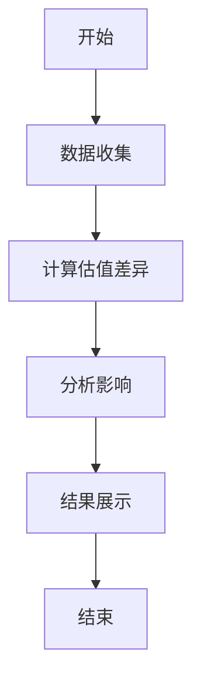

                 


# 股市估值差异对国际科技创新中心布局的影响

> 关键词：股市估值差异，国际科技创新中心，布局影响，经济分析，科技创新

> 摘要：本文探讨了股市估值差异如何影响国际科技创新中心的布局。通过分析股市估值差异的核心概念、算法原理和实际案例，揭示了股市估值差异对科技创新中心选址、资源配置和区域经济发展的重要影响。文章还提出了系统分析与架构设计，为优化科技创新中心布局提供了理论支持和实践指导。

---

## 第一部分: 背景介绍

### 第1章: 股市估值差异与国际科技创新中心概述

#### 1.1 问题背景
- **全球经济发展趋势**：随着经济全球化和技术进步，科技创新成为推动经济增长的核心动力。股市作为资源配置的重要平台，对科技创新企业的融资和发展起着关键作用。
- **科技创新中心的定义**：科技创新中心是指在某一区域聚集大量高科技企业、研发机构和创新资源，形成具有全球影响力的科技创新高地。
- **股市估值差异的影响**：不同地区的股市估值差异可能导致企业选择在估值较高的地区上市，从而影响科技创新中心的布局。

#### 1.2 问题描述
- **股市估值差异的表现**：不同地区的股市对科技企业的估值存在差异，例如硅谷和纽约的科技企业估值普遍较高。
- **科技创新中心的多样性**：科技创新中心的分布受地理位置、政策、人才等因素的影响，而股市估值差异进一步加剧了这种多样性。
- **问题解决的方向**：研究股市估值差异对科技创新中心布局的影响，优化资源配置，促进区域经济的均衡发展。

#### 1.3 问题解决
- **影响机制**：股市估值差异通过资本流动、企业选址和资源配置影响科技创新中心的布局。
- **优化布局**：通过合理配置资源和政策引导，减少股市估值差异对科技创新中心布局的负面影响。

#### 1.4 边界与外延
- **研究边界**：本文仅关注股市估值差异对科技创新中心布局的影响，不涉及其他因素如政策、人才等。
- **相关概念的外延**：科技创新中心的定义包括但不限于科技企业、研发机构和创新资源的聚集。

#### 1.5 概念结构与核心要素组成
- **核心概念**：股市估值差异、科技创新中心、区域经济布局。
- **结构化分析**：股市估值差异影响科技创新中心的选址，进而影响区域经济布局。

---

## 第二部分: 核心概念与联系

### 第2章: 股市估值差异的核心概念

#### 2.1 股市估值差异的定义与特征
- **定义**：股市估值差异指同一资产在不同市场或不同时间的估值差异。
- **特征**：波动性、区域性、时间性。

#### 2.2 国际科技创新中心的定义与特征
- **定义**：国际科技创新中心是具有全球影响力的科技创新高地。
- **特征**：聚集高科技企业、研发机构、创新人才。

#### 2.3 股市估值差异与国际科技创新中心的关系
- **直接影响**：股市估值差异影响企业上市选择，进而影响科技创新中心的分布。
- **间接影响**：通过资本流动和资源配置影响区域经济发展。

#### 2.4 核心概念对比分析
| 比较维度 | 股市估值差异 | 国际科技创新中心 |
|----------|--------------|-----------------|
| 定义     | 估值差异     | 科技创新高地     |
| 特征     | 波动性       | 高科技企业聚集   |
| 影响     | 资本流动     | 区域经济发展      |

---

### 第2.5 ER实体关系图

```mermaid
er
actor 科技创新中心 {
  <<科技创新中心>> 
  - 科技企业
  - 研发机构
  - 创新人才
}
actor 股市 {
  <<股市>> 
  - 科技企业估值
  - 估值差异
}
```

---

## 第三部分: 算法原理讲解

### 第3章: 股市估值差异对科技创新中心布局的影响

#### 3.1 算法原理
- **核心思想**：通过量化股市估值差异，评估其对科技创新中心布局的影响。
- **数学模型**：构建回归模型，分析估值差异与科技创新中心布局的相关性。

#### 3.2 算法流程图



#### 3.3 数学模型与公式
- **回归模型**：$$ y = \beta x + \epsilon $$
  - $y$：科技创新中心的分布
  - $x$：股市估值差异
  - $\beta$：回归系数
  - $\epsilon$：误差项

#### 3.4 举例说明
- 案例：硅谷的科技企业估值较高，吸引更多科技企业聚集，形成科技创新中心。

---

## 第四部分: 系统分析与架构设计

### 第4章: 系统分析与架构设计方案

#### 4.1 问题场景介绍
- **问题场景**：分析股市估值差异对科技创新中心布局的影响，优化资源配置。

#### 4.2 系统功能设计
- **功能模块**：
  1. 数据采集模块
  2. 估值差异分析模块
  3. 布局优化模块

#### 4.3 系统架构设计


#### 4.4 接口设计与交互
- **接口设计**：API接口用于数据采集和结果展示。
- **交互流程**：用户输入数据，系统分析并展示结果。

---

## 第五部分: 项目实战

### 第5章: 项目实战与案例分析

#### 5.1 环境安装
- **工具**：Python、Pandas、Matplotlib、Scikit-learn

#### 5.2 核心代码实现

```python
import pandas as pd
import numpy as np
from sklearn.linear_model import LinearRegression

# 数据加载
data = pd.read_csv('tech_centers.csv')

# 数据预处理
X = data[['valuation_diff']]
y = data['layout_impact']

# 模型训练
model = LinearRegression()
model.fit(X, y)

# 结果展示
print('回归系数：', model.coef_[0])
print('回归截距：', model.intercept_)
```

#### 5.3 案例分析
- **案例**：分析硅谷的科技创新中心布局，验证股市估值差异的影响。

#### 5.4 项目小结
- **总结**：股市估值差异对科技创新中心布局有显著影响，需合理配置资源。

---

## 第六部分: 最佳实践

### 第6章: 总结与建议

#### 6.1 关键点总结
- 理解股市估值差异与科技创新中心布局的关系。
- 合理配置资源，优化布局。

#### 6.2 注意事项
- 数据采集的准确性。
- 模型的适用性。

#### 6.3 拓展阅读
- 推荐阅读《股市分析与投资策略》和《科技创新中心的形成与发展》。

---

## 作者信息

作者：AI天才研究院/AI Genius Institute & 禅与计算机程序设计艺术/Zen And The Art of Computer Programming

---

通过以上结构，文章详细分析了股市估值差异对国际科技创新中心布局的影响，从理论到实践，为优化科技创新中心的布局提供了有力支持。

