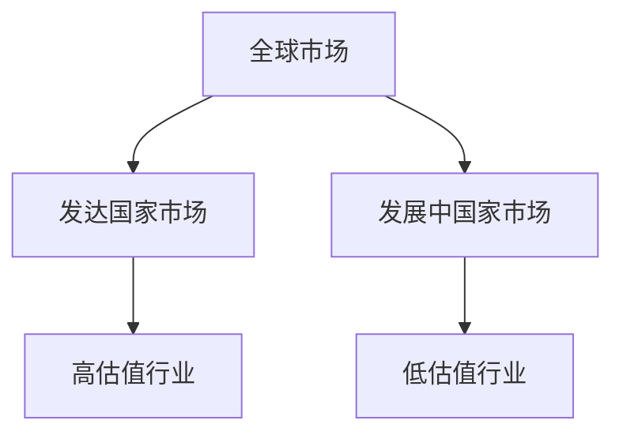
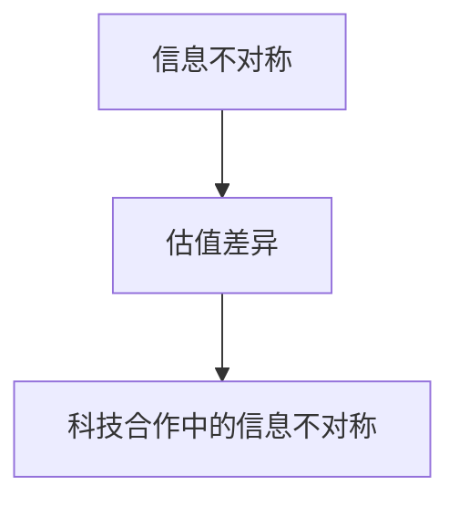
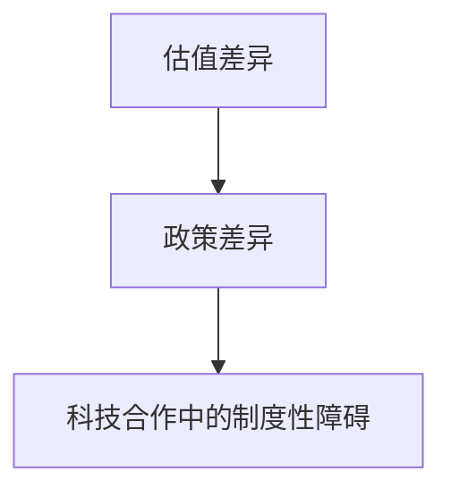
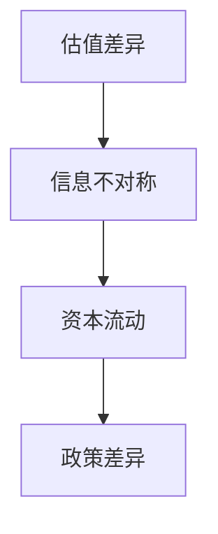
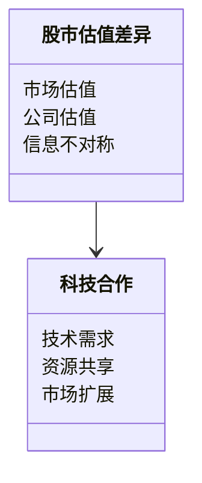
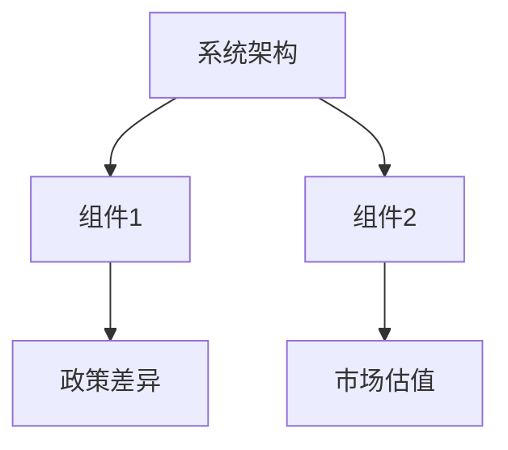
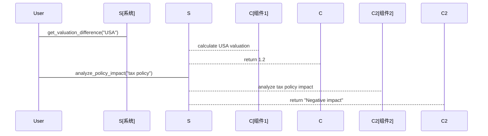

                 


# 股市估值差异对国际科技合作的影响

> **关键词**：股市估值差异、国际科技合作、信息不对称、资本流动、政策差异
>
> **摘要**：本文探讨了股市估值差异对国际科技合作的影响，分析了估值差异如何通过信息不对称、资本流动和政策差异等机制影响科技合作。文章从背景分析、核心机制、系统设计、算法模型、案例分析和应对策略等多个维度展开，结合图表和公式，深入剖析了这一问题的复杂性，并提出了可行的解决方案。

---

## 第一部分：背景与概念

### 第1章：股市估值差异的背景与问题描述

#### 1.1 股市估值的基本概念

**1.1.1 股票估值的定义与方法**

股票估值是通过对公司财务数据和市场环境的分析，确定其股票的合理价格范围。常用的方法包括市盈率（P/E）、市净率（P/B）、EV/EBITDA等。例如，市盈率公式为：

$$ P/E = \frac{\text{股票价格}}{\text{每股净利润}} $$

**1.1.2 市场估值与公司估值的差异**

市场估值是基于整体市场环境的评估，而公司估值是基于公司内部数据的评估。两者的差异可能导致股市估值差异。

**1.1.3 股市估值差异的形成机制**

股市估值差异主要由市场参与者的预期、信息不对称和市场流动性等因素引起。

---

#### 1.2 国际科技合作的定义与现状

**1.2.1 科技合作的定义与类型**

科技合作是指不同国家或企业之间通过技术交流、研发合作等方式共同推进科技进步。主要类型包括技术转让、联合研发和专利共享。

**1.2.2 国际科技合作的主要模式**

国际科技合作的模式包括双边合作、多边合作和国际组织推动的合作。例如，欧盟的 Horizon Europe 计划是典型的多边合作模式。

**1.2.3 当前国际科技合作的驱动因素**

技术需求、资源共享和市场扩展是驱动国际科技合作的主要因素。

---

#### 1.3 股市估值差异对国际科技合作的影响

**1.3.1 问题背景与研究意义**

股市估值差异可能导致科技合作中的资源分配不均，影响合作的可持续性。

**1.3.2 问题解决的必要性**

通过解决估值差异问题，可以优化科技合作的资源配置，提升合作效率。

**1.3.3 研究的边界与外延**

本文主要关注股市估值差异对国际科技合作的影响，不涉及其他外部因素，如地缘政治。

---

## 第二部分：核心概念与机制

### 第2章：股市估值差异的核心概念

#### 2.1 股市估值差异的属性特征对比

**2.1.1 估值差异的维度分析**

| 维度   | 描述                     |
|--------|--------------------------|
| 市场   | 不同市场的估值差异       |
| 行业   | 同一行业内的估值差异     |
| 公司   | 同一公司的不同投资者估值差异 |

**2.1.2 不同市场间的估值差异对比**

通过 Mermaid 图表展示不同市场间的估值差异对比：



**2.1.3 估值差异与科技合作的关系**

股市估值差异直接影响科技合作中的资本分配和资源流动。

---

### 第3章：股市估值差异对国际科技合作的影响机制

#### 3.1 估值差异的信息不对称效应

**3.1.1 信息不对称的定义与表现**

信息不对称是指市场参与者之间掌握的信息不一致，导致估值差异。

**3.1.2 估值差异如何加剧信息不对称**

通过 Mermaid 图表展示信息不对称如何加剧估值差异：



**3.1.3 信息不对称对科技合作的影响**

信息不对称可能导致合作机会的流失，影响合作效率。

#### 3.2 资本流动与资源配置的影响

**3.2.1 资本流动的定义与作用**

资本流动是指资金在不同市场间的流动，受估值差异影响。

**3.2.2 估值差异如何影响资本流动**

通过公式分析：

$$ \text{资本流动} = \frac{\text{高估值市场的资金需求}}{\text{低估值市场的资金供给}} $$

**3.2.3 资本流动对科技合作的双重影响**

资本流动可能促进高估值市场的科技发展，但可能导致低估值市场的资源匮乏。

#### 3.3 政策差异与制度性障碍

**3.3.1 政策差异的定义与表现**

政策差异是指不同国家或地区的政策法规差异，影响科技合作。

**3.3.2 估值差异如何放大政策差异**

通过 Mermaid 图表展示政策差异与估值差异的关系：



**3.3.3 制度性障碍对科技合作的长期影响**

政策差异可能导致科技合作中的不信任，影响长期合作。

---

## 第三部分：系统分析与架构设计

### 第4章：问题场景与系统功能设计

#### 4.1 问题场景描述

**4.1.1 股市估值差异的具体表现**

通过 Mermaid 图表展示问题场景：



**4.1.2 国际科技合作中的典型问题**

典型问题包括资源分配不均、信息不对称和政策差异。

#### 4.2 系统功能设计

**4.2.1 领域模型（Mermaid 类图）**



---

### 第5章：系统架构与接口设计

#### 5.1 系统架构设计

**5.1.1 系统架构图（Mermaid 架构图）**



#### 5.2 系统接口设计

**5.2.1 关键接口定义**

- `get_valuation_difference(country: str) -> float`
- `analyze_policy_impact(policy: str) -> str`

**5.2.2 接口交互流程（Mermaid 序列图）**



---

## 第四部分：算法与数学模型

### 第6章：股市估值差异的数学模型

#### 6.1 信息不对称与估值差异的关系

通过公式分析：

$$ \text{信息不对称} = \frac{\text{市场估值差异}}{\text{公司估值差异}} $$

#### 6.2 资本流动与科技合作的关系

通过公式分析：

$$ \text{资本流动} = \text{高估值市场的资金需求} - \text{低估值市场的资金供给} $$

---

## 第五部分：案例分析与应对策略

### 第7章：案例分析与应对策略

#### 7.1 案例分析

**7.1.1 美国与中国的科技合作案例**

分析美国与中国的科技合作中的估值差异问题。

#### 7.2 应对策略

**7.2.1 政策调整**

通过政策调整减少估值差异对科技合作的影响。

**7.2.2 信息共享机制**

建立信息共享机制，减少信息不对称。

---

## 第六部分：结论与展望

### 第8章：结论与展望

#### 8.1 结论

总结股市估值差异对国际科技合作的影响，提出解决方案。

#### 8.2 未来展望

展望未来的研究方向和应用前景。

---

**作者**：AI天才研究院/AI Genius Institute & 禅与计算机程序设计艺术 /Zen And The Art of Computer Programming

---

### 附录

**附录A**：股市估值差异的数学模型公式

$$ \text{估值差异} = \frac{\text{市场估值}}{\text{公司估值}} $$

**附录B**：系统接口设计的详细代码示例

```python
def get_valuation_difference(country):
    # 示例代码
    return 1.2

def analyze_policy_impact(policy):
    # 示例代码
    return "Negative impact"
```

---

通过以上思考和设计，我们可以系统地分析股市估值差异对国际科技合作的影响，并提出可行的解决方案。

