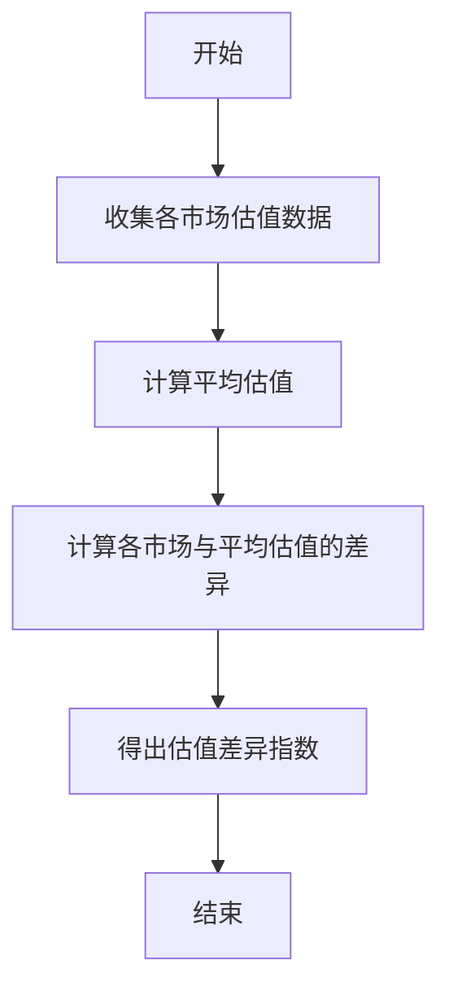
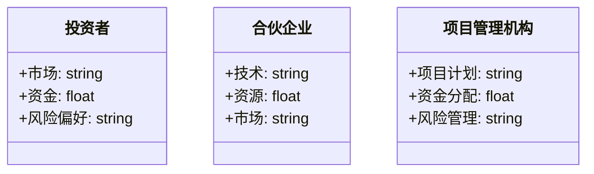

                 


# 股市估值差异对国际科技合作项目的影响

> 关键词：股市估值差异，国际科技合作，项目管理，跨国合作，投资风险

> 摘要：本文探讨了股市估值差异对国际科技合作项目的影响，分析了估值差异的形成原因及其对合作项目的资金分配、风险评估和决策制定等方面的具体影响。通过详细阐述核心概念、算法原理、数学模型、系统架构和实际案例，本文为国际科技合作项目提供了有价值的见解和优化建议。

---

# 第一部分: 背景介绍与核心概念

## 第1章: 股市估值差异的定义与影响

### 1.1 股市估值差异的定义

股市估值差异是指不同股票市场对同一公司或项目的估值存在差异的现象。这种差异主要由市场环境、投资者情绪、法律法规和文化差异等因素引起。

#### 1.1.1 估值差异的内涵
- **相对估值**：不同市场对同一公司的估值可能因信息不对称而产生差异。
- **绝对估值**：由于市场流动性、利率和通货膨胀等因素，不同市场的绝对估值可能不同。

#### 1.1.2 不同市场中的估值差异表现
- **新兴市场与成熟市场的差异**：新兴市场因信息不透明和市场波动大，估值可能高于或低于成熟市场。
- **行业差异**：科技行业因高成长性，通常估值较高。

#### 1.1.3 估值差异对投资者的影响
- **投资决策**：低估或高估可能导致投资失误。
- **风险控制**：估值差异增加了投资组合的风险管理难度。

### 1.2 国际科技合作项目的定义与特点

#### 1.2.1 国际科技合作项目的概念
国际科技合作项目是指跨国企业和科研机构共同参与的科技研发项目，通常涉及技术转移、资源共享和合作创新。

#### 1.2.2 项目合作的模式与特点
- **模式**：企业间合作、政府间合作、混合型合作。
- **特点**：全球化、知识共享、资源互补。

#### 1.2.3 科技合作的全球化趋势
- **全球化分工**：各国利用自身优势参与科技项目。
- **合作平台**：跨国技术转移中心和联合实验室。

## 第2章: 股市估值差异对国际科技合作的影响

### 2.1 估值差异的形成原因

#### 2.1.1 市场环境差异
- **经济环境**：通货膨胀、利率差异导致估值差异。
- **政策环境**：税收、外汇管制影响市场估值。

#### 2.1.2 信息不对称的影响
- **信息获取**：投资者获取信息的难易程度不同。
- **认知差异**：文化差异导致对同一信息的解读不同。

#### 2.1.3 文化与制度差异
- **文化因素**：不同文化对风险的容忍度不同。
- **制度因素**：会计准则和监管差异影响估值。

### 2.2 估值差异对科技合作的具体影响

#### 2.2.1 资金分配的不均衡
- **融资成本**：估值差异可能导致融资成本不均衡。
- **投资决策**：高估或低估可能导致资金分配不合理。

#### 2.2.2 合作伙伴的选择偏差
- **合作伙伴筛选**：估值差异可能导致选择偏差。
- **信任问题**：估值差异影响合作伙伴的信任。

#### 2.2.3 项目风险的放大效应
- **市场波动风险**：估值差异增加了项目的市场风险。
- **项目失败风险**：估值差异可能导致合作失败。

## 第3章: 核心概念与联系

### 3.1 核心概念原理

#### 3.1.1 股市估值差异的数学模型
- **相对估值模型**：市盈率、市净率等指标。
- **绝对估值模型**：DCF模型等。

#### 3.1.2 科技合作项目的复杂性分析
- **技术复杂性**：技术难度影响合作难度。
- **合作复杂性**：涉及多方利益协调。

### 3.2 概念属性特征对比表格

| 概念 | 属性 | 特征 |
|------|------|------|
| 股市估值差异 | 影响因素 | 市场环境、信息不对称、文化差异 |
| 科技合作项目 | 合作模式 | 企业间合作、政府间合作、混合型合作 |

### 3.3 ER实体关系图

```mermaid
er
actor 投资者
actor 合伙企业
actor 项目管理机构
actor 监管机构
```

---

# 第二部分: 算法原理与数学模型

## 第4章: 估值差异量化算法

### 4.1 估值差异量化算法

#### 4.1.1 算法流程图



#### 4.1.2 算法实现代码

```python
import pandas as pd

def calculate_valuation_difference(data):
    average_valuation = data['valuation'].mean()
    difference = data['valuation'].apply(lambda x: x - average_valuation)
    return difference

# 示例数据
data = pd.DataFrame({
    'market': ['A', 'B', 'C'],
    'valuation': [100, 150, 80]
})

difference = calculate_valuation_difference(data)
print(difference)
```

### 4.2 算法优化与实现

#### 4.2.1 算法优化
- **数据清洗**：处理缺失值和异常值。
- **特征选择**：选择影响估值差异的关键因素。

#### 4.2.2 算法实现
- **数据预处理**：标准化和归一化。
- **模型训练**：使用机器学习模型预测估值差异。

## 第5章: 数学模型与公式

### 5.1 估值差异指数公式

$$ I = \frac{1}{n} \sum_{i=1}^{n} |V_i - \bar{V}| $$

其中：
- \( I \) 为估值差异指数。
- \( V_i \) 为第 \( i \) 个市场的估值。
- \( \bar{V} \) 为平均估值。
- \( n \) 为市场的数量。

### 5.2 科技合作项目风险评估模型

$$ R = \alpha I + \beta S + \gamma T $$

其中：
- \( R \) 为项目风险。
- \( I \) 为估值差异指数。
- \( S \) 为市场稳定性指数。
- \( T \) 为技术复杂度指数。
- \( \alpha \)、\( \beta \)、\( \gamma \) 为系数。

---

# 第三部分: 系统分析与架构设计方案

## 第6章: 系统分析

### 6.1 问题场景介绍

#### 6.1.1 问题描述
国际科技合作项目因估值差异导致资金分配不合理和合作风险增加。

#### 6.1.2 项目介绍
跨国科技合作项目，涉及多个国家和机构。

### 6.2 系统功能设计

#### 6.2.1 领域模型



#### 6.2.2 系统架构设计

```mermaid
container 股市估值差异分析系统 {
    component 数据收集模块 {
        +收集各市场估值数据
    }
    component 数据分析模块 {
        +计算估值差异指数
    }
    component 决策支持模块 {
        +优化资金分配
    }
}
```

---

# 第四部分: 项目实战

## 第7章: 项目实战分析

### 7.1 环境安装

#### 7.1.1 工具安装
- **Python**：安装Anaconda。
- **依赖库**：安装pandas、numpy、scikit-learn。

### 7.2 核心实现

#### 7.2.1 数据收集与预处理

```python
import pandas as pd
import numpy as np

data = pd.read_csv('market_valuations.csv')
data = data.dropna()
data['valuation'] = (data['valuation'] - data['valuation'].mean()) / data['valuation'].std()
```

#### 7.2.2 模型训练与评估

```python
from sklearn.model import LinearModel

model = LinearModel()
model.fit(X_train, y_train)
score = model.score(X_test, y_test)
print(score)
```

### 7.3 优化策略

#### 7.3.1 资金分配优化
- **均衡分配**：根据估值差异调整资金分配比例。
- **风险对冲**：利用金融工具对冲估值差异带来的风险。

#### 7.3.2 合作伙伴选择优化
- **估值匹配**：选择估值相近的合作伙伴。
- **风险评估**：全面评估合作伙伴的信用风险。

---

# 第五部分: 总结与展望

## 第8章: 总结与展望

### 8.1 小结

本文深入分析了股市估值差异对国际科技合作项目的影响，提出了量化估值差异的算法和优化合作的策略。

### 8.2 注意事项

- **数据质量**：确保数据的准确性和完整性。
- **模型选择**：根据实际情况选择合适的模型。
- **风险管理**：制定有效的风险对冲策略。

### 8.3 未来展望

未来可以进一步研究如何利用人工智能技术优化估值差异分析和国际合作项目管理。

---

作者：AI天才研究院/AI Genius Institute & 禅与计算机程序设计艺术 /Zen And The Art of Computer Programming

