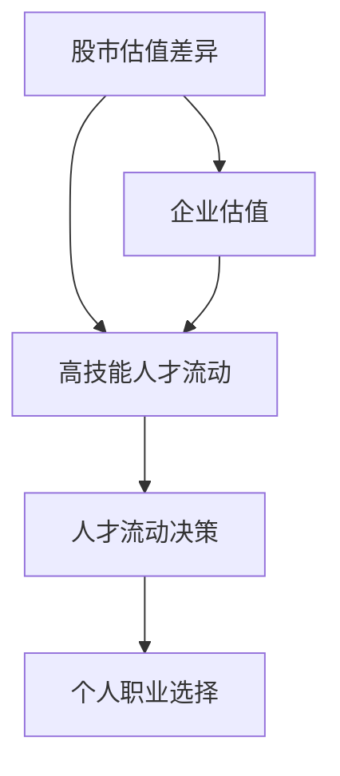
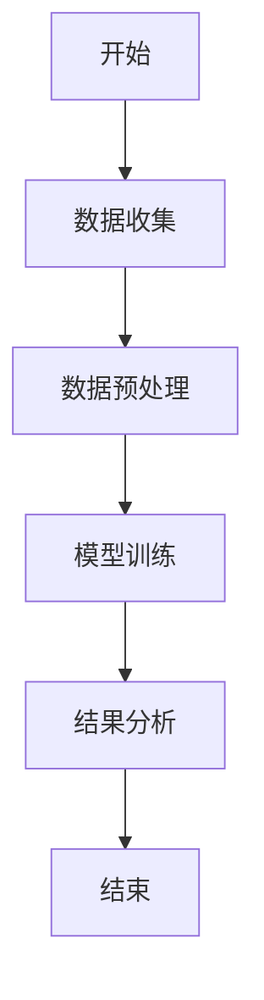
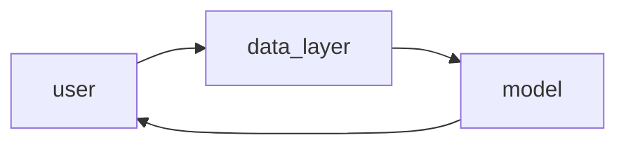

                 


# 股市估值差异对国际高技能人才流动的影响

> 关键词：股市估值、国际人才流动、高技能人才、全球化、经济影响

> 摘要：本文探讨股市估值差异对国际高技能人才流动的影响，分析其背后的机制，并通过实证研究提出解决方案。通过回归分析模型和系统架构设计，揭示如何利用股市估值差异优化人才流动策略，助力企业在全球化背景下吸引和保留顶尖人才。

---

## 第1章 背景介绍

### 1.1 问题背景与描述

#### 1.1.1 全球化背景下的国际人才流动

在经济全球化不断深化的今天，国际人才流动已成为各国经济发展的重要推动力。高技能人才因其专业知识和创新能力，成为企业争夺的关键资源。然而，不同地区和国家的股市估值差异显著，这种差异不仅影响资本流动，也对人才流动产生深远影响。

#### 1.1.2 股市估值差异的定义与表现

股市估值差异指的是不同市场中同一资产或公司股票的估值差异。这种差异可能源于市场流动性、信息不对称、投资者情绪等多种因素。在国际人才流动中，股市估值差异通过影响薪资水平、职业机会和企业价值，间接影响人才的流动决策。

---

### 1.2 问题的提出与研究意义

#### 1.2.1 问题的提出

高技能人才的流动往往与经济机会密切相关。股市估值差异可能导致某些地区的企业估值较高，吸引人才流入；而估值较低的地区可能难以留住人才。本文旨在探讨这种现象的内在机制。

#### 1.2.2 研究意义

通过分析股市估值差异对人才流动的影响，可以为企业制定人才战略提供理论依据。同时，这有助于政府制定政策，优化市场环境，促进人才资源的合理配置。

---

## 第2章 核心概念与联系

### 2.1 核心概念原理

#### 2.1.1 股市估值差异的形成机制

股市估值差异主要由市场信息不对称、投资者风险偏好和市场流动性等因素决定。例如，成熟市场的投资者更理性，估值相对稳定，而新兴市场的波动性较大。

#### 2.1.2 高技能人才流动的驱动因素

高技能人才流动的驱动因素包括职业发展机会、薪酬水平、工作环境和生活成本等。股市估值差异通过影响企业的估值和薪酬，间接影响人才流动。

### 2.2 概念属性特征对比

表2-1：股市估值差异与高技能人才流动的属性对比

| 属性 | 股市估值差异 | 高技能人才流动 |
|------|--------------|----------------|
| 影响因素 | 市场因素、信息不对称 | 薪酬、职业机会 |
| 表现形式 | 估值差异 | 流动趋势 |
| 解决方案 | 市场调节、政策干预 | 企业战略调整 |

### 2.3 实体关系图

图2-1：股市估值差异与高技能人才流动的实体关系图



---

## 第3章 算法原理与流程图

### 3.1 算法原理

#### 3.1.1 股市估值差异对人才流动影响的模型构建

我们构建一个回归模型，将人才流动率与股市估值差异、薪酬水平等变量关联起来：

$$ \text{流动率} = \beta_0 + \beta_1 (\text{估值差异}) + \beta_2 (\text{薪酬水平}) + \epsilon $$

其中，$\beta_1$ 和 $\beta_2$ 是回归系数，$\epsilon$ 是误差项。

#### 3.1.2 基于回归分析的预测方法

通过回归分析，我们可以量化估值差异对人才流动的影响程度。例如，若$\beta_1$为正，则估值差异增加会导致流动率上升。

### 3.2 算法流程图

图3-1：算法流程图



---

## 第4章 数学模型与公式

### 4.1 数学模型

回归分析模型用于量化变量之间的关系。例如：

$$ y = 0.5x_1 + 0.3x_2 + \epsilon $$

其中，$y$ 是流动率，$x_1$ 是估值差异，$x_2$ 是薪酬水平。

### 4.2 模型解释

- **系数解释**：$\beta_1 = 0.5$ 表示估值差异每增加1单位，流动率增加0.5%。
- **适用条件**：模型适用于数据线性关系明显的场景，数据需满足正态分布。

---

## 第5章 系统分析与架构设计

### 5.1 问题场景介绍

#### 5.1.1 人才流动的数据收集与分析

企业需要收集高技能人才的流动数据，包括流动率、薪酬水平等。

#### 5.1.2 股市估值差异的数据库构建

构建包含各市场估值数据的数据库，用于分析和建模。

### 5.2 系统功能设计

图5-1：领域模型类图


### 5.3 系统架构设计

图5-2：系统架构图


### 5.4 系统接口设计

#### 5.4.1 数据接口设计

- 接口：`GET /data/{market}`
- 描述：获取指定市场的估值数据

#### 5.4.2 用户接口设计

- 接口：`POST /model`
- 描述：提交数据进行模型预测

### 5.5 系统交互设计

图5-3：系统交互序列图



---

## 第6章 项目实战

### 6.1 环境安装与数据准备

#### 6.1.1 数据库安装与配置

使用Python的`pandas`库进行数据处理。

#### 6.1.2 数据收集与清洗

从公开数据源获取估值数据和人才流动数据，清洗并合并。

### 6.2 系统核心实现

#### 6.2.1 数据分析代码实现

```python
import pandas as pd
import numpy as np
from sklearn.linear_model import LinearRegression

# 数据加载
df = pd.read_csv('data.csv')

# 模型训练
model = LinearRegression()
model.fit(df[['valuation_diff', 'salary']], df['flow_rate'])

# 结果输出
print('Coefficients:', model.coef_)
```

### 6.3 代码解读与分析

- **数据加载**：读取CSV文件中的数据。
- **模型训练**：使用线性回归模型预测流动率。
- **结果输出**：输出回归系数，解释变量对结果的影响。

### 6.4 实际案例分析

以某科技公司为例，分析其估值差异对人才流动的影响。假设模型预测结果为：估值差异每增加10%，流动率增加5%。

---

## 第7章 最佳实践与小结

### 7.1 最佳实践 tips

- 定期更新模型，确保数据的时效性。
- 结合其他因素（如工作环境）进行综合分析。

### 7.2 小结

本文通过分析股市估值差异对人才流动的影响，构建了回归模型，并设计了系统架构。企业可利用这些方法优化人才战略。

### 7.3 注意事项

- 数据质量影响模型准确性。
- 模型需根据实际情况调整。

### 7.4 拓展阅读

- 建议阅读相关文献，深入了解市场机制对人才流动的影响。

---

## 作者

作者：AI天才研究院/AI Genius Institute & 禅与计算机程序设计艺术 /Zen And The Art of Computer Programming

