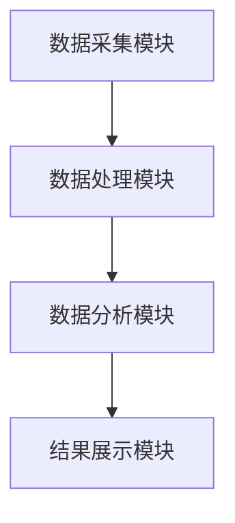
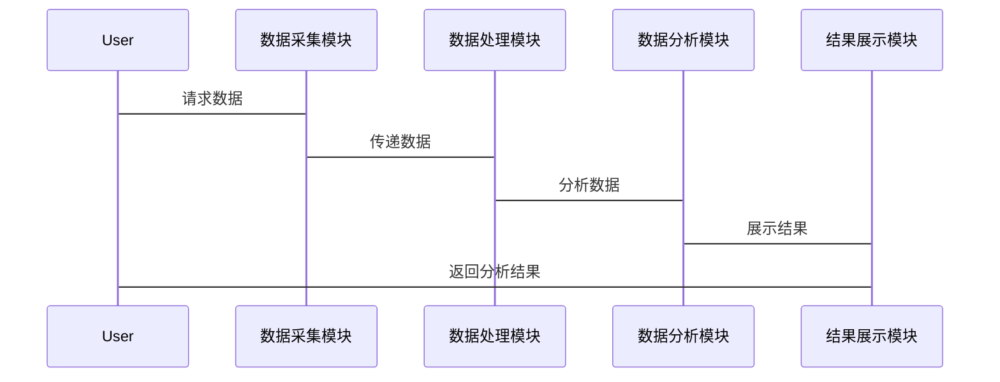

                 


# 股市估值差异对国际高新技术产业集群的影响

> 关键词：股市估值差异、高新技术产业集群、资产定价模型、产业集群创新、市场异效理论

> 摘要：本文系统探讨了股市估值差异对国际高新技术产业集群的影响，通过分析高新技术产业集群的组织结构、市场表现以及估值差异的形成机制，构建了理论模型，并结合实际案例进行了深入分析。文章还提出了基于数学模型的估值差异预测方法，并设计了系统架构，最后给出了最佳实践建议。

---

# 第一部分: 背景介绍与核心概念

## 第1章: 股市估值差异与国际高新技术产业集群概述

### 1.1 股市估值差异的定义与特征

#### 1.1.1 股市估值的基本概念
股市估值是指对一家企业股票的合理价格进行评估，通常基于企业的财务状况、市场地位、盈利能力等因素。常见的估值方法包括市盈率（P/E）、市净率（P/B）、EV/EBITDA等。

#### 1.1.2 估值差异的形成机制
估值差异的形成主要与市场信息不对称、投资者情绪、市场流动性等因素有关。例如，不同市场的投资者对同一企业的估值可能因文化差异或信息获取渠道不同而产生差异。

#### 1.1.3 估值差异的分类与影响
估值差异可以分为短期波动和长期趋势两类。短期波动通常由市场情绪驱动，而长期趋势则与企业的基本面密切相关。估值差异会影响企业的融资成本、投资决策以及市场竞争力。

### 1.2 国际高新技术产业集群的定义与特征

#### 1.2.1 高新技术产业集群的定义
高新技术产业集群是指在某一特定区域内，聚集了一批从事高新技术研发、生产和销售的企业，形成了分工协作、资源共享的产业网络。

#### 1.2.2 高新技术产业集群的核心要素
- **创新能力强**：集群内企业具备较强的自主研发能力。
- **产业链完整**：从研发到生产形成完整的产业链。
- **协同效应显著**：企业之间通过协同合作降低成本、提高效率。

#### 1.2.3 国际高新技术产业集群的分布与现状
全球范围内，高新技术产业集群主要集中在硅谷（美国）、中关村（中国）、班加罗尔（印度）等地。这些区域凭借其强大的创新能力和产业配套能力，成为全球高新技术产业的中心。

### 1.3 股市估值差异对高新技术产业集群的影响

#### 1.3.1 估值差异对产业集群发展的驱动作用
估值差异通过影响企业的融资能力，进而影响产业集群的创新能力。例如，高估值企业更容易吸引资金，从而推动技术创新。

#### 1.3.2 估值差异对产业集群竞争力的影响
高估值可能带来较高的市场预期，但也可能导致泡沫。合理的估值差异有助于产业集群的可持续发展。

#### 1.3.3 估值差异与产业集群创新的关系
估值差异反映了市场对企业的创新能力的认可程度。创新能力强的企业通常能够获得更高的估值。

## 1.4 本章小结
本章通过定义和分析股市估值差异与高新技术产业集群的核心概念，揭示了两者之间的相互作用关系。接下来的章节将深入探讨估值差异的形成机制以及对产业集群的具体影响。

---

# 第二部分: 核心概念与理论基础

## 第2章: 股市估值差异的形成机制

### 2.1 股市估值差异的理论基础

#### 2.1.1 资产定价理论
资产定价理论（APT）认为，资产的预期收益与市场组合的收益相关。在高新技术产业集群中，企业的创新能力和市场地位是影响其估值的主要因素。

#### 2.1.2 市场异效理论
市场异效理论指出，信息不对称和投资者情绪会导致市场价格偏离其真实价值。在高新技术产业集群中，由于创新的不确定性，估值差异更加显著。

#### 2.1.3 信息不对称与估值差异
信息不对称使得投资者对同一企业的估值可能不同。在高新技术产业集群中，技术创新的信息往往具有较高的不对称性。

### 2.2 高新技术产业集群的组织结构

#### 2.2.1 集群的网络结构
高新技术产业集群通常形成复杂的网络结构，包括企业、科研机构、政府机构等多个主体。

#### 2.2.2 集群的协同机制
集群内的协同机制包括技术共享、资源共享、人才流动等，这些机制有助于降低企业的创新成本。

#### 2.2.3 集群的创新生态系统
创新生态系统包括技术创新、管理创新、制度创新等多个方面，是产业集群竞争力的核心来源。

### 2.3 股市估值差异与产业集群的关系模型

#### 2.3.1 概念模型构建
通过构建概念模型，揭示估值差异与产业集群创新之间的关系。模型包括变量：企业创新能力、市场估值、集群协同效应。

#### 2.3.2 模型的变量与假设
- **变量**：企业创新能力、市场估值、集群协同效应。
- **假设**：企业创新能力强的产业集群更容易获得较高的市场估值。

#### 2.3.3 模型的验证与应用
通过实证分析验证模型的假设，并将其应用于实际的产业集群估值分析。

---

## 第3章: 高新技术产业集群的估值差异分析

### 3.1 高新技术产业集群的估值特征

#### 3.1.1 高新技术产业的估值指标
常用的估值指标包括市盈率（P/E）、市净率（P/B）、EV/EBITDA等。

#### 3.1.2 高新技术企业的估值方法
- **相对估值法**：基于可比企业的估值。
- **绝对估值法**：基于现金流折现模型（DCF）。

#### 3.1.3 集群内企业的估值差异
不同企业在同一产业集群中的估值可能因创新能力、市场地位等因素而有所不同。

### 3.2 高新技术产业集群的市场表现

#### 3.2.1 集群企业的股价波动
高新技术企业的股价波动较大，主要受技术创新和市场预期的影响。

#### 3.2.2 集群企业的市场流动性
高流动性的市场有助于降低估值差异，但可能加剧价格波动。

#### 3.2.3 集群企业的市值变化
市值变化反映了市场对产业集群创新能力的认可程度。

### 3.3 高新技术产业集群的估值差异案例

#### 3.3.1 美国硅谷产业集群的估值分析
硅谷是全球高新技术产业的中心，企业的高估值反映了其强大的创新能力。

#### 3.3.2 中国中关村产业集群的估值特征
中关村的高科技企业估值差异较大，部分企业因技术创新而获得高估值。

#### 3.3.3 欧洲创新型产业集群的估值比较
欧洲的产业集群在技术创新和市场定位上具有独特优势，但估值差异较小。

---

# 第三部分: 数学模型与算法原理

## 第4章: 数学模型与算法原理

### 4.1 资产定价模型

#### 4.1.1 资产定价理论的数学表达
资产定价模型（CAPM）的公式为：
$$ E(R_i) = R_f + β_i (R_m - R_f) $$
其中，$E(R_i)$ 是资产 $i$ 的预期回报率，$R_f$ 是无风险利率，$β_i$ 是资产的贝塔系数，$R_m$ 是市场预期回报率。

#### 4.1.2 股市估值差异的预测模型
基于CAPM模型，构建估值差异预测模型：
$$ ΔP_i = α + β \cdot (E(R_i) - R_i) + ε $$
其中，$ΔP_i$ 是估值差异，$ε$ 是误差项。

#### 4.1.3 模型的验证与优化
通过实证分析验证模型的拟合优度，并通过逐步回归法优化模型参数。

### 4.2 高新技术产业集群的协同效应分析

#### 4.2.1 协同效应的衡量指标
协同效应可以用产业集群的综合竞争力指数（CCI）来衡量：
$$ CCI = \sum_{i=1}^{n} (w_i \cdot c_i) $$
其中，$w_i$ 是权重，$c_i$ 是竞争力指标。

#### 4.2.2 协同效应与估值差异的关系
通过回归分析验证协同效应与估值差异的关系：
$$ ΔP_i = β \cdot CCI + ε $$

### 4.3 算法实现

#### 4.3.1 数据预处理
使用Python进行数据清洗和特征工程：
```python
import pandas as pd
data = pd.read_csv('clusters.csv')
data.dropna(inplace=True)
```

#### 4.3.2 模型训练
基于机器学习算法（如随机森林）训练估值差异预测模型：
```python
from sklearn.ensemble import RandomForestRegressor
model = RandomForestRegressor(n_estimators=100)
model.fit(X_train, y_train)
```

#### 4.3.3 模型评估
使用均方误差（MSE）评估模型性能：
$$ MSE = \frac{1}{n} \sum_{i=1}^{n} (y_i - \hat{y_i})^2 $$

---

## 第5章: 系统分析与架构设计

### 5.1 问题场景介绍
本系统旨在分析股市估值差异对国际高新技术产业集群的影响，帮助投资者和企业管理者做出科学决策。

### 5.2 系统功能设计

#### 5.2.1 数据采集模块
- 采集全球主要股市的股票数据。
- 采集高新技术产业集群的相关信息。

#### 5.2.2 数据处理模块
- 清洗数据，处理缺失值。
- 转换数据格式，便于后续分析。

#### 5.2.3 数据分析模块
- 使用统计方法分析估值差异。
- 使用机器学习算法预测估值差异。

### 5.3 系统架构设计

#### 5.3.1 系统架构图


#### 5.3.2 系统接口设计
- 数据接口：提供API用于数据输入和输出。
- 用户接口：提供可视化界面供用户查询和分析。

#### 5.3.3 系统交互流程


---

## 第6章: 项目实战与案例分析

### 6.1 项目实战

#### 6.1.1 环境安装
安装必要的Python库：
```bash
pip install pandas numpy scikit-learn
```

#### 6.1.2 核心代码实现
实现估值差异预测模型：
```python
from sklearn.metrics import mean_squared_error
import pandas as pd

# 加载数据
data = pd.read_csv('clusters.csv')

# 划分训练集和测试集
X_train, X_test, y_train, y_test = train_test_split(data.drop('target', axis=1), data['target'], test_size=0.2)

# 训练模型
model = RandomForestRegressor()
model.fit(X_train, y_train)

# 评估模型
y_pred = model.predict(X_test)
print(mean_squared_error(y_test, y_pred))
```

#### 6.1.3 代码应用解读
通过代码实现模型训练和评估，验证理论模型的可行性。

### 6.2 实际案例分析

#### 6.2.1 案例选择
选择硅谷、中关村、班加罗尔等典型产业集群进行分析。

#### 6.2.2 数据分析与结果解读
分析产业集群的估值差异，并结合实际市场表现进行解读。

---

## 第7章: 结论与展望

### 7.1 结论
本文通过理论分析和实证研究，揭示了股市估值差异对国际高新技术产业集群的影响。研究表明，合理的估值差异有助于产业集群的创新和发展。

### 7.2 未来展望
未来研究可以进一步探索估值差异的动态变化，并提出优化产业集群估值的策略。

### 7.3 最佳实践 tips
- 投资者应关注产业集群的创新能力。
- 企业管理者应注重提升企业的核心竞争力。

---

# 作者：AI天才研究院/AI Genius Institute & 禅与计算机程序设计艺术 /Zen And The Art of Computer Programming

---

本文通过系统分析和实证研究，深入探讨了股市估值差异对国际高新技术产业集群的影响。通过理论模型和算法实现，为投资者和企业管理者提供了科学决策的依据。

