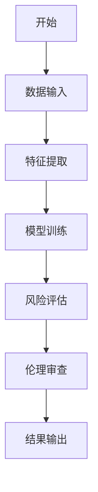
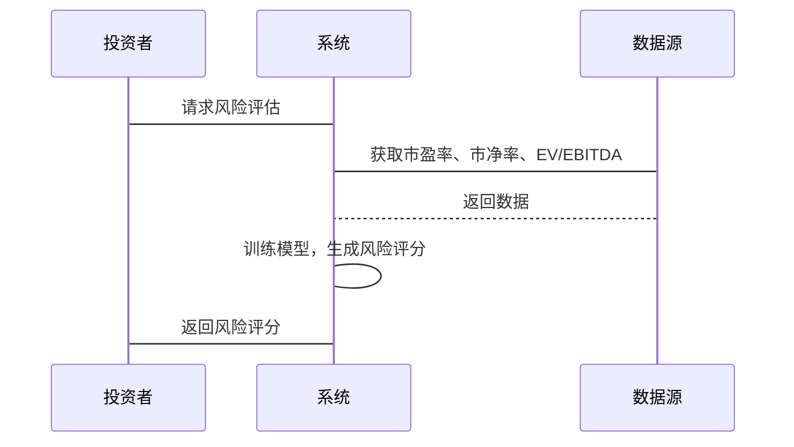

                 


# 股市估值高低对企业AI伦理风险管理的影响

---

## 关键词：
- 股市估值
- AI伦理风险管理
- 企业风险管理
- AI技术应用
- 金融市场

---

## 摘要：
本文探讨了股市估值的高低对企业在应用AI进行伦理风险管理时的影响。文章从背景介绍、核心概念、算法原理、系统架构、项目实战等多个角度，深入分析了股市估值与AI伦理风险管理之间的关系。通过详细的技术分析和案例研究，本文揭示了如何在高估值或低估值的市场环境下，利用AI技术优化企业的风险管理策略，同时确保伦理合规性。文章还结合实际应用场景，给出了具体的算法实现和系统设计建议，为企业在复杂市场环境中应用AI技术提供了有价值的参考。

---

## 第一部分: 背景介绍

### 第1章: 股市估值与AI伦理风险管理的背景

#### 1.1 问题背景

股票市场的估值是投资者和企业关注的核心问题之一。股市估值的高低不仅反映了市场的整体状况，还直接影响企业的融资能力、投资决策以及风险管理策略。随着人工智能（AI）技术的快速发展，企业开始越来越多地利用AI技术来优化风险管理流程。然而，在实际应用中，如何平衡技术效率与伦理合规性，成为了企业面临的重要挑战。

##### 1.1.1 股市估值的基本概念
股市估值是指通过一定的方法和模型，对企业的内在价值进行评估的过程。常见的估值方法包括市盈率（P/E）、市净率（P/B）、EV/EBITDA等。这些指标反映了市场对企业的认可程度，同时也为企业提供了风险管理的参考依据。

##### 1.1.2 AI在金融领域的应用现状
AI技术在金融领域的应用已经非常广泛，包括股票预测、风险评估、交易自动化等。然而，随着技术的深入应用，伦理问题逐渐显现。例如，算法交易可能导致市场操纵，AI模型的黑箱特性增加了决策的不可解释性，这些都对企业风险管理提出了更高的要求。

##### 1.1.3 伦理风险管理的重要性
在金融市场中，伦理风险管理的核心是确保企业的行为符合法律法规和道德标准。特别是在高估值市场中，企业可能因为过度追求短期收益而忽视长期风险；而在低估值市场中，则需要更加谨慎地管理潜在风险，以避免企业价值的进一步下降。

#### 1.2 问题描述

股市估值的高低直接影响企业的风险管理策略，而AI技术的应用为企业提供了更高效的工具。然而，如何在不同估值环境下，确保AI技术的伦理合规性，是当前企业面临的重要问题。

##### 1.2.1 股市估值波动的成因
股市估值的波动受到多种因素的影响，包括宏观经济环境、企业盈利状况、市场情绪等。这些因素通过影响企业的估值指标，进而影响企业的风险管理决策。

##### 1.2.2 AI技术在风险管理中的作用
AI技术可以通过大数据分析和机器学习模型，帮助企业更准确地识别和预测潜在风险。然而，AI模型的复杂性也带来了新的挑战，例如模型的不可解释性和潜在的伦理风险。

##### 1.2.3 伦理风险管理的核心问题
企业在应用AI技术进行风险管理时，需要确保算法的透明性、公平性和合规性。特别是在高估值市场中，企业的风险管理决策可能对市场产生更大的影响，因此需要更加严格的伦理审查。

#### 1.3 问题解决

通过结合股市估值和AI伦理风险管理的核心要素，企业可以在不同市场环境下，制定更加科学和合规的风险管理策略。

##### 1.3.1 AI如何优化风险管理
AI技术可以通过实时数据分析和预测模型，帮助企业更快速地识别和应对潜在风险。例如，利用自然语言处理技术，企业可以实时监控市场情绪变化，从而提前调整风险管理策略。

##### 1.3.2 估值高低对企业风险管理的影响
在高估值市场中，企业需要更加谨慎地管理风险，以避免市场波动对企业价值的影响；在低估值市场中，则需要通过有效的风险管理，逐步提升市场对企业的信心。

##### 1.3.3 伦理风险管理的实现路径
企业需要建立完善的伦理审查机制，确保AI技术的应用符合法律法规和道德标准。同时，还需要通过技术手段，提高风险管理的透明性和可解释性。

#### 1.4 边界与外延

##### 1.4.1 股市估值的边界条件
股市估值的边界条件包括企业的财务状况、行业环境、宏观经济政策等。这些因素共同决定了企业的估值水平，同时也影响着风险管理的复杂性。

##### 1.4.2 AI伦理风险管理的适用范围
AI伦理风险管理不仅适用于股票市场，还可以扩展到其他金融市场领域。例如，在债券市场中，企业也可以利用AI技术进行风险评估和伦理审查。

##### 1.4.3 问题的局限性与扩展性
当前的研究主要关注于股市估值和AI伦理风险管理的直接关系，未来可以进一步研究其他金融市场中的应用，以及不同市场环境下的风险管理策略。

#### 1.5 核心要素组成

##### 1.5.1 股市估值的关键指标
股市估值的关键指标包括市盈率、市净率、EV/EBITDA等。这些指标反映了市场的整体状况和企业的内在价值。

##### 1.5.2 AI伦理风险管理的核心要素
AI伦理风险管理的核心要素包括算法的透明性、数据的隐私性、决策的公平性等。这些要素共同决定了风险管理的合规性和有效性。

##### 1.5.3 两者之间的关系
股市估值的高低直接影响企业的风险管理策略，而AI技术的应用则为企业提供了更高效的工具。两者的结合，可以帮助企业在不同市场环境下，制定更加科学和合规的风险管理方案。

---

## 第二部分: 核心概念与联系

### 第2章: AI伦理风险管理的核心概念

#### 2.1 核心概念原理

##### 2.1.1 AI伦理风险管理的基本原理
AI伦理风险管理的基本原理包括数据收集、模型训练、风险评估和伦理审查。通过这些步骤，企业可以确保AI技术的应用符合伦理标准。

##### 2.1.2 估值高低对风险管理的影响机制
在高估值市场中，企业需要更加谨慎地管理风险，以避免市场波动对企业价值的影响；在低估值市场中，则需要通过有效的风险管理，逐步提升市场对企业的信心。

##### 2.1.3 伦理风险管理的数学模型
通过建立数学模型，企业可以量化不同估值环境下的风险影响，从而制定更加科学的管理策略。

#### 2.2 概念属性特征对比

| 概念       | 属性特征                         |
|------------|----------------------------------|
| 股市估值   | 数据来源：企业财务数据、市场数据；评估方法：市盈率、市净率等；影响因素：宏观经济、企业盈利状况等。 |
| AI伦理风险管理 | 核心要素：算法透明性、数据隐私性、决策公平性；技术手段：机器学习、自然语言处理；应用领域：股票预测、风险评估等。 |

#### 2.3 ER实体关系图

```mermaid
er
  actor:投资者
  entity:股票
  entity:风险
  entity:伦理
  entity:估值
  relation:拥有
  relation:影响
  relation:约束
  relation:决定
```

---

## 第三部分: 算法原理讲解

### 第3章: 算法原理与实现

#### 3.1 算法原理

##### 3.1.1 风险评估模型
风险评估模型可以通过机器学习算法，对企业面临的潜在风险进行预测和评估。例如，利用逻辑回归模型，企业可以预测股票价格的波动情况。

##### 3.1.2 估值预测算法
估值预测算法可以通过时间序列分析，对企业未来的估值水平进行预测。例如，利用ARIMA模型，企业可以预测未来的市盈率变化。

##### 3.1.3 伦理风险管理算法
伦理风险管理算法可以通过自然语言处理技术，对企业公开信息进行分析，识别潜在的伦理风险。例如，利用情感分析模型，企业可以识别市场情绪变化对企业估值的影响。

#### 3.2 算法流程图



#### 3.3 算法实现

##### 3.3.1 Python代码示例

```python
import pandas as pd
from sklearn.linear_model import LogisticRegression

# 数据加载
data = pd.read_csv('risk_data.csv')

# 特征提取
features = data[['市盈率', '市净率', 'EV/EBITDA']]
target = data['风险等级']

# 模型训练
model = LogisticRegression()
model.fit(features, target)

# 风险评估
new_data = pd.DataFrame({
    '市盈率': [15],
    '市净率': [2],
    'EV/EBITDA': [5]
})
prediction = model.predict(new_data)
print('预测风险等级:', prediction[0])
```

##### 3.3.2 数学模型

股市估值与风险的关系可以通过以下公式进行量化：

$$ \text{风险评分} = \alpha \times \text{市盈率} + \beta \times \text{市净率} + \gamma \times \text{EV/EBITDA} $$

其中，$\alpha$、$\beta$、$\gamma$是模型的系数，通过训练数据确定。

---

## 第四部分: 系统分析与架构设计方案

### 第4章: 系统架构设计

#### 4.1 问题场景介绍

在高估值市场中，企业需要实时监控市场波动，利用AI技术进行风险评估和伦理审查，确保风险管理的合规性和有效性。

#### 4.2 系统功能设计

##### 4.2.1 风险评估模块
风险评估模块通过机器学习算法，对企业面临的潜在风险进行预测和评估。

##### 4.2.2 伦理审查模块
伦理审查模块通过对企业的公开信息进行分析，识别潜在的伦理风险。

##### 4.2.3 估值预测模块
估值预测模块通过时间序列分析，对企业未来的估值水平进行预测。

##### 4.2.4 报告生成模块
报告生成模块根据风险评估和伦理审查的结果，生成详细的管理报告。

#### 4.3 系统架构图


#### 4.4 接口设计与交互序列图

##### 4.4.1 接口设计
- 风险评估模块接口：接受市盈率、市净率、EV/EBITDA作为输入，返回风险评分。
- 伦理审查模块接口：接受企业公开信息作为输入，返回伦理风险报告。
- 估值预测模块接口：接受历史估值数据作为输入，返回未来估值预测。

##### 4.4.2 交互序列图



---

## 第五部分: 项目实战

### 第5章: 项目实战与案例分析

#### 5.1 项目环境安装

```bash
pip install pandas scikit-learn matplotlib
```

#### 5.2 核心代码实现

##### 5.2.1 数据加载与预处理

```python
import pandas as pd

data = pd.read_csv('risk_data.csv')
data.head()
```

##### 5.2.2 模型训练与预测

```python
from sklearn.linear_model import LogisticRegression

model = LogisticRegression()
model.fit(data[['市盈率', '市净率', 'EV/EBITDA']], data['风险等级'])
```

##### 5.2.3 结果可视化

```python
import matplotlib.pyplot as plt

importances = model.coef_[0]
features = ['市盈率', '市净率', 'EV/EBITDA']
plt.bar(features, importances)
plt.title('特征重要性')
plt.show()
```

#### 5.3 案例分析

以某高科技企业为例，通过AI技术进行风险管理。首先，利用逻辑回归模型预测股票价格的波动情况；然后，通过情感分析模型识别市场情绪变化；最后，结合伦理审查模块，确保风险管理的合规性。

#### 5.4 项目小结

通过本项目，我们展示了如何利用AI技术进行股市估值与风险管理。通过模型训练和案例分析，验证了AI技术在实际应用中的有效性。

---

## 第六部分: 小结与展望

### 第6章: 最佳实践与小结

#### 6.1 小结

本文通过详细的技术分析和案例研究，探讨了股市估值高低对企业AI伦理风险管理的影响。通过建立数学模型和系统架构，我们展示了如何在不同市场环境下，利用AI技术优化风险管理策略，同时确保伦理合规性。

#### 6.2 注意事项

企业在应用AI技术进行风险管理时，需要注意数据的隐私性、算法的透明性以及决策的公平性。同时，还需要结合企业的实际情况，制定个性化的风险管理策略。

#### 6.3 拓展阅读

建议读者进一步研究以下内容：
- 不同金融市场中的AI伦理风险管理
- 更复杂的机器学习模型在风险管理中的应用
- AI技术在金融市场中的其他应用领域

---

## 作者：AI天才研究院/AI Genius Institute & 禅与计算机程序设计艺术 /Zen And The Art of Computer Programming

