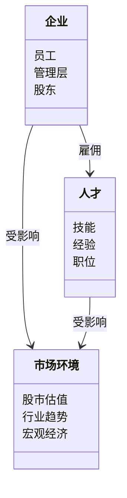
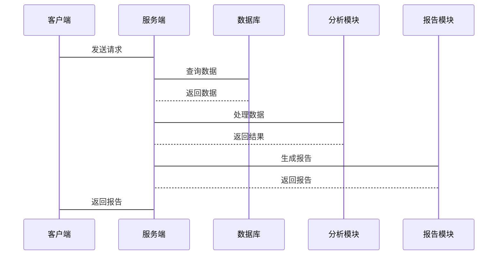

                 

# 股市估值高低对企业人才培养策略的影响

## 关键词
- 股市估值
- 企业人才策略
- 人才培养
- 企业战略
- 人力资源管理

## 摘要
股市估值的高低对企业的人才培养策略有着深远的影响。在高估值的情况下，企业通常面临更高的市场期望和竞争压力，需要更加注重人才的高效配置和创新能力的培养；而在低估值的情况下，企业则需要更加注重成本控制和人才的稳定性，同时寻求在市场中突破的机会。本文将从股市估值的基本概念出发，分析其对人才需求、供给和保留策略的影响，探讨企业如何根据市场环境调整人才培养策略，以实现可持续发展。通过结合实际案例和系统分析，本文旨在为企业提供一套动态调整人才策略的框架，帮助企业在不同市场条件下优化人才管理，提升竞争力。

---

# 第1章 股市估值与企业人才策略概述

## 1.1 股市估值的基本概念

### 1.1.1 股市估值的定义
股市估值是指通过特定的指标和方法，对企业的市场价值进行评估的过程。常用的指标包括市盈率（P/E）、市净率（P/B）、市销率（P/S）等，这些指标反映了市场对企业的整体价值和盈利能力的预期。

### 1.1.2 市盈率、市净率等核心指标
- **市盈率（P/E）**：企业市值与净利润的比率，反映市场对企业盈利能力的预期。
- **市净率（P/B）**：企业市值与净资产的比率，反映市场对企业资产价值的评估。
- **市销率（P/S）**：企业市值与营业收入的比率，反映市场对企业收入能力的关注。

### 1.1.3 股市估值对企业管理的影响
股市估值不仅是企业市值的体现，也反映了市场对企业未来发展的信心。高估值意味着市场对企业有更高的期望，低估值则可能意味着市场对企业的未来增长潜力持怀疑态度。

## 1.2 企业人才策略的重要性

### 1.2.1 企业人才策略的核心目标
人才策略的核心目标是通过优化人才的获取、培养和保留，提升企业的竞争力和创新能力。

### 1.2.2 人才策略与企业竞争力的关系
企业的人才策略直接影响其在人才市场中的竞争力。高素质的人才能够为企业带来创新能力和执行力，从而推动企业实现战略目标。

### 1.2.3 人才策略的动态调整机制
人才策略需要根据企业的经营环境和市场变化进行动态调整，以适应不同的发展阶段和市场需求。

## 1.3 股市估值与人才策略的关联性

### 1.3.1 高估值企业的特点与人才策略
高估值企业通常面临更高的市场期望，需要通过吸引和培养高素质人才来满足市场对高增长和高回报的需求。

### 1.3.2 低估值企业的特点与人才策略
低估值企业可能面临市场竞争压力和人才流失的风险，需要通过优化人才管理策略来提升竞争力。

### 1.3.3 股市估值波动对人才策略的影响
股市估值的波动会导致企业人才策略的调整，企业需要根据市场环境的变化，灵活调整人才的招聘、培养和保留策略。

## 1.4 本章小结
本章从股市估值的基本概念出发，分析了其对企业人才策略的影响，强调了人才策略在企业竞争力中的重要性，并提出了根据股市估值动态调整人才策略的必要性。

---

# 第2章 股市估值对企业人才策略的影响机制

## 2.1 股市估值对企业人才需求的影响

### 2.1.1 高估值企业的人才需求特点
高估值企业通常需要吸引高素质的人才，以满足市场对其高增长的预期。

### 2.1.2 低估值企业的人才需求特点
低估值企业可能在人才需求上更加注重成本控制和实用性，倾向于招聘具有丰富经验的人才。

### 2.1.3 股市估值波动对人才需求的短期与长期影响
股市估值的波动会影响企业对人才需求的强度和方向。短期波动可能导致企业快速调整人才需求，长期波动则会影响企业的人才战略规划。

## 2.2 股市估值对企业人才供给的影响

### 2.2.1 高估值企业吸引人才的优势
高估值企业通常具有较高的市场声誉和较高的薪资水平，能够吸引更多的优秀人才。

### 2.2.2 低估值企业吸引人才的挑战
低估值企业可能因为市场声誉和薪资水平的限制，面临人才吸引的挑战。

### 2.2.3 人才供给市场的动态变化
人才供给市场的动态变化与股市估值密切相关，高估值市场可能吸引更多的优秀人才进入，而低估值市场可能面临人才流失的风险。

## 2.3 股市估值对企业人才保留策略的影响

### 2.3.1 高估值企业的人才保留策略
高估值企业通常能够提供具有竞争力的薪酬和职业发展机会，有助于留住高素质人才。

### 2.3.2 低估值企业的人才保留策略
低估值企业需要通过优化企业文化和提供更多非经济激励来留住人才。

### 2.3.3 股市估值波动对人才保留的影响
股市估值的波动会影响企业的人才保留策略，企业需要根据市场环境的变化，灵活调整人才保留措施。

## 2.4 本章小结
本章分析了股市估值对企业人才需求、供给和保留策略的影响，强调了企业需要根据市场环境的变化，灵活调整人才策略，以实现人才的有效管理和利用。

---

# 第3章 股市估值与企业人才策略的核心概念

## 3.1 股市估值的核心概念

### 3.1.1 股市估值的计算方法
股市估值的计算方法包括市盈率、市净率、市销率等，这些方法反映了市场对企业价值的不同关注点。

### 3.1.2 股市估值的市场影响
股市估值的高低反映了市场对企业未来发展的信心，高估值意味着市场对企业有更高的期望，低估值则可能意味着市场对企业的未来增长潜力持怀疑态度。

### 3.1.3 股市估值的波动性分析
股市估值的波动性是市场环境变化的体现，企业需要根据估值的波动性调整人才策略。

## 3.2 企业人才策略的核心概念

### 3.2.1 人才策略的制定原则
人才策略的制定原则包括企业战略目标、市场环境、企业文化和员工需求等因素。

### 3.2.2 人才策略的实施步骤
人才策略的实施步骤包括人才需求分析、人才招聘与培养、人才保留与激励等。

### 3.2.3 人才策略的评估指标
人才策略的评估指标包括人才流失率、人才绩效、员工满意度等。

## 3.3 股市估值与人才策略的关联模型

### 3.3.1 股市估值与人才需求的关系模型
高估值企业需要吸引高素质人才，低估值企业则需要注重人才的成本控制。

### 3.3.2 股市估值与人才供给的关系模型
股市估值的高低影响人才供给市场的供需关系，高估值市场吸引更多的优秀人才，低估值市场则可能面临人才流失的风险。

### 3.3.3 股市估值与人才保留的关系模型
高估值企业能够提供更好的职业发展和薪酬福利，有助于留住人才；低估值企业则需要通过优化企业文化和提供更多非经济激励来留住人才。

## 3.4 本章小结
本章从股市估值和企业人才策略的核心概念出发，分析了两者之间的关联性，并提出了根据股市估值动态调整人才策略的必要性。

---

# 第4章 股市估值对企业人才策略的影响分析

## 4.1 高估值企业的特点与人才策略

### 4.1.1 高估值企业的优势与劣势
高估值企业通常具有较高的市场声誉和较高的市值，但也面临更高的市场期望和竞争压力。

### 4.1.2 高估值企业的人才需求与供给策略
高估值企业需要吸引高素质的人才，以满足市场对其高增长的预期。同时，高估值企业通常具有较高的薪资水平和较好的职业发展机会，能够吸引更多的优秀人才。

### 4.1.3 高估值企业的人才保留策略
高估值企业能够提供具有竞争力的薪酬和职业发展机会，有助于留住高素质人才。

## 4.2 低估值企业的特点与人才策略

### 4.2.1 低估值企业的优势与劣势
低估值企业通常具有较低的市场声誉和较低的市值，但也可能具有较高的增长潜力和竞争优势。

### 4.2.2 低估值企业的人才需求与供给策略
低估值企业需要注重人才的成本控制，倾向于招聘具有丰富经验的人才，同时可能面临人才流失的风险。

### 4.2.3 低估值企业的人才保留策略
低估值企业需要通过优化企业文化和提供更多非经济激励来留住人才。

## 4.3 股市估值波动对人才策略的影响

### 4.3.1 高估值向低估值波动的影响
高估值向低估值波动时，企业需要调整人才策略，注重成本控制和人才的稳定性。

### 4.3.2 低估值向高估值波动的影响
低估值向高估值波动时，企业需要快速调整人才策略，吸引高素质人才，以满足市场对其高增长的预期。

## 4.4 本章小结
本章分析了高估值和低估值对企业人才策略的影响，强调了企业需要根据市场环境的变化，灵活调整人才策略，以实现人才的有效管理和利用。

---

# 第5章 股市估值与企业人才策略的系统分析与架构设计

## 5.1 系统分析

### 5.1.1 问题场景介绍
企业需要根据股市估值的变化，动态调整人才策略，以实现人才的有效管理和利用。

### 5.1.2 项目介绍
本项目旨在构建一个基于股市估值的企业人才策略管理系统，帮助企业根据市场环境的变化，动态调整人才策略。

## 5.2 系统功能设计

### 5.2.1 领域模型设计
领域模型设计包括企业、人才、市场环境等核心要素，以及它们之间的关系。

### 5.2.2 系统架构设计

### 5.2.3 系统交互设计

## 5.3 本章小结
本章从系统分析的角度，构建了一个基于股市估值的企业人才策略管理系统，提出了系统的功能设计和架构设计，为企业的动态调整人才策略提供了技术支持。

---

# 第6章 股市估值与企业人才策略的项目实战

## 6.1 环境安装

### 6.1.1 系统环境
- 操作系统：Windows 10/ macOS 10.15/ Linux 20.04
- 开发工具：Python 3.8、Jupyter Notebook、IDE（PyCharm）
- 数据库：MySQL 8.0
- 依赖库：pandas、numpy、scikit-learn、matplotlib

## 6.2 核心实现

### 6.2.1 数据采集与预处理
使用Python爬虫技术，采集企业人才数据和股市估值数据，进行数据清洗和特征工程。

### 6.2.2 模型训练
基于机器学习算法，训练股市估值与人才策略的关系模型，评估模型的准确性和稳定性。

### 6.2.3 系统实现
开发一个基于Web的企业人才策略管理系统，实现对股市估值与人才策略的动态调整和管理。

## 6.3 实际案例分析

### 6.3.1 案例背景
以某科技公司为例，分析其在高估值和低估值市场环境下的人才策略调整过程。

### 6.3.2 案例分析
通过具体数据，分析高估值和低估值对企业人才策略的影响，提出优化建议。

## 6.4 本章小结
本章通过项目实战，展示了如何基于股市估值构建企业人才策略管理系统，并通过具体案例分析，验证了系统的可行性和有效性。

---

# 第7章 总结与展望

## 7.1 总结
本文从股市估值与企业人才策略的关系出发，分析了高估值和低估值对企业人才需求、供给和保留策略的影响，并提出了动态调整人才策略的必要性。通过系统分析和项目实战，验证了基于股市估值的企业人才策略管理系统的可行性和有效性。

## 7.2 展望
未来的研究可以进一步探讨股市估值与企业人才策略的动态关系，结合更多的市场数据和实际案例，优化人才策略管理系统，为企业提供更加精准的决策支持。

---

# 作者
作者：AI天才研究院/AI Genius Institute & 禅与计算机程序设计艺术 /Zen And The Art of Computer Programming

