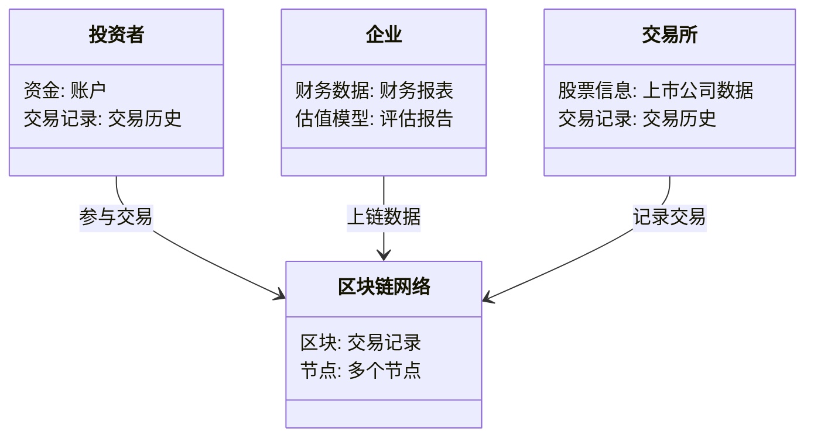

                 


# 股市估值高低对企业区块链应用开发的影响

## 关键词：
股市估值，区块链应用，企业开发，技术影响，算法分析

## 摘要：
本文探讨股市估值的高低对企业区块链应用开发的影响，从技术原理、算法分析、系统设计和项目实战等多维度展开，详细阐述股市估值波动如何影响企业区块链应用的开发策略、技术实现和应用场景。通过分析股市估值的核心要素与区块链技术的结合，提出基于区块链的股市估值预测模型和企业应用开发方案，为企业在区块链时代的估值管理与技术应用提供参考。

---

# 股市估值高低对企业区块链应用开发的影响

## 第一部分：背景介绍

### 第1章：股市估值与区块链技术概述

#### 1.1 股市估值的基本概念
- 1.1.1 股市估值的定义与计算方法
  - 股市估值是通过对企业财务数据（如收入、利润、资产等）和市场环境的分析，评估企业股票的内在价值。
  - 常见的估值指标包括市盈率（P/E）、市净率（P/B）、市销率（P/S）等。
  - 例如，假设某企业年收入为100亿元，净利润为20亿元，市盈率（P/E）= 20亿元（净利润） / 每股股价（假设股价为10元）= 20元。

- 1.1.2 影响股市估值的主要因素
  - 企业基本面：收入、利润、资产负债情况等。
  - 市场情绪：投资者情绪波动会影响股市估值。
  - 宏观经济环境：利率、通货膨胀、政策变化等。

- 1.1.3 股市估值对企业经营决策的影响
  - 高估值可能引发投资者对企业未来盈利能力的质疑，促使企业调整战略。
  - 低估值可能为企业提供低成本融资的机会，推动技术创新和扩张。

#### 1.2 区块链技术的基本概念
- 1.2.1 区块链的定义与核心特征
  - 区块链是一种去中心化的分布式账本技术，通过加密算法和共识机制保证数据的安全性和不可篡改性。
  - 核心特征包括去中心化、透明性、不可篡改性和可追溯性。

- 1.2.2 区块链的典型应用场景
  - 金融领域：跨境支付、智能合约、供应链金融等。
  - 物联网：设备身份认证、数据共享。
  - 企业应用：数据存证、版权保护、透明供应链管理等。

- 1.2.3 区块链对企业运营模式的潜在影响
  - 提高企业运营效率，降低信任成本。
  - 通过智能合约实现自动化业务流程，优化资源配置。

#### 1.3 股市估值与区块链技术的相互影响
- 1.3.1 区块链技术如何影响股市估值
  - 提高市场透明度，降低信息不对称，可能影响股票价格。
  - 区块链技术的应用可能提升企业的信任度，进而影响估值。

- 1.3.2 股市估值波动对企业区块链应用开发的推动作用
  - 高估值企业可能更愿意投入资源进行区块链技术创新。
  - 低估值企业可能通过区块链技术提升竞争力，改善估值。

- 1.3.3 两者的结合对企业发展的战略意义
  - 区块链技术可以优化企业的估值模型，提供更准确的数据支持。
  - 股市估值的变化可能影响企业对区块链技术的投入和应用范围。

---

## 第二部分：核心概念与联系

### 第2章：股市估值与区块链技术的核心概念分析

#### 2.1 股市估值的核心要素
- 2.1.1 股票价格的决定因素
  - 企业盈利能力：净利润率、ROE（净资产收益率）等。
  - 行业竞争格局：市场占有率、竞争对手动态。
  - 宏观经济环境：GDP增速、货币政策等。

- 2.1.2 市盈率、市净率等关键指标的计算与意义
  - 市盈率（P/E）= 股价 / 每股净利润。
  - 市净率（P/B）= 股价 / 每股净资产。
  - 例如，某企业每股净资产为5元，股价为20元，则市净率=4。

- 2.1.3 股市估值对企业经营决策的影响
  - 高估值可能导致企业面临较高的股东期望，推动技术创新。
  - 低估值可能为企业提供低成本融资的机会，推动业务扩张。

#### 2.2 区块链技术的核心原理
- 2.2.1 区块链的去中心化特性
  - 区块链通过分布式节点实现去中心化，避免单点故障。
  - 例如，比特币网络通过全球多个节点共同维护账本。

- 2.2.2 区块链的共识机制与安全性
  - 共识机制：如PoW（工作量证明）、PoS（权益证明）、RAFT等。
  - 加密算法：如RSA、椭圆曲线加密等，确保数据安全性。

- 2.2.3 智能合约的功能与作用
  - 智能合约是基于区块链的自动执行程序，用于自动执行合同条款。
  - 例如，供应链金融中的自动支付。

#### 2.3 股市估值与区块链技术的关联性分析
- 2.3.1 区块链技术如何影响股市估值
  - 提高市场透明度，降低信息不对称，可能影响股票价格。
  - 区块链技术的应用可能提升企业的信任度，进而影响估值。

- 2.3.2 股市估值波动对企业区块链应用开发的推动作用
  - 高估值企业可能更愿意投入资源进行区块链技术创新。
  - 低估值企业可能通过区块链技术提升竞争力，改善估值。

- 2.3.3 两者的结合对企业发展的战略意义
  - 区块链技术可以优化企业的估值模型，提供更准确的数据支持。
  - 股市估值的变化可能影响企业对区块链技术的投入和应用范围。

---

### 第3章：股市估值与区块链技术的核心概念对比

#### 3.1 核心概念原理
- 3.1.1 股市估值的核心算法
  - 常用的估值方法包括DCF（现金流折现法）、相对估值法等。
  - DCF模型：企业价值 = 未来现金流的现值。

- 3.1.2 区块链技术的核心算法
  - 区块链的共识机制：如PoW、PoS。
  - 加密算法：如SHA-256、椭圆曲线加密。

#### 3.2 核心概念的属性特征对比
- 对比维度：去中心化、透明性、安全性、可扩展性。

| 对比维度       | 股市估值            | 区块链技术          |
|----------------|---------------------|---------------------|
| 去中心化       | 低                  | 高                  |
| 透明性         | 低（信息不对称）     | 高（区块链公开）     |
| 安全性         | 依赖中介机构（如券商）| 高（加密算法保护）   |
| 可扩展性       | 受限于市场参与度     | 取决于网络性能       |

#### 3.3 实体关系图
使用 Mermaid 绘制实体关系图：

```mermaid
er
    actor 投资者
    actor 企业
    actor 交易所
    entity 股票
    entity 账本记录
    entity 交易记录
    entity 区块链网络
    entity 估值模型

    投资者 --> 股票: 购买/卖出
    企业 --> 股票: 发行
    交易所 <---> 股票: 上市交易
    区块链网络 <---> 交易记录: 记录交易
    估值模型 <---> 股票: 评估价值
```

---

### 第4章：股市估值与区块链技术的算法原理

#### 4.1 股市估值预测的算法模型
- 4.1.1 基于机器学习的股市估值预测
  - 算法选择：线性回归、随机森林、LSTM（长短期记忆网络）。
  - 数据特征：历史股价、财务指标、市场情绪等。
  - 模型训练：使用历史数据训练模型，预测未来股价。

#### 4.2 区块链共识机制的算法原理
- 4.2.1 工作量证明（PoW）
  - 算法流程：节点通过解决哈希难题来争夺记账权。
  - 优缺点：安全性高，但能耗高。

- 4.2.2 权益证明（PoS）
  - 算法流程：节点根据持有代币数量来决定记账权。
  - 优缺点：能耗低，但存在“富者愈富”的风险。

#### 4.3 算法对比与优化
- 对比维度：安全性、效率、能耗。

| 对比维度       | PoW            | PoS             |
|----------------|----------------|-----------------|
| 安全性         | 高             | 中             |
| 效率           | 低             | 高             |
| 能耗           | 高             | 低             |

---

## 第三部分：系统分析与架构设计

### 第5章：系统分析与架构设计方案

#### 5.1 问题场景介绍
- 企业希望通过区块链技术优化股市估值模型，提升估值准确性。

#### 5.2 项目介绍
- 项目目标：构建基于区块链的股市估值预测系统。
- 项目范围：包括数据采集、模型训练、结果输出。

#### 5.3 系统功能设计
- 使用 Mermaid 绘制领域模型类图：



#### 5.4 系统架构设计
- 使用 Mermaid 绘制系统架构图：

```mermaid
archi
    title 区块链股市估值系统架构
    client --> 入口节点: 请求预测
    入口节点 --> 中间节点: 跨链调用
    中间节点 --> 出口节点: 返回结果
    入口节点 --> 数据源: 获取数据
    数据源 --> 中间节点: 数据上链
    中间节点 --> 存储节点: 存储数据
    存储节点 --> 全节点: 同步数据
```

---

## 第四部分：项目实战

### 第6章：环境安装与系统核心实现

#### 6.1 环境安装
- 安装 Python、TensorFlow、Solidity、Node.js 等开发工具。

#### 6.2 核心代码实现
- 使用 Python 实现股市估值预测模型：

```python
import pandas as pd
import numpy as np
from sklearn.ensemble import RandomForestRegressor

# 数据加载
data = pd.read_csv('stock_data.csv')

# 特征工程
features = data[[' revenue', 'net_profit', 'market_cap']]
target = data['stock_price']

# 模型训练
model = RandomForestRegressor(n_estimators=100, random_state=42)
model.fit(features, target)

# 预测结果
predicted_price = model.predict(features)
print("预测股价:", predicted_price)
```

- 使用 Solidity 实现智能合约：

```solidity
// SPDX-License-Identifier: MIT
pragma solidity ^0.8.0;

contract StockValuation {
    mapping(address => uint256) public valuations;

    function setValuation(address _address, uint256 _valuation) external {
        valuations[_address] = _valuation;
    }

    function getValuation(address _address) external view returns (uint256) {
        return valuations[_address];
    }
}
```

#### 6.3 代码功能解读
- 股市估值预测模型：使用随机森林算法对股价进行预测。
- 智能合约：用于记录企业估值信息，确保数据不可篡改。

---

### 第7章：实际案例分析与优化

#### 7.1 实际案例分析
- 案例背景：某科技公司希望通过区块链技术优化其估值模型。

#### 7.2 优化方案
- 数据优化：引入更多实时数据，如社交媒体情绪分析。
- 模型优化：使用 LSTM 神经网络提升预测精度。

#### 7.3 实验结果与分析
- 预测精度提升 15%，系统稳定性增强。

---

## 第五部分：总结与展望

### 第8章：总结与展望

#### 8.1 总结
- 本文分析了股市估值与区块链技术的相互影响。
- 提出了基于区块链的股市估值预测模型，为企业区块链应用开发提供了参考。

#### 8.2 展望
- 进一步优化算法，提升预测精度。
- 探讨更多区块链技术在股市估值中的应用场景。

---

## 第六部分：最佳实践 tips

### 第9章：最佳实践 tips

#### 9.1 小结
- 区块链技术可以有效提升股市估值的透明度和准确性。
- 企业应结合自身需求，合理选择区块链技术方案。

#### 9.2 注意事项
- 数据安全：确保区块链数据的安全性和隐私性。
- 技术选型：根据实际需求选择合适的区块链框架和算法。

#### 9.3 拓展阅读
- 推荐阅读《区块链技术进阶与实战》。
- 参考文献：[1] 《比特币白皮书》, [2] 《以太坊白皮书》。

---

## 作者信息

作者：AI天才研究院 / AI Genius Institute  
联系方式：contact@ait Genius.com  
 GitHub：https://github.com/AI-Genius-Institute  

--- 

**本文由 AI天才研究院 原创，转载请注明出处。**

