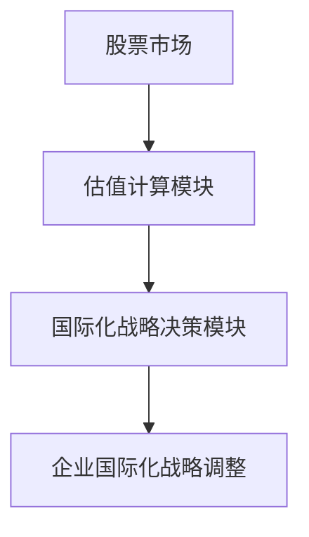

                 


# 股市估值高低对企业国际化战略调整的影响

## 关键词
股市估值，企业国际化，战略调整，市盈率，市净率，国际化战略，企业估值，战略优化

## 摘要
本文深入探讨了股市估值对企业国际化战略调整的影响，从高估值与低估值两个维度分析了其对企业国际化战略的正向与逆向影响。文章首先介绍了股市估值与企业国际化战略的基本概念及二者之间的关系，随后详细分析了高估值与低估值对企业国际化战略的具体影响机制。接着，通过构建数学模型与系统架构，展示了如何量化评估股市估值变化对企业国际化战略调整的影响。最后，结合实际案例，提出了企业应对不同估值环境下国际化战略调整的最佳实践建议。本文内容详实，逻辑清晰，为企业制定国际化战略提供了理论支持与实践指导。

---

# 第一部分: 股市估值与企业国际化战略概述

## 第1章: 股市估值的基本概念与企业国际化战略的关系

### 1.1 股市估值的核心概念
#### 1.1.1 股市估值的定义与计算方法
股市估值是通过对企业财务数据（如净利润、营业收入等）和市场数据（如股价、成交量等）的分析，来评估企业的内在价值和市场价值。常见的估值指标包括市盈率（P/E）、市净率（P/B）、市销率（P/S）等。

- **市盈率（P/E）**：公式为 $$P/E = \frac{股票价格}{每股净利润}$$
- **市净率（P/B）**：公式为 $$P/B = \frac{股票价格}{每股净资产}$$
- **市销率（P/S）**：公式为 $$P/S = \frac{股票价格}{每股收入}$$

#### 1.1.2 企业国际化战略的内涵与外延
企业国际化战略是指企业在拓展国际市场时采取的一系列战略决策，包括市场进入方式（如直接投资、并购、合资等）、产品策略、品牌推广、风险管理等。

#### 1.1.3 股市估值与企业国际化战略的关系
股市估值反映了市场对企业的信心与预期，高估值意味着市场对企业未来增长的乐观预期，而低估值则可能意味着市场对企业前景的悲观看法。这种估值差异直接影响企业国际化战略的实施难度和成本。

---

## 第2章: 股市估值对企业国际化战略的影响机制

### 2.1 高估值对企业国际化战略的推动作用
#### 2.1.1 高估值的市场信心效应
高估值意味着市场对企业未来增长的高期望，这为企业国际化战略提供了更强的资金支持和品牌背书。例如，高估值的科技企业在国际市场上的并购活动更容易获得溢价。

#### 2.1.2 高估值的融资优势
高估值企业通常更容易获得低成本的融资，这为企业国际化扩张提供了资金支持。例如，高估值的中国企业更容易通过海外发债或上市融资。

#### 2.1.3 高估值的并购机会
高估值企业通常在国际市场上具有更强的并购能力，可以通过溢价收购整合国际资源，快速拓展海外市场。

### 2.2 低估值对企业国际化战略的潜在机会
#### 2.2.1 低估值的市场机会
低估值企业通常具有较高的安全边际，这为企业在国际市场上的低成本扩张提供了机会。例如，低估值的传统制造企业在新兴市场可以通过价格优势快速占领市场份额。

#### 2.2.2 低估值的转型动力
低估值企业可能通过国际化战略实现业务转型，例如通过海外并购引入新技术或管理经验。

---

## 第3章: 股市估值对企业国际化战略的抑制效应

### 3.1 高估值的泡沫风险
高估值企业可能面临泡沫破裂的风险，这会直接影响其国际化战略的实施。例如，2000年互联网泡沫破裂后，许多高估值的互联网企业被迫调整国际化战略。

### 3.2 低估值的融资困境
低估值企业通常难以获得足够的融资支持，这限制了其国际化战略的实施。例如，低估值的中小企业在国际市场上的融资渠道有限。

---

## 第4章: 股市估值与企业国际化战略的系统性分析

### 4.1 股市估值与企业国际化战略的反馈机制
股市估值的变化会对企业的国际化战略产生反馈效应，例如高估值可能推动企业加速国际化扩张，而低估值可能迫使企业调整国际化战略。

### 4.2 企业国际化战略对股市估值的反向影响
企业国际化战略的实施可能反过来影响股市估值，例如成功的国际化战略可能提升企业的盈利能力和市场地位，从而推高股市估值。

---

## 第5章: 股市估值与企业国际化战略的数学模型

### 5.1 股市估值预测模型
#### 5.1.1 市盈率模型
$$P/E = \frac{股票价格}{每股净利润}$$

#### 5.1.2 市净率模型
$$P/B = \frac{股票价格}{每股净资产}$$

### 5.2 国际化战略调整模型
$$S = \begin{cases} 
\text{国际化扩张} & \text{如果 } P/E > \text{行业平均值} \\
\text{战略调整} & \text{如果 } P/E < \text{行业平均值}
\end{cases}$$

---

## 第6章: 股市估值与企业国际化战略的系统架构设计

### 6.1 系统架构图


### 6.2 系统功能设计
- **数据输入**：股票价格、企业财务数据、行业平均估值等。
- **估值计算**：市盈率、市净率等。
- **战略决策**：根据估值结果制定国际化战略。
- **结果输出**：战略调整方案。

---

## 第7章: 股市估值与企业国际化战略的项目实战

### 7.1 项目背景
以某科技企业为例，分析其在高估值环境下的国际化战略调整。

### 7.2 环境安装
- Python 3.8+
- Pandas、Matplotlib、Scikit-learn

### 7.3 核心实现代码
```python
import pandas as pd
import matplotlib.pyplot as plt

# 数据加载
data = pd.read_csv('market_data.csv')

# 市盈率计算
data['PE'] = data['Stock Price'] / data['Net Income per Share']

# 可视化
plt.plot(data['Date'], data['PE'])
plt.title('Stock Price to Earnings Ratio')
plt.xlabel('Date')
plt.ylabel('PE Ratio')
plt.show()
```

### 7.4 实践小结
通过实战分析，我们可以发现股市估值对企业国际化战略的影响是多维度的，企业需要根据自身估值水平和市场环境灵活调整战略。

---

## 第8章: 总结与展望

### 8.1 总结
本文从高估值与低估值两个维度分析了股市估值对企业国际化战略的影响，并提出了系统的数学模型与架构设计。企业应根据自身的估值水平灵活调整国际化战略。

### 8.2 展望
未来的研究可以进一步探讨不同行业和市场环境下股市估值对企业国际化战略的具体影响，以及如何通过技术创新优化战略调整模型。

---

## 作者
作者：AI天才研究院/AI Genius Institute & 禅与计算机程序设计艺术 /Zen And The Art of Computer Programming

