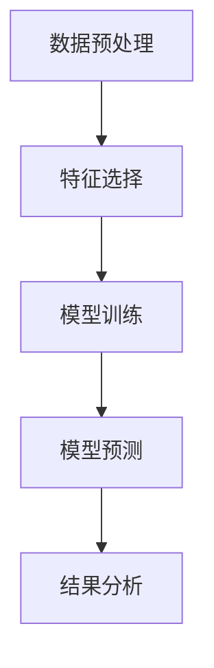
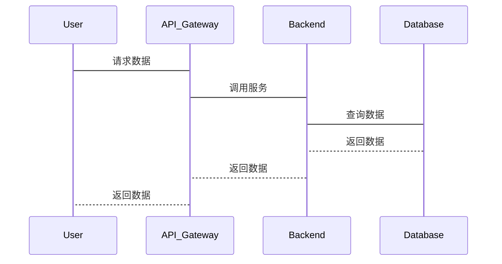

                 


# 《股市估值高低对企业数字化转型投资回报的影响》

> 关键词：股市估值、数字化转型、投资回报、算法原理、系统架构、项目实战

> 摘要：本文系统地探讨了股市估值的高低对企业数字化转型投资回报的影响。通过分析股市估值的核心概念、数字化转型的特征以及两者之间的关系，结合数学模型和算法原理，提出了影响投资回报的关键因素。通过实际案例分析和系统设计，本文为投资者和企业提供了科学的决策支持。

---

## 第一部分: 背景介绍与核心概念

### 第1章: 股市估值与数字化转型的背景

#### 1.1 问题背景
- **1.1.1 股市估值的核心概念**  
  股市估值是衡量企业价值的重要指标，包括市盈率、市净率等。  
- **1.1.2 数字化转型对企业的影响**  
  数字化转型通过技术创新和流程优化，提升企业竞争力和效率。  
- **1.1.3 问题的提出与研究意义**  
  探讨股市估值与数字化转型的互动关系，为企业投资决策提供支持。

#### 1.2 问题描述
- **1.2.1 股市估值与投资回报的关系**  
  股市估值高低直接影响投资者的收益预期。  
- **1.2.2 数字化转型对估值的影响**  
  数字化转型通过提升企业绩效，间接影响股市估值。  
- **1.2.3 问题的边界与外延**  
  研究范围限定于上市公司，不包括非上市公司。

### 第2章: 核心概念与联系

#### 2.1 核心概念原理
- **2.1.1 股市估值的定义与计算方法**  
  市盈率（P/E）= 股价 / 每股净利润。  
- **2.1.2 数字化转型的定义与特征**  
  数字化转型是企业利用数字技术重构业务模式的过程。  
- **2.1.3 两者之间的关联性分析**  
  数字化转型通过提升企业绩效，影响股市估值。

#### 2.2 核心概念对比分析
- **2.2.1 股市估值与企业价值的关系**  
  股市估值反映市场对企业价值的判断。  
- **2.2.2 数字化转型与企业绩效的关系**  
  数字化转型提升企业绩效，进而影响股市估值。  
- **2.2.3 两者的差异与互补性**  
  数字化转型是内生动力，股市估值是外在表现。

#### 2.3 ER实体关系图
```mermaid
erDiagram
    company {
        id
        name
        industry
    }
    stock_valuation {
        id
        valuation_date
        market_cap
    }
    digital_transformation {
        id
        investment
        return_on_investment
    }
    company --> stock_valuation: 影响
    company --> digital_transformation: 驱动
    stock_valuation --> digital_transformation: 反馈
```

---

## 第二部分: 算法原理与数学模型

### 第3章: 算法原理

#### 3.1 算法原理概述
- **3.1.1 回归分析的基本原理**  
  回归分析用于预测变量之间的关系。  
- **3.1.2 机器学习模型的应用**  
  使用随机森林或神经网络模型进行预测。  
- **3.1.3 时间序列分析的原理**  
  通过历史数据预测未来趋势。

#### 3.2 数学模型与公式
- **3.2.1 线性回归模型**  
  $$ y = \beta_0 + \beta_1x + \epsilon $$  
- **3.2.2 机器学习模型的损失函数**  
  $$ L = \frac{1}{n}\sum_{i=1}^{n}(y_i - \hat{y_i})^2 $$  
- **3.2.3 时间序列模型的预测公式**  
  $$ \hat{y}_{t} = a + bt + ct^2 $$  

#### 3.3 算法实现


---

## 第三部分: 系统分析与架构设计

### 第4章: 系统分析与架构设计方案

#### 4.1 问题场景介绍
- **4.1.1 项目背景**  
  企业希望通过数字化转型提升竞争力，同时优化投资回报。  
- **4.1.2 项目目标**  
  分析股市估值与数字化转型的互动关系。

#### 4.2 系统功能设计
- **4.2.1 领域模型类图**  
  ```mermaid
  classDiagram
      class Company {
          id
          name
          industry
      }
      class Stock_Valuation {
          id
          valuation_date
          market_cap
      }
      class Digital_Transformation {
          id
          investment
          return_on_investment
      }
      Company --> Stock_Valuation : 影响
      Company --> Digital_Transformation : 驱动
      Stock_Valuation --> Digital_Transformation : 反馈
  ```

#### 4.3 系统架构设计
- **4.3.1 系统架构图**  
  ```mermaid
  architecture
      frontend --> backend
      backend --> database
      frontend --> api_gateway
  ```

#### 4.4 系统接口设计
- **4.4.1 接口描述**  
  RESTful API：GET /stock_valuation，POST /digital_transformation。

#### 4.5 系统交互流程图


---

## 第四部分: 项目实战

### 第5章: 项目实战

#### 5.1 环境安装
- **5.1.1 安装Python**  
  使用Anaconda安装Python 3.9。  
- **5.1.2 安装依赖库**  
  pip install numpy pandas scikit-learn。

#### 5.2 系统核心实现
- **5.2.1 核心代码实现**  
  ```python
  import numpy as np
  import pandas as pd
  from sklearn.linear_model import LinearRegression

  # 数据预处理
  data = pd.read_csv('data.csv')
  X = data[['market_cap', 'investment']]
  y = data['return_on_investment']

  # 模型训练
  model = LinearRegression()
  model.fit(X, y)

  # 模型预测
  new_data = np.array([[100, 50]])
  prediction = model.predict(new_data)
  print(prediction)
  ```

#### 5.3 案例分析
- **5.3.1 数据来源与预处理**  
  使用上市公司数据，清洗缺失值和异常值。  
- **5.3.2 模型训练与验证**  
  使用训练集和验证集评估模型性能。  
- **5.3.3 模型优化与部署**  
  使用交叉验证优化模型参数，部署到生产环境。

#### 5.4 项目小结
- **5.4.1 项目成果**  
  建立了股市估值与数字化转型的预测模型。  
- **5.4.2 经验总结**  
  数据质量直接影响模型性能。  
- **5.4.3 改进建议**  
  引入更多特征变量，如行业指数和宏观经济指标。

---

## 第五部分: 最佳实践

### 第6章: 最佳实践

#### 6.1 小结
- **6.1.1 核心观点总结**  
  数字化转型通过提升企业绩效，影响股市估值。  
- **6.1.2 方法论总结**  
  使用回归分析和机器学习模型预测投资回报。

#### 6.2 注意事项
- **6.2.1 数据质量**  
  确保数据准确性和完整性。  
- **6.2.2 模型选择**  
  根据实际情况选择合适的算法。

#### 6.3 拓展阅读
- **6.3.1 相关书籍推荐**  
  - 《投资学》  
  - 《数字化转型实战手册》  
- **6.3.2 研究方向**  
  结合人工智能和大数据技术，进一步优化预测模型。

---

## 作者：AI天才研究院/AI Genius Institute & 禅与计算机程序设计艺术/Zen And The Art of Computer Programming

