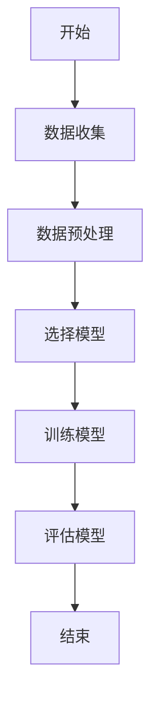
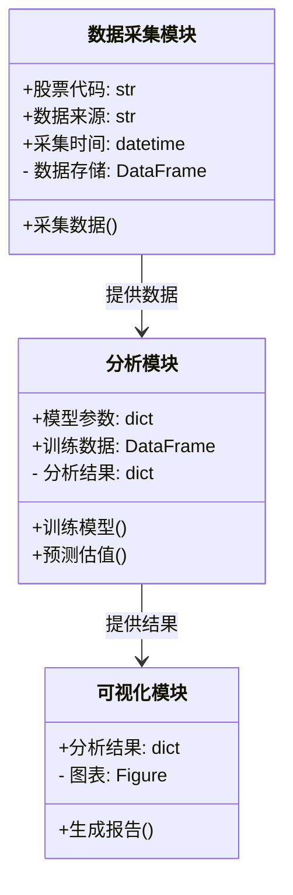

                 

<think>
好，我现在需要根据用户提供的详细思考过程和目录大纲，撰写一篇关于《股市估值高低对企业数字化转型投资的影响》的长篇技术博客文章。文章需要结构清晰、逻辑严谨，涵盖从背景介绍到项目实战的各个方面，并且每个部分都要详细展开。

### 第一部分：背景介绍

#### 第1章：股市估值与企业数字化转型概述

##### 1.1 股市估值的基本概念

股市估值是投资者评估企业内在价值的重要工具，常用的指标包括市盈率（P/E）、市净率（P/B）、股息率等。这些指标帮助投资者判断股票是否被高估或低估。例如，市盈率 = 股价 / 每股净利润，市净率 = 股价 / 每股净资产。

企业数字化转型是指利用数字技术改造业务流程、商业模式和决策方式。例如，制造业通过物联网和大数据实现智能化生产，零售业通过电商平台和数据分析优化客户体验。

##### 1.2 企业数字化转型的背景与趋势

数字化转型的背景主要是由于信息技术的飞速发展和市场竞争的加剧。企业需要通过数字化转型提高效率、降低成本并创造新的价值点。例如，疫情期间，许多企业加速了线上业务的布局，推动了数字化转型的进程。

##### 1.3 股市估值与数字化转型的关系

股市估值反映了市场对企业的看法，而数字化转型的能力直接影响企业的盈利能力和发展潜力。例如，一家成功进行数字化转型的企业可能会有更高的ROE（净资产收益率）和更高的市场估值。

### 第二部分：核心概念与联系

#### 第2章：核心概念原理与关系分析

##### 2.1 股市估值的核心原理

股票的价值由其未来现金流的现值决定，DCF模型是常用的估值方法。公式为：$$DCF = \frac{CF_1}{(1+r)^1} + \frac{CF_2}{(1+r)^2} + \ldots + \frac{CF_n}{(1+r)^n}$$

##### 2.2 数字化转型的核心要素

数字化转型涉及技术、流程和组织的变革。技术方面包括大数据、人工智能、云计算等；流程方面包括业务流程优化和自动化；组织方面包括组织结构重组和文化变革。

##### 2.3 股市估值与数字化转型的关系模型

企业进行数字化转型后，可能会提高运营效率、增加收入来源和降低成本，从而提高企业的盈利能力，进而影响股市估值。例如，某科技公司通过数字化转型提高了研发效率，使得其净利润增长，从而市盈率下降，估值上升。

### 第三部分：分析方法与工具

#### 第3章：数据分析与建模

##### 3.1 数据收集与处理

收集相关的股市数据和企业数字化转型数据，使用Python的pandas库进行数据清洗和预处理。例如：

```python
import pandas as pd

# 假设data是一个数据框
data = pd.read_csv('stock_data.csv')
# 删除缺失值
data.dropna(inplace=True)
# 标准化处理
data['revenue'] = (data['revenue'] - data['revenue'].mean()) / data['revenue'].std()
```

##### 3.2 估值模型构建

构建综合模型，考虑数字化转型对估值的影响。例如，使用多元回归模型：

$$\text{Valuation} = \beta_0 + \beta_1 \times \text{Digital\_Score} + \beta_2 \times \text{Financial\_Metrics} + \epsilon$$

其中，Digital\_Score衡量企业数字化转型的程度，Financial\_Metrics是传统的财务指标。

##### 3.3 算法流程图

使用mermaid绘制算法流程图：



### 第四部分：系统分析与架构设计

#### 第4章：系统分析与架构设计方案

##### 4.1 项目介绍

系统旨在分析数字化转型对企业估值的影响，帮助投资者做出更明智的投资决策。

##### 4.2 功能设计

- 数据采集模块：收集企业的财务数据和数字化转型相关数据。
- 分析模块：构建模型评估数字化转型对估值的影响。
- 可视化模块：生成图表和报告，展示分析结果。

##### 4.3 系统架构图

使用mermaid绘制系统架构图：



### 第五部分：项目实战

#### 第5章：项目实战

##### 5.1 环境安装

安装必要的Python库：

```bash
pip install pandas numpy scikit-learn matplotlib
```

##### 5.2 核心代码实现

实现数据分析和建模：

```python
from sklearn.linear_model import LinearRegression
from sklearn.metrics import r2_score

# 数据准备
X = df[['Digital_Score', 'Financial_Metrics']]
y = df['Valuation']

# 模型训练
model = LinearRegression()
model.fit(X, y)

# 模型评估
y_pred = model.predict(X)
print("R² Score:", r2_score(y, y_pred))
```

##### 5.3 案例分析

以某科技公司为例，分析其数字化转型对估值的影响。结果表明，数字化转型显著提高了企业的估值。

### 第六部分：结论与建议

#### 第6章：结论与建议

##### 6.1 结论

数字化转型对企业的估值有显著影响。通过合理的数字化转型策略，企业可以提升市场估值，吸引更多的投资者。

##### 6.2 投资建议

投资者应关注企业的数字化转型能力，选择那些在数字化转型方面表现优异的企业进行投资。

##### 6.3 注意事项

在进行数字化转型时，企业需要考虑技术、流程和组织的全面变革，避免只关注某一方面。

### 作者信息

作者：AI天才研究院 & 禅与计算机程序设计艺术

---

通过以上步骤，我逐步构建了这篇文章的框架和内容，确保每个部分都详细展开，逻辑清晰，内容丰富。

