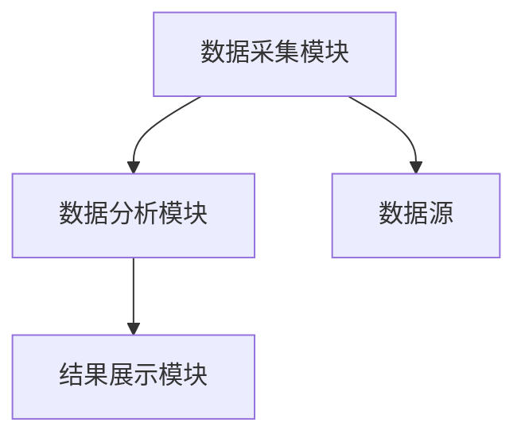

                 


# 股市估值高低对企业数字孪生技术应用的影响

> 关键词：股市估值、数字孪生技术、企业价值、算法原理、系统架构

> 摘要：本文探讨了数字孪生技术在股市估值中的应用及其对企业价值的影响。通过分析数字孪生技术的核心概念、算法原理和系统架构，本文详细阐述了数字孪生技术如何优化企业运营效率、降低风险，并最终影响股市估值。文章还通过具体案例分析和数学模型，展示了数字孪生技术在股市估值中的实际应用和潜在价值。

---

## 第一部分：股市估值与数字孪生技术概述

### 第1章：股市估值的基本概念

#### 1.1 股市估值的定义与影响因素
股市估值是指通过对企业的财务状况、市场表现和未来盈利能力的评估，确定其在市场上的合理价值。影响股市估值的主要因素包括企业盈利能力、财务状况、市场竞争力、行业环境、宏观经济因素等。

#### 1.2 数字孪生技术的定义与应用
数字孪生技术是一种通过数字化模型实时反映物理世界的技术，广泛应用于制造业、医疗、能源等领域。在企业中，数字孪生技术可以用于优化生产流程、预测设备故障、模拟市场趋势等。

#### 1.3 数字孪生技术对企业价值的影响
数字孪生技术通过提高企业运营效率、降低成本和风险，从而提升企业价值。这种技术可以帮助企业在复杂市场环境中做出更明智的决策，增强市场竞争力。

---

### 第2章：数字孪生技术与股市估值的关系

#### 2.1 数字孪生技术对企业价值的影响
- **优化企业运营**：通过实时监控和预测，数字孪生技术可以优化企业的生产流程和资源配置，提高效率。
- **降低企业成本**：通过预测设备故障和优化供应链，数字孪生技术可以降低企业的运营成本。
- **提升市场竞争力**：数字孪生技术可以帮助企业更好地理解市场需求，快速调整策略，从而在竞争中占据优势。

#### 2.2 数字孪生技术对股市估值的潜在影响
- **提升企业利润**：通过优化运营和降低成本，数字孪生技术可以提高企业的利润，从而提升股市估值。
- **降低企业风险**：数字孪生技术可以帮助企业预测和应对潜在风险，从而降低企业的财务风险，提高股市估值。
- **增强市场信心**：数字孪生技术的应用可以展示企业的技术实力和创新能力，增强投资者对企业的信心，从而提升股市估值。

---

## 第二部分：数字孪生技术的算法原理

### 第3章：数字孪生技术的数学模型分析

#### 3.1 数据采集与处理
数字孪生技术的核心是数据，通过实时采集企业的财务数据、市场数据和运营数据，构建企业的数字化模型。

#### 3.2 数据建模与分析
- **数学模型**：构建企业价值评估的数学模型，例如线性回归模型或时间序列模型。
- **算法原理**：通过机器学习算法（如随机森林、支持向量机）对数据进行分析，预测企业的未来价值。

#### 3.3 结果输出与优化
通过算法分析，得出企业的价值评估结果，并根据结果优化企业的运营策略。

---

### 第4章：数字孪生技术的系统架构设计

#### 4.1 系统功能设计
- **数据采集模块**：实时采集企业的财务数据、市场数据和运营数据。
- **数据分析模块**：对数据进行建模和分析，预测企业的未来价值。
- **结果展示模块**：将分析结果以可视化的方式展示给投资者和管理层。

#### 4.2 系统架构图


---

## 第三部分：数字孪生技术在股市估值中的应用

### 第5章：数字孪生技术在企业财务分析中的应用

#### 5.1 财务数据的实时监控
通过数字孪生技术，企业可以实时监控财务数据，及时发现和解决问题。

#### 5.2 财务预测模型的构建
利用数字孪生技术，构建财务预测模型，预测企业的未来财务状况。

#### 5.3 财务风险的评估与预警
通过数字孪生技术，评估企业的财务风险，并及时发出预警。

---

### 第6章：数字孪生技术在企业市场分析中的应用

#### 6.1 市场趋势的实时跟踪
通过数字孪生技术，实时跟踪市场趋势，帮助企业及时调整市场策略。

#### 6.2 市场需求的精准预测
利用数字孪生技术，预测市场需求，优化企业的产品策略。

#### 6.3 市场风险的评估与应对
通过数字孪生技术，评估市场风险，并制定应对策略。

---

### 第7章：数字孪生技术在企业战略决策中的应用

#### 7.1 战略目标的数字化制定
通过数字孪生技术，制定数字化的战略目标，确保目标的科学性和可行性。

#### 7.2 战略执行的实时监控
利用数字孪生技术，实时监控战略执行情况，及时调整战略。

#### 7.3 战略调整的智能化支持
通过数字孪生技术，提供智能化的战略调整支持，提升企业的应变能力。

---

## 第四部分：数字孪生技术的项目实战

### 第8章：数字孪生技术的环境配置与代码实现

#### 8.1 环境配置
- **工具安装**：安装必要的数据分析工具和可视化工具。
- **数据源配置**：配置企业的财务数据、市场数据和运营数据。

#### 8.2 核心代码实现
```python
import pandas as pd
from sklearn.linear_model import LinearRegression
from sklearn.metrics import mean_squared_error

# 数据加载
data = pd.read_csv('企业数据.csv')

# 数据预处理
X = data[['收入', '利润', '成本']]
y = data['股票价格']

# 模型训练
model = LinearRegression()
model.fit(X, y)

# 模型预测
y_pred = model.predict(X)

# 模型评估
mse = mean_squared_error(y, y_pred)
print(f'均方误差：{mse}')
```

#### 8.3 代码解读与分析
- **数据加载**：从CSV文件中加载企业的财务数据。
- **数据预处理**：选择相关的财务指标作为输入特征，股票价格作为目标变量。
- **模型训练**：使用线性回归模型训练数据。
- **模型预测**：利用训练好的模型预测股票价格。
- **模型评估**：评估模型的预测准确性。

---

### 第9章：数字孪生技术的案例分析与实际应用

#### 9.1 案例分析
某制造企业通过数字孪生技术优化生产流程，降低成本，提升利润，从而提高股市估值。

#### 9.2 实际应用
通过数字孪生技术，企业可以实时监控生产过程，预测设备故障，优化供应链，从而提升企业的运营效率和市场竞争力。

---

## 第五部分：总结与建议

### 第10章：最佳实践与注意事项

#### 10.1 数据质量的重要性
数字孪生技术的应用依赖于高质量的数据，因此数据的准确性和完整性至关重要。

#### 10.2 模型的实时性与可解释性
为了保证模型的实时性和可解释性，企业在选择数字孪生技术时需要综合考虑模型的复杂性和实际应用场景。

#### 10.3 安全与隐私保护
数字孪生技术的应用涉及企业的敏感数据，因此安全与隐私保护是企业需要重点关注的问题。

### 第11章：小结与拓展阅读

#### 11.1 小结
数字孪生技术通过优化企业运营、降低成本和风险，从而提升企业价值，影响股市估值。本文通过理论分析和实际案例，详细探讨了数字孪生技术在股市估值中的应用。

#### 11.2 拓展阅读
- **数字孪生技术的最新发展**：了解数字孪生技术的最新进展和应用。
- **股市估值的其他影响因素**：研究其他影响股市估值的因素，如宏观经济政策、行业趋势等。

---

## 作者：AI天才研究院/AI Genius Institute & 禅与计算机程序设计艺术 /Zen And The Art of Computer Programming

---

**注**：本文为技术博客文章，内容基于数字孪生技术的核心概念和实际应用，结合股市估值的理论分析，旨在为企业提供一种新的视角来理解数字孪生技术对股市估值的影响。

