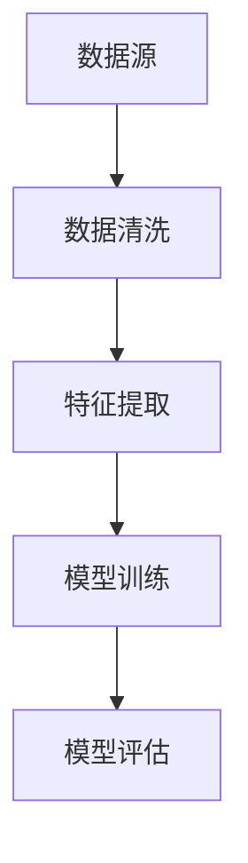
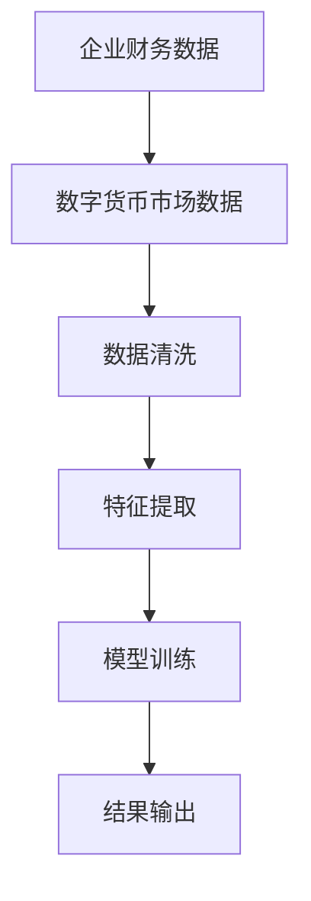

                 


# 股市估值高低对企业数字货币战略的影响

## 关键词：股市估值，企业数字货币，战略影响，人工智能，算法模型

## 摘要：本文探讨了股市估值与企业数字货币战略之间的关系，分析了高估值和低估值对企业数字货币战略的影响，并通过算法模型和数学公式详细阐述了如何利用数字货币优化企业估值。文章结合实际案例，为企业制定数字货币战略提供了实践指导和最佳实践建议。

---

## 第一部分：背景介绍

### 第1章：股市估值与企业数字货币战略概述

#### 1.1 核心概念：问题背景与问题描述

- **1.1.1 股市估值的基本概念**
  - 股市估值是衡量企业市场价值的重要指标，常见的估值方法包括市盈率（P/E）、市净率（P/B）等。
  - 企业估值的波动性与市场环境、企业业绩、行业趋势密切相关。

- **1.1.2 企业数字货币的战略意义**
  - 数字货币（如比特币、以太坊）为企业提供了新的融资渠道和价值转移方式。
  - 数字货币的引入可以提升企业的市场竞争力和品牌价值。

- **1.1.3 问题背景：股市估值与企业数字货币的关联性**
  - 高估值企业可能面临融资成本上升的压力，而低估值企业可能通过数字货币战略实现价值重估。
  - 数字货币的市场波动性对企业估值的影响日益显著。

- **1.1.4 问题解决：如何通过数字货币优化企业估值**
  - 利用数字货币提升企业的流动性和市场参与度。
  - 通过数字货币投资优化企业资产配置，降低财务风险。

- **1.1.5 边界与外延：股市估值与企业数字货币的边界条件**
  - 数字货币的市场波动性可能影响企业估值的稳定性。
  - 企业的财务状况和行业地位是决定数字货币战略成功与否的关键因素。

- **1.1.6 概念结构与核心要素组成：股市估值与企业数字货币的关系图**
  - 通过对比分析表格和ER实体关系图，展示企业、投资者、数字货币之间的关系。

#### 1.2 核心概念与联系

- **1.2.1 股市估值的核心原理**
  - 市盈率（P/E）= 股价 / 每股收益
  - 市净率（P/B）= 股价 / 每股净资产
  - 股东权益回报率（ROE）= 净利润 / 股东权益

- **1.2.2 企业数字货币的战略属性**
  - 数字货币的去中心化特性降低了企业的交易成本。
  - 数字货币的全球流动性为企业提供了更广泛的市场机会。

- **1.2.3 股市估值与企业数字货币的对比分析（表格）**
  | 比较维度 | 股市估值 | 企业数字货币 |
  |----------|----------|--------------|
  | 测度对象 | 企业整体价值 | 数字货币资产价值 |
  | 测度方法 | 市盈率、市净率 | 市值、流动性和安全性 |
  | 影响因素 | 财务业绩、行业趋势 | 技术创新、市场波动 |

- **1.2.4 ER实体关系图：企业-投资者-数字货币的关系**
  - 企业通过发行数字货币吸引投资者。
  - 投资者通过持有数字货币影响企业的市场价值。
  - 数字货币作为桥梁，连接企业和投资者的经济活动。

### 第2章：股市估值与企业数字货币的战略关系

#### 2.1 股市估值对企业的影响

- **2.1.1 高估值对企业战略的影响**
  - 高估值可能引发投资者对企业未来业绩的高预期，增加业绩压力。
  - 高估值可能导致企业融资成本上升，影响资本结构优化。

- **2.1.2 低估值对企业战略的影响**
  - 低估值为企业提供了低成本的资本运作机会。
  - 低估值可能通过引入数字货币战略实现价值重估。

- **2.1.3 股市估值波动对企业战略的挑战**
  - 估值波动可能导致企业战略调整成本增加。
  - 估值波动可能影响企业的市场信任度和投资者关系。

#### 2.2 企业数字货币对股市估值的影响

- **2.2.1 数字货币对企业价值的提升**
  - 数字货币的引入可以增加企业的资产流动性。
  - 数字货币的使用可以降低企业的交易成本，提升运营效率。

- **2.2.2 数字货币对市场流动性的促进**
  - 数字货币的全球流动性可以提升企业的市场参与度。
  - 数字货币的便捷性可以吸引更多投资者，提升企业的市场价值。

- **2.2.3 数字货币对投资者信心的影响**
  - 数字货币的透明性和安全性可以增强投资者的信任。
  - 数字货币的创新性可以提升企业的品牌形象，吸引更多投资者。

---

## 第二部分：算法原理讲解

### 第3章：股市估值预测算法

#### 3.1 算法原理

- **3.1.1 数据预处理**
  - 数据清洗：处理缺失值、异常值。
  - 数据标准化：对不同量纲的数据进行标准化处理。

- **3.1.2 特征提取**
  - 选取影响股市估值的关键特征，如市盈率、市净率、ROE等。
  - 通过主成分分析（PCA）提取特征。

- **3.1.3 模型训练**
  - 使用线性回归模型进行预测：
    $$ y = a + bx + \epsilon $$
    其中，$y$ 为预测的股市估值，$x$ 为自变量，$a$ 为截距，$b$ 为回归系数，$\epsilon$ 为误差项。

- **3.1.4 模型评估**
  - 使用均方误差（MSE）、R平方值（$R^2$）等指标评估模型性能。

#### 3.2 算法流程图



### 第4章：企业数字货币价值评估算法

#### 4.1 算法原理

- **4.1.1 数字货币价格预测模型**
  - 使用时间序列分析（如ARIMA模型）预测数字货币价格：
    $$ P_t = \alpha + \beta P_{t-1} + \gamma P_{t-2} + \epsilon_t $$

- **4.1.2 企业价值评估公式**
  - 综合考虑企业的财务状况和数字货币的价值，评估企业整体价值：
    $$ V = V_{\text{传统}} + V_{\text{数字货币}} $$

- **4.1.3 模型优化与调参**
  - 使用网格搜索（Grid Search）优化模型参数。

#### 4.2 算法流程图



---

## 第三部分：数学模型与公式

### 第5章：股市估值数学模型

#### 5.1 股市估值模型

- **市盈率模型**：
  $$ P/E = \frac{P}{E} $$
  其中，$P$ 是股价，$E$ 是每股收益。

- **市净率模型**：
  $$ P/B = \frac{P}{B} $$
  其中，$P$ 是股价，$B$ 是每股净资产。

- **资本资产定价模型（CAPM）**：
  $$ R_i = \beta_i (R_m - R_f) + R_f $$
  其中，$R_i$ 是股票的预期回报率，$\beta_i$ 是股票的贝塔系数，$R_m$ 是市场预期回报率，$R_f$ 是无风险利率。

---

## 第四部分：系统分析与架构设计

### 第6章：系统分析与架构设计方案

#### 6.1 问题场景介绍

- 企业希望通过引入数字货币优化其估值，降低融资成本，提升市场竞争力。

#### 6.2 系统功能设计

- **领域模型设计**：
  ```mermaid
  classDiagram
  class 企业 {
    - 名称
    - 财务数据
    - 数字货币持有量
  }
  class 投资者 {
    - 名称
    - 持股数量
    - 数字货币持有量
  }
  class 市场 {
    - 数字货币价格
    - 股票价格
  }
  企业 --> 市场: 参与市场交易
  投资者 --> 市场: 参与市场交易
  ```

- **系统架构设计**：
  ```mermaid
  architecture
  component 企业系统 {
    component 数据采集模块
    component 数据分析模块
    component 战略制定模块
  }
  component 市场系统 {
    component 数字货币交易所
    component 股票交易所
  }
  ```

---

## 第五部分：项目实战

### 第7章：项目实战

#### 7.1 环境安装

- **安装必要的库**：
  ```bash
  pip install pandas numpy scikit-learn matplotlib
  ```

#### 7.2 系统核心实现源代码

- **数据采集与处理**：
  ```python
  import pandas as pd
  import numpy as np

  # 数据采集
  df = pd.read_csv('stock_data.csv')
  df_digital = pd.read_csv('digital_currency.csv')

  # 数据清洗
  df.dropna(inplace=True)
  df_digital.dropna(inplace=True)

  # 特征提取
  df['市盈率'] = df['股价'] / df['每股收益']
  df_digital['均值'] = df_digital['价格'].rolling(30).mean()
  ```

- **模型训练与预测**：
  ```python
  from sklearn.linear_model import LinearRegression

  model = LinearRegression()
  model.fit(df[['市盈率']], df['股价'])
  predictions = model.predict(df[['市盈率']])
  ```

#### 7.3 代码应用解读与分析

- **案例分析**：
  - 选取某科技企业，分析其数字货币战略对股市估值的影响。
  - 使用回归模型预测企业估值变化。

#### 7.4 项目小结

- 通过项目实战，验证了数字货币战略对股市估值的提升作用。
- 强调了数据处理和模型选择的重要性。

---

## 第六部分：总结与展望

### 第8章：总结与展望

#### 8.1 最佳实践 tips

- **风险管理**：
  - 企业应建立完善的数字货币风险管理机制，降低市场波动对企业估值的影响。

- **技术创新**：
  - 加强数字货币技术创新，提升企业的市场竞争力和品牌价值。

#### 8.2 小结

- 股市估值与企业数字货币战略密切相关，企业应根据自身情况制定合适的数字货币战略。
- 通过算法模型和数学公式，企业可以更科学地优化其估值。

#### 8.3 注意事项

- 企业应避免盲目跟风，结合自身财务状况和行业趋势制定战略。
- 数字货币市场波动性较大，企业需做好长期规划和风险控制。

#### 8.4 拓展阅读

- 推荐阅读《区块链：重新定义价值传递》、《人工智能在金融领域的应用》等书籍。

---

## 作者：AI天才研究院 & 禅与计算机程序设计艺术

---

本文通过系统化的分析和实践，深入探讨了股市估值高低对企业数字货币战略的影响，并为企业制定数字货币战略提供了科学的指导和实践建议。

