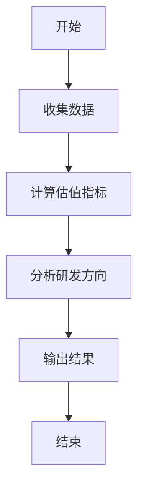
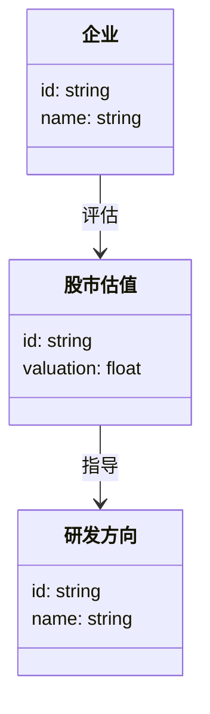
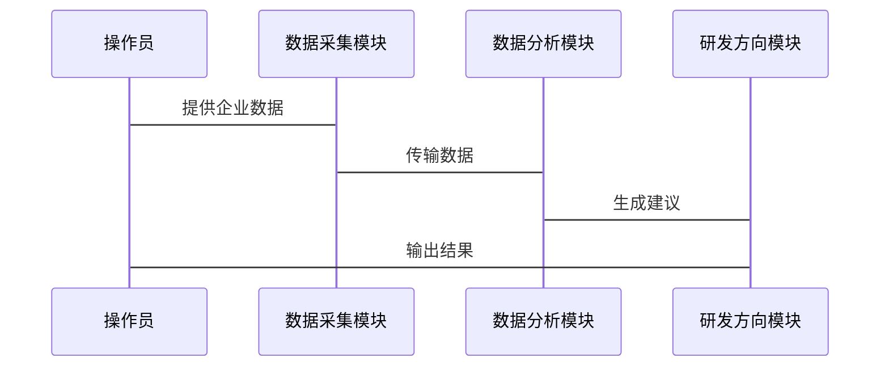

                 


```markdown
# 股市估值高低对企业研发方向选择的影响

> 关键词：股市估值、企业研发方向、投资策略、市场分析、技术评估

> 摘要：股市估值是企业在制定研发方向时的重要参考因素。本文系统分析了股市估值与企业研发方向选择之间的关系，探讨了如何基于股市估值的高低来优化企业的研发策略。文章从背景介绍、核心概念、算法原理、系统分析、项目实战等方面展开，结合实际案例和详细代码，为企业提供实用的指导。

---

## 第1章: 股市估值与企业研发方向概述

### 1.1 股市估值的基本概念

#### 1.1.1 股市估值的定义
股市估值是指通过对企业的财务数据、市场表现和行业状况等多方面因素的分析，评估企业股票的市场价格是否合理。常用的估值指标包括市盈率（P/E）、市净率（P/B）、市销率（P/S）等。

#### 1.1.2 股市估值的核心要素
- **财务数据**：包括收入、利润、资产等。
- **市场环境**：如行业趋势、宏观经济状况。
- **竞争对手分析**：竞争对手的估值水平和市场策略。

#### 1.1.3 股市估值对企业研发的影响
高估的股市估值可能使企业面临更大的压力，需调整研发方向以应对市场的高预期；低估的估值则可能为企业提供更多灵活性，优化研发投入。

### 1.2 企业研发方向的选择

#### 1.2.1 研发方向的选择标准
- **市场需求**：研发方向应符合市场趋势和客户需求。
- **技术可行性**：技术实现的可能性和难度。
- **财务可行性**：研发成本与预期收益的平衡。

#### 1.2.2 研发方向与企业战略的关系
研发方向需与企业长期战略目标一致，支撑企业核心竞争力的提升。

#### 1.2.3 研发方向的市场环境分析
分析行业竞争格局、政策环境、技术发展趋势等因素，确保研发方向的前瞻性。

---

## 第2章: 股市估值与研发方向选择的核心概念

### 2.1 股市估值与研发方向的关联

#### 2.1.1 股市估值对企业研发方向的影响
股市估值的高低直接影响企业研发投入的决策，高估时可能减少非核心研发，低估时则增加研发投入。

#### 2.1.2 研发方向对股市估值的反向影响
成功的研发项目可能提升企业估值，反之亦然。

#### 2.1.3 核心概念的属性对比
| 概念 | 属性 | 描述 |
|------|-------|------|
| 股市估值 | 高低 | 影响研发方向的选择 |
| 研发方向 | 技术性 | 依赖技术可行性 |
| 市场需求 | 变化性 | 需要实时调整 |

### 2.2 股市估值与研发方向选择的ER实体关系图

```mermaid
erDiagram
    enterprise[企业] {
        id: string
        name: string
        industry: string
    }
    stock_valuation[股市估值] {
        id: string
        valuation_method: string
        value: float
    }
   研发方向 {
        id: string
        name: string
        priority: int
    }
    enterprise -|> stock_valuation: 评估
    stock_valuation -|> 研发方向: 指导
   研发方向 -|> enterprise: 实施
```

---

## 第3章: 股市估值与研发方向选择的算法原理

### 3.1 算法原理概述

#### 3.1.1 算法的输入与输出
- **输入**：企业财务数据、市场估值指标、行业趋势。
- **输出**：推荐的研发方向和优先级。

#### 3.1.2 算法的数学模型
回归分析模型：
$$ y = \beta_0 + \beta_1x_1 + \beta_2x_2 + \epsilon $$
其中，$y$为研发方向的优先级，$x_1$为市盈率，$x_2$为行业趋势指数。

#### 3.1.3 算法的流程图



### 3.2 算法实现与代码示例

#### 3.2.1 环境安装与配置
安装Python和相关库（如Pandas、Scikit-learn）。

#### 3.2.2 核心算法实现

```python
import pandas as pd
from sklearn.linear_model import LinearRegression

def calculate_priority(stock_valuation, industry_trend):
    model = LinearRegression()
    # 假设 stock_valuation 和 industry_trend 是数据集
    model.fit(stock_valuation[['P/E', 'P/B']], industry_trend)
    predicted_priority = model.predict([[stock_valuation['P/E'], stock_valuation['P/B']]])
    return predicted_priority

# 示例数据
data = {
    'P/E': [15, 20, 18, 25],
    'P/B': [3, 4, 2, 5],
    'industry_trend': [1.2, 1.5, 1.3, 1.6]
}
df = pd.DataFrame(data)
stock_valuation = df[['P/E', 'P/B']]
industry_trend = df['industry_trend']
priority = calculate_priority(stock_valuation, industry_trend)
print(priority)
```

---

## 第4章: 股市估值与研发方向选择的系统分析

### 4.1 系统功能设计

#### 4.1.1 问题场景介绍
企业需要根据当前股市估值和市场趋势，调整研发方向，优化资源配置。

#### 4.1.2 系统功能模块
- 数据采集模块：收集企业财务数据和市场估值指标。
- 分析评估模块：评估股市估值，生成研发方向建议。
- 结果输出模块：输出研发方向优先级和详细报告。

### 4.2 系统架构设计



### 4.3 系统接口设计



---

## 第5章: 项目实战

### 5.1 环境安装与配置
安装Python、Pandas、Scikit-learn。

### 5.2 核心代码实现

```python
import pandas as pd
from sklearn.linear_model import LinearRegression

def main():
    # 示例数据
    data = {
        'P/E': [15, 20, 18, 25],
        'P/B': [3, 4, 2, 5],
        '研发方向优先级': [3, 4, 3, 5]
    }
    df = pd.DataFrame(data)
    
    # 训练模型
    model = LinearRegression()
    model.fit(df[['P/E', 'P/B']], df['研发方向优先级'])
    
    # 预测新数据
    new_data = [[20, 4]]
    prediction = model.predict(new_data)
    print(f"预测优先级：{prediction[0]:.2f}")

if __name__ == "__main__":
    main()
```

### 5.3 案例分析
以某科技公司为例，分析其股市估值和研发方向的选择，展示如何优化研发投入。

---

## 第6章: 总结与展望

### 6.1 最佳实践 tips
- 定期评估股市估值，及时调整研发方向。
- 结合多种指标和市场因素，制定全面的策略。

### 6.2 小结
股市估值是企业研发方向选择的重要参考，通过系统化的分析和算法优化，可以提升研发效率和企业价值。

### 6.3 注意事项
- 数据的准确性和及时性至关重要。
- 结合企业实际情况，灵活调整策略。

### 6.4 拓展阅读
推荐相关书籍和论文，进一步深入学习。

---

## 作者：AI天才研究院 & 禅与计算机程序设计艺术

---

通过以上结构和内容，我们全面分析了股市估值对企业研发方向选择的影响，结合理论与实践，为企业提供了切实可行的指导。
```

