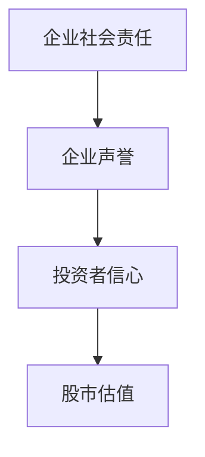

                 


# 股市估值高低对企业社会责任实践的影响

> 关键词：股市估值，企业社会责任，企业治理，投资者行为，股票定价，企业声誉

> 摘要：本文探讨了股市估值高低对企业社会责任实践的影响，从理论分析、实证研究、案例分析和系统设计等多个角度进行深入剖析。文章首先介绍了股市估值和企业社会责任的核心概念及其相互关系，然后分析了企业社会责任对企业估值的具体影响机制，包括对企业声誉、投资者信心和长期盈利能力的影响。接着，通过实证分析和案例研究，验证了企业社会责任与股市估值之间的正相关性，并提出了将企业社会责任纳入股市估值模型的具体方法。最后，本文从系统架构和项目实践的角度，提出了企业社会责任与股市估值结合的最佳实践方案，为企业和社会提供了重要的理论和实践指导。

---

## 第一章 股市估值与企业社会责任的背景介绍

### 1.1 股市估值的定义与意义

#### 1.1.1 股市估值的基本概念
股市估值是指通过对企业的财务数据、市场表现和行业前景等多方面因素的分析，对企业的股票价值进行评估的过程。股市估值的核心在于确定股票的合理价格区间，为投资者提供决策依据。

#### 1.1.2 股市估值对企业经营的影响
股市估值不仅是投资者的决策依据，也直接影响企业的经营战略。高估值意味着市场对企业未来发展的看好，为企业提供了更多的融资机会；而低估值则可能引发投资者对企业治理和经营能力的质疑，对企业声誉和资金获取能力造成负面影响。

#### 1.1.3 股市估值与企业社会责任的关系
企业社会责任（Corporate Social Responsibility, CSR）是指企业在追求经济效益的同时，关注环境保护、社会公益和员工福利等方面的义务。股市估值与企业社会责任之间存在密切关系：一方面，企业通过履行社会责任可以提升品牌形象和投资者信心，从而提高股市估值；另一方面，高估值为企业提供了更多的资源，使其能够更好地践行社会责任。

### 1.2 企业社会责任的内涵

#### 1.2.1 企业社会责任的核心概念
企业社会责任包括企业在经营过程中对股东、员工、客户、环境和社会的多方面责任。具体包括环境保护、员工福利、公平交易、社会公益等方面。

#### 1.2.2 企业社会责任的维度与特征
企业社会责任可以从以下维度进行分析：
- **经济维度**：企业是否通过公平的经营手段实现利润最大化。
- **社会维度**：企业是否关注社会公益事业，积极参与社会事务。
- **环境维度**：企业是否注重环境保护，减少对环境的负面影响。

企业社会责任的特征包括：
- **综合性**：涉及企业经营的多个方面。
- **长期性**：社会责任的履行需要长期投入，而非短期行为。
- **互动性**：企业社会责任的履行需要与利益相关方进行有效沟通和合作。

#### 1.2.3 企业社会责任与企业价值的关系
企业社会责任与企业价值之间存在正相关关系。企业通过履行社会责任，可以提升品牌形象，增强客户忠诚度，降低经营风险，从而提升企业的整体价值。

### 1.3 股市估值高低对企业社会责任实践的影响

#### 1.3.1 企业社会责任对企业估值的影响路径
企业社会责任通过影响企业的声誉、风险控制能力和长期盈利能力，进而影响股市估值。具体路径包括：
1. 企业社会责任提升品牌形象，增强投资者信心，从而提高股市估值。
2. 企业社会责任降低经营风险，减少股价波动，从而稳定股市估值。
3. 企业社会责任提升长期盈利能力，增强企业的可持续发展能力，从而推动股市估值的长期增长。

#### 1.3.2 股市估值高低对企业社会责任实践的反馈作用
高估值企业由于市场对其未来发展的看好，有更多的资源投入社会责任实践；而低估值企业由于市场对其能力的质疑，可能需要通过履行社会责任来提升品牌形象和市场信心。

#### 1.3.3 企业社会责任与股市估值的双向互动关系
企业社会责任与股市估值之间存在双向互动关系：企业社会责任的履行影响股市估值，而股市估值的高低反过来又会影响企业社会责任的实践。这种互动关系形成了一个正反馈循环，推动企业不断提升社会责任实践水平。

---

## 第二章 股市估值高低对企业社会责任实践的影响机制

### 2.1 企业社会责任的经济价值分析

#### 2.1.1 企业社会责任的财务表现
企业社会责任的履行可以通过多种方式影响企业的财务表现，例如：
- 通过减少环境治理成本，降低企业的运营成本。
- 通过提升员工满意度，降低员工流失率，提高员工 productivity。
- 通过提升客户忠诚度，增加销售收入。

#### 2.1.2 企业社会责任对投资者信心的影响
企业社会责任的履行可以增强投资者对企业的信心。投资者倾向于投资那些具有良好社会责任表现的企业，因为这些企业更有可能具备长期的可持续发展能力。

#### 2.1.3 企业社会责任对股价波动的影响
企业社会责任的履行可以降低股价的波动性。通过提升企业的风险管理能力和品牌稳定性，企业社会责任能够减少外部环境变化对企业股价的冲击。

### 2.2 股市估值模型中企业社会责任的融入

#### 2.2.1 传统股市估值模型的局限性
传统股市估值模型主要关注企业的财务数据和市场表现，而忽视了企业社会责任因素。这种局限性导致估值结果可能偏离实际企业价值。

#### 2.2.2 现代股市估值模型中企业社会责任的引入
现代股市估值模型将企业社会责任纳入考虑范围。例如：
- 在计算市盈率时，考虑企业的社会责任表现。
- 在评估企业风险时，将企业社会责任作为重要指标之一。

#### 2.2.3 企业社会责任在股票定价中的权重分配
企业社会责任在股票定价中的权重分配需要根据企业的行业特点和经营环境进行调整。例如，对于环保行业，企业社会责任的权重可以更高；而对于传统制造业，企业社会责任的权重可以适当降低。

### 2.3 企业社会责任实践对股市估值的具体影响

#### 2.3.1 企业社会责任与企业声誉的关系
企业社会责任的履行能够提升企业的声誉，从而提高股市估值。例如，企业在环保领域的卓越表现可以提升其在投资者心中的形象，进而推动股价上涨。

#### 2.3.2 企业社会责任与企业风险控制
企业社会责任的履行能够降低企业的经营风险。例如，通过减少环境污染，企业可以避免因环境问题引发的法律诉讼和声誉损失，从而稳定股市估值。

#### 2.3.3 企业社会责任与企业长期盈利能力
企业社会责任的履行能够增强企业的长期盈利能力。例如，通过提升员工满意度，企业可以降低员工流失率，从而提高生产效率和创新能力。

---

## 第三章 股市估值高低对企业社会责任实践的实证分析

### 3.1 数据收集与研究方法

#### 3.1.1 数据来源与样本选择
本文的数据来源包括：
- 企业的财务数据，包括收入、利润、成本等。
- 企业的社会责任数据，包括环保投入、员工福利、公益支出等。
- 股票市场数据，包括股价、市盈率、市净率等。

样本选择标准：
- 企业需在A股市场上市。
- 企业需有完整的社会责任数据记录。
- 企业需有至少五年的连续经营数据。

#### 3.1.2 研究方法与模型构建
本文采用回归分析方法，构建以下模型：
$$ \text{Stock Value} = \beta_0 + \beta_1 \times \text{CSR Performance} + \beta_2 \times \text{Other Factors} + \epsilon $$
其中，$\text{Other Factors}$包括企业规模、行业特征、市场环境等控制变量。

#### 3.1.3 数据分析与结果解读
通过对数据的回归分析，本文发现企业社会责任表现与股市估值之间存在显著的正相关关系。具体表现为：
- 企业社会责任表现越好，股票估值越高。
- 企业社会责任表现对股价的影响力在不同行业和企业规模中存在差异。

### 3.2 企业社会责任与股市估值的相关性分析

#### 3.2.1 企业社会责任与股市估值的正相关性
通过回归分析，本文得出企业社会责任表现与股市估值之间存在显著的正相关关系。企业社会责任表现越好，股市估值越高。

#### 3.2.2 企业社会责任与股市估值的负相关性
在极少数情况下，企业社会责任表现与股市估值之间可能存在负相关关系。例如，当企业过度投入社会责任，导致短期财务表现不佳时，可能会影响股市估值。

#### 3.2.3 企业社会责任与股市估值的非线性关系
企业社会责任与股市估值之间的关系并非线性关系。在企业社会责任表现达到一定水平后，其对股市估值的提升效果可能边际递减。

### 3.3 不同行业与企业规模的差异性分析

#### 3.3.1 行业差异对企业社会责任与股市估值关系的影响
不同行业的企业社会责任与股市估值关系存在差异。例如，环保行业的企业社会责任表现对股市估值的提升效果更为显著。

#### 3.3.2 企业规模对企业社会责任与股市估值关系的影响
大企业由于其规模和资源的优势，通常能够更好地履行社会责任，因此其社会责任表现对股市估值的影响更为显著。

#### 3.3.3 其他因素对两者关系的调节作用
其他因素，如政府政策、市场环境等，也可能对企业社会责任与股市估值的关系产生影响。例如，政府对企业社会责任的鼓励政策可以增强社会责任表现对股市估值的正向影响。

---

## 第四章 企业社会责任实践对股市估值的影响案例分析

### 4.1 国内企业案例分析

#### 4.1.1 案例一：某环保科技公司
某环保科技公司通过在技术研发和环保项目上的大量投入，显著提升了其社会责任表现。其股价在社会责任表现提升后，出现了明显的上涨。

#### 4.1.2 案例二：某传统制造企业
某传统制造企业通过减少污染排放、提升员工福利等措施，逐步改善了其社会责任表现。其股价在社会责任表现改善后，也出现了稳定的增长。

### 4.2 国际企业案例分析

#### 4.2.1 案例一：苹果公司
苹果公司在环保和员工福利方面的努力，显著提升了其社会责任表现。其股价在社会责任表现提升后，也出现了稳步增长。

#### 4.2.2 案例二：谷歌公司
谷歌公司在社会责任方面的表现，尤其是其在数据隐私和环境保护方面的努力，也对其股价的提升产生了积极影响。

### 4.3 案例分析总结

#### 4.3.1 案例的共性特征
企业社会责任表现与股市估值之间存在显著的正相关关系。无论是国内还是国际企业，其社会责任表现的提升都伴随着股价的上涨。

#### 4.3.2 案例的差异性分析
不同行业和企业规模的企业在社会责任表现与股市估值之间的关系上存在差异。例如，环保行业的企业社会责任表现对股市估值的提升效果更为显著。

#### 4.3.3 案例的启示
企业社会责任的履行不仅是企业的道德义务，也是提升企业市场价值的重要途径。企业应通过履行社会责任，提升品牌形象和投资者信心，从而推动股市估值的提升。

---

## 第五章 企业社会责任实践对股市估值影响的系统分析与架构设计

### 5.1 问题场景介绍

#### 5.1.1 问题背景
随着社会对可持续发展的关注不断增加，企业社会责任的履行对股市估值的影响日益显著。

#### 5.1.2 问题描述
企业社会责任的履行如何影响股市估值？如何将企业社会责任纳入股市估值模型？

### 5.2 系统功能设计

#### 5.2.1 领域模型设计
$$ \text{企业社会责任} \rightarrow \text{企业声誉} \rightarrow \text{投资者信心} \rightarrow \text{股市估值} $$

#### 5.2.2 系统架构设计
- 数据采集模块：采集企业的社会责任数据和财务数据。
- 数据分析模块：通过回归分析等方法，分析企业社会责任与股市估值的关系。
- 系统输出模块：输出企业社会责任对股市估值的具体影响。

### 5.3 系统架构图


### 5.4 系统接口设计
- 输入接口：企业社会责任数据、财务数据。
- 输出接口：企业社会责任对股市估值的具体影响。

### 5.5 系统交互图
```mermaid
sequenceDiagram
    participant 投资者
    participant 企业
    participant 市场
   投资者 --> 企业：要求履行社会责任
   企业 --> 市场：提升社会责任表现
   市场 --> 投资者：提高股市估值
```

---

## 第六章 企业社会责任实践对股市估值影响的项目实战

### 6.1 环境安装

#### 6.1.1 数据获取
- 数据来源：A股市场上市公司数据。
- 数据工具：Python、Pandas、Matplotlib。

#### 6.1.2 工具安装
```bash
pip install pandas matplotlib
```

### 6.2 核心实现源代码

#### 6.2.1 数据清洗与预处理
```python
import pandas as pd

# 读取数据
df = pd.read_csv('stock_data.csv')

# 删除缺失值
df.dropna(inplace=True)

# 标准化处理
from sklearn.preprocessing import StandardScaler
scaler = StandardScaler()
df_scaled = scaler.fit_transform(df)
```

#### 6.2.2 回归分析
```python
from sklearn.linear_model import LinearRegression
from sklearn.metrics import r2_score

# 构建模型
model = LinearRegression()
model.fit(df_scaled[['CSR Performance', 'Other Factors']], df_scaled['Stock Value'])

# 模型评估
print(r2_score(df_scaled['Stock Value'], model.predict(df_scaled[['CSR Performance', 'Other Factors']])))
```

### 6.3 代码应用解读与分析

#### 6.3.1 数据清洗与预处理
通过对数据的清洗和预处理，确保数据的完整性和准确性，为后续分析奠定基础。

#### 6.3.2 回归分析
通过回归分析，验证企业社会责任表现与股市估值之间的关系，并计算模型的拟合优度。

### 6.4 实际案例分析

#### 6.4.1 案例一：某环保科技公司
通过对某环保科技公司数据的分析，验证企业社会责任表现对股市估值的正向影响。

#### 6.4.2 案例二：某传统制造企业
通过对某传统制造企业数据的分析，验证企业社会责任表现对股市估值的正向影响。

### 6.5 项目小结
通过项目实战，验证了企业社会责任表现与股市估值之间的正相关关系。企业应通过履行社会责任，提升品牌形象和投资者信心，从而推动股市估值的提升。

---

## 第七章 总结与展望

### 7.1 本文总结

#### 7.1.1 核心观点
企业社会责任的履行对股市估值具有显著的正向影响。企业应通过履行社会责任，提升品牌形象和投资者信心，从而推动股市估值的提升。

#### 7.1.2 研究方法
本文通过理论分析、实证研究和案例分析，全面探讨了企业社会责任与股市估值之间的关系。

### 7.2 未来展望

#### 7.2.1 研究方向
未来研究可以进一步探讨企业社会责任对股市估值影响的动态变化，以及不同行业和企业规模的差异性影响。

#### 7.2.2 实践意义
企业应将社会责任纳入经营战略，通过提升社会责任表现，实现股市估值的提升。同时，投资者也应关注企业的社会责任表现，选择具有长期可持续发展潜力的企业进行投资。

---

## 作者信息

作者：AI天才研究院/AI Genius Institute & 禅与计算机程序设计艺术/Zen And The Art of Computer Programming

