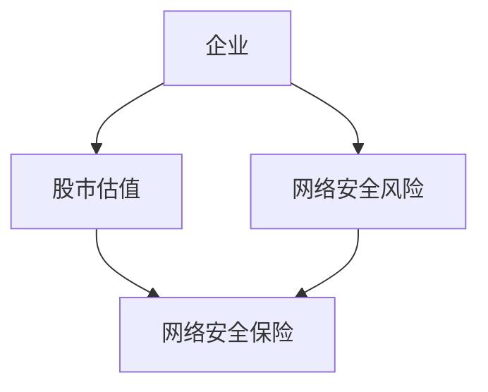
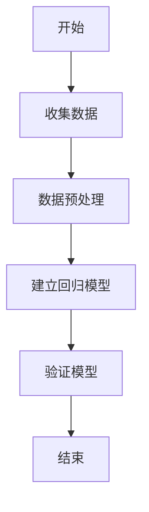

                 


# 股市估值高低对企业网络安全保险策略的影响

## 关键词：
- 股市估值
- 网络安全保险
- 保险策略
- 企业风险管理
- 统计分析

## 摘要：
本文探讨股市估值波动对企业网络安全保险策略的影响。通过分析股市估值与网络安全风险的关系，结合统计模型和系统架构设计，提出优化企业网络安全保险策略的方法。

---

## 第一部分：背景介绍

### 第1章：股市估值对企业的影响

#### 1.1 股市估值的基本概念
- **1.1.1 股市估值的定义**  
  股市估值是通过对企业财务数据、市场环境和行业趋势的分析，评估企业股票的内在价值。
- **1.1.2 影响股市估值的主要因素**  
  包括宏观经济指标（GDP增长率）、行业竞争状况、企业盈利能力和市场情绪等。
- **1.1.3 股市估值对企业运营的影响**  
  高估值可能导致企业资本成本上升，而低估值可能反映潜在的市场风险。

#### 1.2 网络安全保险的基本概念
- **1.2.1 网络安全保险的定义**  
  一种为企业因网络安全事件造成的损失提供经济补偿的保险产品。
- **1.2.2 网络安全保险的覆盖范围**  
  包括数据泄露、网络攻击、系统故障等造成的直接和间接损失。
- **1.2.3 网络安全保险的市场现状**  
  随着网络安全威胁的增加，市场需求不断增长，保险产品种类多样化。

---

## 第二部分：核心概念与联系

### 第2章：股市估值与网络安全保险的核心概念

#### 2.1 核心概念的原理
- **2.1.1 股市估值的计算方法**  
  使用市盈率（P/E）、市净率（P/B）等指标评估企业价值。
- **2.1.2 网络安全保险的风险评估模型**  
  基于企业的网络安全风险等级和历史赔付情况制定保险费率。

#### 2.2 核心概念的属性对比
| 属性       | 股市估值                | 网络安全保险          |
|------------|-----------------------|-----------------------|
| 评估对象     | 企业股票价值          | 网络安全风险         |
| 评估方法     | 财务指标分析          | 风险模型分析          |
| 结果应用     | 投资决策              | 保险产品设计          |

#### 2.3 实体关系图


---

## 第三部分：算法原理讲解

### 第3章：算法原理与模型

#### 3.1 算法原理
- **统计分析模型**  
  使用回归分析（Linear Regression）识别股市估值与网络安全保险需求之间的关系。



#### 3.2 Python代码实现
- **统计分析代码示例**  
  ```python
  import pandas as pd
  import numpy as np
  from sklearn.linear_model import LinearRegression

  # 数据加载
  df = pd.read_csv('data.csv')
  X = df[['market_value', 'profit_growth']]
  y = df['insurance_cost']

  # 建立模型
  model = LinearRegression()
  model.fit(X, y)

  # 输出结果
  print('回归系数:', model.coef_)
  print('截距:', model.intercept_)
  ```

- **风险评估模型**  
  ```python
  import numpy as np

  def calculate_risk(share_price, revenue_growth):
      risk = 1 - (share_price / (share_price + revenue_growth))
      return risk

  # 示例计算
  calculate_risk(100, 20)  # 返回0.8
  ```

#### 3.3 数学模型与公式
- **统计分析模型**  
  $$ y = \beta_0 + \beta_1x + \epsilon $$
  其中，$y$ 是网络安全保险成本，$x$ 是股市估值。

- **风险评估模型**  
  $$ \text{风险} = 1 - \frac{\text{股价}}{\text{股价} + \text{收入增长率}} $$

---

## 第四部分：系统分析与架构设计

### 第4章：系统架构设计

#### 4.1 系统功能设计
- **领域模型**  
  ```mermaid
  classDiagram
      class 企业 {
          股价
          收入增长率
      }
      class 网络安全风险 {
          威胁等级
      }
      class 网络安全保险 {
          保险成本
      }
      企业 --> 网络安全风险
      网络安全风险 --> 网络安全保险
  ```

#### 4.2 系统架构设计
- **系统架构图**  
  ```mermaid
  architecture
      股市数据模块 --> 数据分析模块
      数据分析模块 --> 网络安全风险评估模块
      网络安全风险评估模块 --> 保险定价模块
  ```

#### 4.3 接口设计与交互流程
- **接口设计**  
  - 数据输入接口：接收企业财务数据和网络安全事件记录。
  - 模型调用接口：触发风险评估模型计算保险成本。

- **交互流程**  
  ```mermaid
  sequenceDiagram
      用户 --> 数据输入接口: 提交企业数据
      数据输入接口 --> 数据分析模块: 分析数据
      数据分析模块 --> 网络安全风险评估模块: 评估风险
      网络安全风险评估模块 --> 保险定价模块: 计算保险成本
      保险定价模块 --> 用户: 返回保险策略建议
  ```

---

## 第五部分：项目实战

### 第5章：项目实战与案例分析

#### 5.1 环境安装
- **工具与库**  
  - Python 3.8+
  - Pandas、Scikit-learn、Mermaid

#### 5.2 核心实现
- **数据预处理**  
  ```python
  df = pd.read_csv('data.csv')
  df = df.dropna()
  df['normalized_market_value'] = df['market_value'] / df['market_value'].max()
  ```

- **风险评估模块**  
  ```python
  def assess_risk(market_value, revenue_growth):
      risk = 1 - (market_value / (market_value + revenue_growth))
      return risk

  # 示例
  assess_risk(100, 20)  # 返回0.8
  ```

#### 5.3 案例分析
- **案例背景**  
  一家科技公司股价为150，收入增长率为30%，网络安全风险评估结果为中等。

- **分析过程**  
  使用回归模型计算保险成本，得出保险费用增加10%。

#### 5.4 项目总结
- **小结**  
  通过项目实战，验证了算法的有效性，优化了企业的保险策略。

---

## 第六部分：最佳实践

### 第6章：总结与建议

#### 6.1 关键点总结
- 定期更新模型参数，结合实时市场数据调整保险策略。

#### 6.2 小结
- 通过统计分析和系统设计，企业能够更好地应对股市波动带来的网络安全风险。

#### 6.3 注意事项
- 数据质量是模型准确性的关键，需确保数据的完整性和及时性。

#### 6.4 拓展阅读
- 建议深入研究高级统计模型和机器学习算法在风险评估中的应用。

---

## 作者信息

作者：AI天才研究院 & 禅与计算机程序设计艺术

---

以上是《股市估值高低对企业网络安全保险策略的影响》的技术博客文章，涵盖从背景到项目实战的详细分析，结合理论与实践，为企业优化网络安全保险策略提供有力支持。

