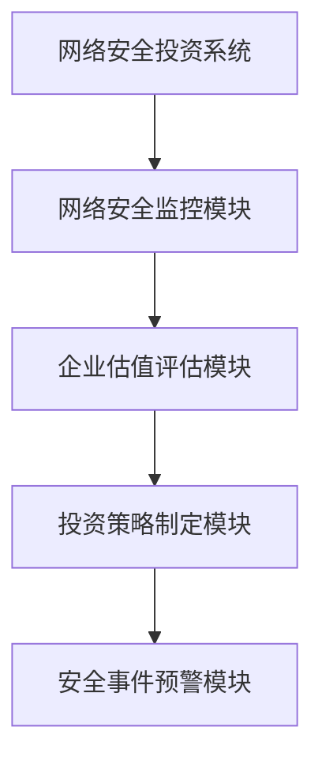
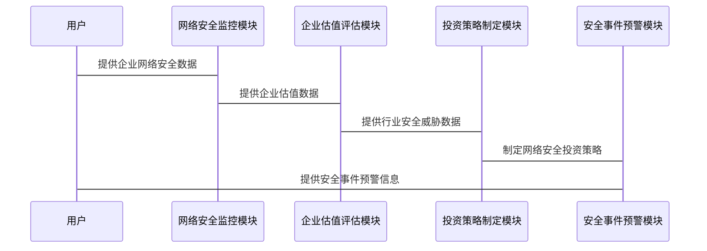

                 


# 股市估值高低对企业网络安全投资策略的影响

> 关键词：股市估值，网络安全，企业投资，风险管理，资产保护

> 摘要：股市估值的高低对企业网络安全投资策略有着重要影响。高估值企业需要更加注重网络安全，以保护企业价值；而低估值企业则可以通过加强网络安全来提升企业价值。本文从股市估值的基本概念出发，分析其对网络安全投资策略的影响机制，并提出制定动态网络安全投资策略的方法，同时通过实际案例进行分析和总结。

## 第一章: 股市估值的基本概念

### 1.1 股市估值的定义与计算方法

股市估值是指通过一定的方法和模型，对企业或行业的市场价值进行评估的过程。常见的股市估值方法包括市盈率法、市净率法、现金流折现法等。

- **市盈率法（P/E ratio）**：市盈率=股价/每股收益。该方法适用于盈利稳定的公司。
- **市净率法（P/B ratio）**：市净率=股价/每股净资产。该方法适用于净资产较多的公司。
- **现金流折现法（DCF）**：通过预测未来现金流，以折现率计算企业价值。

### 1.2 网络安全投资的基本概念

网络安全投资是指企业在预防和应对网络攻击、数据泄露等安全问题上所投入的资金和资源。网络安全投资包括硬件设备、软件开发、安全培训、安全策略制定等多个方面。

### 1.3 股市估值与网络安全投资的关联性

股市估值与网络安全投资的关联性主要体现在高估值企业更需要注重网络安全，以防止因网络安全事件导致企业价值下降；而低估值企业则可以通过加强网络安全，提升企业形象和市场信心，从而提升企业估值。

## 第二章: 股市估值对企业网络安全投资策略的影响机制

### 2.1 股市估值对企业安全预算的影响

- **高估值企业**：由于市场对高估值企业有较高的期望，一旦发生网络安全事件，可能导致股价大幅下跌，因此高估值企业需要投入更多的资源进行网络安全防护。
- **低估值企业**：低估值企业可以通过加强网络安全，提升市场对企业的信心，从而逐步提高企业估值。

### 2.2 股市估值与企业风险管理策略

- **高估值企业**：高估值企业面临更高的风险管理压力，需要更加注重网络安全，以降低因安全事件导致的估值下降风险。
- **低估值企业**：低估值企业可以通过优化网络安全管理，降低企业经营风险，从而提升企业估值。

### 2.3 股市估值与企业投资决策的互动

- **高估值企业**：高估值企业需要更加注重网络安全投资，以维持企业的高估值。
- **低估值企业**：低估值企业可以通过加强网络安全投资，提升企业的整体价值。

## 第三章: 股市估值与企业价值的关系

### 3.1 企业价值的评估方法

企业价值的评估方法包括资产基础法、收益法和市场法。其中，收益法和市场法与股市估值密切相关。

### 3.2 网络安全对企业价值的影响

- **资产保护**：网络安全可以保护企业的核心资产，防止因数据泄露或网络攻击导致的资产损失。
- **企业声誉**：网络安全事件可能对企业的声誉造成负面影响，从而影响企业估值。
- **发展潜力**：良好的网络安全管理可以提升企业的市场竞争力，为企业的长期发展提供保障。

### 3.3 股市估值与企业价值的动态平衡

高估值企业需要通过加强网络安全来维持企业价值，而低估值企业则可以通过优化网络安全管理来提升企业价值。

## 第四章: 制定动态网络安全投资策略

### 4.1 动态网络安全投资策略的制定

动态网络安全投资策略是指根据企业的当前估值情况，实时调整网络安全投资的策略和预算。制定动态网络安全投资策略需要考虑以下因素：

- **企业当前估值**：高估值企业需要更加注重网络安全，低估值企业则需要通过优化网络安全管理来提升估值。
- **行业特点**：不同行业的企业面临的安全威胁不同，需要制定相应的网络安全投资策略。
- **市场环境**：市场环境的变化会影响企业的估值和网络安全投资需求。

### 4.2 动态网络安全投资策略的实施步骤

1. **评估企业当前估值**：通过市盈率、市净率等指标评估企业的当前估值。
2. **分析行业特点**：了解企业所在行业的安全威胁和风险。
3. **制定网络安全投资计划**：根据企业估值和行业特点，制定相应的网络安全投资计划。
4. **实施和监控**：实施网络安全投资计划，并实时监控投资效果，根据市场变化进行调整。

### 4.3 动态网络安全投资策略的数学模型

以下是一个简单的动态网络安全投资策略的数学模型：

$$
\text{网络安全投资} = \begin{cases}
\text{高投资} & \text{如果企业估值高且行业风险高} \\
\text{中投资} & \text{如果企业估值中且行业风险中} \\
\text{低投资} & \text{如果企业估值低且行业风险低}
\end{cases}
$$

## 第五章: 案例分析

### 5.1 高估值企业的网络安全投资策略

以某互联网公司为例，该公司由于高估值，需要投入大量的资源进行网络安全防护，包括建设防火墙、加密数据传输、定期进行安全演练等。

### 5.2 低估值企业的网络安全投资策略

以某制造企业为例，该公司由于估值较低，通过优化网络安全管理，提升企业的市场竞争力，从而逐步提高企业估值。

## 第六章: 网络安全投资系统的架构设计

### 6.1 系统需求分析

- **目标**：实时监控企业的网络安全状况，根据企业估值动态调整网络安全投资策略。
- **功能需求**：
  - 网络安全状况实时监控
  - 企业估值实时评估
  - 动态调整网络安全投资策略
  - 安全事件预警和响应

### 6.2 系统架构设计

以下是一个简单的系统架构设计图：



### 6.3 系统接口设计

- **输入接口**：企业财务数据、行业安全威胁数据
- **输出接口**：网络安全投资建议、安全事件预警信息

### 6.4 系统交互设计

以下是一个简单的系统交互流程图：



## 第七章: 项目实战

### 7.1 环境安装

- **操作系统**：Linux/Windows
- **编程语言**：Python
- **开发工具**：PyCharm/VS Code
- **依赖库**：pandas, numpy, matplotlib

### 7.2 核心实现源代码

以下是一个简单的网络安全投资策略制定的Python代码示例：

```python
import pandas as pd
import numpy as np
import matplotlib.pyplot as plt

def calculate_valuation(company_data):
    pe_ratio = company_data['股价'] / company_data['每股收益']
    pb_ratio = company_data['股价'] / company_data['每股净资产']
    return pe_ratio, pb_ratio

def determine_security_investment(pe_ratio, pb_ratio, industry_risk):
    if (pe_ratio > 20 or pb_ratio > 3) and industry_risk == 'high':
        return 'high investment'
    elif (pe_ratio < 15 or pb_ratio < 2) and industry_risk == 'low':
        return 'low investment'
    else:
        return 'medium investment'

def main():
    # 示例数据
    company_data = {
        '股价': [100, 80, 120],
        '每股收益': [10, 15, 20],
        '每股净资产': [20, 30, 25],
        '行业风险': ['high', 'medium', 'low']
    }
    
    df = pd.DataFrame(company_data)
    
    for index in df.index:
        pe = df['股价'][index] / df['每股收益'][index]
        pb = df['股价'][index] / df['每股净资产'][index]
        industry_risk = df['行业风险'][index]
        investment = determine_security_investment(pe, pb, industry_risk)
        print(f"公司{index+1}: 估值市盈率={pe:.2f}, 市净率={pb:.2f}, 投资策略={investment}")

if __name__ == "__main__":
    main()
```

### 7.3 代码应用解读与分析

以上代码示例展示了如何根据企业估值和行业风险动态调整网络安全投资策略。首先，计算企业的市盈率和市净率，然后根据这些指标和行业风险评估结果，制定相应的网络安全投资策略。

### 7.4 案例分析

以某互联网公司为例，假设该公司市盈率为30，市净率为5，行业风险为高。根据代码计算，该公司的网络安全投资策略应为“high investment”。

## 第八章: 总结与展望

### 8.1 总结

股市估值的高低对企业网络安全投资策略有着重要影响。高估值企业需要投入更多的资源进行网络安全防护，而低估值企业则可以通过优化网络安全管理来提升企业价值。本文通过理论分析、案例研究和系统设计，提出了一种动态调整网络安全投资策略的方法。

### 8.2 展望

未来，随着人工智能和大数据技术的发展，企业可以通过更加智能化的手段动态调整网络安全投资策略。同时，网络安全投资也将成为企业估值的重要组成部分，企业在制定投资策略时需要更加注重网络安全因素。

## 结语

股市估值的高低直接影响着企业的网络安全投资策略。企业需要根据自身的估值情况和行业特点，制定相应的网络安全投资计划，并根据市场变化动态调整。通过加强网络安全管理，企业可以有效保护自身资产，提升市场竞争力，实现可持续发展。

作者：AI天才研究院/AI Genius Institute & 禅与计算机程序设计艺术 /Zen And The Art of Computer Programming

联系邮箱：contact@aitianjiashuyuan.com

---

如果需要进一步的技术支持或交流，请随时联系！

