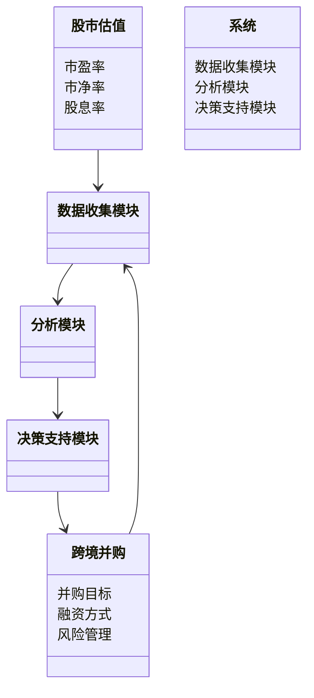
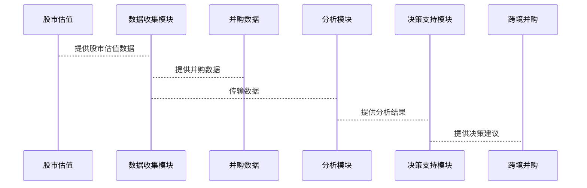

                 

# 第四章: 股市估值对企业跨境并购决策的系统分析

## 4.1 系统分析的背景与目标

### 4.1.1 系统分析的定义
系统分析是一种通过对系统各组成部分及其相互关系的深入研究，来理解和优化系统整体性能的方法。它强调系统性思维，关注各要素的相互作用及其对整体目标的影响。

### 4.1.2 系统分析的目标
在股市估值与跨境并购的背景下，系统分析的目标是理解股市估值如何影响企业的并购决策，优化企业并购策略，降低风险，并提高并购的总体成功率。

### 4.1.3 系统分析的范围
本章的系统分析范围包括股市估值的核心要素、跨境并购的关键要素及其相互作用，构建理论模型，并通过案例分析验证模型的有效性。

## 4.2 系统分析的关键要素

### 4.2.1 股市估值的核心要素
| 核心要素 | 定义 | 影响 | 示例指标 |
|----------|------|------|----------|
| 市盈率   | 企业股价与每股收益的比率 | 反映市场对企业盈利能力的预期 | 市盈率 = 股价 / 每股收益 |
| 市净率   | 企业股价与每股净资产的比率 | 反映市场对企业资产质量的评估 | 市净率 = 股价 / 每股净资产 |
| 股息率   | 每股股息与股价的比率 | 反映市场对企业分红能力的预期 | 股息率 = 每股股息 / 股价 |

### 4.2.2 跨境并购的关键要素
| 关键要素 | 定义 | 影响 | 示例指标 |
|----------|------|------|----------|
| 目标选择 | 并购目标的选择标准 | 影响并购的成功率和整合效果 | 行业地位、财务状况、技术优势 |
| 融资方式 | 并购资金的筹集方式 | 影响并购的可行性和风险 | 股权融资、债务融资、混合融资 |
| 风险管理 | 并购过程中的风险控制 | 影响并购后的整合效果和价值实现 | 财务风险、法律风险、市场风险 |

### 4.2.3 股市估值与跨境并购的相互作用
股市估值和跨境并购之间的关系是复杂而动态的。股市高估时，企业可能面临更高的融资成本和更高的并购溢价，而股市低估时，企业可能更容易获得低成本的融资，并以更低的价格收购目标企业。这种相互作用可以通过构建理论模型来进一步分析。

## 4.3 系统分析的理论模型

### 4.3.1 理论模型的构建
为了分析股市估值与跨境并购的关系，我们可以构建一个多元回归模型，其中股市估值指标（如市盈率、市净率）作为自变量，跨境并购的频率和规模作为因变量。

$$ \text{并购规模} = \beta_0 + \beta_1 \times \text{市盈率} + \beta_2 \times \text{市净率} + \epsilon $$

其中，$\beta_1$ 和 $\beta_2$ 是回归系数，$\epsilon$ 是误差项。

### 4.3.2 模型的数学推导
通过统计分析，我们可以估计出回归系数 $\beta_1$ 和 $\beta_2$，从而建立股市估值与并购规模之间的量化关系。

### 4.3.3 模型的验证
使用实际的股市数据和企业并购数据，我们可以验证模型的有效性。例如，假设某企业在高市盈率市场中进行并购，模型预测其并购规模将显著增加。

## 4.4 系统分析的系统架构设计

### 4.4.1 系统功能模型
使用Mermaid的类图来展示系统的功能模块及其关系：

### 4.4.2 系统架构设计
使用Mermaid的架构图来展示系统的整体架构：

### 4.4.3 系统接口设计
系统接口设计涉及数据输入、数据处理和结果输出三个部分。数据输入包括股市估值指标和并购数据，数据处理包括模型的构建和验证，结果输出包括决策建议和分析报告。

### 4.4.4 系统交互分析
使用Mermaid的序列图展示系统交互过程：

## 4.5 系统分析的案例分析

### 4.5.1 案例背景
假设某企业在高市盈率市场中进行跨国并购，我们需要分析股市估值对其并购策略的影响。

### 4.5.2 数据收集与处理
收集该企业的股市估值指标（市盈率、市净率）和并购数据（并购目标、融资方式、风险管理）。

### 4.5.3 模型构建与验证
使用多元回归模型分析股市估值与并购规模的关系，验证模型的准确性。

### 4.5.4 案例分析结果
案例分析表明，高市盈率市场中，企业并购规模显著增加，但并购溢价也相应提高，需要谨慎管理风险。

## 4.6 系统分析的小结

本章通过系统分析的方法，详细探讨了股市估值与跨境并购之间的关系。构建了理论模型，并通过案例分析验证了模型的有效性。系统架构设计和接口设计为实际应用提供了指导。未来研究可以进一步优化模型，扩展研究范围，以更好地理解股市估值与跨境并购的复杂关系。

