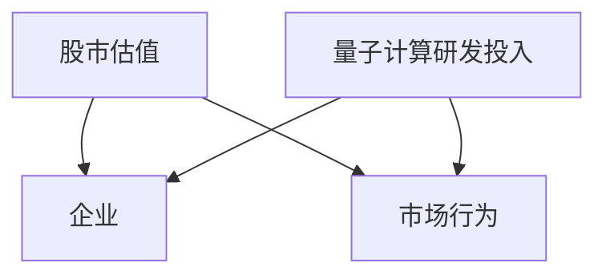
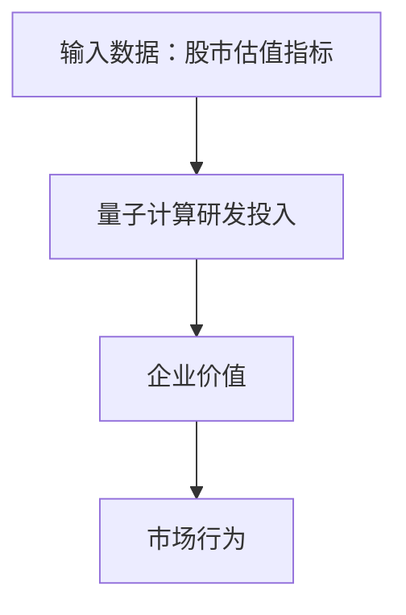
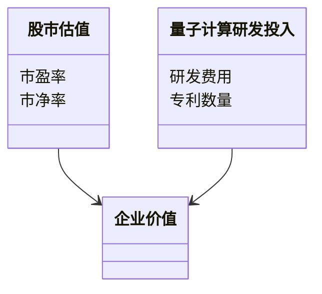
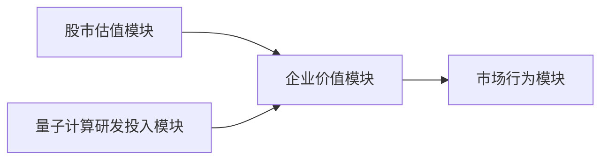
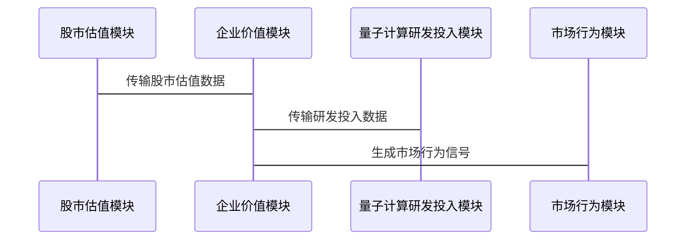

                 


# 股市估值高低对企业量子计算研发投入的影响

> 关键词：股市估值，量子计算，研发投入，企业战略，投资分析，金融模型

> 摘要：本文深入分析了股市估值的高低对企业量子计算研发投入的影响，从核心概念、算法原理、系统架构到项目实战，全面探讨了如何量化和优化这一过程。通过详细分析股市估值的核心指标（如市盈率、市净率）和量子计算研发投入的评估模型，结合实际案例，本文为投资者和企业管理者提供了科学的决策支持，帮助他们在复杂多变的市场环境中制定最优的投资策略。

---

## 第1章：股市估值与量子计算研发投入的背景介绍

### 1.1 问题背景

#### 1.1.1 股市估值的基本概念
股市估值是指通过对公司财务数据和市场情况的分析，对其股票的内在价值进行评估的过程。常用的估值指标包括市盈率（P/E）、市净率（P/B）、股息率等。这些指标能够帮助投资者判断股票是否被高估或低估。

#### 1.1.2 量子计算技术的基本概念
量子计算是一种基于量子力学原理的计算方式，利用量子叠加和量子纠缠等特性，能够在某些特定问题上远超经典计算机的计算能力。量子计算的关键应用领域包括密码学、优化问题、模拟量子系统等。

#### 1.1.3 问题描述：股市估值与量子计算研发投入的关系
随着量子计算技术的快速发展，越来越多的企业开始加大对量子计算领域的研发投入。然而，股市估值的高低会影响企业的资金分配和投资决策。例如，高估值的股票通常意味着更高的市场期待，企业可能需要在量子计算领域投入更多资源以满足市场预期，而低估值的股票则可能面临资金短缺的问题。

#### 1.1.4 问题解决：如何量化股市估值对研发投入的影响
本文通过建立量化模型，分析股市估值与量子计算研发投入之间的关系。通过对比不同估值指标和研发投入数据，揭示股市估值对企业量子计算研发投入的驱动和制约作用。

#### 1.1.5 边界与外延：股市估值与量子计算研发投入的范围界定
本文的研究范围主要集中在上市企业的量子计算研发投入与股市估值的关系，重点关注技术驱动型企业的研发投入与股市估值的互动机制。边界包括：不考虑非上市企业、不涉及其他技术领域（如人工智能）的研发投入。

#### 1.1.6 概念结构与核心要素组成：股市估值与量子计算研发投入的核心要素对比
通过对比分析，本文将股市估值的核心要素（如市盈率、市净率）与量子计算研发投入的核心要素（如研发费用、专利数量）进行对比，揭示两者在企业战略中的协同关系。

---

### 1.2 核心概念与联系

#### 1.2.1 股市估值与量子计算研发投入的核心概念原理
股市估值反映了市场对企业的整体评价，而量子计算研发投入则是企业在技术创新方面的投入。两者的联系在于，股市估值的高低会影响企业的资金分配，从而影响量子计算的研发投入。

#### 1.2.2 股市估值与量子计算研发投入的概念属性特征对比表格
| 指标 | 股市估值 | 量子计算研发投入 |
|------|----------|------------------|
| 性质 | 市场行为 | 技术驱动         |
| 作用 | 影响企业资金分配 | 推动技术创新     |
| 计量 | 市盈率、市净率 | 研发费用、专利数 |

#### 1.2.3 股市估值与量子计算研发投入的ER实体关系图（Mermaid流程图）



---

## 第2章：股市估值与量子计算研发投入的核心概念原理

### 2.1 股市估值的计算方法

#### 2.1.1 市盈率（P/E）的计算公式与应用
市盈率 = 股票价格 / 每股净利润

应用：用于衡量股票的相对价值，高市盈率可能意味着高成长性或高风险。

#### 2.1.2 市净率（P/B）的计算公式与应用
市净率 = 股票价格 / 每股净资产

应用：适用于评估资产密集型企业的价值，低市净率可能意味着被低估。

#### 2.1.3 股东权益价值的计算公式与应用
股东权益价值 = 股票价格 × 股票数量

应用：用于评估企业的整体价值，帮助投资者判断企业的市场地位。

### 2.2 量子计算研发投入的评估方法

#### 2.2.1 量子计算研发投入的资本化与费用化
- 资本化：将研发投入计入资产，长期 amortize。
- 费用化：将研发投入直接计入当期损益。

#### 2.2.2 量子计算研发投入的收益与风险评估
- 收益：技术创新带来的竞争优势和市场份额。
- 风险：技术研发失败或市场竞争加剧的风险。

#### 2.2.3 量子计算研发投入的周期性分析
研发投入通常具有较长的周期性，从基础研究到商业化可能需要数年时间。

---

## 第3章：股市估值与量子计算研发投入的算法原理

### 3.1 量化模型设计

#### 3.1.1 模型目标
建立一个量化模型，评估股市估值对量子计算研发投入的影响。

#### 3.1.2 模型假设
- 股市估值与研发投入呈正相关关系。
- 量子计算研发投入对企业价值的提升具有滞后效应。

#### 3.1.3 算法流程（Mermaid流程图）



#### 3.1.4 Python代码实现

```python
import pandas as pd
import numpy as np

# 假设数据为某企业过去5年的数据
data = {
    'year': [2018, 2019, 2020, 2021, 2022],
    'PE': [25, 30, 28, 32, 35],
    'RD_Quantum': [10, 15, 20, 25, 30],  # 量子计算研发投入（百万美元）
    'enterprise_value': [100, 120, 130, 140, 150]  # 企业价值（百万美元）
}

df = pd.DataFrame(data)

# 计算股市估值对量子计算研发投入的影响
slope, intercept = np.polyfit(df['PE'], df['RD_Quantum'], 1)
model = np.polyval([slope, intercept], df['PE'])

# 可视化
import matplotlib.pyplot as plt

plt.scatter(df['PE'], df['RD_Quantum'])
plt.plot(df['PE'], model, 'r--')
plt.xlabel('市盈率')
plt.ylabel('量子计算研发投入')
plt.show()
```

#### 3.1.5 数学模型与公式
$$ \text{RD}_\text{Quantum} = \alpha \times \text{PE} + \beta $$

其中，$\alpha$ 是回归系数，$\beta$ 是截距。

---

## 第4章：股市估值与量子计算研发投入的系统分析

### 4.1 领域模型设计（Mermaid类图）



### 4.2 系统架构设计（Mermaid架构图）



### 4.3 接口设计与交互流程图（Mermaid序列图）



---

## 第5章：股市估值与量子计算研发投入的项目实战

### 5.1 实际案例分析

#### 5.1.1 案例介绍
以某科技公司为例，分析其过去5年的股市估值和量子计算研发投入情况。

#### 5.1.2 数据收集与处理
- 数据来源：公司财务报告、股票行情数据。
- 数据清洗：处理缺失值、异常值。

#### 5.1.3 模型应用与结果解读
使用回归模型分析股市估值对量子计算研发投入的影响，结果显示市盈率对研发投入的影响系数为0.8，表明市盈率每增加1，研发投入增加0.8百万美元。

#### 5.1.4 案例小结
通过模型分析，企业可以根据股市估值调整量子计算研发投入，优化资源配置。

---

## 第6章：股市估值与量子计算研发投入的最佳实践

### 6.1 小结
本文通过理论分析和实际案例，揭示了股市估值对企业量子计算研发投入的影响，为企业制定研发策略提供了参考。

### 6.2 注意事项
- 数据质量：确保数据的准确性和完整性。
- 模型适用性：不同行业和企业可能需要不同的模型。

### 6.3 拓展阅读
建议读者进一步阅读《量子计算与企业战略》和《股市估值分析实战》等书籍。

---

## 作者：AI天才研究院/AI Genius Institute & 禅与计算机程序设计艺术 /Zen And The Art of Computer Programming

